# Introduction to Asterisk PBX

The popularity of ready-to-run distributions such as FreePBX and Issabel has recently grown. In this book, we will cover the classic Asterisk, which is the foundation for understanding these distributions. Asterisk PBX is open-source software capable of transforming an ordinary PC into a powerful multiprotocol PBX. In this chapter, we will learn about the possibilities of this new technology and its basic architecture.

## Objectives

By the end of this chapter you should be able to:

- Explain what Asterisk is and what it does;
- Describe the role of Digium™ and its successor Sangoma;
- Recognize the basic architecture of Asterisk and its components;
- Point out several usage scenarios; and
- Identify sources of information and help.

## What is Asterisk

Asterisk is open-source PBX software that turns an ordinary computer into a full-featured PBX for home users, enterprises, VoIP service providers, and phone companies. Asterisk is also both an open-source community and a project sponsored by Sangoma Technologies (which acquired Digium in 2018). You are free to use and modify Asterisk to suit your needs. Asterisk allows real-time connectivity between PSTN and VoIP networks. Since Asterisk is much more than a PBX, you not only have an exceptional upgrade to your existing PBX, but you can also do new things in telephony, such as:

- Connect employees working from home to an Office PBX over broadband Internet;
- Connect several offices in different places over an IP network, private network, or even through the Internet itself;
- Give your employees a voicemail integrated with the web and e-mail;
- Build applications like IVRs that allow connections to your ordering system or other applications;
- Give traveling users access to the company PBX from anywhere with a simple broadband or VPN connection; and
- much more....

Asterisk includes several advanced resources previously only found in high-end systems, such as:

- Music for customers on hold waiting in call queues, supporting media streaming and MP3 files;
- Call queues, whereby a team of agents can answer calls and monitor queues;
- Integration with text-to-speech and voice recognition;
- Detailed records transferred to both text files and SQL databases; and
- PSTN connectivity through both digital and analog lines.

## What is AsteriskNOW (Historical) and FreePBX

Asterisk in its purest form, also known as “classic asterisk” (Debian package denomination) is considered more of a development tool than a finished product by itself. AsteriskNOW was an initiative to transform Asterisk into a soft-appliance. The distribution included CentOS as the operating system and FreePBX as the graphical interface. AsteriskNOW has since been discontinued.

Today, the standard turnkey Asterisk distribution is **FreePBX** (maintained by Sangoma), which bundles Asterisk with a web-based administration GUI and module ecosystem. FreePBX is licensed according to the GPL and can be freely downloaded from www.freepbx.org. For commercial deployments, Sangoma also offers **FreePBX Distro** (a complete Linux image) and its commercial product **PBXact**.

## Role of Digium™ and Sangoma

Digium, a company located in Huntsville, Alabama, was the creator and primary developer of Asterisk since its founding in 1999. In addition to being the primary sponsor of Asterisk development, Digium produced telephony interface cards and other hardware for Asterisk PBXs, and created commercial products such as Switchvox (targeted at the SMB market). In 2018, Digium was acquired by **Sangoma Technologies**, a Canadian unified communications company. Since the acquisition, Sangoma has continued to sponsor Asterisk development and serves as its primary steward, maintaining the open-source project at www.asterisk.org.

Historically, Digium offered Asterisk under three types of license agreements:

- General Public License (GPL) Asterisk. This is the most used version. It includes all features and is free to be used and modified according to the terms of the GPL license.
- Asterisk Business Edition was a commercial version of Asterisk. Some companies used the business edition because they did not want or could not use the GPL license—usually because they did not want to release their source code together with Asterisk. **Note:** Asterisk Business Edition has been discontinued; today Asterisk is distributed solely under the GPL.
- Asterisk OEM licensing. After Digium stopped selling Asterisk Business Edition at retail, it continued to license that commercial edition to OEM customers — equipment vendors who wanted to build proprietary products on top of Asterisk without releasing their own source code under the GPL.

### The Zapata project and its relationship with Asterisk

The Zapata project was developed by Jim Dixon, who was also responsible for the revolutionary hardware design used with Asterisk. The hardware is open-source too; as such, it can be used by any company, and today several manufacturers produce cards compatible with this architecture.

The Zapata project produced an architecture called Zaptel, later renamed DAHDI (Digium/Asterisk Hardware Device Interface). One of the main benefits of this architecture is the ability to use the PC CPU to process media streaming, echo cancellation, and transcoding. In contrast, most existing cards use digital signal processors (DSP) to perform these tasks. The use of the PC CPU instead of dedicated DSPs reduces the board's price dramatically. Thus, these cards are significantly cheaper than previously available interfaces from other manufacturers. On the other hand, these cards require a lot of CPU; a misuse of the PC CPU can significantly impact voice quality. Recently, Digium launched a coprocessor card that uses DSPs to encode and decode G.729 and G.723, allowing better scalability for a large number of channels.

## Why Asterisk?

I remember my first contact with Asterisk. Usually, the first reaction to something new—especially something that competes with what you already know—is to reject it! This is exactly what happened in 2003. Asterisk was competing with a solution that I was selling to a customer (4 E1 VoIP Gateway), and it was ten times less expensive than what I was charging for the solution I already knew. This disproportionate price led me to start studying Asterisk in order to identify potential pitfalls and drawbacks. For example, I found that the PC CPU at that time would not support 120 g.729 simultaneous sections, at the end of the day, I won the proposal with my Gateway solution.

However, this exercise led me to the discovery that Asterisk could solve a variety of very expensive problems for my customer base. We were in trouble with expensive quotes for IVR, unified messaging, call recording, and dialers; with appropriate dimensioning, the CPU problems could be worked around. Indeed, in just three years Asterisk became the flagship product of my company (I actually decided to open another company just for the Asterisk business). In my opinion, Asterisk is a revolution in telecommunication that represents to IP telephony what Apache represents to web services.

### Extreme cost reduction

If you compare a traditional PBX with Asterisk in regard to digital interfaces and phones, Asterisk is slightly cheaper than those PBXs. However, Asterisk really pays off when you add advanced features such as voicemail, ACD, IVR and CTI. With these advanced features, Asterisk becomes significantly less expensive than traditional PBXs. In fact, comparing Asterisk PBXs with low-end analog PBXs is unfair because Asterisk offers so many features not available in low-end analog systems.

### Telephony system control and independence

One of customers’ most often-quoted benefits of asterisk is the independence that it provides. Some of today’s manufacturers do not even give the customer the system’s password or the configuration documentation. With Asterisk's “do-it-yourself” approach, the user achieves total freedom; as a bonus, the user has access to a standard interface.

### Easy and rapid development environment

Asterisk can be extended using script languages like PHP and Perl with AMI and AGI interfaces. Asterisk is open-source, and its source code can be modified by the user. The source code is written mostly in ANSI C programming language.

### Feature rich

Asterisk has several features that are either not found or optional in traditional PBXs (e.g., voicemail, CTI, ACD, IVR, built-in music on hold, and recording). The costs of these features in some platforms exceed the price of the platform itself.

### Dynamic content on the phone

Asterisk is programmed using C language and other languages common in today's development environment. The possibility to provide dynamic content is practically limitless.

### Flexible and powerful dial plan

Another Asterisk breakthrough is its powerful dial plan. In traditional PBXs, even simple features like least cost routing (LCR) are either not feasible or optional. With Asterisk, choosing the best route is easy and clean.

### Open-source running on top of Linux

One of the greatest features of Asterisk is its community. Several resources are available, including the official Asterisk documentation (docs.asterisk.org), the community-maintained VoIP-Info wiki (www.voip-info.org <http://www.voip-info.org>), e-mail distribution lists, and forums. As Asterisk becomes increasingly adopted, bugs are found and fixed quickly. With a large user base and an active development team, Asterisk is among the most widely tested PBX platforms in the world, which helps keep the code base stable and mature.

### Asterisk architecture limitations

Some limitations in Asterisk stem from the use of the Zapata telephony design. In this design, Asterisk uses the PC CPU to process voice channels instead of dedicated digital signal processors (DSPs), which are common in other platforms. Although this allows for a huge cost reduction in hardware interface, the system becomes dependent on the PC CPU. My recommendation is to run Asterisk in a dedicated machine and be conservative about hardware dimensioning. You can also use Asterisk in a separate VLAN to avoid excessive broadcasts that consume the CPU (broadcast storms caused by loops or viruses). Some newer interface cards from several vendors are now including DSPs to process echo cancellation, codecs, and other features, which will make Asterisk even better.

## Main objections to Asterisk PBX

It is common to hear objections to adopting Asterisk, which we will address here.

### Asterisk’s market share is too small

The market share is usually measured by the number of PBXs sold. These statistics are generally acquired from the biggest distributors. Asterisk is free software that can be downloaded and deployed without any sale being recorded, so it is systematically undercounted in those figures. Even so, Asterisk powers a very large installed base worldwide — from single-server office PBXs to large carrier and contact-center deployments — and remains the dominant engine behind the open-source PBX ecosystem (including turnkey distributions such as FreePBX).

### If it is free, how does the manufacturer survive?

Actually, there is no such thing as an open-source software manufacturer in the traditional sense. Digium developed Asterisk since 1999, sustaining itself through sales of telephony interface cards, commercial PBX products such as Switchvox, and related software. In 2018, Sangoma Technologies acquired Digium. Sangoma continues to fund Asterisk development and generates revenue through commercial products (FreePBX commercial modules, PBXact, Switchvox), hardware sales, and professional services.

### It is hard to find technical support!

Sangoma provides commercial technical support for Asterisk through its partner ecosystem and directly via its product offerings. A global network of certified professionals provides first-line support and professional services. Community support remains active through the Asterisk forums and mailing lists at www.asterisk.org.

### Does Asterisk support more than 200 extensions?

Yes, absolutely. A single well-dimensioned Asterisk server can handle a large number of extensions, and Asterisk scales further by distributing users across multiple servers with load balancing and failover, allowing large multi-site deployments.

### Only “geeks” are able to install Asterisk

With FreePBX (available as a standalone distro from Sangoma), even professionals with limited knowledge about Linux are able to install and configure a PBX of medium complexity. With the help of a GUI, it is possible to configure an entire PBX in just a few hours.

### What if the server fails?

One of the main advantages of Asterisk is its capability to run in fault-tolerant systems. It is relatively simple and inexpensive to have two servers running in parallel. I dare you to try this with a conventional PBX!

### Our company does not use open-source software

Your company probably uses open-source software without even realizing it. Several appliances use Linux as their operating system. Moreover, commercial support and managed deployments are available from Sangoma and its certified partner network.

### Using the PC's CPU to process signaling and media is not recommended

Asterisk uses the server's CPU to process signaling and media for voice channels instead of having dedicated DSPs. Although this allows a cost reduction of up to five times, it makes the system dependent on the performance of the main CPU. With the correct dimensioning, Asterisk is capable of handling large volumes. If you still want to release the main CPU from these tasks, you can also use hardware echo cancellation and even transcoder cards, such as the Sangoma (formerly Digium) TC400B based on DSPs.

## Asterisk Architecture

This section will explain how Asterisk’s architecture works. The figure below shows the basic Asterisk architecture. Next, we will explain architecture-related concepts, including channels, codecs, and applications.

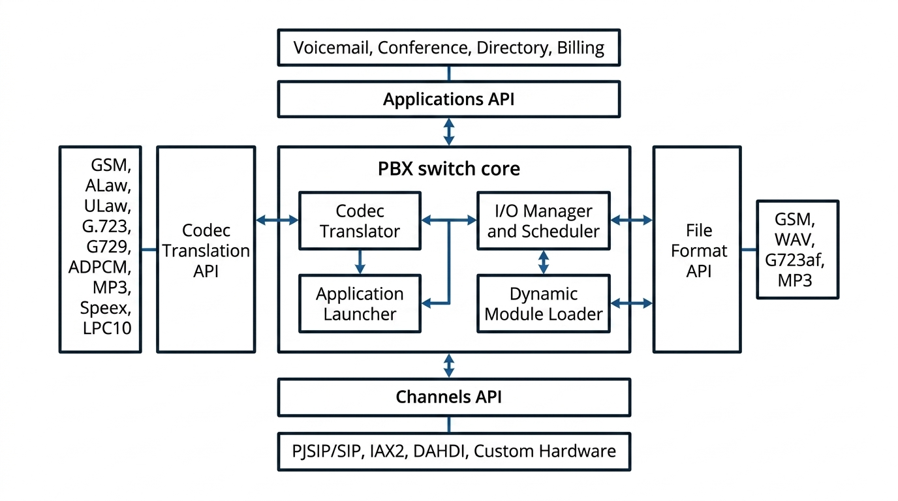

### Channels

A channel is the equivalent of a telephone line, but in a digital format. It usually consists of an analog or digital (TDM) signaling system or a combination of codec and signaling protocol (e.g., SIP-GSM, IAX-uLaw). Initially, all telephony connections were analog and susceptible to echo and noise. Later, most systems were converted to digital systems, with the analogical sound converted into a digital format using pulse code modulation (PCM) in most cases. This format allows voice transmission in 64 kilobits/second without compression.

Channels interfacing with the Public Switched Telephone Network (PSTN):

- `chan_dahdi`: analog (FXO/FXS) and digital (E1/T1/PRI) TDM cards from Sangoma (formerly Digium), Xorcom, and others. Built separately against DAHDI — see the *Legacy channels* chapter.

Channels interfacing with Voice over IP:

- `chan_pjsip`: SIP — the primary and only SIP channel driver in Asterisk 22 LTS. Dial string: `PJSIP/endpoint_name`. (**Note:** the old `chan_sip` was removed in Asterisk 21 and does not exist in Asterisk 22. See *Building your first PBX with PJSIP* for configuration.)
- `chan_iax2`: the IAX2 protocol — still ships in Asterisk 22 but is legacy; SIP/PJSIP is preferred for new deployments. Dial string: `IAX2/peer`.
- `chan_unistim`: Nortel/Avaya UNISTIM phones. Still available (extended support) but rarely used.

The older VoIP channels are no longer part of a standard Asterisk 22 build: `chan_h323` (H.323) survives only as the community `ooh323` add-on, and `chan_mgcp` (MGCP) and `chan_skinny` (Cisco SCCP) were deprecated and dropped from the modern channel set. If you must interwork with those protocols, a gateway in front of Asterisk is the usual approach.

Miscellaneous channels:

- **Local**: a pseudo-channel (built into the core) that loops back into the dial plan in a different context — useful for recursive routing and for fanning a call out to multiple destinations. Dial string: `Local/extension@context`.

### Codec and codec translation

We usually try to put as many voice connections as possible in a data network. Codecs enable new features in digital voice, including compression, which is one of the most important features as it allows compression rates larger than 8 to 1. Many codecs also define features such as voice activity detection (silence suppression), packet loss concealment, and comfort noise generation, though Asterisk itself does not generate comfort noise or perform silence suppression. Several codecs are available for Asterisk and can be transparently translated from one to another. Internally, Asterisk uses slinear as the stream format when it needs to convert from one codec to another. Some codecs in Asterisk are supported only in pass-through mode; these codecs cannot be translated. To verify which codecs are installed in your system, you can use the console command:

```
CLI>core show translation
```

The following codecs are supported:

- G.711 ulaw (USA) - (64 Kbps).
- G.711 alaw (Europe) - (64 Kbps).
- G.722 (High Definition) – (64 Kbps)
- G.723.1 - Only pass-through mode
- G.726 - (16/24/32/40kbps)
- G.729 - Binary codec module distributed by Sangoma; the download is free of charge, but lawful use requires purchasing a per-channel license (8Kbps)
- GSM - (12-13 Kbps)
- iLBC - (15 Kbps)
- LPC10 - (2.4 Kbps)
- Speex - (2.15-44.2 Kbps)
- Opus - (6-510 Kbps)

### Protocols

Sending data from one phone to another should be easy provided that the data find a path to the other phone on their own. Unfortunately, it doesn't happen this way, and a signaling protocol is necessary in order to establish connections between phones, discover end devices, and implement telephony signaling. SIP is the dominant signaling protocol in modern deployments and is the only SIP channel available in Asterisk 22 LTS (via chan_pjsip). IAX2 is still available but considered legacy. Asterisk supports the following protocols.

- SIP — via `chan_pjsip`
- IAX2 — legacy, still ships in Asterisk 22
- UNISTIM — Nortel/Avaya phones (extended support)
- H.323, MGCP, and SCCP (Cisco Skinny) — legacy protocols no longer in a standard Asterisk 22 build (H.323 only via the community `ooh323` add-on)

### Applications

To bridge calls from one phone to another, the application dial() is used. Most Asterisk features (e.g., voicemail and conferencing) are implemented as applications. You can see available Asterisk applications by using the core show applications console command.

```
CLI>core show applications
```

You can add applications from Asterisk add-ons, third-party providers, or even those you develop yourself.

## Overview of an Asterisk system

Asterisk is an open-source PBX that acts like a hybrid PBX, integrating technologies such as TDM and IP telephony. Asterisk is ready to implement functionality such as interactive voice response (IVR) and automatic call distribution (ACD); moreover, as previously mentioned, it is open to the development of new applications. This figure shows how Asterisk connects to the PSTN and existing PBXs using analog and digital interfaces as well as supports analog and IP phones. It can act as a soft-switch, media gateway, voicemail, and audio conference and also has built-in music on hold.

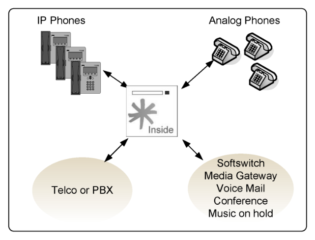

## Comparing the old and the new world

In the old soft-switch model, all components were sold separately, meaning you had to purchase each component separately and then integrate to the PBX or soft-switch environment. The costs and risks were high and most of the equipment proprietary.

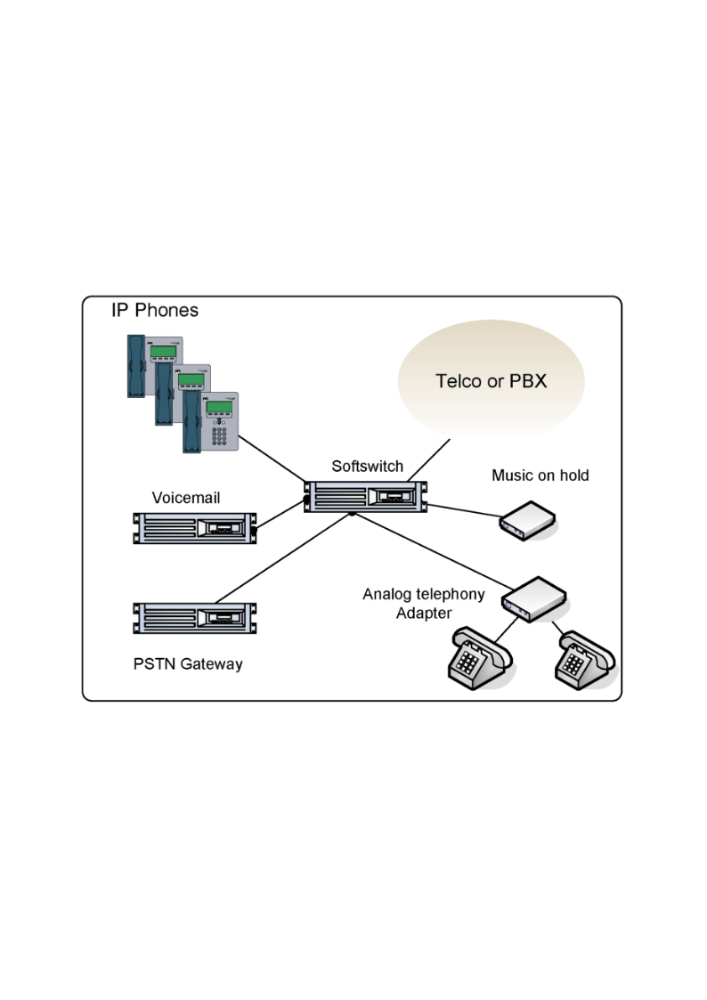

### Telephony using Asterisk

All functions are integrated in the Asterisk platform in the same or in different boxes according to the dimensioning, and all are GPL licensed. Sometimes it is easier to install Asterisk than license some of the mainstream IP-PBXs

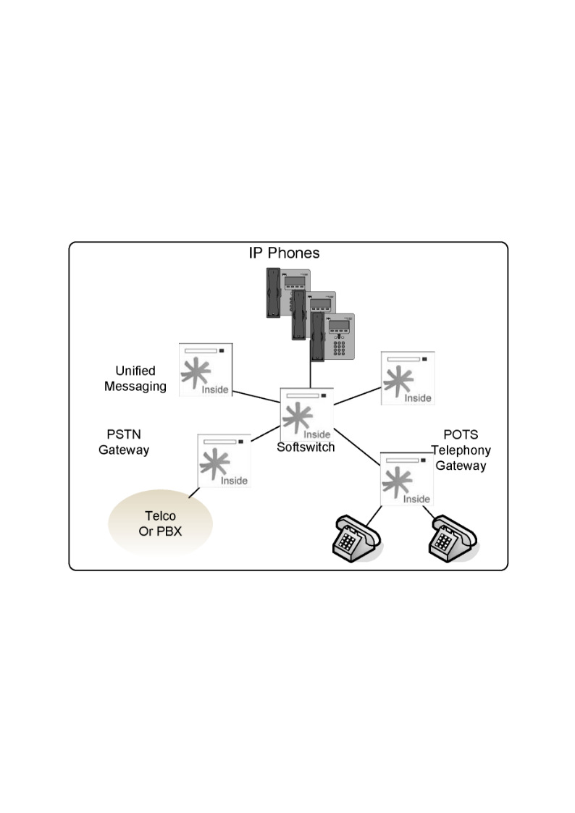

## Building a test system

When implementing an Asterisk solution, our first step is generally to build a test system. The goal is a minimal **1×1 PBX** — one phone that can call another — so you can try out endpoints, dialplan, and features before touching production. Today this is entirely software: you do not need any telephony hardware.

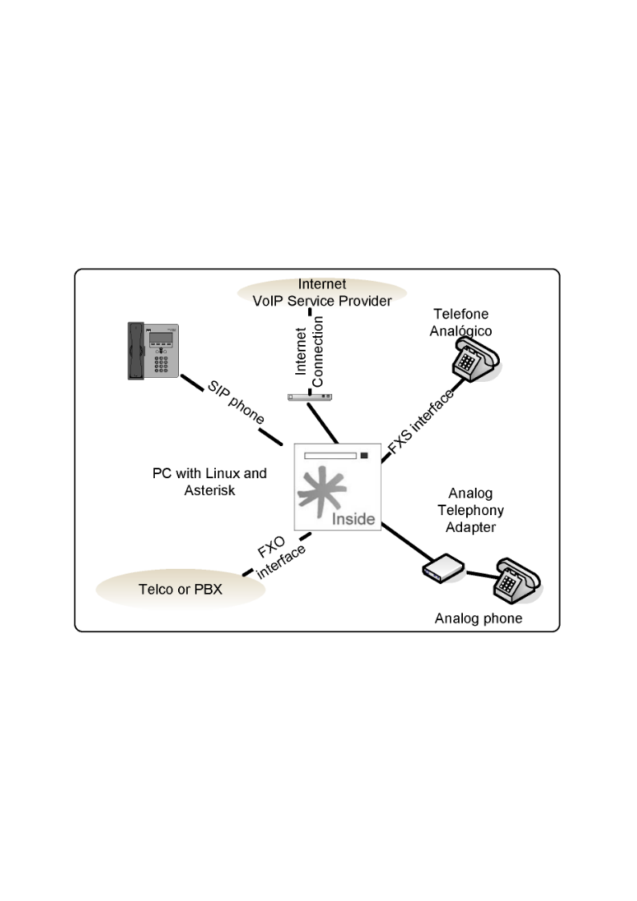

### The modern way: a software lab (recommended)

The fastest test system is Asterisk 22 running in a container or virtual machine, with **softphones** for the endpoints and, optionally, a **SIP trunk** to reach the public network:

- **Asterisk 22** on a small Linux box, VM, or Docker container. This book ships a ready-made Docker lab (see the lab guide) that boots a fully configured Asterisk 22 with a single command — no compilation, no hardware.
- **Two softphones** registered as PJSIP endpoints, so you can place a real call between them. Throughout this book we use the **SipPulse Softphone** (free download: <https://www.sippulse.com/produtos/softphone>), available for desktop and mobile.
- **A SIP trunk** (optional) from a VoIP provider, for when you want to reach the PSTN. No card and no analog line — just credentials.

This is how every example in this book is built and verified, and you can reproduce it on any laptop.

### The legacy way: analog/digital cards

Before VoIP, a test PBX needed physical interfaces: an **FXO** port to connect to an existing telephone line and an **FXS** port to connect an analog phone, which together gave you a 1×1 PBX. A single card carrying one FXO and one FXS interface was the classic starter kit. These DAHDI-based cards (from Sangoma, formerly Digium) still exist for sites that must terminate analog or T1/E1 lines, but they are niche today — most deployments are pure VoIP. If you only need to connect analog phones or lines, see the *Legacy Channels* chapter; otherwise you can skip telephony hardware entirely.

## Asterisk scenarios

Asterisk can be used in several different scenarios. We will list some of them and explain the advantages and possible limitations of each.

### IP PBX

The most common scenario is the installation of a new or the replacement of an existing PBX. If you compare Asterisk with some other alternatives, you will find it to be cheaper and richer in features than most PBXs currently available on the market. Several companies are now changing their specifications to Asterisk instead of other brand-name PBXs.

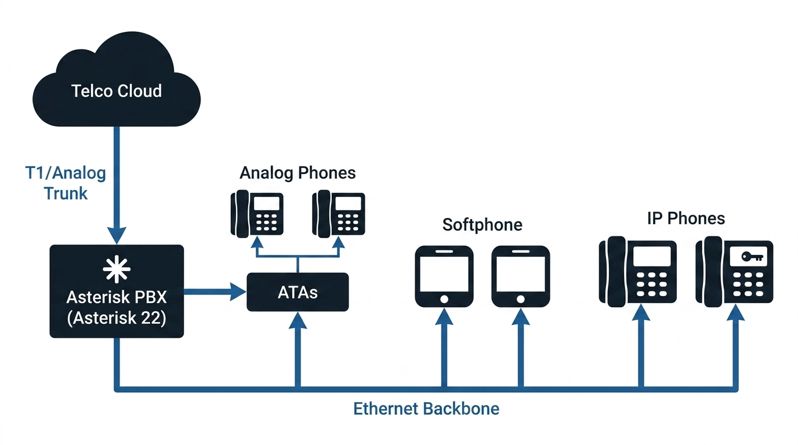

### IP-enabling legacy PBXs

The following image illustrates one of the most commonly used setups. Large companies generally do not want to take significant risk when investing in new technologies and simultaneously wish to preserve their investments in legacy equipment. IP-enabling legacy PBX can be very expensive; thus, connecting an Asterisk PBX using T1/E1 lines can be a good alternative for cost-conscious customers. Another benefit is the possibility of connecting to a VoIP service provider with better telephony rates.

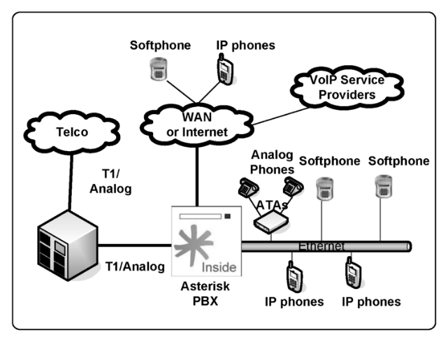

### Toll Bypass

A very useful application for VoIP is connecting branch offices over the Internet or a WAN. Using an existing data connection allows you to bypass toll charges incurred in telecommunication connections between headquarters and branch offices.

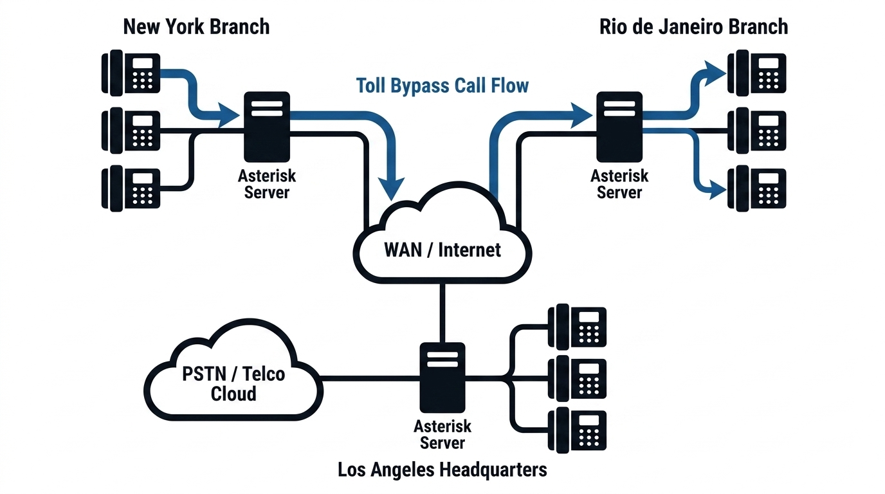

### Application Server (IVR, Conference, Voicemail)

Asterisk can be used as an application server for the existing PBX or be directly connected to PSTN. Asterisk offers services such as voicemail, fax reception, call recording, IVR connected to a database, and an audio conferencing server. If you integrate voicemail and fax into an existing e-mail server, you will have a unified messaging system, which is usually an expensive solution. Using Asterisk as an application server provides extreme cost reduction compared to other solutions.

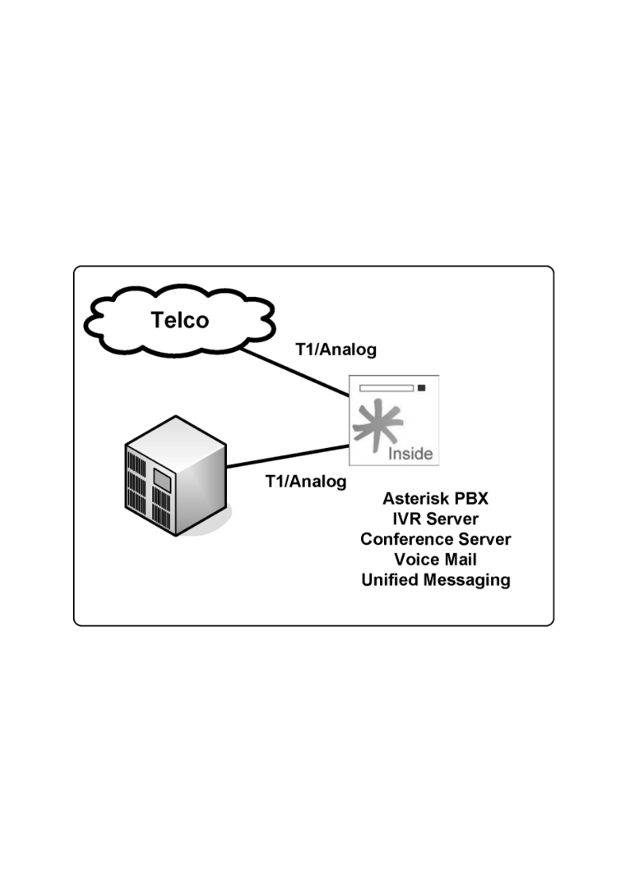

### Media Gateway

Most voice-over IP service providers use an SIP proxy to host all registration, location, and authentication of SIP users. They still have to send calls to the PSTN directly or route it through a wholesale call termination provider using an SIP or H.323 voice-over IP connection. Asterisk can act as a back-to-back user agent (B2BUA) or media gateway, replacing very expensive soft switches or media gateways. Compare the price of a four E1/T1 gateway from the main market manufacturers with Asterisk. The Asterisk solution can cost several times less than other solutions and is capable of translating signaling protocols (H.323, SIP, IAX…) and codecs (G.711, G.729…).

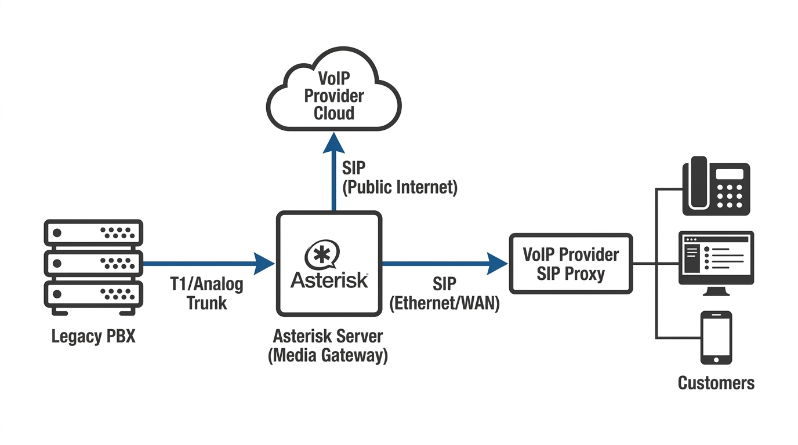

### Contact Center Platform

A contact center is a very complex solution that combines several technologies, such as automatic call distribution (ACD), interactive voice response (IVR), and call supervision. Basically, three types of contact centers are available: inbound, outbound, and blended.

Inbound contact centers are very sophisticated and usually require ACD, IVR, CTI, recording, supervision, and reports. Asterisk has a built-in ACD to queue the calls. IVR can be done using Asterisk Gateway Interface (AGI) or internal mechanisms such as the application background(). Computer telephony integration (CTI) is achieved using Asterisk Manager Interface (AMI); recording and reporting are built in to Asterisk.

For an outbound contact center, a predictive or power dialer is one of the main components. Although several dialers are available for the open-source Asterisk, it is not hard to build your own for the platform if you so desire. A blended contact center allows simultaneous inbound and outbound operation, saving money by ensuring better use of the agent's time. It is possible to use Asterisk and its ACD mechanism to implement a blended solution.

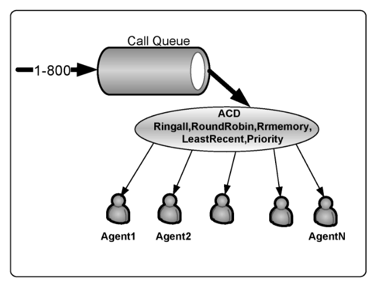

## Finding information and help

This section will provide some of the main sources of information related to Asterisk.

- Asterisk’s official website: <https://www.asterisk.org> Here you can find information about:
- Documentation & Wiki -> <https://docs.asterisk.org>
- Community forum -> <https://community.asterisk.org>
- Bug tracking -> <https://github.com/asterisk/asterisk/issues>
- Wiki (legacy, largely superseded by docs.asterisk.org) -> <https://wiki.asterisk.org>

### Community forum

The Asterisk community forum has largely replaced the old mailing lists and is the place to ask questions. Try to gather as much information as possible before posting. Nobody will help you if you haven't done your homework — try at least once to solve the problem by yourself.

- <https://community.asterisk.org>

## Summary

Asterisk is software licensed according to the GPL that enables an ordinary PC to act as a powerful IP PBX platform. Digium’s Mark Spencer created Asterisk in the late 1990s, and Digium sustained itself by selling Asterisk-related hardware and commercial products. Digium was acquired by Sangoma Technologies in 2018; Sangoma now sponsors Asterisk development. Hardware interface design originated in the Zapata project developed by Jim Dixon, which gave rise to DAHDI.

The Asterisk architecture has the following main components:

- CHANNELS: Analog, digital, or voice-over IP. In Asterisk 22 LTS, SIP is handled exclusively by `chan_pjsip`.
- PROTOCOLS: Communication protocols, which are responsible for signaling the calls, including SIP (via PJSIP), H.323, MGCP, and IAX2.
- CODECS: Translate digital formats of voice allowing compression and packet loss concealment. Note that Asterisk itself does not perform silence suppression (voice activity detection) or comfort-noise generation; when endpoints use VAD, comfort noise should be disabled on the client side.
- APPLICATIONS: Responsible for the Asterisk PBX functionality. Conference, voicemail, and fax are examples of Asterisk applications.

Asterisk can be used in various scenarios, from a small IP PBX to a sophisticated contact center. You can easily find help at www.asterisk.org and docs.asterisk.org.

## Quiz

1. Which company acquired Digium in 2018 and now serves as the primary steward of the Asterisk open-source project?
   - A. Cisco Systems
   - B. Sangoma Technologies
   - C. Nortel Networks
   - D. Red Hat

2. In Asterisk 22 LTS, which channel driver provides SIP connectivity?
   - A. `chan_sip`
   - B. `chan_skinny`
   - C. `chan_pjsip`
   - D. `chan_h323`

3. True or False: The `chan_sip` channel driver was removed in Asterisk 21 and is not present in a standard Asterisk 22 build.

4. Which of the following channels/protocols are **no longer** part of a standard Asterisk 22 build? (Choose all that apply.)
   - A. MGCP (`chan_mgcp`)
   - B. SCCP / Cisco Skinny (`chan_skinny`)
   - C. IAX2 (`chan_iax2`)
   - D. H.323 (`chan_h323`, surviving only as the community `ooh323` add-on)

5. The Zapata project's hardware architecture, originally called Zaptel, was later renamed to ____.
   - A. DAHDI
   - B. PJSIP
   - C. PRI
   - D. mISDN

6. When Asterisk must convert audio from one codec to another, which internal stream format does it translate through?
   - A. G.711 ulaw
   - B. GSM
   - C. slinear (signed linear)
   - D. Opus

7. According to the chapter, what is the licensing situation of the G.729 codec module distributed by Sangoma?
   - A. It is GPL and completely free for any use.
   - B. The download is free, but lawful use requires purchasing a per-channel license.
   - C. It cannot be obtained at all without buying Asterisk Business Edition.
   - D. It only works in pass-through mode and cannot be installed.

8. Which Asterisk application is used to bridge a call from one phone to another?
   - A. `Background()`
   - B. `Dial()`
   - C. `Queue()`
   - D. `Goto()`

9. What is the `Local` channel in Asterisk?
   - A. A hardware FXS interface for analog phones.
   - B. A SIP trunk to a local service provider.
   - C. A pseudo-channel that loops a call back into the dial plan in a different context.
   - D. A codec used for on-net calls.

10. In which usage scenario does Asterisk act as a back-to-back user agent (B2BUA), translating between signaling protocols and codecs to replace expensive soft switches?
    - A. IP-enabling a legacy PBX
    - B. Toll bypass
    - C. Media Gateway
    - D. Contact Center Platform

**Answers:** 1 — B · 2 — C · 3 — True · 4 — A, B, D · 5 — A · 6 — C · 7 — B · 8 — B · 9 — C · 10 — C
