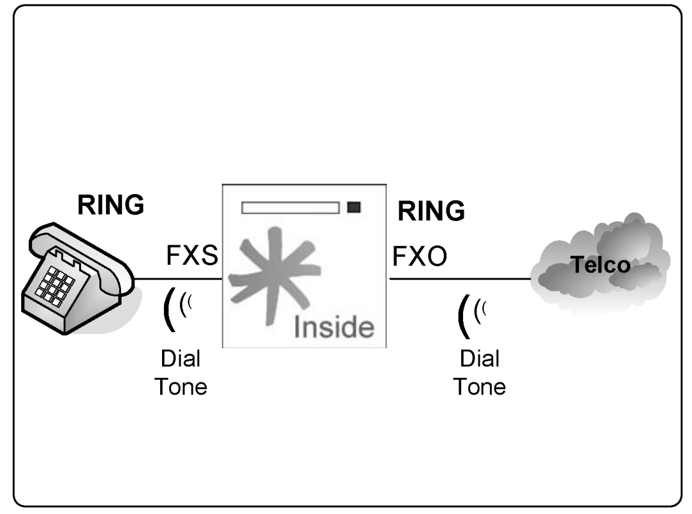
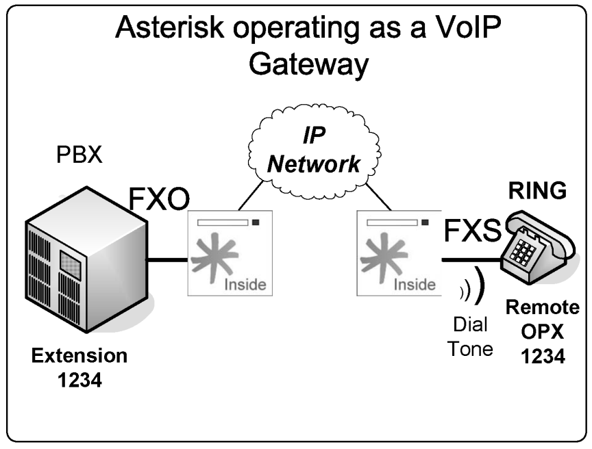
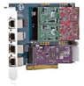

# Analog channels

> **[2nd-ed note]** Update front-matter dates/ISBN for the 2nd edition before publication.

> **[2nd-ed note — deployment context]** As of Asterisk 22, DAHDI and analog telephony cards remain fully supported and DAHDI still builds against current kernels. However, the majority of new deployments are pure VoIP (SIP trunks, PJSIP). Analog/TDM hardware is now a niche choice, mainly found in legacy environments, rural PSTN connectivity, or regulated markets. The content below is still accurate for those scenarios.

There are several ways to connect the public switched telephone network (PSTN). The best way depends on how the telephone company makes this connection available in your area. The simplest way is to use an analog line, similar to the line you use at home. In this section, we will show you how to configure analog cards from Sangoma™ (formerly Digium™) and Xorcom™.

### Objectives

By the end of this chapter you should be able to:

- Recognize the main telephony terms and acronyms;
- Understand when to use digital and analog circuits;
- Recognize the difference between FXS and FXO; and
- Configure Asterisk for FXS and FXO.

### Telephony basics

Most analog implementations use a pair of cooper lines named tip and ring. When a loop is closed, the phone receives the dial tone from the telecom switch (or the private PBX). The most frequently used signaling is loop-start; other, less common kinds of signaling including ground start, which is used in several countries. The three categories of signaling are:

- Supervision signaling
- Address signaling
- Information signaling

#### Supervision signaling

The main supervision signalings are on-hook, off-hook, and ringing. On-Hook – When a user puts the phone on the hook, the PBX interrupts and does not allow the electric current to pass. In this state, the circuit is named on-hook. In this position, only the ringer is active. Off-Hook – Before starting a phone call, the phone needs to pass to the off-hook state. Removing the handset from the hook closes the loop and indicates to the PBX that the user intends to make a call. Upon receiving this indication, the PBX generates a dial tone, indicating to the user that it is ready to accept the destination address (i.e., phone number). Ringing – When a user calls another phone, it generates a voltage to the ringer that warns the other user about a call being received. Signaling varies by country, with different tones for different countries. You can personalize Asterisk tones to your country by modifying the indications.conf file. For example:

```
[br]
description=Brazil
ringcadance=1000,4000
dial=425
busy=425/250,0/250
ring=425/1000,0/4000
congestion=425/250,0/250,425/750,0/250
callwaiting=425/50,0/1000
```

#### Address Signaling

You can use two kinds of signaling for dialing. The first and most common is dual tone multi- frequency (dtmf) while the other is pulse dialing (used in old rotary dial phones). Phones have a keypad for dialing, and each button is associated with two frequencies: one high and one low. In the case of dtmf signaling, the combination of these tones indicates what digit is being pressed. MFC/R2 uses a multi-frequency tone different from dtmf.

#### Information signaling

Information signaling shows the call’s progress and different events.

- Dial tone
- Busy Tone
- Ringback
- Congestion
- Invalid number
- Confirmation tone

### PSTN interfaces

As in the case of old PBXs, it is often required to connect the Asterisk PBX to the PSTN. Here we’ll show you how to do it. Usually you have three options for telephone lines.

- Analog: The most common form for home and small business, usually delivered with a metallic pair of cooper lines.
- Digital: Used when many lines are necessary. A digital line is usually delivered by a CSU/DSU or a Fiber multiplexer. The end user connector is usually a RJ45. In some countries, E1 lines are delivered using two coaxial BNC connectors; in this case you will need a balloon to connect to the RJ45 jack to the telephony board.
- SIP: This option has been recently developed. The telephone line is delivered using a data connection with SIP signaling (VoIP). This is a good option to use with Asterisk since you will not need to buy a telephony card. Phone calls will be delivered directly to the Ethernet port. Another advantage is that you may be able to free resources from your CPU by avoiding codec transcoding.

### Analog FXS, FXO, and E&M interfaces

Several types of analog interfaces are available. It is fundamental to understand the differences between these interfaces to learn how to connect to the phone network as well as to other PBXs. Here, we will show you the E&M interface. Although it is not currently available for Asterisk and has been discontinued by several vendors, you may find routers and PBXs with this kind of interface, so it is better to know what you are dealing with.

#### Foreign eXchange (FX) Interfaces

FX interfaces are analog. The term “Foreign eXchange” is applied to access trunks to a PSTN central office (CO). Foreign eXchange Office (FXO)



The FXO interface is used to connect to a central office (CO) or another PBX’s extension. It communicates directly with a telephone line coming from the PSTN. Another option is to connect the FXO interface to an existing PBX, allowing communication between Asterisk and the legacy PBX. Connecting Asterisk to a PBX port and delivering a remote extension using VoIP is often referred to as an off-promises extension (OPX). An FXO interface receives a dial tone. Foreign eXchange Station (FXS) The FXS interface feeds an analog phone, modem, or fax. The FXS provides the dial tone and power for a phone.

#### Trunk signaling

- Loop-Start
- Ground-Start
- Kewlstart

The use of kewlstart signaling in Asterisk is almost default. Kewlstart is not signaling itself, but adds intelligence to the circuit by monitoring what is happening on the other side. Kewlstart is based in loop-start. Most switches do not support this feature, which is used to get the hang-up notification.

- Loopstart: Used in most analog lines, it allows the telephone to indicate “on-hook” and “off-hook” and the switch to indicate “ring” and “no-ring”. This is probably what most people have at home. The name comes from the fact that the line is always open. When you close the loop, the switch provides you with a dial tone. An incoming call is signaled by a 100V ringing voltage over the open pair.



- Groundstart: Similar to Loopstart. When you want to make a call, one side of the line is short-circuited. When the switch identifies this state, it reverses the voltage through the open pair, and then the loop is closed. Consequently, the line first becomes occupied before being offered to the caller.
- Kewlstart: Adds intelligence to the circuits, allowing monitoring of the other side. Kewlstart incorporates many advantages from loop-start.

### Asterisk telephony channels setup

To configure a telephony interface card, several steps are necessary. In this chapter, we will show three of the most common scenarios:

- Analog connection using FXS
- Analog connection using FXO
- Connection of an Astribank™ with FXS and FXO interfaces

### Configuration Procedure (valid in both cases)

Before choosing hardware for Asterisk, you should consider the number of simultaneous calls, services, and codecs that are going to be installed and enabled. Asterisk is a CPU-intensive application, which is why we recommend a dedicated machine for Asterisk. The number of interface cards installed within the computer is limited by the number of slots and interruptions available. It is preferable to install a single card with eight voice interfaces than two cards with four. Another option is to use a USB channel bank, such as the Xorcom Astribank. Recently, some manufacturers (e.g., CIANET) have started producing TDMoE channel banks, making it even easier to connect dozens of analog interfaces. Astribank 19” with 32 FXS/FXO ports

#### Example 1: One FXO, one FXS installation

Several devices (e.g., Sangoma cards, Astribanks) use a set of kernel modules formerly known as Zaptel. Because of trademark disputes, the Zaptel drivers were renamed DAHDI (DAHDI Asterisk Hardware Device Interface) in 2008. The Zaptel drivers have since been discontinued; DAHDI is the current and only supported driver stack. In this example, we will use a Sangoma TDM400 telephony interface card (formerly sold as the Digium TDM400) with one FXS and one FXO module. The required steps are listed below: 1. Install the analog card FXS, FXO, or both.

```
2. Configure the file /etc/dahdi/system.conf (formerly /etc/zaptel.conf).
```

3. Generation of the configuration files using dahdi_genconf. 4. Load the driver for the DAHDI interface. 5. Execute dahdi_test to verify interrupt misses. 6. Execute dahdi_cfg to configure the driver. 7. Configure the channel DAHDI in chan_dahdi.conf file. Load Asterisk. Step 1: Install the TDM400 Board. The TDM404P card contains FXS and FXO modules. Connect the FXS (S110M, green) and FXO (X100M, red) modules. If you are using FXS modules, connect the card directly to the power source using a molex connector. Please wear electrostatic protection before handling interface cards to avoid damage to the hardware. Sangoma (formerly Digium) analog cards also support a hardware echo cancellation module VPMADT032. Step 2: The good news about the configuration is the new utility dahdi_genconf, which automatically detects and generates the configuration for DAHDI interfaces. The utility generates two files:

- /etc/dahdi/system.conf
- /etc/asterisk/dahdi-channels.conf
- /etc/asterisk/users.conf (option: users)
- All these files use the option chan_dahdi full

Before you can execute the dahdi_genconf, it is important to configure the file

```
gen_parameters.conf
#
# /etc/dahdi/genconf_parameters
#
# This file contains parameters that affect the
# dahdi_genconf configurator generator.
```



```
#
#base_exten
4000
#fxs_immediate
```

- no

```
#fxs_default_start ks
#lc_country
il
#context_lines
```

- from-pstn

```
#context_phones
from-internal
#context_input
```

- astbank-input

```
#context_output
astbank-output
#group_phones
0
#group_lines
5
#brint_overlap
#bri_sig_style
```

- bri_ptmp

```
#
# The echo canceller to use. If you have a hardware echo canceller, just
# leave it be, as this one won't be used anyway.
#
# The default is mg2, but it may change in the future. E.g: a packager
# that bundles a better echo canceller may set it as the default, or
# dahdi_genconf will scan for the "best" echo canceller.
#
#echo_can
hpec
#echo_can
oslec
#echo_can
none  # to aboid echo cancellers altogether
# bri_hardhdlc: If this parameter is set to 'yes', in the entries for
# BRI cards 'hardhdlc' will be used instead of 'dchan' (an alias for
# 'fcshdlc').
#
#bri_hardhdlc
yes
# For MFC/R2 Support
#pri_connection_type
R2
#r2_idle_bits
1101
# pri_types contains a list of settings:
# Currently the only setting is for TE or NT (the default is TE)
#
#pri_termtype
# SPAN/2
NT
 # SPAN/4
NT
O arquivo gen_parameters.conf permite a personalização da sua configuração. Os
parâmetros mais importantes para linhas analógicas são:
base_exten
```

- 4000

```
#fxs_immediate
```

- no

```
fxs_default_start
ks
lc_country
```

- br

```
context_lines
from-pstn
context_phones
```

- from-internal

```
context_input
astbank-input
context_output
```

- astbank-output

```
group_phones
0
group_lines
5
#echo_can
hpec
#echo_can
oslec
echo_can
MG2
```

Warning: It is required that you configure at least the echo cancellation algorithm for the channels. The base_exten parameter defines the basic dial plan for FXS extensions. In this case, the first FXS channel will receive the extension number 4000, the second 4001, and so on. The context in which the lines (context_phones) and trunks (context_lines) are created is very important. After generating the files, you should include the file /etc/asterisk/dahdi-channels.conf in the file

```
/etc/asterisk/chan_dahdi.conf.
#include dahdi-channels.conf
```

Note: Analog signaling is a bit confusing; it is always the inverse of the card. FXS cards are signaled with FXO whereas FXO cards are signaled with FXS. Asterisk talks to these devices as if it was on the opposite side. Step 3: Load kernel drivers. Now you have to load the chan_dahdi module and the related card kernel driver. Use dahdi_hardware to detect your card and the driver name. For example:

- Card Driver Description
- TE410P wct4xxp 4xE1/T1-3.3V PCI
- TE405P wct4xxp 4xE1/T1-5V PCI
- TDM400P wctdm 4 FXS/FXO
- T100P wct1xxp 1 T1 E100P wctlxxp 1 E1 X100P wcfxo 1 FXO

Commands to load the drivers:

```
modprobe dahdi
modprobe wctdm
```

Step 4: Use the dahdi_test utility. An important utility is dahdi_test, which is used to verify interrupt misses in the DAHDI card. Audio quality problems are often related to interrupt conflicts. To verify that your DAHDI card is not sharing an interrupt with other cards, use the following command:

```
#cat /proc/interrupts
```

You can verify the number of interrupt misses using the dahdi_test utility compiled with the DAHDI cards. A number below 99.987% indicates possible problems. Step 5: Use the dahdi_cfg utility to configure the driver. DAHDI has an unusual system for loading the drivers. First configure the /etc/system/dahdi.conf, and then apply those configurations to the DAHDI driver using dahdi_cfg. In this case, dahdi_cfg is used to configure the signaling for the FX interfaces. To see the results, you can append “-vvvvv” to the command for verbose.

```
#
/sbin/dahdi_cfg -vv
Dahdi Configuration
======================
Channel map:
Channel 01: FXS Kewlstart (Default) (Slaves: 01)
Channel 02: FXO Kewlstart (Default) (Slaves: 02)
2 channels configured.
```

If the channels were loaded successfully, you will see an output similar to the one shown above. Users often incorrectly configure chan_dahdi.conf with inverted signaling between channels. If this happens, you will see a message like the one shown below:

```
DAHDI_CHANCONFIG failed on channel 1: Invalid argument (22)
Did you forget that FXS interfaces are configured with FXO signalling
and that FXO interfaces use FXS signalling?
```

After successfully configuring the hardware, you can proceed to Asterisk configuration.

```
Step 6: /etc/dahdi/system.conf configuration file.
```

It sounds strange, but after configuring the /etc/dahdi/system.conf, you configured the card itself. DAHDI can be used for other purposes, like routing and SS7. To use it with Asterisk, you must configure the Asterisk DAHDI channels. Every channel in Asterisk has to be defined; SIP/PJSIP channels are defined in pjsip.conf (note: chan_sip and sip.conf were removed in Asterisk 21) while TDM channels are defined in chan_dahdi.conf. This creates the logical TDM channels to be used in your dial plan.

```
signalling=fxs_ks;
group=1;
```

- channel group

```
context=incoming  ;
context
channel => 1;
channel number
signalling=fxo_ks;  FXO signaling for FXS interfaces
group=2;
```

- channel group

```
context=extensions;
context
channel=> 2
```

- channel number

### Configuration options

Several options are available in the chan_dahdi.conf file. A description of all options would be boring and counterproductive; instead, we will focus on the main option groups available for easy understanding.

#### General options (channel independent)

These options work for any channel: context: Defines the incoming context.

```
context=default
```

channel: Defines channel or channel range. Each channel definition will inherit options defined before the declaration. Channels can be identified individually or in the same line by comma separation. Ranges can be defined using “-”.

```
Channel=>1-15
Channel=>16
Channel=>17,18
```

group: Allows channels to be handled as a group. If you dial a group number instead of a channel number, the first channel available is used. If channels are phones, when you call a group, all phones will ring simultaneously. With commas, you can specify more than one group for the same channel.

```
group=1
group=3,5
```

language: Turns on the internationalization and configures a language. This feature will configure system messages for a specific language. English is the only language with complete prompts available through standard installation. musiconhold: Selects music on hold class.

#### Caller ID options

There are many callerid options. Some can be disabled, although most are enabled by default. usecallerid: Enables or disables the callerid transmission for the subsequent channels (Yes/No). Note: If your system gets two rings before answering, try disabling this feature. It should answer immediately. hidecallerid: Defines whether or not to hide the outgoing callerid (Yes/No). callerid: Configures a callerid string for a specific channel. The caller can be configured with asreceived. This is mostly used in trunk interfaces to indicate the incoming callerid.

```
callerid = "Flavio Eduardo Gonçalves" <48 30258500>
```

callwaitingcallerid: Supports callerid during call waiting. useincomingcalleridondahditransfer: Uses the incoming callerid in a transfer.

#### Call Waiting

Asterisk supports call waiting in FXS channels. The user will receive a waiting tone if someone tries the extension. To enable call waiting:

```
callwaiting=yes
```

To support callerid in call waiting:

```
callwaitingcallerid=yes
```

#### Audio quality options

Adjusting the echo cancellation is half technical, half art. These options adjust certain Asterisk parameters that affect audio quality in the DAHDI channels. They can help improve audio quality in analog interfaces.

#### The fxotune utility

The fxotune is a utility used to fine-tune certain parameters for FXO modules. This fine-tuning is required to adjust impedance mismatch caused by the hybrid. The utility has three operation modes:

- Detection (-i): detects and fixes the existing FXO channels and saves the configuration to

```
fxotune.conf
```

- Dump mode (-d): generates the waveform files to fxotune_dump.vals
- Startup mode (-s): reads the file fxotune.conf and applies it to the FXO modules

It is important to understand that you will have to insert the instruction fxotune –s in the system load before starting Asterisk:

```
#modprobe dahdi
#modprobe wctdm
#fxotune-s
```

### Echo cancellation

Most echo cancellation algorithms operate by generating multiple copies of the received signal, in which each one is delayed by a specific amount of time. The number of taps of the filter determines the size of the echo delay that needs to be cancelled. These delayed copies are then adjusted and subtracted from the received signal. The trick is to adjust only the delayed signal to remove the echo without using too many CPU cycles. From the users’ perspective, it is important to choose an appropriate echo cancellation algorithm. The default is MG2; however, two other options are available: the High Performance Echo Cancellation (HPEC) from Sangoma (formerly Digium) and the open-source echo cancellation (OSLEC) developed by David Rowe.

> **[2nd-ed note]** The OSLEC project page (http://www.rowetel.com/ucasterisk/oslec.html) may no longer be current; verify availability and kernel integration status for modern kernels before referencing it. To change the echo cancellation algorithm, change the parameter echo_can to /etc/dahdi/system.conf. For example:

```
echo_can=oslec
```

The echo cancellation in Asterisk is controlled by three parameters in the file /etc/asterisk/chan-

```
dahdi.conf.
```

echocancel: Disables or enables echo cancellation. You should keep this feature enabled. It accepts “yes” or the number of taps. Explanation: How does echo canceling work? Most echo canceling algorithms operate by generating multiple copies of a received signal, with each being delayed by a small interval. This little flow is called a “tap”. The number of taps determines the echo delay that can be cancelled. These copies are delayed, adjusted, and subtracted from the original signal. The trick is to adjust the delayed signal exactly to what is necessary to remove the echo. echocancelwhenbridged: Enables or disables the echo canceller during a pure TDM call. This is usually not necessary. rxgain: Adjusts the audio reception gain to either increase or decrease reception volume (-100% to 100%). txgain: Adjusts audio transmission gain to either increase or decrease the transmission volume (- 100% to 100%). For example:

```
echocancel=yes
echocancelwhenbridged=yes
txgain=-10%
rxgain=10%
```

#### Billing options

These options change how call information is recorded in the call detail records (CDR) database. amaflags: Configures the AMA flags affecting the CDR categorization. It accepts the following values:

- billing
- documentation
- omit
- default

accountcode: Configures an account code for a specific channel. It can contain any alphanumeric value—usually the department or user name.

```
accountcode=finance
amaflags=billing
```

### Call progress options

These items are used to acquire information about the progress of the call. In public interfaces, it may be useful to detect the call progress and determine if it was answered or busy. The busy detection is highly experimental and regulated by specific parameters.

```
busydetect=yes
busycount=4
busypattern=500,500
callprogress=yes
progzone=br
```

These parameters (above) specify whether the interface will try to detect the busy tone, how many tones will be used for successful detection, and what is the busy pattern. The busy detection is largely experimental, and some additional parameters can be changed in the Makefile. To detect the answer of a call, which is essential for precise billing, it is possible to use the polarity reversal to signal the exact answer time. This is important if you plan to charge for the call or just wish to have precise billing for comparison. Usually you have to contact the phone company to request this service.

```
answeronpolarityswitch=yes
```

In some countries, it is possible to detect the hang up of the call using polarity reversal as well.

```
hanguponpolarityswitch=yes
```

#### Options for phones

These options are used for phones connected to the FXS interfaces. All the functionalities delivered to analog phones connected directly to the DAHDI interfaces are controlled by Asterisk. Adsi (Analog Display Services Interface): This is a set of telecom standards used by some telcos to offer services such as ticket buying. cancallforward: Enables or disables call forwarding (*72 to enable and *73 to disable). calleridcallwaiting: Enables callerid received during a call waiting indication (Yes/No). immediate: In immediate mode, instead of providing a dial tone, the channel jumps immediately to the “s” extension in the defined context. This is used to create hotlines. threewaycalling: Enables or disables three-way conferencing. mailbox: Warns the user about available voicemail messages. It can be an audible sign or a visual indicator (if the telephone supports this feature). The argument is the mailbox number. callgroup: Group phones to dial or to pick up. pickupgroup: Group of phones for call pickup.

### Useful DAHDI CLI commands

Once Asterisk is running with DAHDI channels loaded, you can inspect channel status from the Asterisk CLI. These commands remain current in Asterisk 22:

```
*CLI> dahdi show channels
*CLI> dahdi show channel 1
*CLI> module reload chan_dahdi.so
```

### DAHDI channel format.

DAHDI channels use the following format in the dial plan:

```
DAHDI/[g]<identifier>[c][r<cadence>]
<identifier>- Physical channel numeric identifier
[g] – Group identifier
[c] – Answer confirmation. A number is not considered until the callee press
“#”
[r] – customized ringing
[cadence] Integer from 1 to 4
```

For example:

```
DAHDI/2
- channel 2
DAHDI/g1  - First available channel in group 1
```

### Quiz

1. Supervision signaling includes: A. On-hook B. Off-hook C. Ringing D. Dtmf 2. Information signaling includes: A. Dtmf B. Dial tone C. Invalid number D. Ringback E. Congestion F. Busy G. Pulse 3. There are two types of analog interfaces available for Asterisk: FXS and FXO. Mark the correct answers. A. FXS: Foreign Exchange Station can be connected directly to the company’s PBX extension port. B. FXO: Foreign Exchange Office can be connected to the public switched telephony network. C. FXS: Foreign Exchange Station provides a dial tone and can be connected to a standard analog phone. 4. To configure DAHDI hardware, you should first edit the ______ file. A. /etc/dahdi/system.conf B. /etc/asterisk/chan_dahdi.conf C. /etc/asterisk/unicall.conf D. serial.conf 5. The DAHDI hardware is independent of Asterisk. In the chan_dahdi.conf, you configure Asterisk channels, not the hardware itself. A. True B. False 6. When using a TDM400 with an ___ port, is necessary to connect the PC power source to the card using a specific connector (similar to the one used to power the hard disk). A. FXO B. FXS C. E+M D. ISDN 7. Echo, pops, and noise in a DAHDI card are often related to the: A. Asterisk compilation B. Cable problems C. PCI Interrupt conflicts D. Electromagnetic interference 8. When a card presents problems with echo, what you can do? (check all that apply) A. Change tx and rx gains B. Change the echo cancellation algorithm (oslec, mg2) C. Use hardware echo cancellation D. Activate call progress detection E. Invert the tip and ring 9. In some cases, when you want a precise billing using analog channels, it is important to activate a feature that allows the precise detection of the moment when the call answer occurred. To do this, you should activate _________ on Asterisk and at the phone company. A. Answer reversal B. Billing reversal C. Charge reversal D. Polarity reversal E. Dial tone generation 10. Caller ID identification on analog lines is country dependent. The most frequently used standard for North America is: A. v.23 B. dtmf C. polarity reversal D. battery reversal Answers: 1-ABC,2-BCDEF,3-BC,4-A,5-A,6-B,7-C,8-ABC,9-D,10-A
