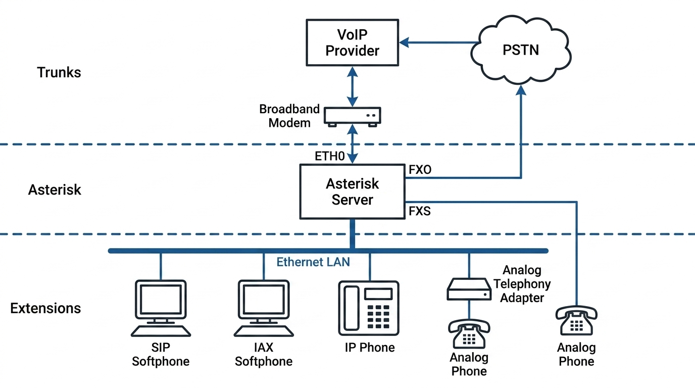
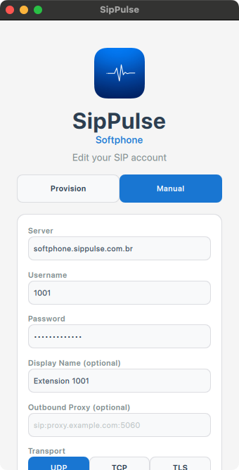
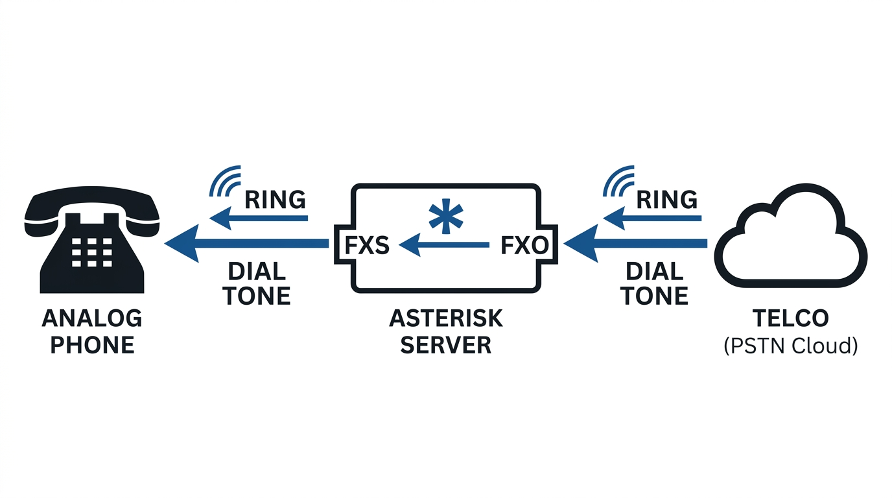
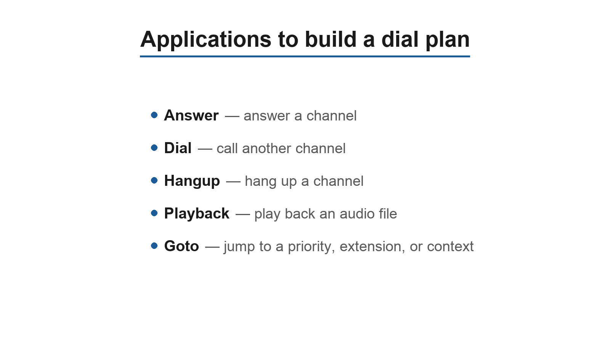

# Building your first PBX with PJSIP

In this chapter, you will learn how to perform a basic Asterisk PBX configuration. The main objective here is to see the PBX running for the first time, be able to dial between extensions, dial a message being played, and dial to a single analog or SIP trunk. The idea behind this chapter is to ensure that your Asterisk is up and running as soon as possible. After completing the work in this chapter, you will have sufficient background to prepare for subsequent chapters, where we will delve more deeply into configuration details.

## Objectives

By the end of this chapter, you should be able to:

- Understand and edit configuration files;
- Install soft-phones based on SIP;
- Install and configure a SIP trunk;
- Install and configure an analog connection;
- Dial between extensions;
- Dial between phones and external destinations; and
- Configure an auto attendant.

## Understanding the configuration files

Asterisk is controlled by text configuration files located in /etc/asterisk. The file format is similar to the Windows “.ini” files. A semicolon is used as a remark character, the signs “=” and “=>” are equivalent, and spaces are ignored.

```
;
; The first line without a comment should be the session title.
;
[Session]
Key = value; Variable designation
[Session 2]
Key => value; Object declaration
```

Asterisk interprets “=” and “=>” in the same way. Differences in syntax are used to distinguish between objects and variables. Use “=” when you want to declare a variable and “=>” to designate an object. The syntax is the same between all files, but three types of grammar are used, as discussed below.

## Grammars

| Grammar | How the object is created | Conf. file | Example |
|---------|---------------------------|------------|---------|
| Simple Group | All in the same line | `extensions.conf` | `exten => 4000,1,Dial(PJSIP/4000)` |
| Option Inheritance | Options are defined first, the object inherits the options | `chan_dahdi.conf` | `[channels]`<br>`context=default`<br>`signalling=fxs_ks`<br>`group=1`<br>`channel => 1` |
| Complex Entity | Each entity receives a context | `pjsip.conf`, `iax.conf` | `[cisco]`<br>`type=endpoint`<br>`auth=cisco-auth`<br>`aors=cisco`<br>`context=trusted` |

### Simple Group

The simple group format used in extensions.conf, meetme.conf, and voicemail.conf is the most basic grammar. Each object is declared with options in the same line. Example:

```
[Session]
Object 1 => op1,op2,op3
Object 2=> op1b,op2b,op3b
```

In this example, object 1 is created with options op1, op2, and op3 while object 2 is created with options op1, op2, and op3.

### Object options inheritance grammar

This format is used by the files chan_dahdi.conf and agents.conf, where numerous options are available, and most interfaces and objects share the same options. Typically, one or more sections have objects and channels declarations. Options to the object are declared above the object and can be changed to another object. Although this concept is hard to understand, it is very easy to use. Example:

```
[Session]
op1 = bas
op2 = adv
object=>1
op1 = int
object => 2
```

The first two lines configure the value of the options op1 and op2 to “bas” and “adv”, respectively. When object 1 is instanced, it is created using option 1 as “bas” and option 2 as “adv”. After defining object 1, we change option 1 to “int”. Next, we create object 2 with option 1 as “int” and option 2 as “adv”.

### Complex entity object

This format is used by pjsip.conf, iax.conf, and other configuration files in which numerous entities with many options exist. Typically, this format does not share a large volume of common configurations. Each entity receives a context. Sometimes reserved contexts exist, like [general] for global configurations. Options are declared in the context declarations. Example:

```
[entity1]
op1=value1
op2=value2
[entity2]
op1=value3
op2=value4
```

The entity [entity1] has values “value1” and “value2” for options op1 and op2, respectively. The entity [entity2] has values “value3” and “value4” for options op1 and op2.

## Options to build a LAB for Asterisk

To configure a PBX, you will need some basic hardware. It is not hard or expensive, but there are some options to be considered. All you will need are two phones and a connection to the public network. Some options and combinations are possible when creating your lab, which we will discuss below.

### Option 1: Complete LAB

With the complete LAB, it is possible to test all the scenarios available and compare solutions such as ATA, IP-phones, and soft-phones. You can also learn about analog and SIP trunks. You will need:

- A SIP analog telephone adapter (ATA)
- An IP phone
- A dedicated server for Asterisk
- A workstation with a soft-phone
- An analog interface card with at least two interfaces (1 FXO and 1 FXS)
- A VoIP provider account

### Option 2: Economy LAB

With the economy LAB, we simplify it a bit. We use the ATA, which is usually less expensive than the IP-phone, and a single FXO card, which is really inexpensive. We won’t be able to use analog phones connected directly to the server, but this does not commonly occur in practice. You will need:

- A SIP analog telephone adapter (ATA)
- A dedicated server for Asterisk
- A workstation for the soft-phone
- An analog interface card with 1 FXO
- An account with a VoIP provider

### Option 3: Super economy lab

The third LAB uses a virtualized server in the student’s own notebook. The problem with this model is the conflicts generated by the UDP port. Sometimes both the Asterisk server and the soft-phone try to access the same port, preventing Asterisk from binding the address port. Another issue is the quality of the calls; virtual environments are not indicated for real-time applications such as Asterisk. Use a free soft-phone for the server and workstation and a trunk connection to a SIP provider. You will need:

- A laptop running a soft-phone
- A virtual machine (VirtualBox, VMware, or similar) to install Asterisk
- An account with a VoIP provider

## Installation Sequence

To help you understand the installation sequence, we outlined the sequence of steps necessary to install and configure Asterisk.



1. Extensions configuration a. SIP extensions (ATA, Soft-phone, IP Phone) b. IAX extensions c. FXS extensions 2. Trunk configuration a. Configuration of a SIP trunk b. Configuration of a FXO trunk 3. Building a basic dial plan a. Dialing between extensions b. Dialing external destinations c. Receiving a call from in the operator extension d. Receiving a call in an auto-attendant

## Configuration of the extensions

The extensions are SIP, IAX, or analog phones connected to an FXS port. To configure an extension, you should edit the configuration file related to the channel (pjsip.conf, iax.conf, chan_dahdi.conf)

### SIP extensions

On Asterisk 22, PJSIP (the `res_pjsip` stack, configured in `/etc/asterisk/pjsip.conf`) is the SIP channel driver. It supports multiple transports per endpoint, is actively maintained, and is the only SIP driver shipped with the platform. (The original `chan_sip` driver was removed in Asterisk 21 — see the *Legacy channels* chapter if you need to migrate an old configuration.)

The idea here is to configure a simple PBX. (Subsequent chapters provide an entire SIP/PJSIP session with all the details.) PJSIP is configured in `/etc/asterisk/pjsip.conf` and holds all the parameters related to SIP phones and VoIP providers. SIP clients have to be configured before you can make and receive calls.

#### The transport

In PJSIP, the listener configuration (bind address, port, protocol) lives in a `transport` object. Asterisk has built-in protection against username guessing — it always returns an identical authentication challenge for unknown and known users, and repeated unidentified requests from one IP are rate-limited via the `[global]` options `unidentified_request_count`/`unidentified_request_period`. The main options of a transport are:

- protocol: The transport protocol — `udp`, `tcp`, `tls`, `ws`, or `wss`.
- bind: Address and port the listener binds to. If you set the address to `0.0.0.0`, it binds to all interfaces; the SIP port defaults to 5060 for UDP/TCP.

A minimal UDP transport:

```
[global]
type=global

[transport-udp]
type=transport
protocol=udp
bind=10.1.30.45:5060
```

Codec selection (`disallow`/`allow`) and the default `context` are configured on each `endpoint` (shown below), not on the transport. Anonymous/guest calls are handled by an `endpoint` named `anonymous`. Registration timers are controlled per-AOR via `maximum_expiration`/`default_expiration`.

#### SIP clients

After completing the transport section, it is time to set up the SIP clients. I would once again like to remind the reader that we will have an entire SIP/PJSIP chapter later in the book. For now, let’s concentrate on the basics and leave the details for later.

In PJSIP a SIP client is built from a set of related objects, tied together by name reference:

- `endpoint`: The call behaviour — codecs (`allow`/`disallow`), the dialplan `context`, and which `auth` and `aors` it uses.
- `auth`: The credentials. `username` is the SIP authentication user and `password` is the secret used to authenticate the device.
- `aor`: The "address of record" — where the endpoint can be reached. Either a static `contact=` (for a device at a fixed IP) or `max_contacts=` to allow the device to register dynamically.

Warning: Use strong passwords, with at least 8 characters, alphanumeric and numeric characters, and at least one symbol. Reports of hacked servers have appeared in the mailing lists, and brute force password crackers for SIP are easily available for script kiddies. Toll fraud costs thousands of dollars for consumers and providers.

Endpoint 6000 is a device at a fixed IP, so its AOR carries a static `contact` instead of allowing registration. Endpoint 6001 is a device that registers, so its AOR allows it to register (`max_contacts=1`):

```
[6000]
type=endpoint
context=from-internal
disallow=all
allow=ulaw
auth=6000-auth
aors=6000

[6000-auth]
type=auth
auth_type=userpass
username=6000
password=#MySecret1#7

[6000]
type=aor
contact=sip:6000@10.1.30.50

[6001]
type=endpoint
context=from-internal
disallow=all
allow=ulaw
auth=6001-auth
aors=6001

[6001-auth]
type=auth
auth_type=userpass
username=6001
password=Mys3cr3t#

[6001]
type=aor
max_contacts=1
```

PJSIP allows the `endpoint`, `auth`, and `aor` sections to share the same section name (e.g. the two `[6001]` blocks above, distinguished by their `type=`); many admins instead suffix them (`[6001]`, `[6001-auth]`, `[6001]` aor) for readability. For a device that registers, the contact is learned dynamically when the phone registers, so the AOR needs no static `contact`.

## IAX Extensions

`chan_iax2` still ships in Asterisk 22 but is now legacy; SIP/PJSIP is the preferred protocol for new deployments.

You may also create IAX extensions. This protocol is native to the Asterisk, and we will have an entire section devoted to it later in this book. For now, let’s create a few extensions using the protocol. As the first section to be configured, the section [general] has certain parameters to be configured. The main options are:

- allow/disallow: Defines which codecs are going to be used.
- bindaddr: Address to be bound to Asterisk SIP listener. If you set it up as 0.0.0.0 (default), it will bind to all interfaces.
- context: Sets the default context for all clients unless changed in the client section. We used dummy for security reasons. Unauthenticated users get into this context when the option allowguest is set to yes.
- bindport: SIP UDP port to listen.
- delayreject: When set to yes, delays the sending of an authentication reject for a REGREQ or AUTHREQ, which improves the security against brute-force password attacks.
- bandwidth: When set to high, it allows the selection of high bandwidth codecs, such as the g711 in their variants ulaw and alaw.

The following is a sample of the [general] section of the file iax.conf.

```
[general]
bindport = 4569
bindaddr = 10.1.30.45 ;(use your IP)
context = dummy
delayreject=yes
bandwidth=high
disallow = all
allow = ulaw
```

### IAX Clients

After finishing the general sections, it is time to set up the IAX clients.

- [name]: When a SIP device connects to Asterisk, it uses the username part of the SIP URI to find the peer/user.
- type: Configures the connection class. Options are peer, user, and friend. o peer: Asterisk sends calls to a peer. o user: Asterisk receives calls from a user. o friend: Both occur at the same time.
- host: IP address or host name. The most common option is dynamic, which is used when the host registers to Asterisk.
- secret: Password to authenticate peers and users.

Warning: Use strong passwords with at least 8 characters, alphanumeric and numeric characters, and at least one symbol. Reports of hacked servers have appeared in the mailing lists, and brute force password crackers for SIP md5 hashes are available for script kiddies. Toll fraud costs thousands of dollars for consumers and providers. Example:

```
[guest]
type=user
context=dummy
callerid=”Guest IAX User”
[6003]
context=from-internal
type=friend
secret=#sup3rs3cr3t#
host=dynamic
context=from-internal
[6004]
context=from-internal
type=friend
secret=#s3cr3ts3cr3t#
host=dynamic
context=from-internal
```

## Configuring the SIP devices

After defining the phones in the Asterisk configuration file, it is time to configure the phone itself. In this example, we will show how to configure a free soft-phone. The 1st edition used X-Lite from CounterPath; that product has been discontinued, so use any modern free SIP soft-phone (for example Zoiper, Linphone, or MicroSIP). Check your device’s manual to understand the parameters of your phone. Step 1: Configure the phone to use the extension 6000. Execute the installation program. After the execution, open the account/SIP settings and add a new SIP account. Fill in the required information.



Display Name: 6000  User Name: 6000  Password: #MySecret1#7  Authorization User Name: 6000  Domain: ip_of_your_server. Confirm that your phone is registered using the console command `pjsip show endpoints` (or `pjsip show endpoint 6000` for detail; `pjsip show contacts` shows the registered AOR contacts). Repeat the configuration for the phone 6001.


## Configuring the IAX devices

IAX2 is a legacy protocol (see the *Legacy channels* chapter), and the SipPulse Softphone is SIP-only, so it cannot register an IAX account. If you need to test IAX2, use a client that still supports it (for example Zoiper, which historically offered IAX). Create a new IAX account,

3. Select new IAX account. 4. Insert the related options for the 6003 phone and optionally for the 6004. 5. Save the configuration and check if the phone is registered using iax2 show peers. Important: Use one account for SIP and another one for IAX. If you want to configure the system to ring both IAX and SIP at the same time, we will show you how to do so in the dial plan section.

### Configuring a PSTN interface

To connect to the PSTN, you will need an interface foreign exchange office (FXO) and a telephone line. You can use an existing PBX extension too. You can obtain a telephony interface card with an FXO interface from several manufacturers. In this example, we will show you how to install a DAHDI interface card.



### Analog lines using DAHDI

You can buy an analog card compatible with the DAHDI from several manufacturers. X100P was one of the first Digium cards and had already been discontinued. Some manufacturers still produce similar clones. In addition to the price of the X100P, we have found several issues between these cards and new motherboards, so use it with care. X100P, in my opinion, is not a good choice for a production environment. Any card compatible with DAHDI should work. Thanks to the team of DAHDI developers, we now have a tool for detecting and configuring the interface cards almost automatically. If you have just installed the DAHDI drivers, please don’t forget to run make config and reboot the machine to load it automatically. You can use the commands below to detect and configure your card. Step 1: To detect your hardware, use:

```
dahdi_hardware.
```

Step 2: To configure use:

```
dahdi_genconf.
```

The command above will generate two files /etc/dahdi/system.conf and /etc/asterisk/dahdi-channels.conf. The default parameters for dahdi_genconf are usually fine, but you can change them in the file /etc/dahdi/genconf_parameters. By default, it will insert the lines (FXO) in the context from-pstn and the phones (FXS) in the context from-internal. Step 3: After running dahdi_genconf, in the last line of the file /etc/asterisk/chan_dahdi.conf insert the following line:

```
#include dahdi-channels.conf
```

Step 4: Edit the file /etc/dahdi/modules and comment for all the unused drivers. Reboot before proceeding and check if the channels are being recognized using:

```
CLI>dahdi show channels
```

### Connecting to the PSTN using a VoIP provider

If your budget is really limited, you can configure a SIP trunk to connect to the PSTN. It is certainly the most affordable way to connect to the PSTN. Thousands of VoIP providers exist worldwide. To connect to one of them, you will need some parameters. Parameters provided by the SIP provider.

- username: login
- password: secret
- Provider’s domain: domain
- UDP port: 5060
- Allowed codecs:g729, ilbc, alaw

Two parameters should be determined by you.

- Extension to receive calls—in this case: 9999
- context: from-sip

In PJSIP, a registering SIP trunk is built from the same object family used for an endpoint, plus explicit `registration` and `identify` objects. The `registration` object tells Asterisk to register to the provider, the `identify` object matches inbound traffic from the provider's IP to the endpoint (PJSIP authenticates inbound INVITEs by source IP), and `outbound_auth` supplies the credentials for outbound calls and registration:

```
[siptrunk]
type=endpoint
context=from-sip
disallow=all
allow=ilbc
allow=alaw
allow=g729
dtmf_mode=rfc4733
outbound_auth=siptrunk-auth
aors=siptrunk
from_user=login
from_domain=domain

[siptrunk-auth]
type=auth
auth_type=userpass
username=login
password=secret

[siptrunk]
type=aor
contact=sip:domain:5060

[siptrunk]
type=identify
endpoint=siptrunk
match=domain

[siptrunk-reg]
type=registration
transport=transport-udp
outbound_auth=siptrunk-auth
server_uri=sip:domain:5060
client_uri=sip:login@domain:5060
contact_user=9999
retry_interval=60
```

To access this trunk, we will use the channel name `PJSIP/siptrunk`. The `dtmf_mode=rfc4733` setting carries DTMF out of band (RFC 4733 obsoletes the older RFC 2833; the payload is identical). The `identify`/`match` option accepts IP addresses, CIDRs, or hostnames, but hostnames are resolved once at config-load time, so for a provider with changing IPs list the signalling IP(s) explicitly. Confirm registration with `pjsip show registrations`.

## Dial plan introduction

Dial plan is like Asterisk’s heart. It defines how Asterisk handles every single call to the PBX. It consists of extensions that make an instruction list for Asterisk to follow. Instructions are fired by digits received from the channel or application. In order to configure Asterisk successfully, it is crucial to understand the dial plan. Most of the dial plan is contained in the extensions.conf file in the /etc/asterisk directory. This file uses the simple group grammar and has four major concepts:

- Extensions
- Priorities
- Applications
- Contexts

Let’s create a basic dial plan. In subsequent sections of this book, I will devote a chapter exclusively to the dial plan. If you installed the sample files (make samples), the extensions.conf already exists. Save it with another name and start with a blank file.

## The structure of the file extensions.conf

The extensions.conf file is separated into sections. The first is the [general] section followed by the [globals] section. The beginning of each section starts with its name definition (i.e., [default]) and finishes when another section is created.

### The section [general]

The general section sits at the top of the file. Before starting to configure the dial plan, it is helpful to know the general options that control certain dial plan behaviors. These options are:

- static and write protect: If static=yes and writeprotect=no, you can use the CLI

```
command save dialplan.
```

Warning: If you issue a save dialplan command from the CLI, you will end up losing any remarks and comments in the file.

- autofallthrough: If autofallthrough is set, then if an extension runs out of things to do, it will terminate the call with BUSY, CONGESTION, or HANGUP depending on Asterisk's best guess. This is the default. If autofallthrough is not set, then if an extension runs out of things to do, Asterisk will wait for a new extension to be dialed.
- clearglobalvars: If clearglobalvars is set, global variables will be cleared and reparsed into an dialplan reload or Asterisk reload. If clearglobalvars is not set, then global variables will persist through reloads and—even if deleted from the extensions.conf or one of its included files—they will remain set to the previous value.
- extenpatternmatchnew: Uses a faster pattern-matching algorithm, which helps noticeably when you have a large number of extensions. Defaults to no.
- userscontext: This is the context where the entries from the users.conf are registered.

### The section [globals]

In the [globals] section you will define global variables and their initial values. You can access the variable in the dial plan using ${GLOBAL(variable)}. You can even access variables defined in the linux/unix environment using ${ENV(variable)}. Global variables are not case sensitive. A few examples could be:

```
INCOMING>DAHDI/8&DAHDI/9
RINGTIME=>3
```

In the following example, you can set and test a global variable in the dial plan.

```
exten=9000,1,set(GLOBAL(RINGTIME)=4)
exten=9000,n,Noop(${GLOBAL(RINGTIME)})
exten=9000,n,hangup()
```

## Contexts

Context is the named partition of the dial plan. After the [general] and [globals] sections, the dial plan is a set of contexts in which each context has several extensions, each extension has several priorities, and each priority calls an application with several arguments.


You can build a simple dial plan to reach other phones and the PSTN. However, Asterisk is much more powerful than that. Our objective is to teach you more details of what is possible in the dial plan.

## Extensions

Unlike the traditional PBX, where extensions are associated with phones, interfaces, menus, and so on, in Asterisk an extension is a list of commands to be processed when a specific extension number or name is triggered. The commands are processed in priority order.

![Extension syntax: `exten => number(name),{priority|label}[(alias)],application`. Extensions can be numeric, alphanumeric, numeric with caller ID, a pattern, or a standard extension like `s`; priorities can be a number, `n` (next), `s` (same), an offset, or a `hint`.](../images/04-first-pbx-fig05.png)

An extension can be literal, standard, or special. A standard extension includes only numbers or names and the characters * and #; 12#89* is a valid literal extension. Names can be used for extension matching as well. Extensions are case sensitive. However, you cannot create two extensions with the same name but different cases. When an extension is dialed, the command with the first priority is executed followed by the command with priority 2 and so on. This happens until the call is disconnected or some command returns the number one, indicating failure. What Asterisk does when the last priority is executed is regulated by the parameter autofallthrough. See the [general] section in this chapter. Example:

```
exten=>123,1,Answer
exten=>123,n,Playback(tt-weasels)
exten=>123,n,Hangup
```

Above you find the list of instructions to be processed when the extension 123 is dialed. The first priority is to answer the channel (necessary when the channel is in the ringing state: i.e., FXO channels). The second priority is to play back an audio file called tt-weasels. The third priority hangs up the channel. Another option is to handle the call according to the caller ID. You can use the / character to specify the caller ID to be processed. Examples:

```
exten=>123/100,1,Answer()
exten=>123/100,n,Playback(tt-weasels)
exten=>123/100,n,Hangup()
```

This example will trigger extension 123 and execute the following options only if the caller ID is 100. This can also be done by using the pattern described below:

```
exten=>1234/_256NXXXXXX,1,Answer()
```

hint: maps an extension to a channel. It is used to monitor the channel state. It is used in conjunction with presence. The phone has to support it.

#### Patterns

You can use patterns and literals in the dial plan. Patterns are very useful for reducing the dial plan size. All patterns start with the “_” character. The following characters may be used to define a pattern. The figure identifies the patterns available for use with Asterisk.

![Pattern matching characters: `_` starts a pattern, `.` matches one or more characters, `!` matches zero or more, `[123-7]` matches any listed digit or range, `X` is 0-9, `Z` is 1-9, and `N` is 2-9 — with examples mapping office extension ranges.](../images/04-first-pbx-fig06.png)

### Special extensions

Asterisk uses some extension names as standard extensions.


Description: s: Start. It is used to handle a call when there is no dialed number. It is useful for FXO trunks and in- menu processing. t: Timeout. It is used when calls remain inactive after a prompt has been played. It is also used to hang up an inactive line. T: AbsoluteTimeout. If you establish a call limit using the `TIMEOUT(absolute)` dialplan function, once the call exceeds the limit defined, it will be sent to the T extension. h: Hangup. It is called after the user disconnects the call. i: Invalid. It is triggered when you call an non-existent extension in the context. Using these extensions can affect the content of CDR records—specifically, the dst that does not contain the number dialed. o: Operator. It is used to go to operator when the user presses “0” during the voicemail. The use of these extensions can change the content of the billing records (CDR)—in particular, the field dst will not have the number dialed. To work around this problem, you should use the option g in the dial() application and consider the functions resetcdr(w) and/or nocdr()

## Variables

In the Asterisk PBX, variables can be global, channel-specific, and environment-specific. You can use the NoOP() application to see the content of a variable in the console. It can use a global variable or a channel-specific variable as applications arguments. A variable can be referenced as in the following example, where varname is the name of the variable.

```
${varname}
```

A variable name can be an alphanumeric string starting with a letter. Global variable names are not case sensitive. However, system variables (Asterisk-defined are channel-defined) are case sensitive. Thus, the variable ${EXTEN} is different from ${exten}.

### Global variables

Global variables can be configured in the [global] section in the extensions.conf file or using the application:

```
set(Global(variable)=content)
```

### Channel-specific variables

Channel-specific variables are configured using the application set(). Each channel receives its own variable space. There is no chance of collisions between variables from different channels. A channel- specific variable is destroyed when the channel hangs up. Some of the most commonly used variables are:

- ${EXTEN} Extension dialed
- ${CONTEXT} Current context
- ${CALLERID(name)}
- ${CALLERID(num)}
- ${CALLERID(all)} Current caller ID
- ${PRIORITY} Current priority

Other channel-specific variables are all uppercase. You can see the content of several variables using the dumpchan() application. Below is a simple excerpt of dump-channel variables.

```
exten=9001,1,dumnpchan()
exten=9001,n,echo()
exten=9001,n,hangup()
```

Dumpchan output:

```
Dumping Info For Channel: PJSIP/4400-00000001:
================================================================================
Info:
Name=               PJSIP/4400-00000001
Type=               PJSIP
UniqueID=           1161186526.1
LinkedID=           1161186526.0
CallerIDNum=        4400
CallerIDName=       laptop
ConnectedLineIDNum= (N/A)
ConnectedLineIDName=(N/A)
DNIDDigits=         9001
RDNIS=              (N/A)
Parkinglot=
Language=           en
State=              Ring (4)
Rings=              0
NativeFormat=       (ulaw)
WriteFormat=        ulaw
ReadFormat=         ulaw
RawWriteFormat=     ulaw
RawReadFormat=      ulaw
WriteTranscode=     No
ReadTranscode=      No
1stFileDescriptor=  16
Framesin=           0
Framesout=          0
TimetoHangup=       0
ElapsedTime=        0h0m0s
BridgeID=           (Not bridged)
Context=            default
Extension=          9001
Priority=           1
CallGroup=
PickupGroup=
Application=        DumpChan
Data=               (Empty)
Blocking_in=        (Not Blocking)
Variables:
```

The field layout above is the Asterisk 22 `DumpChan` output (a real `PJSIP/...` channel name, the `CallerIDNum`/`ConnectedLineID` fields, and the `Raw*`/`Transcode`/`BridgeID` rows that PJSIP channels populate). Unlike the old driver, a PJSIP channel does not auto-set `SIPCALLID`/`SIPUSERAGENT` channel variables; the equivalent SIP details are read on demand with the `PJSIP_HEADER()` and `CHANNEL()` dialplan functions — for example `${CHANNEL(pjsip,call-id)}`, `${PJSIP_HEADER(read,User-Agent)}`, and `${CHANNEL(rtp,dest)}` for the remote RTP address.

### Environment-specific variables

Environment-specific variables can be used to access variables defined in the operating system. You can set environment-specific variables using the function ENV(). For example:

```
${ENV(LANG)}
Set(ENV(LANG))=en_US
```

### Application-specific variables

Some applications use variables for data input and output. You can set variables before calling the application or retrieve the variable after the application execution. For example: The Dial application returns the following variables:

- ${DIALEDTIME} ->This is the time from dialing a channel until it is disconnected.
- ${ANSWEREDTIME} -> This is the amount of time for the actual call.
- ${DIALSTATUS} This is the status of the call: o CHANUNAVAIL o CONGESTION o NOANSWER o BUSY o ANSWER o CANCEL o DONTCALL o TORTURE
- ${CAUSECODE} -> Error message for the call.

## Expressions

Expressions can be very useful in the dial plan. They are used to manipulate strings and perform math and logical operations.

![Asterisk expressions overview — `$[expression1 operator expression2]` — grouping the math, logical, comparison, regular-expression, and conditional operators available in the dial plan.](../images/04-first-pbx-fig08.png)

The expression syntax is defined as follows:

```
$[expression1 operator expression2]
```

Let’s suppose that we have a variable called “I” and we want to add 100 to the variable:

```
$[${I}+100]
```

When Asterisk finds an expression in the dial plan, it changes the entire expression by the resulting value.

### Operators

The following operators can be used to build expressions. It is important to observe operator precedence. 1. Parentheses “()” 2. Unary operators “! -“ 3. Regular expression “: =~ 4. Multiplicative operators “* / %” 5. Additive operators “+ -“ 6. Comparison operators 7. Logical operators 8. Conditional operators

#### Math Operators

- Addition (+)
- Subtraction (-)
- Multiplication(*)
- Division (/)
- Modulus (%)

#### Logical Operators

- Logical “AND” (&)
- Logical “OR” (|)
- Logical Unary Complement (!)

#### Regular expression operators

- Regular expression matching (:)
- Regular expression exact matching (=~)

A regular expression is a special text string used to describe a search pattern. You can think of regular expressions as wildcards. Regular expressions are used to match a string to a pattern to check the matching. If the match succeeds and the regular expression contains at least one match, the first match is returned; otherwise, the result is the number of characters matched.

#### Comparison operators

The result of a comparison is 1 if the relation is true or 0 if it is false.

- = equal
- != not equal
- < less than
- > greater than
- <= less than or equal to
- >= greater than or equal to

### LAB. Evaluate the following expressions:

Put these expressions in your dial plan and use the NoOP() application to evaluate the expressions. Dial 9002 and examine the results in the Asterisk console. Use verbose 15 to show the results.

```
exten=9002,1,set(NAME="FLAVIO")                 ;Set NAME=FLAVIO
exten=9002,n,set(I=4)
exten=9002,n,set(URI="40001@voip.school")
exten=9002,n,NoOP(${NAME})
exten=9002,n,NoOP(${I})
exten=9002,n,NoOP($[${I}+${I}])
exten=9002,n,NoOP($[${I}=4])
exten=9002,n,NoOP($[${I}=4 & ${NAME}=FLAVIO])
exten=9002,n,NoOP($[${URI} =~ "4[0-9][0-9][0-9][0-9]@."])
exten=9002,n,NoOP($[${I}=4?"MATCH"::"DO NOT MATCH"])
exten=9002,n,hangup
```

## Functions

Some applications have been replaced by functions, which allow the processing of variables in a more advanced way than expressions alone. You can see the full list of functions by issuing the following console command:

```
CLI>core show functions
```

String length: ${LEN(string)} returns the string length

```
Example:
exten=>100,1,Set(Fruit=pear)
exten=>100,2,NoOp(${LEN(Fruit)})
exten=>100,3,NoOp(${LEN(${Fruit})})
```

In the first operation, the system shows 5 as the result (the number of letters in the word “fruit”). The second returns the number 4 (the number of letters in the word “pear”). Substrings: Returns the substring, starting from the positing defined by the “offset” parameter, with the string length defined in the “length” parameter. If the offset is negative, it starts from right to left, beginning at the end of the string. If the length is omitted or negative, it takes the whole string starting with the offset.

```
${string:offset:length }
```

Example #1: Several substrings

```
${123456789:1}-returns 23456789
${123456789:-4}-returns 6789
${123456789:0:3}-returns 123
${123456789:2:3}-returns 345
${123456789:-4:3}-returns 678
```

Example #2: Take the area code from the first three digits.

```
exten=>_NXX.,1,Set(areacode=${EXTEN:0:3})
```

Example #3: Takes all digits from the variable ${EXTEN}, except for the area code.

```
exten=>_516XXXXXXX,1,Dial(${EXTEN:3})
```

### String concatenation

To concatenate two strings, simply write them together.

```
${foo}${bar}
555${number}
${longdistanceprefix}555${number}
```

## Applications

To build a dial plan, we need to understand the concept of applications. You will use applications to handle the channel in the dial plan. Applications are implemented in several modules. Available applications depend on modules. You can show all Asterisk applications using the console command:

```
CLI>core show applications
```

Alternatively, you can show details of a specific application using the following example:

```
CLI>core show application dial
```

To build a simple dial plan, you need to know a few applications. We will discuss more advanced examples later in the book.



We will use these applications (above) to create a simple dial plan for two basic PBXs.

### Answer()

[Synopsis] Answers a channel if ringing [Description] Answer([delay]): If the call has not been answered, the application will answer it. Otherwise, it has no effect on the call. If a delay is specified, Asterisk will wait the number of milliseconds specified in ‘delay’ before answering the call.

### Dial()

The following description can be obtained by issuing the show application dial in the dial plan. For easy searching, it is reproduced below. The syntax for the Dial application is also shown below:

```
;dial to a single channel
Dial(type/identifier,timeout,options, URL)
;Dialing to multiple channels
Dial(Technology/resource[&Tech2/resource2...][|timeout][|options][|URL]):
```

This application will place calls to one or more specified channels. As soon as one of the requested channels answers, the originating channel will be answered—if it has not already been answered. These two channels will then be active in a bridged call. All other requested channels will then be hung up. Unless a timeout is specified, the Dial application will wait indefinitely until one of the called channels answers, the user hangs up, or all of the called channels are busy or unavailable. The execution of the dial plan will continue if no requested channels can be called or if the timeout expires. This application sets the following channel variables upon completion:

- DIALEDTIME - This is the time from dialing a channel until the time that it is disconnected.
- ANSWEREDTIME - This is the amount of time for an actual call.
- DIALSTATUS - This is the status of the call: o CHANUNAVAIL o CONGESTION o NOANSWER o BUSY o ANSWER o CANCEL o DONTCALL o TORTURE

For the Privacy and Screening Modes, the DIALSTATUS variable will be set to DONTCALL if the called party chooses to send the calling party to the 'Go Away' script. The DIALSTATUS variable will be set to TORTURE if the called party wants to send the caller to the 'torture' script. This application will report normal termination if the originating channel hangs up or if the call is bridged and either of the parties in the bridge ends the call. The optional URL will be sent to the called party if the channel supports it. If the OUTBOUND_GROUP variable is set, all peer channels created by this application will be included in that group (as in

```
Set(GROUP()=...).
```

The following table summarizes some of the most frequently used options for the application dial. For the complete list, use the console command core show application dial. A(x) Plays an announcement to the called party, using 'x' as the file. Resets the CDR for this call. Allows the calling user to dial a 1-digit extension while waiting for a call to be answered. Exits to that extension if it exists in the current context or to the context defined in the EXITCONTEXT variable, if it exists. D([called][:calling]) Sends the specified DTMF strings after the called party has answered, but before the call gets bridged. The 'called' DTMF string is sent to the called party, and the 'calling' DTMF string is sent to the calling party. Both parameters can be used alone. f Forces the caller ID of the calling channel to be set as the extension associated with the channel using a dial plan 'hint’. For example, some PSTNs do not allow caller ID to be set to anything other than the number assigned to the caller. g Proceeds with dial plan execution at the current extension if the destination channel hangs up. G(context^exten^pri) If the call is answered, transfers the calling party to the specified priority and the called party to the specified priority+1.Optionally, an extension—or extension and context—can be specified. Otherwise, the current extension is used. h Allows the called party to hang up by sending the '*' DTMF digit H Allows the calling party to hang up by hitting the '*' DTMF digit. L(x[:y][:z]) Limits the call to 'x' ms. Plays a warning when 'y' ms are left. Repeats the warning every 'z' ms. The following special variables can be used with this option: LIMIT_PLAYAUDIO_CALLER yes|no (default yes) Plays sounds for the caller. LIMIT_PLAYAUDIO_CALLEE yes|no Plays sounds for the person called. LIMIT_TIMEOUT_FILE File to be played when time is up. LIMIT_CONNECT_FILE ->File to be played when the call begins. LIMIT_WARNING_FILE ->File to be played as a warning if 'y' is defined. The default is to say the time remaining. m([class]) Provides hold music to the calling party until a requested channel answers. A specific MusicOnHold class can be specified. r Indicates ringing to the calling party. Passes no audio to the calling party until the called channel has answered. S(x) Hangs up the call 'x' seconds after the called party has answered the call. t Allows the called party to transfer the calling party by sending the DTMF sequence defined in features.conf. T Allows the calling party to transfer the called party by sending the DTMF sequence defined in features.conf. w Allows the called party to enable recording of the call by sending the DTMF sequence defined for one-touch recording in

```
features.conf.
```

W Allows the calling party to enable recording of the call by sending the DTMF sequence defined for one-touch recording in

```
features.conf.
```

K Allows the called party to enable parking of the call by sending the DTMF sequence defined for call parking in features.conf. K Allows the calling party to enable parking of the call by sending the DTMF sequence defined for call parking in features.conf. Example:

```
exten=_4XXX,1,Dial(PJSIP/${EXTEN},20,tTm)
```

In the example above, the application will dial to the corresponding PJSIP channel. Both caller and called could transfer the call (Tt). Music on hold will be heard instead of ring back. If nobody answers within 20 seconds, the extension will go to the next priority.

### Hangup()

Hangs up the calling channel [Description] Hangup([causecode]): This application will hang up the calling channel. If a cause code is given, the channel's hang-up cause will be set to the given value.

### Goto()

Jump to a particular priority, extension, or context [Description] Goto([[context|]extension|]priority): This application will cause the calling channel to continue the dial plan execution at the specified priority. If no specific extension (or extension and context) are specified, this application will jump to the specified priority of the current extension. If the attempt to jump to another location in the dial plan is not successful, the channel will continue at the next priority of the current extension.

## Building a dial plan

To build a simple dial plan, you need to treat all incoming and outgoing calls by creating contexts and extensions. In this section, we will show you how to build the most common extensions.

### Dialing between extensions

To enable dialing between extension, we could use the channel variable ${EXTEN}, which refers to the dialed extension. For example, if the extension range is between 4000 and 4999 and all extensions use SIP, we could adopt the following command:

```
[from-internal]
exten=_4XXX,1,Dial(PJSIP/${EXTEN})
```

### Dialing to an external destination

To dial an external destination you could precede the number dialed with a route. In North America, it is common to use 9 followed by the number to be dialed externally. If you are using an analog or digital channel to the PSTN, the command should look like the following: If you want to use the SIP trunk instead of the DAHDI, use the `PJSIP/...@siptrunk` channel.

```
[from-internal]
exten=_9NXXXXXX,1,Dial(DAHDI/1/${EXTEN:1},20,tT)
or
exten=_9NXXXXXX,1,Dial(PJSIP/${EXTEN:1}@siptrunk,20,tT)
```

The above line will permit you to dial 9 and the desired number. In the example given, you will use the first DAHDI channel (DAHDI/1). If you have several lines and this one is busy, the call will not be completed. However, you could use the following line to automatically choose the first available DAHDI channel. Optionally, you can use the SIP trunk instead of DAHDI. In the PJSIP form `Dial(PJSIP/number@siptrunk,...)`, the dialled number is the user part and `siptrunk` is the endpoint configured above.

```
[from-internal]
exten=_9NXXXXXX,1,Dial(DAHDI/g1/${EXTEN:1},20,tT)
```

The “g1” parameter will search for the first available channel in the group, allowing the use of all channels. Using the line below, you could dial a long distance number.

```
[from-internal]
exten=_91NXXNXXXXXX,1,Dial(DAHDI/g1/${EXTEN:1},20,tT)
```

### Dialing 9 to get a PSTN line

If you do not have any restrictions to external dialing, you could simplify and use the following:

```
[from-internal]
exten=9,1,Dial(DAHDI/g1,20,tT)
```

### Receiving a call in the operator extension

In the following example, the operator extension is 4000. The PSTN line is connected to an FXO interface. In the chan_dahdi.conf file, the context specified is from-pstn. Any call coming from the PSTN will be routed to the context from-pstn in the dial plan. This line does not have direct inward dialing (DID); as such, we will have to receive the call via the “s” extension. If receiving from the SIP trunk, use the context [from-sip].

```
[globals]
OPERATOR=PJSIP/6000
[from-pstn]
exten = s,1,Dial(${OPERATOR},40,tT)
exten = s,n,Hangup()
[from-sip]
exten = s,1,Dial(${OPERATOR},40,tT)
exten = s,n,Hangup()
```

### Receiving a call using direct inward dialing (DID)

If you have a digital line, you will receive the dialed extension. When this is the case, you don’t need to forward the call to the operator; rather, you can forward the call directly to the destination. Suppose your DID range is from 3028550 to 3028599 and the last four numbers are passed in the DID. The configuration would look like the following example:

```
[from-pstn]
exten => _85[5-9]X,1,Answer()
exten => _85[5-9]X,n,Dial(PJSIP/${EXTEN},15,tT)
exten => _85[5-9]X,n,Hangup()
```

### Playing several extensions simultaneously

You can set Asterisk to dial an extension and, if it is not answered, to dial several other extension simultaneously, as indicated in the following example:

```
exten => 0,1,Dial(DAHDI/1,15,tT)
exten => 0,n,Dial(DAHDI/1&DAHDI/2&DAHDI/3,15)
exten => 0,n,Hangup()
```

In this example, when someone dials the operator, the channel DAHDI/1 is initially tried. If nobody answers after 15 seconds (timeout), the channels DAHDI/1, DAHDI/2 and DAHDI/3 will ring simultaneously for another 15 seconds.

### Routing by Caller ID

In this example, you could give different treatments based on the caller ID, which could be useful for call spammers. For example:

```
exten => 8590/4832518888,1,Playback(I-have-moved-to-china)
exten => 8590,1,Dial(DAHDI/1,20)
```

In this example, we have added a special rule that, if the caller ID is 4832518888, you play back a message from the previously recorded file “I-have-moved-to-china”. Other calls are accepted as usual.

### Using variables in the dial plan

Asterisk can use global and channel variables in the dial plan as arguments for certain applications. Look at the following examples:

```
[globals]
Flavio => DAHDI/1
Daniel => DAHDI/2&PJSIP/pingtel
Anna => DAHDI/3
Christian => DAHDI/4
[mainmenu]
exten => 1,1,Dial(${Daniel}&${Flavio})
exten => 2,1,Dial(${Anna}&${Christian})
exten => 3,1,Dial(${Anna}&${Flavio})
```

Using variables makes future changes easier. If you change the variable, all references are changed immediately.

### Recording an announcement

In some of the options discussed later in this section, we will use recorded prompts. Here we show you an easy way to record them. We will use the application Record() to save the announcement using one’s own phone.

```
[from-internal]
exten => _record.,1,Record(${EXTEN:6}:gsm)
exten => _record.,n,wait(1)
exten => _record.,n,Playback(${EXTEN:6})
exten => _record.,n,Hangup()
```

These instructions allow you to record any message from a soft-phone. Example: dialing recordmenu from the softphone The instructions will call the recording with the variable ${EXTEN:6} without the first six letters. In other words, the instruction is equivalent to record(menu:gsm). All you have to do is dial record + name_of_the_file_to_be_recorded, press # to finish the recording, and wait to hear the recording.

### Receiving the calls in an digital receptionist

Now that we have some simple examples, let’s expand our learning about the applications background() and goto(). The key for interactive systems in Asterisk is the application background(), which allows you to execute an audio file that, when the caller presses a key, is interrupted in order to send the call to the extension dialed. Syntax of the background() application:

```
exten=>extension, priority, background(filename)
```

Another application very useful is goto(). As the name implies, it jumps to the context, extension, and priority indicated. Syntax of the application goto():

```
exten=>extension, priority,goto(context, extension, priority)
```

Valid formats for the goto() command:

```
goto(context,extension,priority)
goto(extension,priority)
goto(priority)
```

In the following example, we will create a digital receptionist. It is very simple to edit the file extensions.conf and configure the following extensions:

```
[globals]
OPERATOR=PJSIP/6000
[from-pstn]
include=aapstn
[from-sip]
include=aasip
[aapstn]
exten=>s,1,answer()
exten=>s,n,set(TIMEOUT(response)=10)
exten=>s,n,background(menu1)
exten=>s,n,WaitExten(30)
exten=>s,n,Dial(${OPERATOR})
exten=>6000,1,Dial(PJSIP/6000)
exten=>6001,1,Dial(PJSIP/6001)
exten=>6003,1,Dial(IAX2/6003)
exten=>6004,1,Dial(IAX2/6004)
[aasip]
exten=>9999,1,answer()
exten=>9999,n,set(TIMEOUT(response)=10)
exten=>9999,n,background(menu1)
exten=>s,n,WaitExten(30)
exten=>9999,n,Dial(${OPERATOR})
exten=>6000,1,Dial(PJSIP/6000)
exten=>6001,1,Dial(PJSIP/6001)
exten=>6003,1,Dial(IAX2/6003)
exten=>6004,1,Dial(IAX2/6004)
```

The SIP extensions use `PJSIP/` and the IAX extensions use `IAX2/` — both drivers ship in Asterisk 22, though `chan_iax2` is now considered legacy and SIP/PJSIP is preferred.

In the file menu1.gsm, record the message “press the extension or wait for the operator”. When the user dials the number 6000, he will be sent to extension 6000. At this point, you should have a clear understanding of the use of several applications, including answer(), background(), goto(), hangup(), and playback(). If you do not have a clear understanding, please read this chapter again until you feel comfortable with the content. You will use the background application very often. Once you understand the basics of extensions, priorities, and applications, it will be easy to create a simple dial plan. These concepts will be explored in greater depth later in the book, and you will see that the dial plan will become more powerful.

## Summary

In this chapter, you’ve learned that configuration files are stored in the /etc/asterisk directory. To use Asterisk, it is first necessary to configure the channels (e.g., pjsip, dahdi, iax). Three different grammars exist for configuration files: simple group, object inheritance, and complex entity. The dial plan is created in the file extensions.conf and is a set of contexts and extensions. In the dial plan, each extension triggers an application. You’ve learned to use playback, background, dial, goto, hangup, and answer applications.

## Quiz

1. The channel configuration files are (choose all that apply):
   - A. `/etc/asterisk/chan_dahdi.conf`
   - B. `/etc/asterisk/pjsip.conf`
   - C. `/etc/asterisk/iax.conf`
   - D. `/etc/asterisk/extensions.conf`
2. On Asterisk 22, the single `chan_sip` peer `[6001]` (`type=friend`/`host=dynamic`) is replaced in `pjsip.conf` by which set of related objects?
   - A. A `type=peer` and a `type=user`
   - B. A `type=endpoint`, a `type=auth`, and a `type=aor`
   - C. A single `type=friend`
   - D. A `type=transport` and a `type=global`
3. Defining a context in the channel configuration file matters because it sets the incoming context for calls from that channel — a call from the channel is processed in the matching context in `extensions.conf`.
   - A. True
   - B. False
4. The main differences between the `Playback()` and `Background()` applications are (choose two):
   - A. Playback plays a prompt but does not wait for digits.
   - B. Background plays a prompt but does not wait for digits.
   - C. Background plays a message and waits for digits to be pressed.
   - D. Playback plays a message and waits for digits to be pressed.
5. When a call enters Asterisk through a telephony interface card (FXO) with no DID, it is handled in the special extension:
   - A. `0`
   - B. `9`
   - C. `s`
   - D. `i`
6. Valid formats for the `Goto()` application are (choose three):
   - A. `Goto(context,extension,priority)`
   - B. `Goto(priority,context,extension)`
   - C. `Goto(extension,priority)`
   - D. `Goto(priority)`
7. The pattern `_7[1-5]XX` matches (choose all that apply):
   - A. 7100
   - B. 7600
   - C. 7630
   - D. 7230
8. In `Dial(PJSIP/${EXTEN},20,tTm)`, what does the `m` option do?
   - A. Limits the call to a maximum duration.
   - B. Provides music on hold to the caller instead of ringback until the channel answers.
   - C. Sends DTMF digits after the called party answers.
   - D. Forces the caller ID using a dial plan hint.
9. In the option-inheritance grammar used by `chan_dahdi.conf`, you:
   - A. Define the object in a single line.
   - B. Define options first and declare the objects below the defined options.
   - C. Define a separate context for each object.
10. Priorities in an extension must be numbered consecutively (1, 2, 3, …) and cannot use `n`.
    - A. True
    - B. False

**Answers:** 1 — A, B, C · 2 — B · 3 — A · 4 — A, C · 5 — C · 6 — A, C, D · 7 — A, D · 8 — B · 9 — B · 10 — B
