# Digital channels

> **[2nd-ed note]** As of Asterisk 22, DAHDI and libpri remain fully supported, but TDM digital trunks (E1/T1/ISDN PRI) are increasingly replaced by SIP trunks in new deployments. This chapter remains fully applicable where TDM connectivity is required; readers in greenfield environments may prefer SIP trunking (Chapter 3) for similar channel density.

Digital channels are extremely common, so you will need to learn how to implement these channels if you want to focus on large customers. When the number of channels is high—usually more than 8—it is fairly common to use digital interfaces such as T1/E1/J1. T1 is very common in the US, whereas E1 is common in Europe and J1 in Japan. These types of channels allow for a good density of circuits—24 per T1 channel and 30 for E1 channels. In Latin America, China, and Africa, it is common to use a type of channel associated signaling (CAS) known as MFC/R2. This chapter will examine how to implement MFC/R2 using the library OpenR2. In the US and Europe, Integrated Services Digital Networks (ISDN) PRI is the most common signaling. The chapter will also discuss ISDN Basic Rate Interface (BRI), which is very common in Europe in mid-range applications. All examples in the book concentrate on DAHDI channels. Some cards are implemented using proprietary channels, so please check with your manufacturer for further details on how to configure your specific card.

## Objectives

By the end of this chapter you will be able to:

- Recognize the main terms used in digital telephony
- Differentiate CAS and CCS signaling
- Differentiate R2 and ISDN signaling
- Configure interfaces with ISDN signaling
- Configure interfaces with R2 signaling

## E1/T1 digital lines

Digital lines E1/T1 are an option whenever you need to implement a large number of channels. A single E1 circuit is capable of 30 simultaneous calls, and you may have features such as direct inward dial (DID), Caller ID (caller identification), and advanced signaling. The E1/T1 line may arrive at your company in several ways using twisted pair, fiber, and microwaves, depending on your country. Digital lines are delivered to your company using UTP, fiber, or microwaves. Modems and multiplexors (MUX) are used to deliver the physical line. The connection to a T1 line is always based in an RJ45 connector. However, E1 lines may be provisioned as well using BNC. It is very important to know the type of connector you are going to receive in advance, mainly in E1 lines. Usually all the equipment up to the RJ45 is provided by the TELCO.

### How is the voice converted to bits?

The analog signal is sampled 8,000 times per second to create a digital version of the analog voice. This encoding is known as pulse code modulation (PCM). In the US and Japan, the signal is encoded using law (in Asterisk, referred to as ulaw). In the rest of the world, the encoding is alaw.

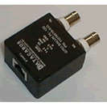

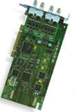

### Time Division Multiplexing

Analog lines make sense when you need just a few channels. When using time division multiplexing (TDM), it is possible to stuff multiple channels into a single data connection. When you want a large number of circuits, the phone company will usually provide you with a digital trunk, which is a data circuit in which the voice is transported in a digital format using PCM. Each timeslot uses 64 Kbps of bandwidth to transport a single voice channel.

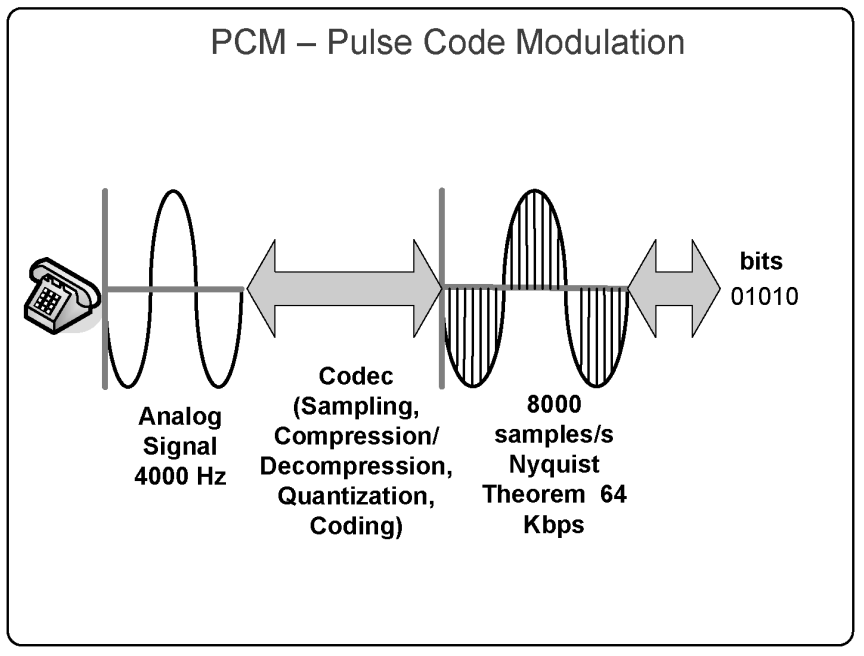

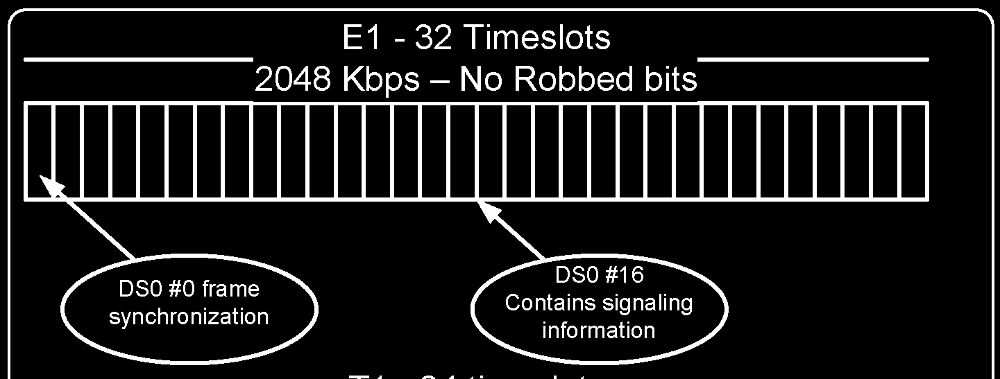

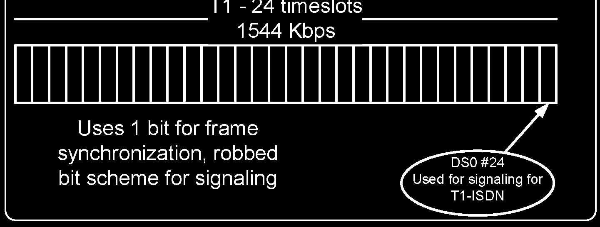

In the US, the most common digital trunk is T1, which has 24 available lines; in Europe and Latin America, E1 trunks have 30 lines. Some companies provide a fractional T1/E1 with fewer channels. Robbed bit signaling Sometimes a T1 trunk uses a robbed bit scheme where one bit is borrowed for signaling. On T1 trunks, the data/voice channel is transmitted with 56 Kbps on each timeslot. As you may observe, when you use the robbed bit, the T1 circuit does not lose two slots for synchronization and signaling.

### T1/E1 Line code

T1s and E1s are actually data circuits and have a data coding that determines the way in which the bits are interpreted. For E1s, the most common line code is HDB3 for layer 1 and CCS for layer 2. The easiest way to know how your digital trunk is configured is to ask the TELCO about this information. You will need this information to configure the file /etc/dahdi/system.conf.

### T1/E1 Signaling

It is important to understand that T1/E1 lines may be delivered using different kinds of signaling, such as:

- T1 with robbed bit signaling
- T1 with ISDN signaling
- E1 with MFC/R2 (CAS - Channel Associated Signaling)
- E1 with ISDN signaling

ISDN is often used in Europe and the US. It is a digital voice network, standardized by the International Telecommunications Union (ITU) in 1984. ISDN provides two kinds of channels:

- Bearer channels o Voice o Data
- Data channels o Out of band signaling o LAPD signaling o Q.931

Usually, an ISDN line is provided using two physical means:

- Basic rate interface (BRI) o Known as 2B+D o Two bearer (64K) channels and a data (16K) channel o Uses a pair of copper wires with 148Kbps.
- Primary rate interface (PRI) o Delivered using a T1/E1 trunk o 23B+D for T1s o 30B+D for E1s

Sometimes, E1 circuits use a CAS signaling scheme called MFC/R2, which was defined by the ITU as a standard known as Q.421/Q441. This is frequently found in Latin America and Asia. Several telephony companies in these countries use customized variants of MFC/R2. Hence, you will need to know the correct country variation in order to make it work.

## ISDN BRI

Channels using ISDN BRI signalling are very popular in Europe. Most ISDN BRI cards for Asterisk supports an S/T interface with NT and TE capabilities. The TE (terminal) connection is the one used to connect to the TELCO or to other PBXs configured as network termination (NT). The NT is used to connect phones and PBXs configured as TE. ISDN BRI provides two data/voice channels and one signalling channel. ISDN BRI cards are available from several vendors of interface cards for Asterisk.

## Choosing a telephony card for your Asterisk server

There are several manufacturers for digital cards compatible with Asterisk. The choice of a card depends on some of the following factors:

### Data bus

There are several types of bus on your PC. It is very important that you have the right card for your server. The following overview outlines the most frequently used cards:

- 32 Bits PCI 5V found in most computers, including desktops o Sangoma (formerly Digium) TE405, TE407, TE205, TE207, TE120, TE122, B410, TDM2400, TDM800, TDM410, and TC400 o Sangoma A101, A102, and A104
- 32/64 bits PCI 3.3V, basically found in servers o Sangoma (formerly Digium) TE410, TE412, TE210, TE212, TE120, TE122, B410, TDM2400, TDM800, TDM410, and TC400
- PCI Express found on desktops and servers o Sangoma (formerly Digium) TE420, TE220, TE121, AEX2400, and AEX800 o Sangoma A101, A102, and A104

> **[2nd-ed note]** Sangoma acquired Digium in 2018. Digium-branded cards are now sold and supported under the Sangoma brand. Verify current model availability on the Sangoma website (www.sangoma.com) as some older SKUs may be discontinued.
- MiniPCI found on embedded systems o OpenVOX A100M(FXO), B100M(ISDN BRI), B200M(ISDN BRI), and B400M(ISDN BRI)
- USB 2.0 found in most modern PCs. Solutions based on USB allow a great density of analog and digital channels. This bus supports 480 Mbps, and each voice channel occupies 64 Kbps. When using USB hubs, it is possible to get densities up to a thousand analog ports in a single port. o Xorcom Astribank (FXS, FXO, E1-ISDN, E1-R2)
- Etherne t. The biggest advantage of Ethernet is to allow the card to be connected by more than one server. High availability solutions are usually the core application for these devices. The strength of this solution is the use of servers without free PCI slots or blade servers. o Redfone FoneBridge (up to four E1 circuits)

## Using hardware echo cancellation

Hardware echo cancellation reduces the load in the host CPU. For cards with more than a single E1 interface, hardware echo cancellation can help alleviate your processor. New enhanced software echo cancellers such as the OSLEC are reducing the need for a hardware echo canceller. To choose between hardware and software echo cancellers, you should consider the amount of processing power available in your server and the number of E1 circuits. An echo cancellation process may use up to nine MIPS (millions of instructions per second) per voice channel with 128 taps of amplitude using OSLEC (Reference: Xorcom Ltd.). If you consider 1 CPU cycle per each instruction (which is not always correct based on the processor and software implementation itself), we are speaking of 1.080 Ghz for four E1s.

### Type of signaling

Selecting the type of signaling (e.g., T1 CAS, T1 PRI, E1 CAS R2, or E1 CAS ISDN) is not an easy task. It really depends on what you have available in your area and at what price. Common Channel Signaling (CCS) is often better than channel associated signaling (CAS). However, it is often not available. In the US, you can usually choose, as most TELCOS offer T1 CAS for regular users and T1 PRI for advanced users (e.g., call centers). In Latin America, E1 CAS R2 is prevalent, but ISDN PRI is available in some cities.

### Asterisktm

Asterisk chan_dahdi Libpri LibopenR2 Libss7

### /dev/dahdi

### dahdi kernel driver

### Interface kernel driver

Implementing R2 is necessary for installing a library known as OpenR2 (www.libopenr2.org), developed by Moises Silva, and to patch Asterisk before the installation—a simple procedure shown later in this chapter. The library has passed several tests and is in production in several of our customers. ISDN is, in my opinion, always the best choice, if available. Some providers can have access to signaling system 7 (SS7), which is a CCS signaling available between phone companies. Proprietary and open source solutions are available for SS7. Library libss7 is used to support SS7 on Asterisk.

## Zaptel and DAHDI

Originally developed by Digium (now Sangoma), DAHDI replaced the earlier Zaptel™ drivers following a trademark dispute. The old Zaptel drivers are no longer maintained; all modern Asterisk installations use DAHDI. The file UPGRADE.txt in the source code details the migration differences.

## Asterisk telephony channels setup

Configuring a telephony interface card involves several necessary steps. In this chapter, we will show three of the most common scenarios:

- Digital connection using ISDN PRI
- Digital connection using ISDN BRI
- Digital connection using MFC/R2

There are two ways to configure DAHDI channels. The first one is to configure it manually with full control of all parameters. The second way is to use the utility dahdi_genconf to detect and configure the cards.

### Automatic detection and configuration

Thanks to the DAHDI development team, we now have automatic detection and configuration of the cards. Step 1: To generate the configuration automatically, use the utility dahdi_genconf, which will detect the card and generate the files /etc/dahdi/system.conf and dahdi-channels.conf.

```
dahdi_genconf
```

Step 2: In the last line of the file chan_dahdi.conf, include the file dahdi-channels.conf

```
#include dahdi_channels.conf
```

Step 3: Comment on all the unused modules in the file modules or simply use:

```
dahdi_genconf modules
```

### Manual configuration

Another option is to configure the interfaces manually. Below are some examples of the configuration for DAHDI channels.

#### Example #1 – Two T1/ E1 channels using ISDN

Required steps: TE205P or TE210P installation /etc/dahdi/system.conf file configuration dahdi driver loading dahdi_test utility dahdi_cfg utility chan_dahdi.conf file configuration Asterisk load and testing Step 1: TE205P installation Before installing TE205P, it is important to understand the differences between the TE205P and TE210P cards. The TE210P card uses a 64-bit bus powered by 3.3 volts found almost only in the server’s motherboards. Be careful if you specify this interface card; make sure your hardware supports a 64-bit, 3.3V bus. The TE205P card uses a 5V PCI, which is often found in desktop computers. We have chosen the TE205P interface card with two spans for this example because it is easier to reduce it to one-span card or to expand it to the four-span card. These cards are now sold under the Sangoma brand (formerly Digium).

```
Step 2: /etc/dahdi/system.conf configuration file
```

The configuration of TDM digital cards is a bit different from the configuration of their analog counterparts. First, we will need to configure the board spans and then the channels. Spans are numbered sequentially depending on the recognizing order of the cards. In other words, if you have more than one interface card, it is hard to know what span belongs to each one. Use dahdi_hardware to check which hardware is installed on each span. Example #1 (2xT1 PRI)

```
span=1,1,0,esf,b8zs
span=2,0,0,esf,b8zs
bchan=1-23
dchan=24
bchan=25-47
dchan=48
defaultzone=us
loadzone=us
```

Example #2 (2xE1 PRI)

```
span=1,1,0,ccs,hdb3,crc4 # not always necessary, consult Telco.
span=2,0,0,ccs,hdb3,crc4
bchan=1-15, 17-31
dchan=16
bchan=33-47, 49-63
dchan=48
defaultzone=br
```

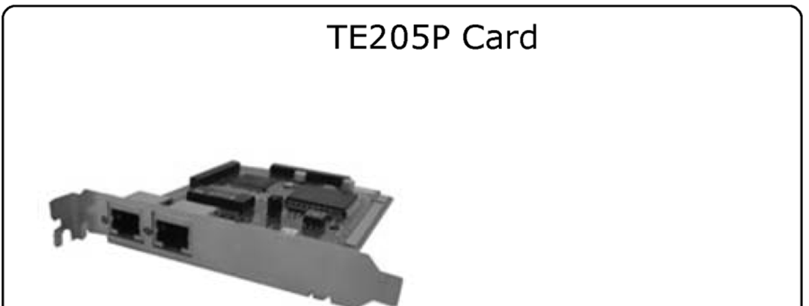

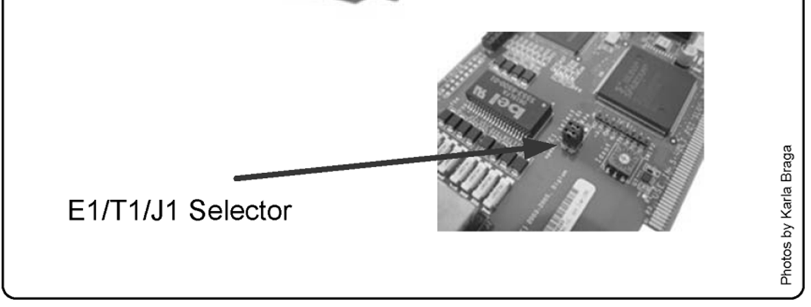

```
loadzone=br
```

Example #3 (4xBRI)

```
loadzone=de
defaultzone=de
span=1,1,0,ccs,ami
bchan=1,2
hardhdlc=3
span=2,0,0,ccs,ami
bchan=4,5
hardhdlc=6
span=3,0,0.ccs.ami
bchan=7,8
hardhdlc=9
span=4,0,0,ccs,ami
bchan=10,11
hardhdlc=12
```

Step 3: Loading kernel drivers Check which driver you need to install using dahdi_hardware.

```
dahdi_hardware
pci:0000:04:02.0     wcte2xxp    e159:0001 Sangoma Wildcard TE205P T1/E1 Board
```

To load use:

```
modprobe dahdi
modprobe wct2xxp
```

Step 4: Using dahdi_test, check the missing interrupts You may verify the number of interrupt misses using the dahdi_test utility compiled with the DAHDI cards. A number below 99.987% indicates possible problems. You will find dahdi_test in

```
/usr/sbin.
#./dahdi_test
Opened pseudo zap interface, measuring accuracy...
99.987793% 100.000000% 100.000000% 100.000000% 100.000000% 100.000000%
100.000000%
100.000000% 100.000000% 100.000000% 100.000000% 100.000000% 100.000000%
100.000000% 100.000000%
100.000000% 100.000000% 100.000000% 100.000000% 99.987793% 100.000000%
100.000000% 100.000000%
100.000000% 100.000000% 100.000000%
--- Results after 26 passes ---
Best: 100.000000 -- Worst: 99.987793 -- Average: 99.999061
```

Step 5: Using the dahdi_cfg utility This is the correct output for dahdi_cfg for one fractional E1 (15 ports) span and two FXO ports.

```
#./dahdi_cfg –vvvv
Dahdi configuration
======================
SPAN 1: CCS/HDB3 Build-out: 0 db (CSU)/0-133 feet (DSX-1)
Channel map:
Channel 01: Clear channel (Default) (Slaves: 01)
Channel 02: Clear channel (Default) (Slaves: 02)
Channel 03: Clear channel (Default) (Slaves: 03)
Channel 04: Clear channel (Default) (Slaves: 04)
Channel 05: Clear channel (Default) (Slaves: 05)
Channel 06: Clear channel (Default) (Slaves: 06)
Channel 07: Clear channel (Default) (Slaves: 07)
Channel 08: Clear channel (Default) (Slaves: 08)
Channel 09: Clear channel (Default) (Slaves: 09)
Channel 10: Clear channel (Default) (Slaves: 10)
Channel 11: Clear channel (Default) (Slaves: 11)
Channel 12: Clear channel (Default) (Slaves: 12)
Channel 13: Clear channel (Default) (Slaves: 13)
Channel 14: Clear channel (Default) (Slaves: 14)
Channel 15: Clear channel (Default) (Slaves: 15)
Channel 16: D-channel (Default) (Slaves: 16)
16 channels configured.
```

Step 6: Configuration of DAHDI into the file /etc/asterisk/chan_dahdi.conf Example #1 (2xT1)

```
callerid=”John Doe”<(555)555-1111>
switchtype=national
signalling =pri_cpe
context=from-pstn
group = 1
channel => 1-23
group =2
channel => 25-47
```

Example #2 (2xE1)

```
callerid=”Flavio Eduardo” <4830258580>
switchtype=euroisdn
signalling = pri_cpe
group = 1
channel => 1-15;17-31
group =2
channel => 32-46;48-62
```

Example #3 (4xBRI)

```
signaling=bri_cpe
switchtype=euroisdn
group=1
context=from-pstn
channel=>1,2,4,5,7,8,10,11
```

Use signaling=bri_cpe_ptmp for point to multipoint BRI. Currently, BRI point to multipoint is not supported in NT mode.

### Loading the kernel drivers

After configuring the drivers, you may simply restart the server. If you have installed DAHDI with make config, you won’t need to do anything extra. The kernel driver will be automatically loaded and configured. However, sometimes it is useful to load and unload the drivers manually. Example:

```
modprobe wct11xp
dahdi_cfg –vvvvv
```

The first command loads the driver and the second, dahdi_cfg, applies the configuration to the kernel driver.

## Troubleshooting

Sometimes things don’t work the first time. Let’s check some resources for troubleshooting DAHDI. Step 1: Check if the card is being recognized by the operation system. Sangoma/Digium cards are usually recognized as the ISDN modem.

```
lspci –v
00:00.0 Host bridge: Intel Corporation E7230/3000/3010 Memory Controller Hub
00:01.0 PCI bridge: Intel Corporation E7230/3000/3010 PCI Express Root Port
00:1c.0 PCI bridge: Intel Corporation 82801G (ICH7 Family) PCI Express Port 1 (rev 01)
00:1c.4 PCI bridge: Intel Corporation 82801GR/GH/GHM (ICH7 Family) PCI Express Port 5 (rev
01)
00:1c.5 PCI bridge: Intel Corporation 82801GR/GH/GHM (ICH7 Family) PCI Express Port 6 (rev
01)
00:1d.0 USB Controller: Intel Corporation 82801G (ICH7 Family) USB UHCI Controller #1 (rev
01)
00:1d.1 USB Controller: Intel Corporation 82801G (ICH7 Family) USB UHCI Controller #2 (rev
01)
00:1d.2 USB Controller: Intel Corporation 82801G (ICH7 Family) USB UHCI Controller #3 (rev
01)
00:1d.7 USB Controller: Intel Corporation 82801G (ICH7 Family) USB2 EHCI Controller (rev 01)
00:1e.0 PCI bridge: Intel Corporation 82801 PCI Bridge (rev e1)
00:1f.0 ISA bridge: Intel Corporation 82801GB/GR (ICH7 Family) LPC Interface Bridge (rev 01)
00:1f.1 IDE interface: Intel Corporation 82801G (ICH7 Family) IDE Controller (rev 01)
00:1f.2 IDE interface: Intel Corporation 82801GB/GR/GH (ICH7 Family) SATA IDE Controller (rev
01)
00:1f.3 SMBus: Intel Corporation 82801G (ICH7 Family) SMBus Controller (rev 01)
01:00.0 PCI bridge: Intel Corporation 6702PXH PCI Express-to-PCI Bridge A (rev 09)
01:00.1 PIC: Intel Corporation 6700/6702PXH I/OxAPIC Interrupt Controller A (rev 09)
02:08.0 SCSI storage controller: LSI Logic / Symbios Logic SAS1068 PCI-X Fusion-MPT SAS (rev
01)
03:00.0 PCI bridge: Intel Corporation 6702PXH PCI Express-to-PCI Bridge A (rev 09)
04:02.0 Network controller: Tiger Jet Network Inc. Tiger3XX Modem/ISDN interface
05:00.0 Ethernet controller: Broadcom Corporation NetXtreme BCM5721 Gig. Eth.PCI Express (rev
11)
07:00.0 Ethernet controller: Realtek Semiconductor Co., Ltd. RTL-8139/8139C/8139C+ (rev 10)
07:05.0 VGA compatible controller: ATI Technologies Inc ES1000 (rev 02)
```

Step 2: Check if the kernel driver is loading correctly using:

```
modprobe wct11xp
dmesg
TE110P: Setting up global serial parameters for E1 FALC V1.2
TE110P: Successfully initialized serial bus for card
TE110P: Span configured for CAS/HDB3
Calling startup (flags is 4099)
Found a Wildcard: Sangoma Wildcard TE110P T1/E1
TE110P: Span configured for CCS/HDB3/CRC4
Calling startup (flags is 4099)
dahdi: Registered tone zone 0 (United States / North America)
wcte1xxp: Setting yellow alarm
```

Step 3: Verify the status of alarms related to the physical layer of the connection. To verify the physical layer of the E1 connection, you may use the following Asterisk CLI command.

```
dahdi show status
```

The alarms indicate problems with the port: Red Alarm: Cannot maintain synchronization with the remote switch. This is usually a physical problem, such as line code or framing mismatch. Yellow alarm: Signals that the remote switch is in the red alarm. This indicates that the remote switch is not receiving your transmissions. Blue Alarm: Receives all unframed 1s on all timeslots; dahdi_tool currently does not detect a blue alarm. Loopback: The port is either in local or remote loopback

```
vtsvoffice*CLI> dahdi show status
Description                              Alarms     IRQ        bpviol     CRC4
Sangoma Wildcard E100P E1/PRA Card 0      OK         0          0          0
Wildcard X100P Board 1                   OK         0          0          0
Wildcard X100P Board 2                   RED        0          0          0
```

Step 4: To detect problems with DAHDI on the Asterisk server, first check if the channels are being recognized using:

```
dahdi show channels
pabxip01*CLI> dahdi show channels
   Chan Extension  Context         Language   MOH Interpret
 pseudo            default                    default
      1            from-pstn                  default
      2            from-pstn                  default
      3            from-pstn                  default
      4            from-pstn                  default
      5            from-pstn                  default
      6            from-pstn                  default
      7            from-pstn                  default
      8            from-pstn                  default
      9            from-pstn                  default
     10            from-pstn                  default
     11            from-pstn                  default
     12            from-pstn                  default
     13            from-pstn                  default
     14            from-pstn                  default
     15            from-pstn                  default
     17            from-pstn                  default
     18            from-pstn                  default
     19            from-pstn                  default
     20            from-pstn                  default
     21            from-pstn                  default
     22            from-pstn                  default
     23            from-pstn                  default
     24            from-pstn                  default
     25            from-pstn                  default
     26            from-pstn                  default
     27            from-pstn                  default
     28            from-pstn                  default
     29            from-pstn                  default
     30 2171       from-pstn                  default
     31 2171       from-pstn                  default
```

Step 5: Check the status of the ISDN layer 3, also known as q.931. You can check if the ISDN layer 3 is up using: `pri show spans` (to list all spans) or `pri show span <n>` for a specific span:

```
vtsvoffice*CLI> pri show span 1
Primary D-channel: 16
Status: Provisioned, Up, Active
Switchtype: EuroISDN
Type: CPE
Window Length: 0/7
Sentrej: 0
SolicitFbit: 0
Retrans: 0
Busy: 0
Overlap Dial: 0
T200 Timer: 1000
T203 Timer: 10000
T305 Timer: 30000
T308 Timer: 4000
T313 Timer: 4000
N200 Counter: 3
```

Use `pri show spans` (plural) to list the status of all configured PRI spans at once.

Check a specific channel. dahdi show channel x:

```
vtsvoffice*CLI> dahdi show channel 1
Channel: 1*CLI>
File Descriptor: 21
Span: 1
Extension:
Dialing: no
Context: entrada
Caller ID: 4832341689
Calling TON: 33
Caller ID name:
Destroy: 0
InAlarm: 0
Signalling Type: PRI Signalling
Radio: 0
Owner: <None>
Real: <None>
Callwait: <None>
Threeway: <None>
Confno: -1
Propagated Conference: -1
Real in conference: 0
DSP: no
Relax DTMF: no
Dialing/CallwaitCAS: 0/0
Default law: alaw
```

debug pri span x: If after everything you still have problems, start debugging the pri span. This command enables a detailed debugging of ISDN calls. It is an important command when you think that something is not correct. You can detect digits being misdialed and other problems. Below we present the example of a debugging output for a successful call. Refer to this example if you need to compare an unsuccessful call to one without problems. One tip is using core set verbose=0 to receive just the ISDN q.931 messages.

```
-- Making new call for cr 32833
> Protocol Discriminator: Q.931 (8)  len=57
> Call Ref: len= 2 (reference 65/0x41) (Originator)
> Message type: SETUP (5)
> [04 03 80 90 a3]
> Bearer Capability (len= 5) [ Ext: 1  Q.931 Std: 0  Info transfer capability: Speech (0)
>                              Ext: 1  Trans mode/rate: 64kbps, circuit-mode (16)
>                              Ext: 1  User information layer 1: A-Law (35)
> [18 03 a9 83 81]
> Channel ID (len= 5) [ Ext: 1  IntID: Implicit, PRI Spare: 0, Exclusive Dchan: 0
>                        ChanSel: Reserved
>                       Ext: 1  Coding: 0   Number Specified   Channel Type: 3
>                       Ext: 1  Channel: 1 ]
> [28 0e 46 6c 61 76 69 6f 20 45 64 75 61 72 64 6f]
> Display (len=14) @h@>[ Flavio Eduardo ]
> [6c 0c 21 80 34 38 33 30 32 35 38 35 39 30]
> Calling Number (len=14) [ Ext: 0  TON: National Number (2)  NPI: ISDN/Telephony Numbering
Plan (E.164/E.163) (1)
>                           Presentation: Presentation permitted, user number not screened
(0) '4830258590' ]
> [70 09 a1 33 32 32 34 38 35 38 30]
> Called Number (len=11) [ Ext: 1  TON: National Number (2)  NPI: ISDN/Telephony Numbering
Plan (E.164/E.163) (1) '32248580' ]
> [a1]fice*CLI>
> Sending Complete (len= 1)
< Protocol Discriminator: Q.931 (8)  len=10
< Call Ref: len= 2 (reference 65/0x41) (Terminator)
< Message type: CALL PROCEEDING (2)
< [18 03 a9 83 81]
< Channel ID (len= 5) [ Ext: 1  IntID: Implicit, PRI Spare: 0, Exclusive Dchan: 0
<                        ChanSel: Reserved
<                       Ext: 1  Coding: 0   Number Specified   Channel Type: 3
<                       Ext: 1  Channel: 1 ]
-- Processing IE 24 (cs0, Channel Identification)
< Protocol Discriminator: Q.931 (8)  len=9
< Call Ref: len= 2 (reference 65/0x41) (Terminator)
< Message type: ALERTING (1)
< [1e 02 84 88]
< Progress Indicator (len= 4) [ Ext: 1  Coding: CCITT (ITU) standard (0) 0: 0   Location:
Public network serving the remote user (4)
<                               Ext: 1  Progress Description: Inband information or
appropriate pattern now available. (8) ]
-- Processing IE 30 (cs0, Progress Indicator)
< Protocol Discriminator: Q.931 (8)  len=64
< Call Ref: len= 2 (reference 5720/0x1658) (Originator)
< Message type: SETUP (5)
< [04 03 80 90 a3]
< Bearer Capability (len= 5) [ Ext: 1  Q.931 Std: 0  Info transfer capability: Speech (0)
<                              Ext: 1  Trans mode/rate: 64kbps, circuit-mode (16)
<                              Ext: 1  User information layer 1: A-Law (35)
< [18 03 a1 83 82]
< Channel ID (len= 5) [ Ext: 1  IntID: Implicit, PRI Spare: 0, Preferred Dchan: 0
<                        ChanSel: Reserved
<                       Ext: 1  Coding: 0   Number Specified   Channel Type: 3
<                       Ext: 1  Channel: 2 ]
< [1c 15 91 a1 12 02 01 bc 02 01 0f 30 0a 02 01 01 0a 01 00 a1 02 82 00]
< Facility (len=23, codeset=0) [ 0x91, 0xa1, 0x12, 0x02, 0x01, 0xbc, 0x02, 0x01, 0x0f, '0',
0x0a, 0x02, 0x01, 0x01, 0x0a, 0x01, 0x00, 0xa1, 0x02, 0x82, 0x00 ]
< [1e 02 82 83]
< Progress Indicator (len= 4) [ Ext: 1  Coding: CCITT (ITU) standard (0) 0: 0   Location:
Public network serving the local user (2)
<                               Ext: 1  Progress Description: Calling equipment is non-ISDN.
(3) ]
< [6c 0c 21 83 34 38 33 32 32 34 38 35 38 30]
< Calling Number (len=14) [ Ext: 0  TON: National Number (2)  NPI: ISDN/Telephony Numbering
Plan (E.164/E.163) (1)
<                           Presentation: Presentation allowed of network provided number (3)
'4832248580' ]
< [70 05 c1 38 35 38 30]
< Called Number (len= 7) [ Ext: 1  TON: Subscriber Number (4)  NPI: ISDN/Telephony Numbering
Plan (E.164/E.163) (1) '8580' ]
< [a1]
< Sending Complete (len= 1)
-- Making new call for cr 5720
-- Processing Q.931 Call Setup
-- Processing IE 4 (cs0, Bearer Capability)
-- Processing IE 24 (cs0, Channel Identification)
-- Processing IE 28 (cs0, Facility)
Handle Q.932 ROSE Invoke component
-- Processing IE 30 (cs0, Progress Indicator)
-- Processing IE 108 (cs0, Calling Party Number)
-- Processing IE 112 (cs0, Called Party Number)
-- Processing IE 161 (cs0, Sending Complete)
> Protocol Discriminator: Q.931 (8)  len=10
> Call Ref: len= 2 (reference 5720/0x1658) (Terminator)
> Message type: CALL PROCEEDING (2)
> [18 03 a9 83 82]
> Channel ID (len= 5) [ Ext: 1  IntID: Implicit, PRI Spare: 0, Exclusive Dchan: 0
>                        ChanSel: Reserved
>                       Ext: 1  Coding: 0   Number Specified   Channel Type: 3
>                       Ext: 1  Channel: 2 ]
> Protocol Discriminator: Q.931 (8)  len=14
> Call Ref: len= 2 (reference 5720/0x1658) (Terminator)
> Message type: CONNECT (7)
> [18 03 a9 83 82]
> Channel ID (len= 5) [ Ext: 1  IntID: Implicit, PRI Spare: 0, Exclusive Dchan: 0
>                        ChanSel: Reserved
>                       Ext: 1  Coding: 0   Number Specified   Channel Type: 3
>                       Ext: 1  Channel: 2 ]
> [1e 02 81 82]
> Progress Indicator (len= 4) [ Ext: 1  Coding: CCITT (ITU) standard (0) 0: 0   Location:
Private network serving the local user (1)
>                               Ext: 1  Progress Description: Called equipment is non-ISDN.
(2) ]
< Protocol Discriminator: Q.931 (8)  len=5
< Call Ref: len= 2 (reference 5720/0x1658) (Originator)
< Message type: CONNECT ACKNOWLEDGE (15)
< Protocol Discriminator: Q.931 (8)  len=9
< Call Ref: len= 2 (reference 65/0x41) (Terminator)
< Message type: PROGRESS (3)
< [1e 02 84 82]
< Progress Indicator (len= 4) [ Ext: 1  Coding: CCITT (ITU) standard (0) 0: 0   Location:
Public network serving the remote user (4)
<                               Ext: 1  Progress Description: Called equipment is non-ISDN.
(2) ]
-- Processing IE 30 (cs0, Progress Indicator)
< Protocol Discriminator: Q.931 (8)  len=5
< Call Ref: len= 2 (reference 65/0x41) (Terminator)
< Message type: CONNECT (7)
> Protocol Discriminator: Q.931 (8)  len=5
> Call Ref: len= 2 (reference 65/0x41) (Originator)
> Message type: CONNECT ACKNOWLEDGE (15)
NEW_HANGUP DEBUG: Calling q931_hangup, ourstate Active, peerstate Connect Request
> Protocol Discriminator: Q.931 (8)  len=9
> Call Ref: len= 2 (reference 65/0x41) (Originator)
> Message type: DISCONNECT (69)
> [08 02 81 90]
> Cause (len= 4) [ Ext: 1  Coding: CCITT (ITU) standard (0) 0: 0   Location: Private network
serving the local user (1)
>                  Ext: 1  Cause: Unknown (16), class = Normal Event (1) ]
< Protocol Discriminator: Q.931 (8)  len=5
< Call Ref: len= 2 (reference 65/0x41) (Terminator)
< Message type: RELEASE (77)
NEW_HANGUP DEBUG: Calling q931_hangup, ourstate Null, peerstate Release Request
> Protocol Discriminator: Q.931 (8)  len=9
> Call Ref: len= 2 (reference 65/0x41) (Originator)
> Message type: RELEASE COMPLETE (90)
> [08 02 81 90]
> Cause (len= 4) [ Ext: 1  Coding: CCITT (ITU) standard (0) 0: 0   Location: Private network
serving the local user (1)
>                  Ext: 1  Cause: Unknown (16), class = Normal Event (1) ]
NEW_HANGUP DEBUG: Calling q931_hangup, ourstate Null, peerstate Null
NEW_HANGUP DEBUG: Destroying the call, ourstate Null, peerstate Null
< Protocol Discriminator: Q.931 (8)  len=9
< Call Ref: len= 2 (reference 5720/0x1658) (Originator)
< Message type: DISCONNECT (69)
< [08 02 82 90]
< Cause (len= 4) [ Ext: 1  Coding: CCITT (ITU) standard (0) 0: 0   Location: Public network
serving the local user (2)
<                  Ext: 1  Cause: Unknown (16), class = Normal Event (1) ]
-- Processing IE 8 (cs0, Cause)
NEW_HANGUP DEBUG: Calling q931_hangup, ourstate Disconnect Indication, peerstate Disconnect
Request
> Protocol Discriminator: Q.931 (8)  len=9
> Call Ref: len= 2 (reference 5720/0x1658) (Terminator)
> Message type: RELEASE (77)
> [08 02 81 90]
> Cause (len= 4) [ Ext: 1  Coding: CCITT (ITU) standard (0) 0: 0   Location: Private network
serving the local user (1)
>                  Ext: 1  Cause: Unknown (16), class = Normal Event (1) ]
< Protocol Discriminator: Q.931 (8)  len=5
< Call Ref: len= 2 (reference 5720/0x1658) (Originator)
< Message type: RELEASE COMPLETE (90)
NEW_HANGUP DEBUG: Calling q931_hangup, ourstate Null, peerstate Null
NEW_HANGUP DEBUG: Destroying the call, ourstate Null, peerstate Null
```

## Configuration options in chan_dahdi.conf

Several options are available in the file chan_dahdi.conf. A description of all options would be boring and counterproductive. Here, we will detail the main option groups available to provide a better understanding.

### General options (channel independent)

context: Defines the incoming context.

```
context=default
```

channel: Defines channel or channel range. Each channel definition will inherit options defined before the declaration. Channels can be identified individually or in the same line with comma separation. Ranges can be defined using “-”.

```
Channel=>1-15
Channel=>16
Channel=>17,18
```

group: Allows channels to be treated as a group. If you dial a group number instead of a channel number, the first channel available is used. If channels are phones, when you call a group, all phones will ring simultaneously. Using commas, you can specify more than one group for the same channel.

```
group=1
group=3,5
```

language: Turns on the internationalization and configures a language. This feature will configure system messages for a specific language. English is the only language with complete prompts available from the standard installation. musiconhold: Select music on hold class.

### ISDN options

switchtype: Is dependent on the PBX or switch used. In Europe and Latin America, EuroISDN is common.

- 5ess: Lucent 5ESS
- euroisdn: EuroISDN
- national: National ISDN
- dms100: Nortel DMS100
- 4ess: AT&T 4ESS
- Qsig: Q.SIG

```
switchtype = EuroISDN
```

pridialplan: Required for some switches that need a dial plan specification. This option is ignored by many switches. The valid options are private, national, international, and unknown.

```
pridialplan = unknown
```

prilocaldialplan: Necessary for some switches, usually unknown.

```
prilocaldialplan = unknown
```

overlapdial: Overlap dialing is used when you pass digits after the connection is established. You can use block mode numbering (overlapdial=no) or digit mode (overlapdial=yes). Block mode is often used by operators. signaling: Configures the signaling type for the subsequent channels. These parameters should correspond to those in the chan_dahdi.conf file. Correct choices are based on the available channel. For ISDN you might choose five options:

- pri_cpe: Used when the device is a CPE, sometimes referred to as client, user, or slave. This is the simplest and most used form of signaling. Sometimes, when you try to connect to a private PBX, the PBX has commonly been configured as a CPE as well. In this case, use pri_net signaling in Asterisk.
- pri_net: Used when Asterisk is connected to a private PBX configured as a CPE. The signaling is often referred to as host, master, or network.
- bri_cpe: Used when Asterisk is connected as a CPE to a ISDN BRI trunk
- bri_net: Used when Asterisk is connected to an ISDN phone or PBX configured as a terminal (TE).
- bri_cpe_ptmp: Sames as bri_cpe, but in a point-to-multipoint architecture.

### CallerID options

Many Caller ID options are available. Some can be disabled, although most are enabled by default. usecallerid: Enables or disables the Caller ID transmission for the subsequent channels (Yes/No). Note: If your system requires two rings before answering, try disabling this feature so that it will answer immediately. hidecallerid: Hides the Caller ID (Yes/No). calleridcallwaiting: Enables receiving Caller ID during a call waiting indication (Yes/No). callerid: Configures a Caller ID string for a specific channel. The caller can be configured with “asreceived” in trunk interfaces to pass the Caller ID forward.

```
callerid = "Flavio Eduardo Gonçalves" <48 30258500>
```

Note: Most TELCOs mandate that you configure your correct caller ID. If you do not pass the right caller ID, you shouldn’t be able to dial out over the TELCO. On the other hand, you will be able to receive calls even without configuring the caller ID.

### Audio quality options

These options adjust certain Asterisk parameters that affect audio quality in DAHDI channels. echocancel: Disable or enable echo cancellation. You should keep this feature enabled. It accepts “yes” or the number of taps. Explanation: How does echo canceling work? Most echo canceling algorithms operate by generating multiple copies of a received signal, with each being delayed by a small interval. This little flow is named “tap”. The number of taps determines the echo delay that can be cancelled. These copies are delayed, adjusted, and subtracted from the original signal. The trick is to adjust the delayed signal exactly to what is necessary to remove the echo. echocancelwhenbridged: Enables or disables the echo canceller during a pure TDM call. This is usually not required. rxgain: Adjusts the audio reception gain to either increase or decrease reception volume (-100% to 100%). txgain: Adjusts audio transmission gain to either increase or decrease the transmission volume (- 100% to 100%). Example:

```
echocancel=yes
echocancelwhenbridged=yes
txgain=-10%
rxgain=10%
```

### Billing options

These options change the way in which call information is recorded in the call detail records (CDR) database. amaflags: Affects the categorization of CDR. It accepts these values:

- billing
- documentation
- omit
- default

accountcode: It configures an account code for a specific channel. It can contain any alphanumeric value, usually the department or user name.

```
accountcode=finance
amaflags=billing
```

## MFC/R2 configuration

MFC/R2 is used in several countries in Latin America, China, and Africa as well as some European countries. ISDN is superior and preferred if available in your area.

### Understanding the problem

The card used to signal MFC/R2 is the same used to signal ISDN. It’s possible to use MFC/R2 on DAHDI channels using the library called libopenR2 (www.libopenr2.com). This library was not part of versions of Asterisk prior to 1.6.2.

#### Understanding the MFC/R2 protocol

The MFC/R2 protocol combines in-band and out-of-band signaling. Address signaling is forwarded in-band using a set of tones while channel information is transmitted over timeslot 16 as out-of-band signaling. Line Signaling (ITU-T Q.421) In timeslot 16, each voice channel uses four ABCD bits to signal its states and call control. Bits C and D are rarely used. In some countries, they can be used for metering (pulse metering for billing). In a normal conversation, we have both sides working: the caller and the called side. Signaling from the caller side is referred to as forward signaling while the called side uses backward signaling. We will designate Af and Bf for forwarding signaling and Ab and Bb for backward signaling. State ABCD forward ABCD backward Idle/Released 1001 1001 Seized 0001 1001 Seize Ack 0001 1101 Answered 0001 0101 ClearBack 0001 1101 ClearFwd (Before clear-back) 1001 0101 ClearFwd (disconnection confirmation) 1001 1001 Blocked 1001 1101 MFC/R2 was defined by the ITU. Unfortunately, several countries customized the standard to their own needs. As a result, variations emerged in standards between countries. Inter-register signals (ITU-T Q.441) MFC/R2 signaling uses a combination of two tones. The table below shows the ITU standard. Signal group I (Forward) Signal Description Forward signal Digit 1 I-1 Digit 2 I-2 Digit 3 I-3 Digit 4 I-4 Digit 5 I-5 Digit 6 I-6 Digit 7 I-7 Digit 8 I-8 Digit 9 I-9 Digit 0 I-10 Country code indicator, outgoing half-echo suppressor required I-11 Country code indicator, no echo suppressor required I-12 Test call indicator I-13 Country code indicator, outgoing half-echo suppressor inserted I-14 Not used I-15 Signal group II (Forward) Signal Description Forward signal Subscriber without priority II-1 Subscriber with priority II-2 Maintenance equipment II-3 Spare II-4 Operator II-5 Data Transmission II-6 Subscriber or operator without forward transfer facility II-7 Data transmission II-8 Subscriber with priority II-9 Operator with forward transfer facility II-10 Spare II-11 Spare II-12 Spare II-13 Spare II-14 Spare II-15 Signal group A (backwards) Signal Description Backward signal Send next digit (n+1) A-1 Send last but one digit (n-1) A-2 Address complete, changeover to reception of Group B signals A-3 Congestion in the national network A4 Send calling party’s category A5 Address complete, charge, set-up speech conditions A6 Send last but two digit (n-2) A7 Send last but three digit (n-3) A8 Spare A9 Spare A10 Send country code indicator A11 Send language or discrimination digit A12 Send nature of circuit A13 Request information on use of echo suppressor A14 Congestion in an international exchange or at its output A15 Signal group B (backwards) Signal Description Backward signal Spare B1 Send special information tone B2 Subscriber’s line busy B3 Congestion (after changeover group A to B) B4 Unallocated number B5 Subscriber’s line free, charge B6 Subscriber’s line free, no charge B7 Subscriber’s line out of order B8 Spare B9 Spare B10 Spare B11 Spare B12 Spare B13 Spare B14 Spare B15

### MFC/R2 sequence

The following sequence illustrates a call originating from an Asterisk’s extension to a terminal in the PSTN. The PSTN drops the call and ends the communication.

## How to use the driver libopenr2

The project initiated by Moises Silva was inspired on the Unicall channel driver written by Steve Underwood. The OpenR2 library is currently the most stable software solution for Asterisk. With this solution, we may use any digital card compatible with DAHDI. Previously, only proprietary solutions were available for MFC/R2, one of the best I have used is the one made available by Khomp, www.khomp.com.br. In Asterisk 22, MFC/R2 support via libopenR2 is built in when the library is present at compile time — no external patch is required. The steps below show the historical manual installation for reference; on modern systems, install `libopenr2-dev` from your distribution's package manager before running `./configure`, then enable `chan_dahdi` in `make menuselect`.

> **[2nd-ed note]** The SVN repository referenced below (`svn.digium.com`) is no longer active. The patched Asterisk 1.4 tree is obsolete. For Asterisk 22, libopenr2 support is integrated in the main source tree. Consider condensing or removing the legacy patch steps below.

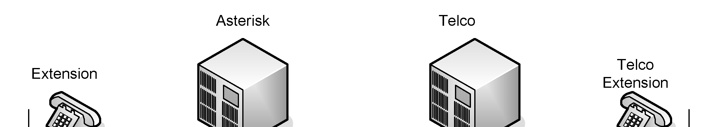

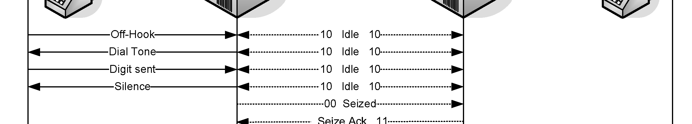


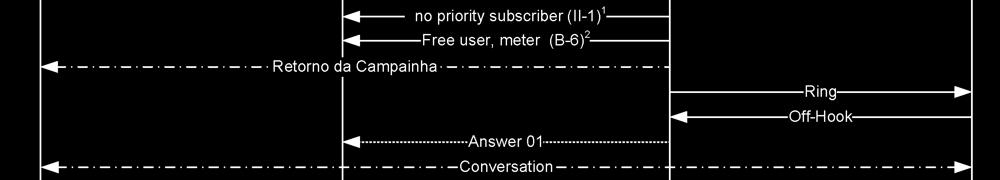

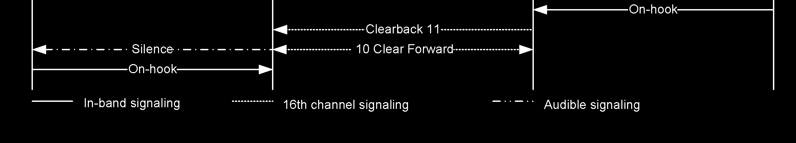

Step 1: Check the patches for the version of Asterisk you want to install.

```
apt-get install subversion
```

Step2: Download the modified Asterisk code with the patch installed.

> **[2nd-ed note]** The SVN URL below is from the Asterisk 1.4 era and is no longer reachable. For Asterisk 22, skip this step — libopenr2 support is included in the main Asterisk source tree.

```
cd /usr/src
svn checkout http://svn.digium.com/svn/asterisk/team/moy/mfcr2/asterisk-1.4-openr2
```

Step 3: Compile and install Please, BACK UP your server before proceeding.

```
cd asterisk-1.4-openr2
./configure && make && make install
```

Note: Do not execute “make samples” to avoid overwriting your configuration files.

```
Step 4: Changing the file /etc/dahdi/system.conf:
vim /etc/dahdi/system.conf
```

Let’s suppose you have a card with one E1 interface.

```
span=1,1,0,cas,hdb3
cas=1-15:1101
cas=17-31:1101
dchan=16
loadzone=br
defaultzone=br
```

Step 5: Run the command dahdi_cfg to apply the changes to the driver:

```
dahdi_cfg –vvvvvvvv
Dahdi Version:SVN-branch-1.4-r4348
Echo Canceller: MG2
Configuration
======================
SPAN 1: CAS/HDB3 Build-out: 0 db (CSU)/0-133 feet (DSX-1)
Channel map:
Channel 01: CAS / User (Default) (Slaves: 01)
Channel 02: CAS / User (Default) (Slaves: 02)
Channel 03: CAS / User (Default) (Slaves: 03)
Channel 04: CAS / User (Default) (Slaves: 04)
Channel 05: CAS / User (Default) (Slaves: 05)
Channel 06: CAS / User (Default) (Slaves: 06)
Channel 07: CAS / User (Default) (Slaves: 07)
Channel 08: CAS / User (Default) (Slaves: 08)
Channel 09: CAS / User (Default) (Slaves: 09)
Channel 10: CAS / User (Default) (Slaves: 10)
Channel 11: CAS / User (Default) (Slaves: 11)
Channel 12: CAS / User (Default) (Slaves: 12)
Channel 13: CAS / User (Default) (Slaves: 13)
Channel 14: CAS / User (Default) (Slaves: 14)
Channel 15: CAS / User (Default) (Slaves: 15)
Channel 16: D-channel (Default) (Slaves: 16)
Channel 17: CAS / User (Default) (Slaves: 17)
Channel 18: CAS / User (Default) (Slaves: 18)
Channel 19: CAS / User (Default) (Slaves: 19)
Channel 20: CAS / User (Default) (Slaves: 20)
Channel 21: CAS / User (Default) (Slaves: 21)
Channel 22: CAS / User (Default) (Slaves: 22)
Channel 23: CAS / User (Default) (Slaves: 23)
Channel 24: CAS / User (Default) (Slaves: 24)
Channel 25: CAS / User (Default) (Slaves: 25)
Channel 26: CAS / User (Default) (Slaves: 26)
Channel 27: CAS / User (Default) (Slaves: 27)
Channel 28: CAS / User (Default) (Slaves: 28)
Channel 29: CAS / User (Default) (Slaves: 29)
Channel 30: CAS / User (Default) (Slaves: 30)
Channel 31: CAS / User (Default) (Slaves: 31)
31 channels to configure.
-----------------------------------------------------------------------
```

Step 5: Change the file chan_dahdi.conf

```
vim /etc/asterisk/chan_dahdi.conf
[channels]
usecallerid=yes
callwaiting=yes
usecallingpres=yes
callwaitingcallerid=yes
threewaycalling=yes
transfer=yes
canpark=yes
cancallforward=yes
callreturn=yes
echocancel=yes
echotrainning=yes
echocancelwhenbridged=yes
signalling=mfcr2
mfcr2_variant=br
mfcr2_get_ani_first=no
mfcr2_max_ani=20
mfcr2_max_dnis=4
mfcr2_category=national_subscriber
mfcr2_logdir=span1
mfcr2_logging=all
group=1
callgroup=1
pickupgroup=1
callerid=asreceived
context=from-mfcr2
channel => 1-15,17-31
```

Step 6: Change the dial plan in the file extensions .conf

```
vim /etc/asterisk/extensions.conf
[default]
exten => _XXXXXXXX,1,Set(CALLERID(num)=1145678990)
exten => _XXXXXXXX,n,Dial(DAHDI/g1/${EXTEN},60,tT)
```

Note: Some TELCOS do not accept calls without the caller ID. Please set the caller ID to one of the DID numbers assigned by the operator. In some countries, this step is not required. Step 7: Test the solution: Now, with an extension in the context from-internal, call any number and observe the console. Check to see if any errors are occurring. -- Executing Set("SIP/8564-081ca5d8", "CALLERID(num)=1145678990") in new stack -- Executing Dial("SIP/8564-081ca5d8", "DAHDI/g1/35678899|60|tT") in new stack

### Debugging OpenR2

To detect errors in the calls, you can activate the debug. To do this, follow the steps below. Step 1: Edit the file chan_dahdi.conf and add the following three lines to the configuration:

```
mfcr2_logdir=span1
mfcr2_logging=all
mfcr2_call_files=yes
```

Step 2: Restart the Asterisk server Step 3: Test the call and check the call files at /var/log/asterisk/mfcr2/span1 Below is a trace for a normal call. Compare it to what you receive in your call.

```
[15:05:47:710] [Thread: 3078019984] [Chan 1] - Call started at Mon Jul  6 15:05:47 2009 on
chan 1
[15:05:47:710] [Thread: 3078019984] [Chan 1] - CAS Tx >> [SEIZE] 0x00
[15:05:47:710] [Thread: 3078019984] [Chan 1] - CAS Raw Tx >> 0x01
[15:05:47:951] [Thread: 3078019984] [Chan 1] - Bits changed from 0x08 to 0x0C
[15:05:47:951] [Thread: 3078019984] [Chan 1] - CAS Rx << [SEIZE ACK] 0x0C
[15:05:47:951] [Thread: 3078019984] [Chan 1] - Attempting to cancel timer timer 2
[15:05:47:951] [Thread: 3078019984] [Chan 1] - timer id 2 found, cancelling it now
[15:05:47:951] [Thread: 3078019984] [Chan 1] - Sending DNIS digit 3
[15:05:47:951] [Thread: 3078019984] [Chan 1] - MF Tx >> 3 [ON]
[15:05:48:070] [Thread: 3078019984] [Chan 1] - MF Rx << 1 [ON]
[15:05:48:070] [Thread: 3078019984] [Chan 1] - Attempting to cancel timer timer 0
[15:05:48:070] [Thread: 3078019984] [Chan 1] - Cannot cancel timer 0
[15:05:48:070] [Thread: 3078019984] [Chan 1] - MF Tx >> 3 [OFF]
[15:05:48:150] [Thread: 3078019984] [Chan 1] - MF Rx << 1 [OFF]
[15:05:48:150] [Thread: 3078019984] [Chan 1] - Sending DNIS digit 0
[15:05:48:150] [Thread: 3078019984] [Chan 1] - MF Tx >> 0 [ON]
[15:05:48:150] [Thread: 3078019984] [Chan 1] - Group A DNIS request handled
[15:05:48:250] [Thread: 3078019984] [Chan 1] - MF Rx << 1 [ON]
[15:05:48:250] [Thread: 3078019984] [Chan 1] - Attempting to cancel timer timer 0
[15:05:48:250] [Thread: 3078019984] [Chan 1] - Cannot cancel timer 0
[15:05:48:250] [Thread: 3078019984] [Chan 1] - MF Tx >> 0 [OFF]
[15:05:48:350] [Thread: 3078019984] [Chan 1] - MF Rx << 1 [OFF]
[15:05:48:350] [Thread: 3078019984] [Chan 1] - Sending DNIS digit 2
[15:05:48:350] [Thread: 3078019984] [Chan 1] - MF Tx >> 2 [ON]
[15:05:48:350] [Thread: 3078019984] [Chan 1] - Group A DNIS request handled
[15:05:48:450] [Thread: 3078019984] [Chan 1] - MF Rx << 1 [ON]
[15:05:48:450] [Thread: 3078019984] [Chan 1] - Attempting to cancel timer timer 0
[15:05:48:450] [Thread: 3078019984] [Chan 1] - Cannot cancel timer 0
[15:05:48:450] [Thread: 3078019984] [Chan 1] - MF Tx >> 2 [OFF]
[15:05:48:550] [Thread: 3078019984] [Chan 1] - MF Rx << 1 [OFF]
[15:05:48:550] [Thread: 3078019984] [Chan 1] - Sending DNIS digit 5
[15:05:48:550] [Thread: 3078019984] [Chan 1] - MF Tx >> 5 [ON]
[15:05:48:550] [Thread: 3078019984] [Chan 1] - Group A DNIS request handled
[15:05:48:650] [Thread: 3078019984] [Chan 1] - MF Rx << 1 [ON]
[15:05:48:650] [Thread: 3078019984] [Chan 1] - Attempting to cancel timer timer 0
[15:05:48:650] [Thread: 3078019984] [Chan 1] - Cannot cancel timer 0
[15:05:48:650] [Thread: 3078019984] [Chan 1] - MF Tx >> 5 [OFF]
[15:05:48:750] [Thread: 3078019984] [Chan 1] - MF Rx << 1 [OFF]
[15:05:48:750] [Thread: 3078019984] [Chan 1] - Sending DNIS digit 8
[15:05:48:750] [Thread: 3078019984] [Chan 1] - MF Tx >> 8 [ON]
[15:05:48:750] [Thread: 3078019984] [Chan 1] - Group A DNIS request handled
[15:05:48:850] [Thread: 3078019984] [Chan 1] - MF Rx << 1 [ON]
[15:05:48:850] [Thread: 3078019984] [Chan 1] - Attempting to cancel timer timer 0
[15:05:48:850] [Thread: 3078019984] [Chan 1] - Cannot cancel timer 0
[15:05:48:850] [Thread: 3078019984] [Chan 1] - MF Tx >> 8 [OFF]
[15:05:48:950] [Thread: 3078019984] [Chan 1] - MF Rx << 1 [OFF]
[15:05:48:950] [Thread: 3078019984] [Chan 1] - Sending DNIS digit 5
[15:05:48:950] [Thread: 3078019984] [Chan 1] - MF Tx >> 5 [ON]
[15:05:48:950] [Thread: 3078019984] [Chan 1] - Group A DNIS request handled
[15:05:49:050] [Thread: 3078019984] [Chan 1] - MF Rx << 1 [ON]
[15:05:49:050] [Thread: 3078019984] [Chan 1] - Attempting to cancel timer timer 0
[15:05:49:050] [Thread: 3078019984] [Chan 1] - Cannot cancel timer 0
[15:05:49:050] [Thread: 3078019984] [Chan 1] - MF Tx >> 5 [OFF]
[15:05:49:150] [Thread: 3078019984] [Chan 1] - MF Rx << 1 [OFF]
[15:05:49:150] [Thread: 3078019984] [Chan 1] - Sending DNIS digit 8
[15:05:49:150] [Thread: 3078019984] [Chan 1] - MF Tx >> 8 [ON]
[15:05:49:150] [Thread: 3078019984] [Chan 1] - Group A DNIS request handled
[15:05:49:250] [Thread: 3078019984] [Chan 1] - MF Rx << 1 [ON]
[15:05:49:250] [Thread: 3078019984] [Chan 1] - Attempting to cancel timer timer 0
[15:05:49:250] [Thread: 3078019984] [Chan 1] - Cannot cancel timer 0
[15:05:49:250] [Thread: 3078019984] [Chan 1] - MF Tx >> 8 [OFF]
[15:05:49:330] [Thread: 3078019984] [Chan 1] - MF Rx << 1 [OFF]
[15:05:49:330] [Thread: 3078019984] [Chan 1] - Sending DNIS digit 4
[15:05:49:330] [Thread: 3078019984] [Chan 1] - MF Tx >> 4 [ON]
[15:05:49:330] [Thread: 3078019984] [Chan 1] - Group A DNIS request handled
[15:05:49:590] [Thread: 3078019984] [Chan 1] - MF Rx << 5 [ON]
[15:05:49:590] [Thread: 3078019984] [Chan 1] - Attempting to cancel timer timer 0
[15:05:49:590] [Thread: 3078019984] [Chan 1] - Cannot cancel timer 0
[15:05:49:590] [Thread: 3078019984] [Chan 1] - MF Tx >> 4 [OFF]
[15:05:49:670] [Thread: 3078019984] [Chan 1] - MF Rx << 5 [OFF]
[15:05:49:670] [Thread: 3078019984] [Chan 1] - Sending category National Subscriber
[15:05:49:670] [Thread: 3078019984] [Chan 1] - MF Tx >> 1 [ON]
[15:05:49:770] [Thread: 3078019984] [Chan 1] - MF Rx << 5 [ON]
[15:05:49:770] [Thread: 3078019984] [Chan 1] - Attempting to cancel timer timer 0
[15:05:49:770] [Thread: 3078019984] [Chan 1] - Cannot cancel timer 0
[15:05:49:770] [Thread: 3078019984] [Chan 1] - MF Tx >> 1 [OFF]
[15:05:49:850] [Thread: 3078019984] [Chan 1] - MF Rx << 5 [OFF]
[15:05:49:850] [Thread: 3078019984] [Chan 1] - Sending ANI digit 4
[15:05:49:850] [Thread: 3078019984] [Chan 1] - MF Tx >> 4 [ON]
[15:05:49:930] [Thread: 3078019984] [Chan 1] - MF Rx << 5 [ON]
[15:05:49:930] [Thread: 3078019984] [Chan 1] - Attempting to cancel timer timer 0
[15:05:49:930] [Thread: 3078019984] [Chan 1] - Cannot cancel timer 0
[15:05:49:930] [Thread: 3078019984] [Chan 1] - MF Tx >> 4 [OFF]
[15:05:50:030] [Thread: 3078019984] [Chan 1] - MF Rx << 5 [OFF]
[15:05:50:030] [Thread: 3078019984] [Chan 1] - Sending ANI digit 8
[15:05:50:030] [Thread: 3078019984] [Chan 1] - MF Tx >> 8 [ON]
[15:05:50:130] [Thread: 3078019984] [Chan 1] - MF Rx << 5 [ON]
[15:05:50:130] [Thread: 3078019984] [Chan 1] - Attempting to cancel timer timer 0
[15:05:50:130] [Thread: 3078019984] [Chan 1] - Cannot cancel timer 0
[15:05:50:130] [Thread: 3078019984] [Chan 1] - MF Tx >> 8 [OFF]
[15:05:50:230] [Thread: 3078019984] [Chan 1] - MF Rx << 5 [OFF]
[15:05:50:230] [Thread: 3078019984] [Chan 1] - Sending ANI digit 3
[15:05:50:230] [Thread: 3078019984] [Chan 1] - MF Tx >> 3 [ON]
[15:05:50:330] [Thread: 3078019984] [Chan 1] - MF Rx << 5 [ON]
[15:05:50:330] [Thread: 3078019984] [Chan 1] - Attempting to cancel timer timer 0
[15:05:50:330] [Thread: 3078019984] [Chan 1] - Cannot cancel timer 0
[15:05:50:330] [Thread: 3078019984] [Chan 1] - MF Tx >> 3 [OFF]
[15:05:50:430] [Thread: 3078019984] [Chan 1] - MF Rx << 5 [OFF]
[15:05:50:430] [Thread: 3078019984] [Chan 1] - Sending ANI digit 0
[15:05:50:430] [Thread: 3078019984] [Chan 1] - MF Tx >> 0 [ON]
[15:05:50:530] [Thread: 3078019984] [Chan 1] - MF Rx << 5 [ON]
[15:05:50:530] [Thread: 3078019984] [Chan 1] - Attempting to cancel timer timer 0
[15:05:50:530] [Thread: 3078019984] [Chan 1] - Cannot cancel timer 0
[15:05:50:530] [Thread: 3078019984] [Chan 1] - MF Tx >> 0 [OFF]
[15:05:50:610] [Thread: 3078019984] [Chan 1] - MF Rx << 5 [OFF]
[15:05:50:610] [Thread: 3078019984] [Chan 1] - Sending ANI digit 2
[15:05:50:610] [Thread: 3078019984] [Chan 1] - MF Tx >> 2 [ON]
[15:05:50:710] [Thread: 3078019984] [Chan 1] - MF Rx << 5 [ON]
[15:05:50:710] [Thread: 3078019984] [Chan 1] - Attempting to cancel timer timer 0
[15:05:50:710] [Thread: 3078019984] [Chan 1] - Cannot cancel timer 0
[15:05:50:710] [Thread: 3078019984] [Chan 1] - MF Tx >> 2 [OFF]
[15:05:50:810] [Thread: 3078019984] [Chan 1] - MF Rx << 5 [OFF]
[15:05:50:810] [Thread: 3078019984] [Chan 1] - Sending ANI digit 7
[15:05:50:810] [Thread: 3078019984] [Chan 1] - MF Tx >> 7 [ON]
[15:05:50:910] [Thread: 3078019984] [Chan 1] - MF Rx << 5 [ON]
[15:05:50:910] [Thread: 3078019984] [Chan 1] - Attempting to cancel timer timer 0
[15:05:50:910] [Thread: 3078019984] [Chan 1] - Cannot cancel timer 0
[15:05:50:910] [Thread: 3078019984] [Chan 1] - MF Tx >> 7 [OFF]
[15:05:51:010] [Thread: 3078019984] [Chan 1] - MF Rx << 5 [OFF]
[15:05:51:010] [Thread: 3078019984] [Chan 1] - Sending ANI digit 2
[15:05:51:010] [Thread: 3078019984] [Chan 1] - MF Tx >> 2 [ON]
[15:05:51:110] [Thread: 3078019984] [Chan 1] - MF Rx << 5 [ON]
[15:05:51:110] [Thread: 3078019984] [Chan 1] - Attempting to cancel timer timer 0
[15:05:51:110] [Thread: 3078019984] [Chan 1] - Cannot cancel timer 0
[15:05:51:110] [Thread: 3078019984] [Chan 1] - MF Tx >> 2 [OFF]
[15:05:51:210] [Thread: 3078019984] [Chan 1] - MF Rx << 5 [OFF]
[15:05:51:210] [Thread: 3078019984] [Chan 1] - Sending ANI digit 1
[15:05:51:210] [Thread: 3078019984] [Chan 1] - MF Tx >> 1 [ON]
[15:05:51:310] [Thread: 3078019984] [Chan 1] - MF Rx << 5 [ON]
[15:05:51:310] [Thread: 3078019984] [Chan 1] - Attempting to cancel timer timer 0
[15:05:51:310] [Thread: 3078019984] [Chan 1] - Cannot cancel timer 0
[15:05:51:310] [Thread: 3078019984] [Chan 1] - MF Tx >> 1 [OFF]
[15:05:51:410] [Thread: 3078019984] [Chan 1] - MF Rx << 5 [OFF]
[15:05:51:410] [Thread: 3078019984] [Chan 1] - Sending ANI digit 7
[15:05:51:410] [Thread: 3078019984] [Chan 1] - MF Tx >> 7 [ON]
[15:05:51:510] [Thread: 3078019984] [Chan 1] - MF Rx << 5 [ON]
[15:05:51:510] [Thread: 3078019984] [Chan 1] - Attempting to cancel timer timer 0
[15:05:51:510] [Thread: 3078019984] [Chan 1] - Cannot cancel timer 0
[15:05:51:510] [Thread: 3078019984] [Chan 1] - MF Tx >> 7 [OFF]
[15:05:51:610] [Thread: 3078019984] [Chan 1] - MF Rx << 5 [OFF]
[15:05:51:610] [Thread: 3078019984] [Chan 1] - Sending ANI digit 1
[15:05:51:610] [Thread: 3078019984] [Chan 1] - MF Tx >> 1 [ON]
[15:05:51:710] [Thread: 3078019984] [Chan 1] - MF Rx << 5 [ON]
[15:05:51:710] [Thread: 3078019984] [Chan 1] - Attempting to cancel timer timer 0
[15:05:51:710] [Thread: 3078019984] [Chan 1] - Cannot cancel timer 0
[15:05:51:710] [Thread: 3078019984] [Chan 1] - MF Tx >> 1 [OFF]
[15:05:51:810] [Thread: 3078019984] [Chan 1] - MF Rx << 5 [OFF]
[15:05:51:810] [Thread: 3078019984] [Chan 1] - Sending more ANI unavailable
[15:05:51:810] [Thread: 3078019984] [Chan 1] - MF Tx >> F [ON]
[15:05:51:990] [Thread: 3078019984] [Chan 1] - MF Rx << 3 [ON]
[15:05:51:990] [Thread: 3078019984] [Chan 1] - Attempting to cancel timer timer 0
[15:05:51:990] [Thread: 3078019984] [Chan 1] - Cannot cancel timer 0
[15:05:51:990] [Thread: 3078019984] [Chan 1] - MF Tx >> F [OFF]
[15:05:52:090] [Thread: 3078019984] [Chan 1] - MF Rx << 3 [OFF]
[15:05:52:090] [Thread: 3078019984] [Chan 1] - Sending category National Subscriber
[15:05:52:090] [Thread: 3078019984] [Chan 1] - MF Tx >> 1 [ON]
[15:05:53:350] [Thread: 3078019984] [Chan 1] - MF Rx << 1 [ON]
[15:05:53:350] [Thread: 3078019984] [Chan 1] - Attempting to cancel timer timer 0
[15:05:53:350] [Thread: 3078019984] [Chan 1] - Cannot cancel timer 0
[15:05:53:350] [Thread: 3078019984] [Chan 1] - MF Tx >> 1 [OFF]
[15:05:53:430] [Thread: 3078019984] [Chan 1] - MF Rx << 1 [OFF]
[15:06:03:322] [Thread: 3078019984] [Chan 1] - Attempting to cancel timer timer 0
[15:06:03:322] [Thread: 3078019984] [Chan 1] - Cannot cancel timer 0
[15:06:03:322] [Thread: 3078019984] [Chan 1] - CAS Tx >> [CLEAR FORWARD] 0x08
[15:06:03:322] [Thread: 3078019984] [Chan 1] - CAS Raw Tx >> 0x09
[15:06:03:569] [Thread: 3085228944] [Chan 1] - Bits changed from 0x0C to 0x08
[15:06:03:569] [Thread: 3085228944] [Chan 1] - CAS Rx << [IDLE] 0x08
[15:06:03:569] [Thread: 3085228944] [Chan 1] - Call ended
[15:06:03:569] [Thread: 3085228944] [Chan 1] - Attempting to cancel timer timer 0
[15:06:03:569] [Thread: 3085228944] [Chan 1] - Cannot cancel timer 0
```

## MFC/R2 Configuration

The options are documented within the file chan_dahdi.conf. Some of the most important options are detailed here. Mandatory parameters: mfcr2_variant, mfcr2_max_ani and mfcr2_max_dnis. mfcr2_variant: Country variant.

```
r2test -l
Variant Code        Country
AR                  Argentina
BR                  Brazil
CN                  China
CZ                  Czech Republic
CO                  Colombia
EC                  Ecuador
ITU                 International Telecommunication Union
MX                  Mexico
PH                  Philippines
VE                  Venezuela
```

mfcr2_max_ani: Max amount of ANI digits to ask for mfcr2_max_dnis: Max amount of DNIS digits to ask for mfcr2_get_ani_first: Whether or not to get ANI before DNIS (required by some TELCOS) mfcr2_category: Caller category. You can set the variable MFCR2_CATEGORY before starting the call mfcr2_logdir: Directory to log the call files. (/var/log/asterisk/mfcr2/directory) mfcr2_call_files: Whether or not to log the calls

- mfcr2_logging: logging values
- cas – ABCD bits for tx and rx
- mf – Multifrequency tones
- stack – verbose output of the channel and context stack
- all – all activities
- nothing – do not log anything

mfcr2_mfback_timeout: This value deserves to be mentioned. Sometimes if you are calling a cell phone or any call that takes a long time to complete, this parameter can time out, so it is often changed for fine tuning. If some of your calls are not being completed, this is the parameter you should change first. mfcr2_metering_pulse_timeout: Pulses are used by some R2 variants to indicate costs mfcr2_allow_collect_calls: In Brazil, the tone II-8 is used to indicate a collect call; this parameter allows you to block collect calls. mfcr2_double_answer: Also used to avoid collect calls when a double answer is required. With double_answer=yes you actually block the collect calls. mfcr2_immediate_accept: Allows you to skip the use of group B/II signals and go directly to the accepted state. mfcr2_forced_release: Allows you to speed up the release of the call; works for the Brazilian variant.

### ANI and DNIS

Automatic Number Identification (ANI) is the caller’s number. Dialed Number Identification Service (DNIS ) is the number called or, in other words, the number dialed. When a call is received, usually the last four numbers are passed to the PBX in a process referred to as direct inward dial (DID). The ANI number is actually the Caller ID. ANI will have the caller’s extension when dialing while DNIS will contain the call destination. It is important that these parameters be configured correctly. Some switches send just the last four digits while others send the complete number.

## DAHDI channel format

DAHDI channels use the following format in the dial plan:

```
DAHDI/[g]<identifier>[c][r<cadence>]
<identifier>- Physical channel numeric identifier
[g] – Group identifier
[c] – Answer confirmation. A number is not considered until the callee press
“#”
[r] – customized ringing
[cadence] Integer from 1 to 4
```

Examples:

```
DAHDI/2
- channel 2
DAHDI/g1  - First available channel in group 1
[g] – Group identifier
[c] – Answer confirmation; A number is not considered until the callee press
“#”
[r] – customized ringing
[cadence] Integer from 1 to 4
```

## Questions

1 – In regard to T1 and E1 signaling, mark the correct affirmations. A. E1 is digital signaling that uses 1.544 Mbits/s bandwidth. B. T1 is often used in Latin America and Europe. C. It is possible to use 30 channels for an E1 trunk and 23 channels for a T1 trunk in an ISDN PRI configuration. D. ISDN is an example of CCS signaling while MFC/R2 is an example of CAS signaling. 2 – To configure the hardware with a DAHDI interface, you should first edit the ______ file. A. system.conf B. chan_dahdi.conf C. unicall.conf D. serial.conf 3 – The DAHDI hardware is independent of Asterisk. In chan_dahdi.conf, you configure Asterisk channels and not the hardware itself. A. False B. True 4 – R2 signaling defined by ITU is standardized throughout the world, and no variations to the standard exist based on the country. A. True B. False 5 – The utility to detect and configure the DAHDI channel automatically is: A. dahdi_generator B. dahdi_genconf C. dahdigenconf D. generate_dahdi 6 – ISDN BRI is common on Europe. An ISDN BRI line supports ___ voice/data channels and ___ signaling channel(s). A. 15, 2 B. 30,2 C. 23,1 D. 2,1 7 – When using a USB 2.0 connection, you can support only 32 channels. A. True B. False 8 – You can improve Asterisk’s echo cancellation by installing OSLEC. A. True B. False Answers: 1-CD,2-A,3-B,4-B,5-B,6-D,7-B,8-A
