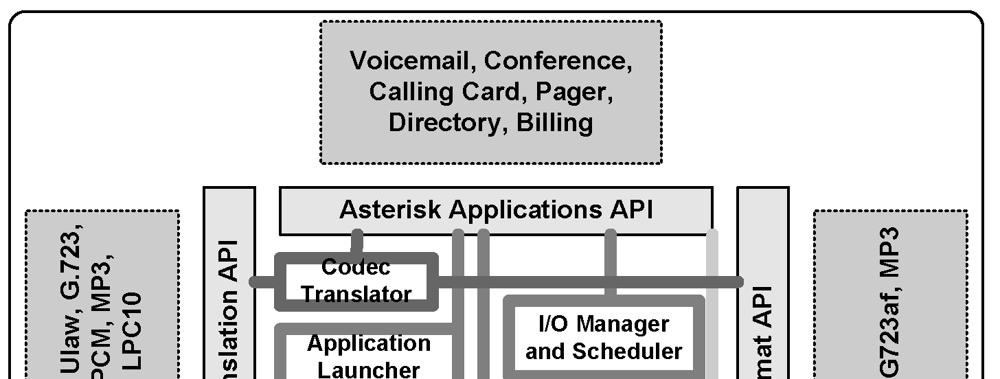
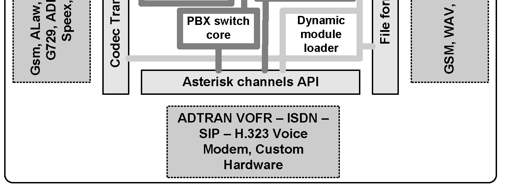
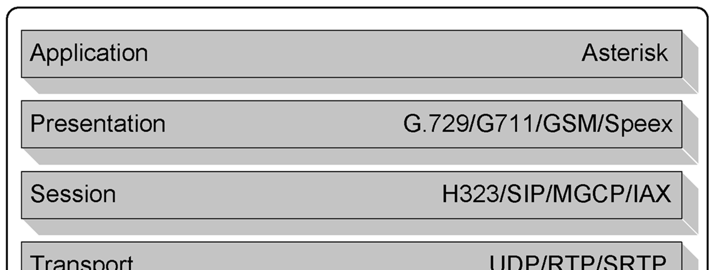
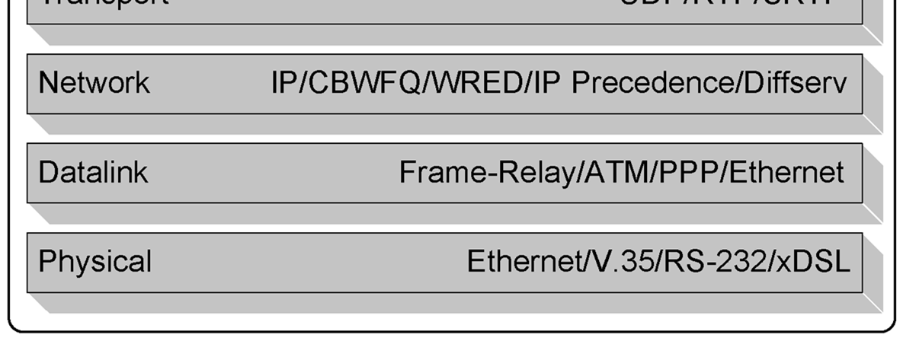
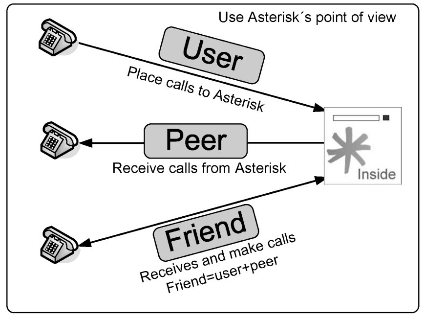
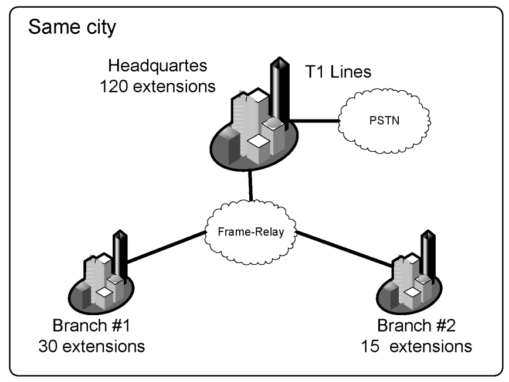
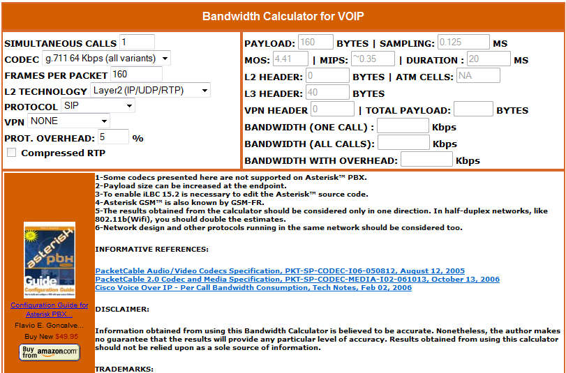
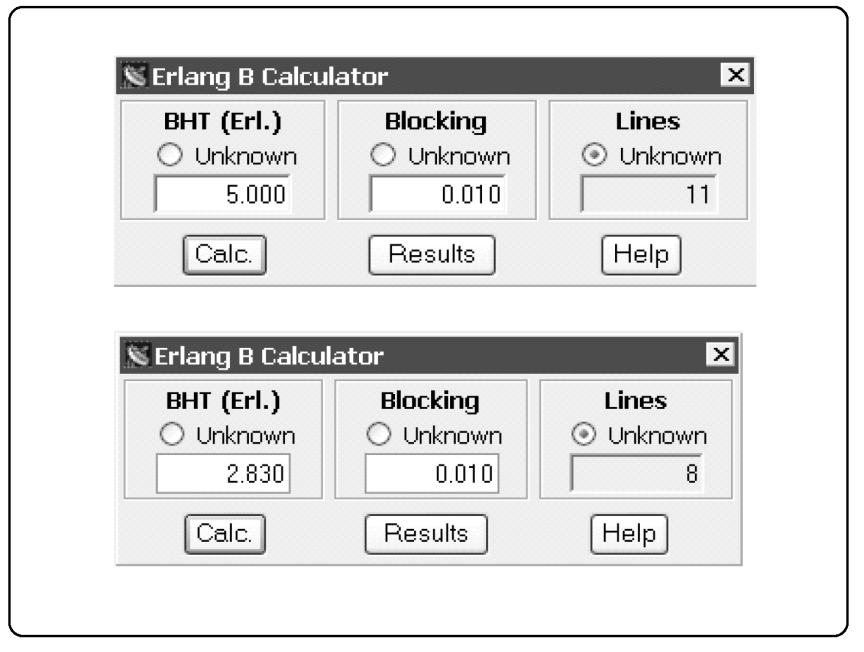
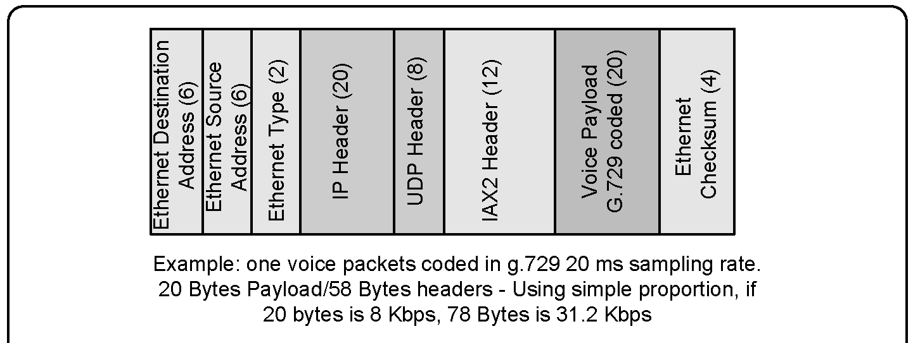
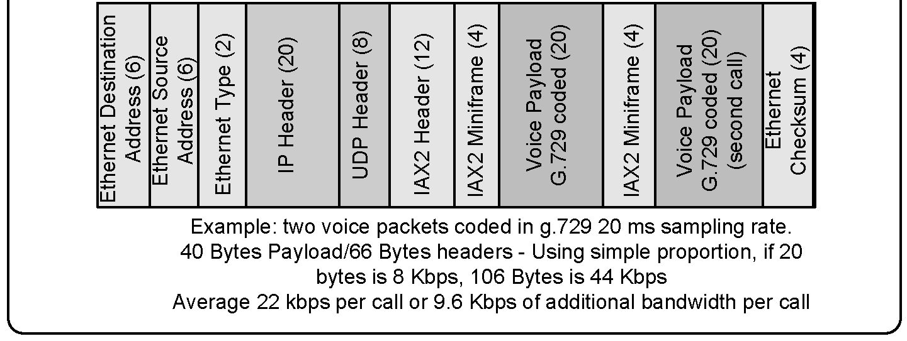

# Designing a VoIP network

Voice over IP is quickly growing in the telephony market. The convergence paradigm is changing the way in which we communicate, reducing costs and enhancing the way in which we trade information. Voice is just the beginning of a full multimedia communication era, including voice, video, and presence. In the future, we are not going to transport people to work, but work to people because it is cleaner, faster, and cheaper. VoIP is just part of this revolution. Our challenge in this chapter is to design a VoIP network. To do this, we will have to understand concepts such as session protocols and codecs as well as how to dimension the number of circuits and bandwidth.

### Objectives

By the end of this chapter, you should be able to:

- Understand the benefits of VoIP
- Describe how Asterisk handles VoIP
- Describe the concepts of the SIP and IAX channels
- Choose the most adequate protocol for a specific data channel
- Choose the most adequate codec for a specific data channel
- Dimension the required number of channels
- Calculate the required bandwidth

### VoIP benefits

Why would you care about VoIP? VoIP provides benefits to both companies and individuals. Cost reduction is certainly one of them, but in some environments VoIP simplifies the integration of computer systems. Several of the benefits are detailed here:

#### Convergence

The primary benefit of VoIP is the combination of data and voice networks to reduce costs (convergence). However, analyzing just voice minute costs may not be enough to justify the adoption of VoIP. The price of the minutes sold by phone companies is quickly becoming cheaper and is something to be considered before adopting VoIP.

#### Infrastructure costs

The use of a single network infrastructure reduces the costs associated with additions, removals, and changes. As IP has become pervasive, it has brought VoIP-related technology to several new devices, such as cell phones, PDAs, embedded systems, and laptops.

#### Open Standards

Finally, the open standards upon which VoIP is built provide the freedom to choose from different vendors. This single benefit makes the customer king instead of a subordinate to TELCOS and PBX manufacturers.

#### Computer Telephony Integration

Telephony is far older than computing. Telephony PBXs are circuit-switch based, and you usually do not have more than a computer for supervision. With VoIP, telephony is from the ground up created based in computer standards. This makes the use of Computer Telephony applications cheaper and easier than in the old model. You can quickly create a long list of telephony applications based on Asterisk. You can develop IVRs, ACDs, CTI, dialers, screen popups, and other applications in a fraction of the time required for traditional PBXs.

### Asterisk VoIP architecture

Asterisk’s architecture is shown below. Asterisk treats all VoIP protocols as channels. You can use any codec or any protocol. The concept to be learned here is that Asterisk bridges any type of channel to any other. Thus, you can translate signaling protocols such as SIP and IAX to one another and even with different codecs. For example, you can translate a call from a SIP phone in the local area network using the G.711 codec to a SIP trunk to your VoIP provider using the G.729 codec. In the next chapters, we will explain the details of the SIP and IAX architecture. H.323 support (via the chan_ooh323 add-on) is available but increasingly rare; SIP/PJSIP is the standard for modern deployments.

### VoIP protocols and the ISO Open Systems Interconnect (OSI)

### model

As you can see below, VoIP uses a set of different protocols working together. Different OSI layers are present in VoIP communication. The figure below will help you understand the role of each protocol and their relationships.





The first four layers represent a data network, just like the Internet you have in your business or home. You can use some QoS protocols like “diffserv” or “cbwfq” to prioritize voice packets and enhance voice quality. Most VoIP protocols use real-time protocol (RTP) as the transport protocol of choice. In the session layer, protocols are responsible for setting up and closing the calls. H.323 is one of the oldest and mature protocols in this area. SIP is now pervasive in the VoIP provider market, putting aside H.323. Signaling protocols use TCP or UDP to transport the packets. In the presentation layer, the codecs transform the multimedia stream from one format to another based on different characteristics. For example: SIP: SIP uses UDP or TCP in port 5060 to transport signaling. RTP transports the audio stream using ports 1000 to 2000 in Asterisk (as defined in rtp.conf). For example, a call can be coded in g.711. A soft-phone in the application layer will use the lower layers to communicate. H.323: H.323 uses TCP in ports 1720 and 1719 to transport signaling. RTP usually transports audio in UDP ports 16383 to 32768.

### How to choose a protocol

Given the many protocols, how can you choose the best one for your network? In this section, we will highlight the advantages and drawbacks of each protocol.

#### SIP - Session Initiated Protocol

SIP is an Internet Engineering Task Force (IETF) open standard, largely defined in RFC 3261. Most modern VoIP providers use SIP; indeed, it is becoming the most popular VoIP standard. The strength of SIP is that it is an IETF-based standard. SIP is light when compared to the older H.323. SIP’s main





weakness is the NAT traversal—a challenge to most SIP VoIP providers. IETF did not create SIP with billing in mind, but for open communications between peers. Billing is usually a concern for VoIP providers.

#### IAX – Inter Asterisk eXchange

IAX is an open protocol originally developed by Digium (now Sangoma). IAX is an all-in-one protocol as it transports signaling and media through the same UDP port (4569). Mark Spencer developed IAX as a binary protocol for reduced bandwidth. The main strength of IAX is its reduced bandwidth usage (it does not use RTP); it is also very easy for NAT and firewall traversal since it uses only one UDP port (4569). If a traditional PBX manufacturer were to have created IAX, it would probably have marketed the protocol as the “best thing since ice cream”; in some situations, IAX in trunk mode can reduce voice bandwidth use by one third. IAX2 (version 2) still ships in Asterisk 22 via the `chan_iax2` module and remains useful for Asterisk-to-Asterisk trunks, though it is considered legacy; SIP/PJSIP is preferred for new deployments.

> **[2nd-ed note]** The original IETF draft URL (www.ietf.org/internet-drafts/drafts-guy-iax00.txt) is expired; verify and update the canonical reference if desired.

#### MGCP – Media Gateway Control Protocol

MGCP is a protocol used in conjunction with H.323, SIP, and IAX. Its greatest advantage is scalability. It is configured in the call agent instead of the gateways. This simplifies the configuration process and permits centralized management. However, Asterisk implementation is not complete, and it seems that not many people use it.

#### H.323

H.323 is largely being used in VoIP. It is one of the first VoIP protocols and is essential for connecting older VoIP infrastructures based in gateways. H.323 is still the standard in the gateway market, although the market is slowly migrating to SIP. H.323’s strengths include the large market adoption and maturity. H.323’s weaknesses are related to the complexity of implementation and standard bodies’ associated costs.

#### Protocol comparison table

The following table summarizes the differences among the session protocols. Protocol Standard body Is used for: IAX2 IETF draft Asterisk trunks IAX2 phones Connection to IAX service providers SIP IETF standard SIP phones Connection to SIP service providers MGCP IETF/ITU standard MGCP phones Currently does not support connecting to a MGCP gateway or service provider H.323 ITU standard H.323 phones H.323 gateways Currently does not support being a gatekeeper, but can connect to an external gatekeeper. SCCP Cisco Proprietary Cisco phones

> **[2nd-ed note]** In Asterisk 22, SIP is handled exclusively by `chan_pjsip` (chan_sip was removed in Asterisk 21). Consider refreshing this table to reflect current module names and support status.

### Peers, Users, and Friends

Three kinds of SIP and IAX clients exist. The first one is “user”. Users can make calls to an Asterisk server, but they cannot connect to receive calls from this server. The second one is a “peer”. You can make calls to a peer, but you will not receive calls from them. Usually a server or a device will require both concepts at the same time. A “friend” is a shortcut to a “user” + “peer”. A phone would probably fall into this category as it is needed to make and receive calls.

> **[2nd-ed note]** The peer/user/friend distinction is a `chan_sip` (`sip.conf`) concept. In PJSIP (`pjsip.conf`), this is replaced by the **endpoint** object, which handles both inbound and outbound calls. The peer/user separation no longer applies in Asterisk 22.

### Codecs and codec translation

You will use a codec to convert the voice from an analog wave to a digital signal. Codecs differ from one another in aspects such as sound quality, compression rate, bandwidth, and computing requirements. Services, phones, and gateways usually support several of these aspects. The codec G.729 is very popular; it was previously proprietary and required per-channel licensing fees, but Sangoma now distributes `codec_g729` binary modules free of charge for Asterisk 22.



Asterisk 22 supports the following codecs (among others):

- GSM: 13 Kbps
- iLBC: 13.3 Kbps
- ITU G.711 (ulaw/alaw): 64 Kbps — standard PSTN quality; ulaw common in North America, alaw common in Europe and Latin America
- ITU G.722: 64 Kbps — wideband (HD voice), good quality at the same bandwidth as G.711
- ITU G.723.1: 5.3/6.3 Kbps
- ITU G.726: 16/24/32/40 Kbps
- ITU G.729: 8 Kbps — free binary module (`codec_g729`) distributed by Sangoma
- Speex: 2.15 to 44.2 Kbps
- LPC10: 2.5 Kbps
- **Opus**: 6–510 Kbps, variable — modern wideband/fullband codec; excellent quality and packet-loss resilience; free binary module (`codec_opus`) distributed by Sangoma; recommended for WebRTC and modern SIP endpoints

In addition, Asterisk permits translation among codecs. In some cases, this is not possible, such as the case of g723, which is supported only in pass-thru mode. Translating from one codec to another consumes many resources from the CPU. Thus, avoid this altogether whenever possible.

### How to choose a Codec

Codec selection depends on several options, such as:

- Sound quality
- Licensing costs
- CPU-processing consumption
- Bandwidth requirements
- Packet-loss concealment
- Availability for Asterisk and phone devices

The following table compares the most popular codecs. The quality of these codecs is considered “toll”—in other words, similar to PSTN. Codec g.711 g.729A iLBC GSM 06.10 (20 ms) (30 ms) RTE/LTP Bandwidth 13.33 (Kbps) Costs Free ~ USD10.00 Free Free (per channel) Resistance to No 3% 5% 3% Frame Erasure1 mechanism Complexity ~0.35 ~13 ~18 ~5 MIPS 2 1 Resistance to packet loss refers to the rate when MOS is next to 0.5 worst from peak quality for the specific codec. 2 Complexity refers to quantities in millions of instructions per second spent to code and decode the codec using a reference design in a Texas Instruments DSP (TMS320C54x). A direct relationship exists between processor frequency and MIPS, but it is not possible to draw a precise relationship among such diverse hardware platforms. Use this table just for comparison.

> **[2nd-ed note]** Update this table for the 2nd edition: G.729 is now free (Sangoma `codec_g729`); add Opus (recommended modern wideband codec, free `codec_opus` from Sangoma) and G.722 (wideband at 64 Kbps). G.711 ulaw/alaw remains the baseline for PSTN interop.

**Codec recommendations for Asterisk 22:**

- **G.711 (ulaw/alaw):** Use for PSTN trunks and maximum interoperability; zero transcoding cost within Asterisk.
- **G.729:** Recommended for low-bandwidth WAN trunks; now freely available via Sangoma's `codec_g729` binary module.
- **G.722:** Good choice for wideband (HD voice) on LAN/internal extensions; same bandwidth as G.711 with better quality.
- **Opus:** Recommended for modern endpoints, WebRTC clients, and any deployment where the endpoint supports it. Adaptive bitrate, excellent packet-loss resilience, freely available via Sangoma's `codec_opus` binary module.

### Overhead caused by protocol headers

Despite the fact that codecs make little use of bandwidth, we have to consider the overhead caused by protocol headers like Ethernet, IP, UDP, and RTP.As such, we could say that bandwidth depends upon the headers used. If we are in an Ethernet network, the bandwidth requirement is higher than in a PPP network because the PPP header is shorter than the Ethernet one. Let’s look through some examples: Ethernet Destination G.729 coded (20) UDP Header (8) Ethernet Type (2) Ethernet Source IP Header (20) RTP Header (12) Voice Payload Checksum (4) Address (6) Address (6) Ethernet Codec g.711 (64 Kbps)

- Ethernet (Ethernet+IP+UDP+RTP+G.711) = 95.2 Kbps
- PPP (PPP+IP+UDP+RTP+G.711) = 82.4 Kbps
- Frame-Relay (FR+IP+UDP+RTP+G.711) = 82.8 Kbps

Codec G.729 (8 Kbps)

- Ethernet (Ethernet+IP+UDP+RTP+G.729) = 31.2 Kbps
- PPP (PPP+IP+UDP+RTP+G.729) = 26.4 Kbps
- Frame-Relay (FR+IP+UDP+RTP+G.729) = 26.8 Kbps

You can easily calculate other bandwidth requirements using an online VoIP bandwidth calculator.

> **[2nd-ed note]** The original calculator URL (http://www.voip.school/bandcalc/bandcalc.php) may no longer be active; verify and replace with a current resource.

### Traffic Engineering

A main issue in the design of VoIP networks is dimensioning the number of lines and the required bandwidth to a specific destination, like a remote office or a service provider. It is also important to dimension the number of Asterisk’s simultaneous calls (main parameter for Asterisk’s dimensioning).

#### Simplifications

The primary and most widely used simplification is to estimate the number of calls by user type. For example:

- Business PBXs (one simultaneous call for every five extensions)
- Residential users (one simultaneous call for every sixteen users)

Example #1 The company’s headquarters have 120 extensions and two branches—the first with 30 extensions and the second with 15 extensions. Our objective is to dimension the number of E1 trunks in the headquarters and the bandwidth required for the Frame-Relay network. 1a Number of T1 lines

- Total number of extensions using T1 lines: 120+30+15=165 lines
- Using one trunk for each five extensions for business use
- Total number of lines = 33 or approximately 2xT1 lines

1b Bandwidth requirements We choose the g.729 codec because of bandwidth requirements, sound quality, and medium CPU consumption.



With one trunk for every five extensions:

- Required bandwidth for branch #1 (Frame-relay): 26.8*6=160.8 Kbps
- Required bandwidth for branch #2 (Frame-relay): 26.8*3= 80.4 Kbps

#### Erlang B method

1.a Number of VoIP simultaneous calls Sometimes, simplification is not the best approach. When you have previous data, you can adopt a more scientific approach. We will use the work of Agner Karup Erlang (Copenhagen Telephone Company, 1909), who developed a formula to calculate lines in a trunk group between two cities. Erlang is a traffic measurement unit usually found in telecom. It is used to describe the volume of traffic for one hour. For example: 20 calls occur in an hour, averaging 5 minutes of conversation each. You can calculate the number of Erlangs as shown below: Traffic minutes in the hour: 20 x 5 = 100 minutes Hour of traffic inside one hour: 100/60 = 1.66 Erlangs You can determine these measures from a call logger and use it to design your network to calculate the number of lines required. Once the number of lines is known, it is possible to calculate the bandwidth requirements. Erlang B is the most commonly used method for calculating the number of lines in a trunk group. It assumes that calls arrive randomly (Poisson distribution) while blocked calls are immediately cleared. This method requires that you know the Busy Hour Traffic (BHT), which you can obtain from a call logger or by the following simplification: BHT=17% of the call minutes of one day.



Another important variable is Grade of Service (GoS), which defines the probability of blocking calls by line shortage. You can arbitrate this parameter, which is usually 0.05 (5% calls lost) or 0.01 (1% calls lost). Example #1: Using the same example from 5.10.1, we will give you some data about traffic patterns. From the call logger, we discovered these data: Data from call logger (Call minutes and BHT):

- Headquarters to Branch #1 = 2,000 minutes, BHT = 300 minutes
- Headquarters to Branch #2 = 1,000 minutes, BHT = 170 minutes
- Branch #1 to Branch #2 = 0, BHT=0

Let’s arbitrate GoS=0.01

- Headquarters to Branch #1 - BHT=300 minutes/60 = 5 Erlangs
- Headquarters to Branch #2 – BHT=170 minutes/60 = 2.83 Erlangs

Using an Erlang Calculator (www.erlang.com)

- For the Headquarters to Branch #1, 11 lines are required.
- For the Headquarters to Branch #2, 8 lines are required

1.b Bandwidth Required We are using a WAN where packet loss is rare. We will choose the g729 codec because of its good sound quality and data compression (8 Kbps).



Selected codec: g729 Datalink layer: Frame-Relay

- Estimated voice bandwidth for Branch #1: 26.8x11 = 294.8 Kbps
- Estimated voice bandwidth for Branch #2: 26.8x8 = 214.40 Kbps

### Reducing the bandwidth required for VoIP

Three methods can be used to reduce the bandwidth required for VoIP calls:

- RTP header compression
- IAX Trunked
- VoIP payload

#### RTP Header Compression

In Frame-Relay and PPP networks, you can use RTP header compression. RTP header compression was defined in RFC 2508. It is an IETF standard available in several routers. However, be cautious, as some routers require a different feature set in order for this resource to be available. The impact of using RTP header compression is fabulous as it reduces the bandwidth required in our example from 26.8 Kbps per voice conversation to 11.2 Kbps—a 58.2% reduction!

#### IAX2 trunk mode

If you are connecting two Asterisk servers, you can use the IAX2 protocol in the trunk mode. This revolutionary technology does not need any special routers and can be applied to any kind of data link. The IAX2 trunk mode reuses the same headers from the second call and over. Using g729 in a PPP link, the first call will consume 30 Kbps of bandwidth, whereas the second call will use the same header as the first and reduce the necessary bandwidth for the additional call to 9.6 Kbps. We can calculate the required bandwidth in trunk mode as follows: Branch #1 (11 calls) Bandwidth = 31.2 + (11-1)* 9.6 Kbps = 127.2 Kbps Branch #2 (8 calls) Bandwidth = 31.2 + (8-1)* 9.6 Kbps = 98.4 Kbps The first call uses 31.2 Kbps, the next 9.6, and so on.

#### Increasing the Voice Payload

This method is very common when using VoIP gateways over the Internet. When using a bigger payload, you will sacrifice latency in favor of reduced bandwidth. You can change the RTP packetization by appending the frame size to the codec in the allow instruction.





Example:

```
allow=ulaw:30
```

The permitted values are: Name Min Max Default Increment g723 gsm ulaw alaw g726 ADPCM SLIN lpc10 g729 speex ilbc

### Summary

In this chapter, you have learned that Asterisk treats VoIP using channels. It supports SIP (via `chan_pjsip` in Asterisk 22), IAX2, H.323 (add-on), MGCP, and Skinny protocols. You compared and learned how to choose a signaling protocol and a codec for VoIP channels. The IAX2 is more bandwidth efficient and can traverse NAT easily. SIP/PJSIP is the most supported protocol by third-party phone and gateway vendors and is the only SIP channel driver in Asterisk 22. The H.323 protocol is the oldest one and should be used to connect to legacy VoIP infrastructures. In section 5.11, we learned how to design and dimension a VoIP network.

### Quiz

1. Please, list at least four benefits of VoIP. 2. Convergence is the integration of voice, data, and video in a single network; its primary benefit is the cost reduction in the implementation and maintenance of separate networks. A. False B. True 3. Asterisk cannot use resources from PSTN and VoIP simultaneously because the codecs are not compatible. A. False B. True 4. Asterisk is a SIP proxy with integration to other protocols A. False B. True 5. Using the OSI reference model, SIP, H.323, and IAX2 are in the ____________ layer. A. Presentation B. Application C. Physical D. Session E. Datalink 6. SIP is the most adopted protocol for IP phones and is an open standard ratified by IETF. A. False B. True 7. H.323 is an inexpressive protocol with very few applications, abandoned by the market, which is moving to SIP. A. False B. True 8. IAX is a protocol originally developed by Digium (now Sangoma). Despite its limited adoption by phone vendors, IAX is excellent when you need: (check all that apply) A. To reduce bandwidth usage B. Video media format C. NAT traversal D. Protocols standardized by IETF or ITU. 9. “Users” can receive calls from Asterisk. A. False B. True 10. Regarding codecs: (check all the true affirmations) A. G711 is the equivalent to PCM and uses 64 Kbps of bandwidth. B. G.729 requires a per-channel license fee. C. GSM is growing because it uses approximately 13 Kbps and does not need a license. D. G711 u-law is common in the US whereas a-law is common in Europe and Latin America. E. G.729 is light and uses very few CPU resources in their coding/decoding process. Answers: 1 – Convergence, Computer Telephony Integration, Reduced Costs, Video 2 – A 3 – A 4 – A 5 – D 6 – B 7 – B 8 – AC 9 – B 10 - ACD

> **[2nd-ed note]** Quiz question 10-B needs updating: G.729 is now freely available via Sangoma's `codec_g729` binary module — the "requires licensing" statement is no longer accurate. Review answer key for question 10 accordingly.
