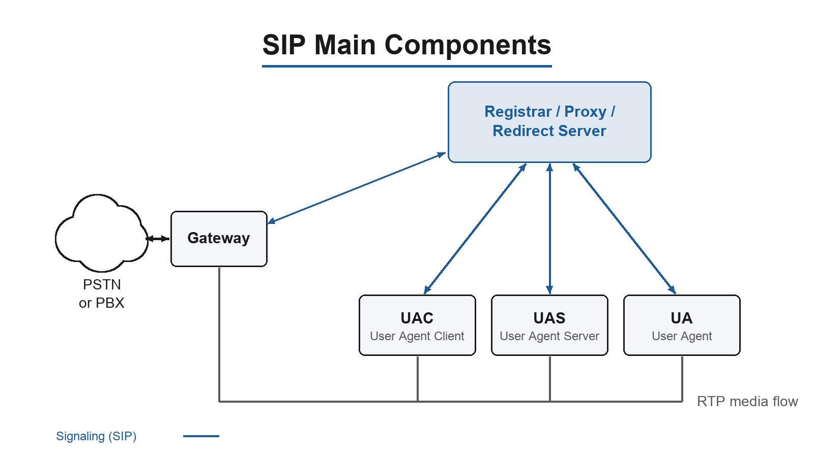
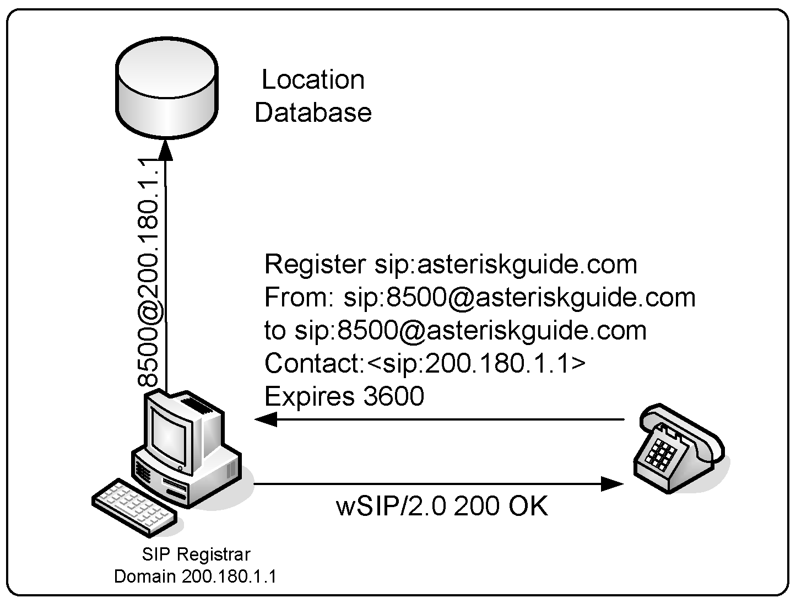
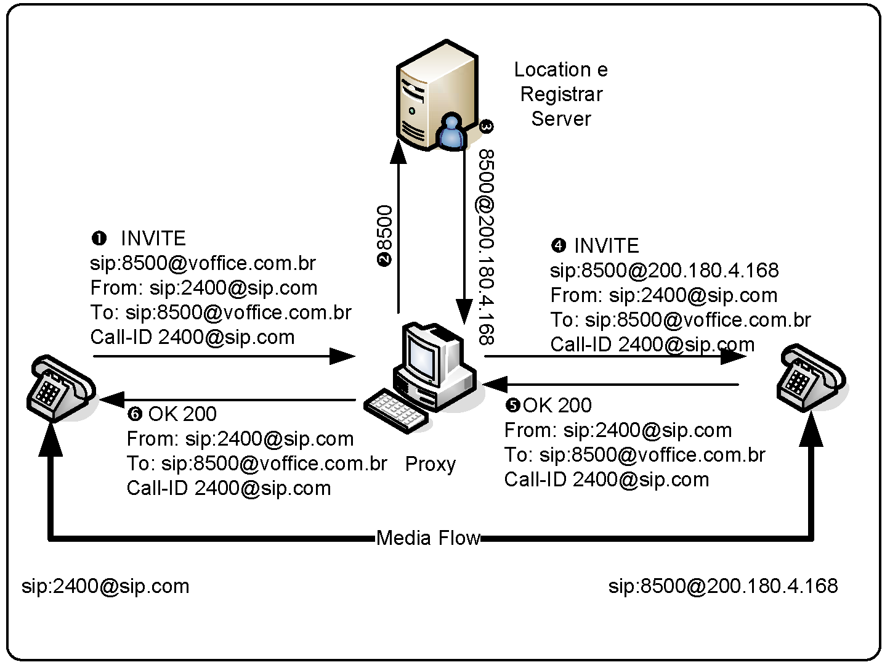
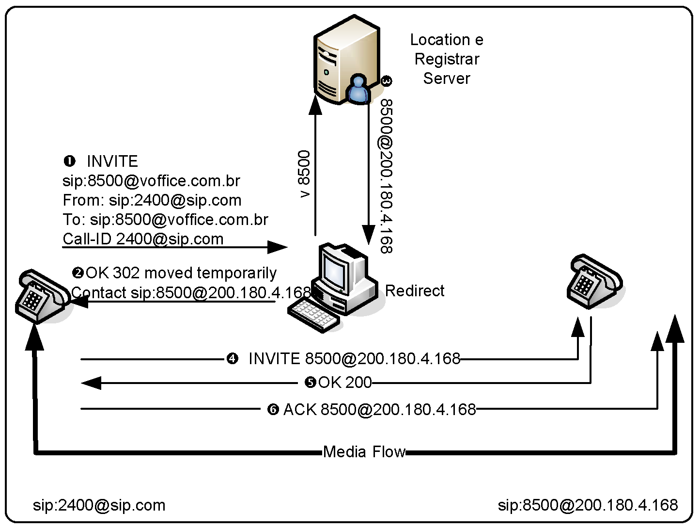
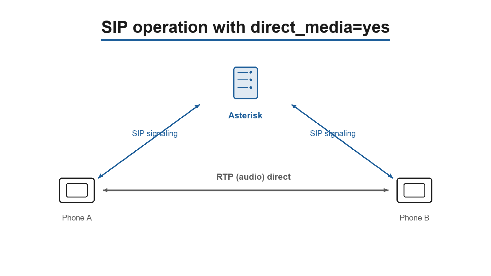
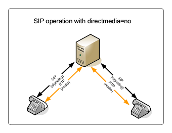
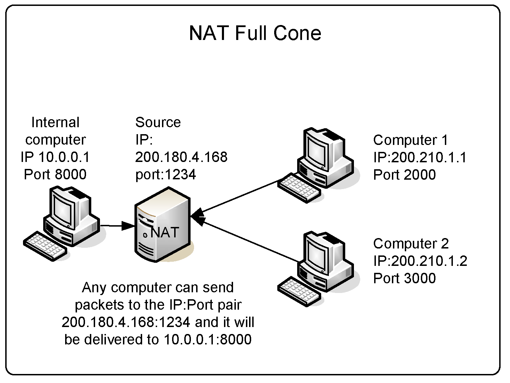
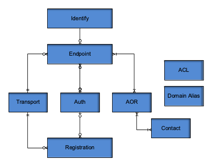

# SIP & PJSIP in depth

SIP is the protocol; PJSIP is how Asterisk 22 speaks it. **PJSIP** (`chan_pjsip`, configured via `pjsip.conf`) is the only SIP channel driver in Asterisk 22 LTS. This chapter covers the SIP protocol fundamentals (which are protocol-level and remain 100% valid) and the PJSIP object model and configuration that you use every day. The retired legacy driver and a migration guide are covered in the *Legacy channels* chapter.

## SIP protocol fundamentals

Session Initiation Protocol (SIP) is a text-based protocol similar to HTTP and SMTP that was designed to initialize, keep, and terminate interactive communication sessions between users. These sessions may include voice, video, chat, interactive games, and others. SIP was defined by the IETF and has become the de facto standard for voice communications. It is very important to understand how SIP works. On Asterisk 22 the SIP configuration lives in `pjsip.conf`, which is one of the most frequently edited files on a SIP-based system (just after `extensions.conf`).

### Theory of Operation

SIP is a signaling protocol with the following components: User Agent Client, User Agent Servers, SIP Proxies, and SIP Gateways. The following figure depicts the relationships among these components.

- UAC (user agent client) – The client or terminal that initializes SIP signaling.
- UAS (user agent server) – The server that responds to a SIP signaling coming from a UAC.
- UA (user agent) – The SIP terminal (phones or gateways that contain both UAC and UAS).
- Proxy Server – Receives requests from a UA and transfers to other SIP Proxies if the particular station is not under their administration.
- Redirect Server – Receives requests and sends them back to the UA, including destination data, instead of directly forwarding them to the destination.
- Location Server – Receives requests from a UA and updates the location database with this information.

Usually, the proxy, redirect, and location servers are hosted within the same hardware and use the same piece of software, which we call the SIP proxy. The SIP proxy is responsible for location database maintenance, connection establishment, and session termination.



#### SIP Register process

Before a phone can receive calls, it needs to be registered to a location database. In the location database, the IP address will be bonded to the name. In the following example, extension 8500 will be bound to IP address 200.180.1.1. You do not necessarily need to use phone numbers. In the SIP architecture, the registered extension could be flavio@voip.school as well.



#### Proxy operation

When operating as a SIP proxy, the SIP server stays in the middle of the signaling and is capable of advanced routing and billing. The media flow, based on the real time protocol (RTP) still goes directly between the endpoints.



#### Redirect operation

When redirecting, the SIP server simply sends a message (e.g., 302 moved temporarily) to the user agent and stays out of the path of new messages. It is very light in terms of resource usage, but you have no control at all. Redirection is sometimes used in load balance designs.



#### How Asterisk handles SIP

It is important to understand that Asterisk is neither a SIP proxy nor a SIP redirector. Asterisk can perform the role of the registrar and location server; however, it only connects two UACs to itself. Therefore, Asterisk is considered a back-to-back user agent (B2BUA). In other words, it connects two SIP channels, bridging them together. Asterisk has a re-invite mechanism that can make the SIP channels talk to each other directly instead of passing through Asterisk. On a PJSIP endpoint this is controlled by the parameter `direct_media`. When using `direct_media=yes` the RTP flow goes directly from one endpoint to another, freeing server resources.

#### SIP operation with direct_media=yes



However, if you need to transfer or record the call using Asterisk, you may use the parameter `direct_media=no` to force the RTP flow through the Asterisk server.

#### SIP operation with direct_media=no



#### SIP Messages

The basic SIP messages are:

- INVITE – connection establishment
- ACK – acknowledge
- BYE – connection termination
- CANCEL – connection termination for a non-established call
- REGISTER – register a UAC to a SIP proxy
- OPTIONS – can be used to check availability
- REFER – transfer a SIP call to someone else
- SUBSCRIBE – subscribe to notification events
- NOTIFY – send out channel information
- INFO – send various messages (e.g., DTMF )
- MESSAGE – send instant messages

The SIP responses are in text format and are easily readable (similar to HTTP messages). The most important responses are:

- 1XX – Information messages (100–trying, 180–ringing, 183–progress)
- 2XX – Successful request complete (200 – OK)
- 3XX – Call redirect, request has to be directed to another place (302 – moved temporarily, 305 – use proxy)
- 4XX – Error (403 – Forbidden)
- 5XX – Server Error (500 – Internal Server Error; 501 – Not implemented)
- 6XX – Global Failure (606 – Not acceptable)

For example:

```
INVITE sip:2000@192.168.1.133 SIP/2.0
Via: SIP/2.0/UDP
192.168.1.116;rport;branch=z9hG4bKc0a8017400000063452fafbb00006967000000d2
From: "unknown"<sip:2001@192.168.1.133>;tag=1556140623845
To: <sip:2000@192.168.1.133>
Contact: <sip:2001@192.168.1.116>
Call-ID: 64B4C8EC-FCFC-49E9-98B1-90982EEEBED3@192.168.1.116
CSeq: 2 INVITE
Max-Forwards: 70
User-Agent: SJphone/1.61.312b (SJ Labs)
Content-Length: 335
Content-Type: application/sdp
Proxy-Authorization: Digest
username="2001",realm="asterisk",nonce="6c55905e",uri="sip:2000@192.168.1.133",
response="983c0099eea125d8cdfe93b0ec99f3ec",algorithm=MD5
```

#### Session description protocol (SDP)

SDP was originally defined in IETF RFC 2327, now obsoleted by RFC 4566. It is intended for describing multimedia sessions for the purposes of session announcement, session invitation, and other forms of multimedia session initiation. SDP includes:

- Transport protocol (RTP/UDP/IP)
- Type of media (text, audio, video)
- Media format or codec (H.261 video, g.711 audio, etc.)
- Information needed to receive these media (addresses, ports, etc.)

The following example is a transcription of a SDP describing a call between two phones.

```
v=0
o=- 3369741883 3369741883 IN IP4 192.168.1.116
s=SJphone
c=IN IP4 192.168.1.116
t=0 0
a=setup:active
m=audio 49160 RTP/AVP 3 97 98 8 0 101
a=rtpmap:3 GSM/8000
a=rtpmap:97 iLBC/8000
a=rtpmap:98 iLBC/8000
a=fmtp:98 mode=20
a=rtpmap:8 PCMA/8000
a=rtpmap:0 PCMU/8000
a=rtpmap:101 telephone-event/8000
a=fmtp:101 0-11,16
```

### SIP NAT Traversal

Network Address Translation (NAT) is a feature used by most networks to save Internet IP addresses. Usually, a company receives a small block of IP addresses, and end users receive one IP address dynamically when connected to the Internet. NAT solves the addressing problem by mapping internal addresses to external addresses. It stores a mapping of internal to external addresses in its memory. This mapping is valid for a specific length of time, after which the mapping is discarded. The mapping uses IP:port pairs for the internal and external addresses. Four kinds of NAT exist:

- Full Cone
- Restricted Cone
- Port Restricted Cone
- Symmetric

The NAT theory below — the four NAT types, the Contact-header problem, keep-alives, and forcing media through the server — is protocol-level and applies to any SIP implementation. The way you configure each behaviour on Asterisk 22 (PJSIP) is covered later in this chapter under *Nat traversal on res_pjsip*.

#### Full Cone

The first NAT, full cone, represents a static mapping from an external IP:port pair to an internal IP:port pair. Any external computer can connect to it using the external IP:port pair. This is the case in non-stateful firewalls implemented with the use of filters.



#### Restricted Cone

In the restricted cone scenario, the external IP:port pair is opened only when the internal computer sends data to an outside address. However, the restricted cone NAT blocks any incoming packets from a different address. In other words, the internal computer has to send data to an external computer before it can send data back.

#### Port Restricted Cone

The port restricted cone firewall is almost identical to the restricted cone. The only difference is that, now, the incoming packet has to come from exactly the same IP and port of the sent packet.

#### Symmetric

The last type of NAT is called symmetric. It is different from the first three in that a specific mapping is done to each external address. Only specific external addresses are allowed to come back by the NAT mapping. It is not possible to predict the external IP:port pair that will be used by the NAT device. The other three types of NAT allow the use of an external server to discover the external IP address for communication. With symmetric NAT, even if you can connect to an external server, the discovered address cannot be used for any other device except for this server.


#### NAT firewall table

The following table summarizes the four types of NAT.

| NAT type | Must send data first | Can determine the external IP:port for return packets | Restricts incoming packets to the destination IP:port |
| --- | --- | --- | --- |
| Full Cone | No | Yes | No |
| Restricted Cone | Yes | Yes | Only IP |
| Port Restricted Cone | Yes | Yes | Yes |
| Symmetric | Yes | No | Yes |

#### SIP signaling and RTP over NAT

Some of the biggest issues in NAT traversal are that you have to solve two problems: SIP signaling and audio (RTP). Most problems of one-way audio are NAT related. An interesting thing about SIP is that, when a UAC sends a packet, it embeds the IP address in the SIP “Contact” header field. Usually this is an internal (RFC1918) address; responses to this packet cannot be routed over the Internet back to the UAC. The conceptual fixes are always the same:

- **Ignore the Contact/Via address and reply to where the packet actually came from.** This is the behaviour defined in RFC 3581 (`rport`). On PJSIP it is `force_rport=yes`, and `rewrite_contact=yes` rewrites the stored contact to the source address.
- **Send media back to the address the RTP actually arrived from** (symmetric RTP, historically called *comedia*). On PJSIP this is `rtp_symmetric=yes`.
- **Keep the NAT mapping open.** If the mapping times out, Asterisk can no longer send an INVITE to the UAC — the phone can place calls but not receive them. Sending a periodic OPTIONS (a *qualify*) keeps the pinhole open. On PJSIP this is `qualify_frequency=` on the AOR.

If the user’s NAT is of the symmetric type, it is not possible to send packets from one UAC to another directly; in that case you have to force the RTP through Asterisk with `direct_media=no`. These configurations are appropriate for most cases. It is possible to optimize the traffic using advanced techniques like Simple Traversal of UDP over NAT (STUN), which is useful with full cone, restricted cone, and port restricted cone, and Application Layer Gateway (ALG). Unfortunately, most firewalls today — even home DSL/cable routers — are symmetric, making STUN unusable. ALG could solve the problem, but it is not supported, not implemented, or buggy in most cases.

#### Asterisk behind NAT

Sometimes the Asterisk server itself is implemented behind a firewall with NAT — a very common situation when you deploy in the cloud. In this case it is necessary to do some extra configuration so that Asterisk advertises its **public** address in the SIP and SDP headers instead of its private one.

Conceptually there are three steps:

- Forward the SIP signaling port (UDP 5060 by default) from the firewall to the Asterisk server.
- Forward the RTP media port range (UDP 10000–20000 by default, set in `rtp.conf`) from the firewall to the Asterisk server.
- Tell Asterisk its external address and which network is local, so it knows when to substitute the public address into the headers.

On PJSIP these last two items map to `external_media_address` / `external_signaling_address` and `local_net=` on the **transport**, and the RTP port range is still configured in `rtp.conf`:

```
; RTP Configuration
;
[general]
;
; RTP start and RTP end configure start and end addresses
;
rtpstart=10000
rtpend=20000
```

The complete, worked PJSIP configuration for an Asterisk server behind NAT is given later in this chapter under *Asterisk Server behind NAT*.

### SIP limitations

Asterisk uses the incoming RTP flow to synchronize the outgoing flow. If the incoming flow is interrupted (silence suppression), music-on-hold will be cut. In other words, you should not use silence suppression in phones or providers with Asterisk.

## PJSIP: the SIP channel

PJSIP is the SIP channel in Asterisk. It was first introduced in Asterisk 12 and, after years of development, became the default and recommended SIP channel, and in Asterisk 22 (the current LTS) it is the only SIP channel driver. PJSIP is based on Teluu’s project called pjproject. The pjproject stack is employed by many softphones and commercial SIP implementations. It is a versatile and mature SIP stack.

### Why to use PJSIP

PJSIP was a ground-up redesign of how Asterisk speaks SIP, and it is worth understanding the features that made it the standard.

#### Features

The channel supports many features, some deserve mention here

- Multiple registrations:. You may use more than one phone connected to the same Address of Record. In other words, you can connect two phones to the same endpoint.
- Friendly Application Program Interface (API). The API is modular and easy to extend, built from many small cooperating modules rather than one large block of code.
- Multiple transports: You can listen to multiple addresses, ports and transports when using PJSIP. You are not limited to a single bind address for all your devices. PJSIP is very flexible.

#### A note on configuration

PJSIP configuration is more verbose: it requires a little more effort and more lines of configuration, since each device is described by several related objects instead of one peer block. That extra structure is what gives PJSIP its flexibility, and the configuration wizard (covered later) keeps day-to-day provisioning short.

### PJSIP modules

The PJSIP channel is implemented by many modules described below:

#### res_pjsip

This is the base layer of PJSIP and the main module. It is responsible for some of the main services.

#### res_pjsip_session

This module is responsible for media sessions, session description protocol processing and some addons

#### res_pjsip_messaging

Process SIP messages and parse SIP headers.

#### res_pjsip_registrar

Responsible to handle SIP registrations

#### res_pjsip_pubsub

Responsible to process subscribe, notify and publish. These messages are responsible to handle SIP presence and BLF (Busy Lamp Field).

### PJSIP configuration

PJSIP has many different sections. The format of the section are:

```
[Section Name]
Option = Value
Option = Value
```

#### End point section

The most important configuration object is the endpoint. The endpoint configuration has core functionality and has to be associated with an AOR and Transport section. Example:

```
[xlite]
type=endpoint
transport=transport-udp-main
context=from-internal
disallow=all
allow=ulaw
aors=xlite
auth=xlite
```

If you look at the example above, the endpoint is a kind of glue linking all sections together. It specifies a transport, the address of record and the authentication for a phone. Also defines the most important part, the context entry point in the dialplan.

#### Address of Record (AOR)

This object tells Asterisk where to contact the endpoint. It stores the contact addresses. It also allow the configuration of mailboxes. Example:

```
[xlite]
type=aor
max_contacts=2
```

#### Authentication

This section is responsible for inbound and outbound authentication. The documentation is found at the example file pjsip.conf. Example:

```
[xlite]
type=auth
auth_type=userpass
username=xlite
password=#supersecret#
```

#### Transport

The transport section allows you to define IPV4 and IPV6 addresses and the transport protocol, TCP, UDP, TLS, Websockets and so on. You may also configure Natted addresses in this section. You can create multiple transports, but they cannot share the same IP and port and you cannot bind multiple TCP or TLS transports of the same IP version. Example:

```
[transport-udp-main]
type=transport
protocol=udp
bind=0.0.0.0:5060
```

#### Registration

This object is used to configure an outbound registration. Example:

```
[siptrunk]
type=registration
outbound_auth=siptrunk
server_uri=sip:1020@sip.flagonc.com:5600
client_uri=sip:1020@sip.flagonc.com
contact_user=9999
```

#### Identify

This object controls which SIP request belongs to each endpoint. If you do not have an identify section, the system will match the content of the “From” header with the endpoint name. Using this section, you can assign specific IP addresses to specific endpoints, identified by username or IP. Example:

```
[siptrunk]
type=identify
endpoint=siptrunk
match=52.37.87.85
```

#### ACL

The ACL object allows you to configure specific networks with access to the endpoint. Now ACLs are defined in a specific section or in the acl.conf. Example:

```
[acl]
type=acl
deny=0.0.0.0/0.0.0.0
permit=209.16.236.0
permit=209.16.236.1
```

### Relationship between entities

The relationship between the configuration objects provides a great flexibility for configuration. However, it seems a bit complex for anyone starting.



The graphic above means:

#### Relationships:

- ENDPOINT/AOR many to many
- ENDPOINT/AUTH Zero to Many to Zero to One
- ENDPOINT/IDENTIFY Zero to Many to One
- ENDPOINT/AUTH Zero to Many to One
- ENDPOINT/TRANSPORT Zero to Many to at least one
- REGISTRATION/AUTH Zero to many to zero to one
- REGISTRATION/TRANSPOPRT Zero to many to at least one
- AOR/CONTACT many to many ACL, DOMAIN_ALIAS don’t have relationship configurations

### Configuring a Softphone

To configure a softphone you have to define many different sections. Below an example on how to configure a softphone.

```
[transport-udp-main]
type=transport
protocol=udp
bind=0.0.0.0:5060
[xlite]
type=endpoint
transport=transport-udp-main
context=from-internal
disallow=all
allow=ulaw
aors=xlite
auth=xlite
[xlite]
type=auth
auth_type=userpass
username=xlite
password=#supersecret#
[xlite]
type=aor
max_contacts=2
```

The configuration above sets a transport for UDP in the port 5060, then define an endpoint, its authentication by username and password and then the Address of Record with a maximum of two contacts.

### Configuring a SIP trunk

To configure a SIP trunk you need to have the IP address or Host of the SIP trunk, name and password. You have to create a new registration section for this purpose.

```
[siptrunk]
type=endpoint
transport=transport-udp-main
context=from-siptrunk
direct_media=no
disallow=all
allow=ulaw
outbound_auth=siptrunk
aors=siptrunk
[siptrunk]
type=aor
contact=sip:sip.flagonc.com:5600
[siptrunk]
type=auth
auth_type=userpass
username=1020
password=supersecret
[siptrunk]
type=registration
outbound_auth=siptrunk
server_uri=sip:1020@sip.flagonc.com:5600
client_uri=sip:1020@sip.flagonc.com
contact_user=9999
[siptrunk]
type=identify
endpoint=siptrunk
match=sip.flagonc.com
```

### Nat traversal on res_pjsip

Network Address Translation was created a long time ago as a way to deal with the shortage of IP version 4 addresses. Many people also use NAT as a security feature hiding the internal addresses of a network from the public Internet. Sometimes you will have to handle NAT traversal. In some cases, the server can be behind NAT, such as where you are deploying the server in the cloud. Many times if you are deploying in the cloud your users will also be behind a NAT router. To organize things, we will split this into two parts. The first one is the Asterisk server behind NAT such as in a cloud deployment. In the second section, we will cover how to support clients behind NAT using res_pjsip.

#### Asterisk Server behind NAT

When the Asterisk server is behind NAT, you should inform the external and internal local addresses in the transport section. We will have the following directives.

##### direct_media

Does the media flow directly from peer to peer or thru the server? For NAT it should flow thru the server. For NAT select no. Example:

```
direct_media=no
```

##### external_media_address

Media address to handle external RTP. Usually the same as the external_signaling_address. Use the public IP address of your server for media and signalling. Example:

```
external_media_address=54.232.1.20
```

##### external_signaling_address

External SIP address where to receive messages. Example:

```
external_signaling_address=54.232.1.20
```

##### local_net

The network you consider your local network. Example:

```
local_net=172.16.30.0/24
local_net=127.0.0.1/32
```

#### Complete example for transport for an Asterisk server behind NAT

To use an Asterisk server behind NAT you have to do two steps. First, define a transport behind NAT. Two, associate this transport to the endpoint.

##### Creating the transport behind NAT

To create the transport behind NAT in the file pjsip.conf create a section like below.

```
[tnat]
type=transport
protocol=udp
bind=0.0.0.0
local_net=172.16.30.0/24
local_net=127.0.0.1/32
external_media_address=54.232.1.20
external_signaling_address=54.232.1.20
```

Associate the transport to an endpoint

```
[6000]
type=endpoint
transport=tnat
context=from-internal
direct_media=no
auth=6000
aors=6000
```

For SIP trunks you should also associate the transport to the registration section as below.

```
[siptrunk_reg]
type=registration
transport=tnat
server_uri=sip:sip.flagonc.com:5600
outbound_auth=siptrunk_auth
client_uri=sip:23456789@flagonc.com
contact_user=9999
```

#### Using Asterisk with clients behind NAT

To use phones behind NAT you have to configure some additional parameters per endpoint.

##### direct_media

Does the media flow directly from peer to peer or thru the server? For NAT it should flow thru the server. Example:

```
direct_media=no
```

##### rtp_symmetric

This is what we call comedia. Instead of relying in the address defined in this SDP header as usual in SIP, use the address from where you receive the first rtp packet and send back from the same address. Example:

```
rtp_symmetric=yes
```

##### force_rport

This is the behaviour defined in the RFC3581. Rather than using the address in the VIA header, send back the responses from where the requests are coming from. Example:

```
force_rport=yes
```

##### qualify_frequency

This setting has to be applied to the AOR (not the endpoint). There is also the last step, to configure the qualify option. You should always have some packets pinging the destination to keep the NAT mapping open. This is set in the AOR section. Example:

- qualify_frequency=15

Complete example of an endpoint where the server and the client are behind NAT

```
[6000]
type=endpoint
transport=tnat
context=from-internal
direct_media=no
force_rport=yes
rtp_symmetric=yes
auth=6000
aors=6000
[6000]
type=aor
qualify_frequency=15
```

### Channel Naming

As usual one of the important aspects of a channel is its naming and PJSIP has some interesting details. You dial a PJSIP endpoint with the `PJSIP/` technology:

```
exten=>6000,1,Dial(PJSIP/6000,20,tT)
```

A useful feature is the possibility to dial all contacts registered to an AOR at once. The function PJSIP_DIAL_CONTACTS will be translated to the list of contacts to dial.

```
exten=>6000,dial(${PJSIP_DIAL_CONTACTS(6000)},20,tT)
```

To dial a trunk is slightly different. Assume the trunk won’t be registered to your platform or don’t have and IP address associated with your AOR address of record. You can specify the address of the trunk directly in the line. Using an international dial as the example.

```
exten=>9011.,1,Dial(PJSIP/siptrunk/sip:${EXTEN:1}@sip.flagonc.com)
```

If you prefer to specify the address of the trunk in the AOR section, you may also use.

```
exten=>9011.,Dial(PJSIP/${EXTEN:1}@siptrunk
```

### PJSIP configuration wizard

PJSIP is powerful but verbose to configure: many different sections, and templates that can be confusing at first. The good news is the PJSIP configuration wizard. By defining each channel in a few lines, it allows you to create templates and simplify the configuration of new devices. Use the file pjsip_wizard.conf to configure. You still have to define transport and global sections in the file pjsip.conf. Personally, I prefer to use the wizard just for phones, for sip trunks usually the number is not big and you can configure directly in pjsip. The biggest advantage of the wizard is the possibility to use templates and create phones quickly.

```
[phone_default](!)
type = wizard
accepts_auth = yes
accepts_registrations = yes
transport = tnat
endpoint/allow = ulaw
endpoint/context = from-internal
endpoint/direct_media=no
endpoint/force_rport=yes
endpoint/rtp_symmetric=yes
aor/qualify_frequency=15
[xlite](phone_default)
inbound_auth/username = xlite
inbound_auth/password = supersecret
[zoiper](phone_default)
inbound_auth/username = zoiper
inbound_auth/password = supersecret
```

### Loading and unloading PJSIP

PJSIP is the only SIP channel in Asterisk 22, and its modules are loaded by default. In rare cases you may still want to control module loading from the modules.conf file — for example, to disable PJSIP on a server that only uses IAX2 or DAHDI.

#### To disable PJSIP

Edit the file modules.conf and add the following lines.

```
noload => res_pjsip.so
noload => res_pjsip_pubsub.so
noload => res_pjsip_session.so
noload => chan_pjsip.so
noload => res_pjsip_exten_state.so
noload => res_pjsip_log_forwarder.so
```

### Console commands

Now that you configured your PJSIP endpoints, it is time to see how to check your configuration. There are many console commands to help you with this task. After editing pjsip.conf, reload the configuration with:

```
module reload res_pjsip.so
```

A plain `reload` (or `core reload`) reloads all modules including PJSIP. (Note there is no bare `pjsip reload` command — `pjsip reload` only exists in the form `pjsip reload qualify aor|endpoint`.) You can list all available PJSIP console commands with `help pjsip`.

#### pjsip show endpoints

This command shows the endpoints available. In the picture below, we have a screenshot. You can see the address of the xlite softphone and see that is available.


#### pjsip show endpoint <endpoint>

With the command above, you can see each parameter of the endpoint. The list below was cut to less than half of the current parameters.


#### pjsip show aors

This command lists the configured Address of Record objects and their contacts, so you can confirm where Asterisk will send calls for each endpoint.

#### pjsip show registrations

The command below shows the registrations made by our own server.


#### pjsip list

The command list is a little friendlier and show less data, but better structured. Listing endpoints:


Listing contacts:


#### pjsip set logger on

The most useful troubleshooting command is the SIP packet logger. It prints every SIP request and reply to the console as it is sent or received, which is invaluable when diagnosing registration and call setup problems.

```
pjsip set logger on
pjsip set logger off
```

You can also restrict the logging to a single host with `pjsip set logger host <ip>`.

#### pjsip set history on

A great addition to PJSIP is the concept of history. You can capture and analyse SIP request and replies in real time in an easy way. To start history use the command below.


Now you can show the history:


Then to see a specific request or reply, show the history item:


Very easy, isn’t it? You may also clear the history whenever you want using `pjsip set history clear`.

> **Migrating an existing chan_sip/sip.conf system?** The legacy `chan_sip`
> driver and a complete **sip.conf → pjsip.conf migration guide** (including the
> concept-mapping table and the `sip_to_pjsip.py` conversion script) are covered
> in the *Legacy channels* chapter.

## Quiz

1. In the SIP architecture, which component receives a request and answers it with a redirect response (such as `302 Moved Temporarily`) carrying the new location, then stays out of the path of the follow-up messages?
   - A. Proxy server
   - B. Redirect server
   - C. Location server
   - D. Registrar

2. What role does Asterisk play when it handles a SIP call between two phones?
   - A. A SIP proxy that stays only in the signaling path
   - B. A SIP redirect server
   - C. A back-to-back user agent (B2BUA) that bridges two SIP channels
   - D. A stateless SIP load balancer

3. Which SIP method is used by a phone to tell the registrar its current IP address so it can later receive calls?
   - A. INVITE
   - B. OPTIONS
   - C. SUBSCRIBE
   - D. REGISTER

4. True or False: In Asterisk 22, `chan_sip` and `sip.conf` are still available as a legacy fallback alongside PJSIP.

5. Which configuration objects must an endpoint be associated with so that Asterisk knows the listening socket to use and where to send calls for that device? (Choose all that apply.)
   - A. `type=transport`
   - B. `type=aor`
   - C. `type=identify`
   - D. `type=registration`

6. In a PJSIP `aor` object, which setting keeps the NAT mapping open by periodically qualifying the contact, and what is its unit?
   - A. `qualify=yes` (boolean)
   - B. `qualify_frequency` (seconds)
   - C. `rtp_timeout` (milliseconds)
   - D. `nat=force_rport`

7. Fill in the blank: To make Asterisk match an inbound SIP request to a specific endpoint by source IP address (instead of by the `From` header), you create a section with `type=________`.

8. Which PJSIP object is used to configure an **outbound** registration from Asterisk to a SIP trunk provider?
   - A. `type=aor`
   - B. `type=identify`
   - C. `type=registration`
   - D. `type=auth`

9. On the Asterisk 22 CLI, which command enables the SIP packet logger that prints every SIP request and reply to the console?
   - A. `sip set debug on`
   - B. `pjsip set logger on`
   - C. `pjsip debug on`
   - D. `sip show registry`

10. On a PJSIP endpoint that serves a phone behind a symmetric NAT, which pair of settings makes Asterisk reply to the source address of the request (RFC 3581) and send media back to where the RTP actually arrives from?
    - A. `direct_media=yes` and `srvlookup=yes`
    - B. `force_rport=yes` and `rtp_symmetric=yes`
    - C. `allowguest=yes` and `insecure=invite`
    - D. `qualify=yes` and `nat=no`

**Answers:** 1 — B · 2 — C · 3 — D · 4 — False · 5 — A, B · 6 — B · 7 — identify · 8 — C · 9 — B · 10 — B
