# SIP & PJSIP in depth

SIP is the protocol; PJSIP is how Asterisk 22 speaks it. The original SIP channel driver `chan_sip` (configured via `sip.conf`) was deprecated for several releases and finally **removed in Asterisk 21**, so it no longer exists in Asterisk 22 LTS — **PJSIP** (`chan_pjsip`, configured via `pjsip.conf`) is now the only SIP channel driver. This chapter covers the SIP protocol fundamentals (which are protocol-level and remain 100% valid), the PJSIP object model and configuration that you use every day, and how to migrate an existing legacy `sip.conf` deployment to `pjsip.conf`.

## SIP protocol fundamentals

> **Important — chan_sip removed in Asterisk 21+ (legacy framing):** The SIP
> protocol theory in this section — methods, requests/responses, registration,
> dialogs, SDP, RTP, and NAT — is protocol-level and remains fully valid and
> valuable on Asterisk 22. The `sip.conf` configuration examples below, however,
> belong to the removed `chan_sip` driver and are **legacy**: treat every
> `sip.conf` example as historical. For the modern, supported configuration, see
> the PJSIP section and the **sip.conf → pjsip.conf migration guide** later in
> this chapter.

Session Initiation Protocol (SIP) is a text-based protocol similar to HTTP and SMTP that was designed to initialize, keep, and terminate interactive communication sessions between users. These sessions may include voice, video, chat, interactive games, and others. SIP was defined by the IETF and has become the de facto standard for voice communications. It is very important to understand how SIP works. On Asterisk 22 the SIP configuration lives in `pjsip.conf`; on legacy systems through Asterisk 20 it lived in `sip.conf`, which used to be the second most changed file (just after `extensions.conf`).

### Theory of Operation

SIP is a signaling protocol with the following components: User Agent Client, User Agent Servers, SIP Proxies, and SIP Gateways. The following figure depicts the relationships among these components.

- UAC (user agent client) – The client or terminal that initializes SIP signaling.
- UAS (user agent server) – The server that responds to a SIP signaling coming from a UAC.
- UA (user agent) – The SIP terminal (phones or gateways that contain both UAC and UAS).
- Proxy Server – Receives requests from a UA and transfers to other SIP Proxies if the particular station is not under their administration.
- Redirect Server – Receives requests and sends them back to the UA, including destination data, instead of directly forwarding them to the destination.
- Location Server – Receives requests from a UA and updates the location database with this information.

Usually, the proxy, redirect, and location servers are hosted within the same hardware and use the same piece of software, which we call the SIP proxy. The SIP proxy is responsible for location database maintenance, connection establishment, and session termination.

#### SIP Register process

Before a phone can receive calls, it needs to be registered to a location database. In the location database, the IP address will be bonded to the name. In the following example, extension 8500 will be bound to IP address 200.180.1.1. You do not necessarily need to use phone numbers. In the SIP architecture, the registered extension could be flavio@voip.school as well.

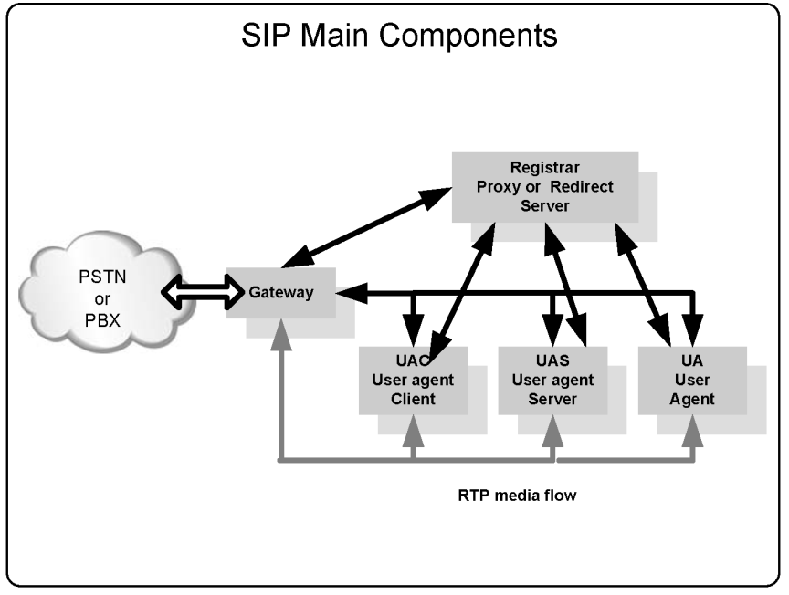

#### Proxy operation

When operating as a SIP proxy, the SIP server stays in the middle of the signaling and is capable of advanced routing and billing. The media flow, based on the real time protocol (RTP) still goes directly between the endpoints.

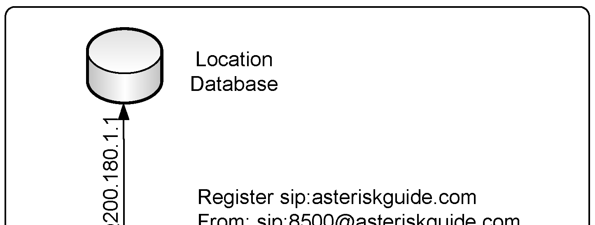

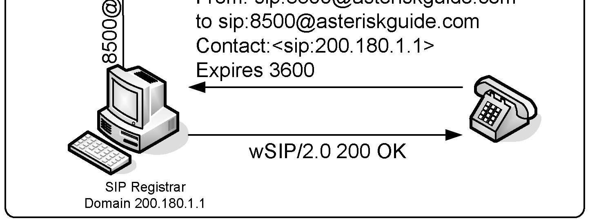

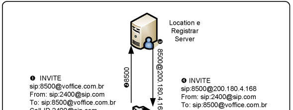

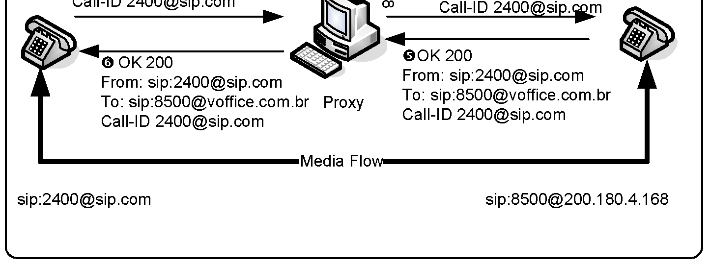

#### Redirect operation

When redirecting, the SIP server simply sends a message (e.g., 302 moved temporarily) to the user agent and stays out of the path of new messages. It is very light in terms of resource usage, but you have no control at all. Redirection is sometimes used in load balance designs.

#### How Asterisk handles SIP

It is important to understand that Asterisk is neither a SIP proxy nor a SIP redirector. Asterisk can perform the role of the registrar and location server; however, it only connects two UACs to itself. Therefore, Asterisk is considered a back-to-back user agent (B2BUA). In other words, it connects two SIP channels, bridging them together. Asterisk has a re-invite mechanism that can make the SIP channels talk to each other directly instead of passing through Asterisk. This mechanism is controlled by the parameter `directmedia`. When using `directmedia=yes` the RTP flow goes directly from one endpoint to another, freeing server resources. In legacy chan_sip this option lived in `sip.conf`; in Asterisk 22 the same concept is `direct_media=yes` on a PJSIP endpoint in `pjsip.conf`.

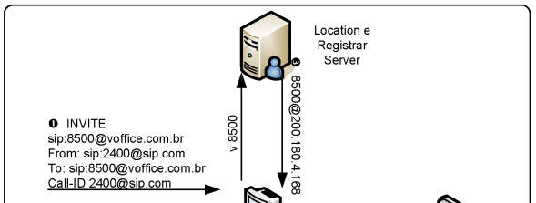

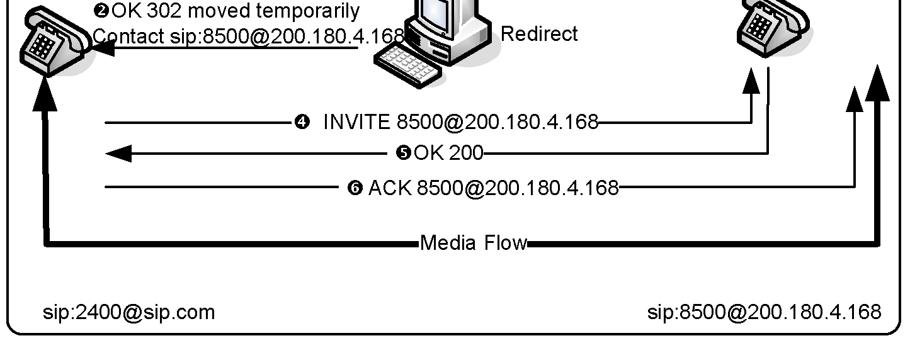

#### SIP operation with directmedia=yes

However, if you need to transfer or record the call using Asterisk, you may use the parameter directmedia=no to force the RTP flow through the Asterisk server.


#### SIP operation with directmedia=no

#### SIP Messages

The basic SIP messages are:

- INVITE – connection establishment
- ACK – acknowledge
- BYE – connection termination
- CANCEL – connection termination for a non-established call
- REGISTER – register a UAC to a SIP proxy
- OPTIONS – can be used to check availability
- REFER – transfer a SIP call to someone else
- SUBSCRIBE – subscribe to notification events
- NOTIFY – send out channel information
- INFO – send various messages (e.g., DTMF )
- MESSAGE – send instant messages

The SIP responses are in text format and are easily readable (similar to HTTP messages). The most important responses are:

- 1XX – Information messages (100–trying, 180–ringing, 183–progress)
- 2XX – Successful request complete (200 – OK)
- 3XX – Call redirect, request has to be directed to another place (302 – moved temporarily, 305 – use proxy)
- 4XX – Error (403 – Forbidden)
- 5XX – Server Error (500 – Internal Server Error; 501 – Not implemented)
- 6XX – Global Failure (606 – Not acceptable)

For example:

```
INVITE sip:2000@192.168.1.133 SIP/2.0
Via: SIP/2.0/UDP
192.168.1.116;rport;branch=z9hG4bKc0a8017400000063452fafbb00006967000000d2
From: "unknown"<sip:2001@192.168.1.133>;tag=1556140623845
To: <sip:2000@192.168.1.133>
Contact: <sip:2001@192.168.1.116>
Call-ID: 64B4C8EC-FCFC-49E9-98B1-90982EEEBED3@192.168.1.116
CSeq: 2 INVITE
Max-Forwards: 70
User-Agent: SJphone/1.61.312b (SJ Labs)
Content-Length: 335
Content-Type: application/sdp
Proxy-Authorization: Digest
username="2001",realm="asterisk",nonce="6c55905e",uri="sip:2000@192.168.1.133",
response="983c0099eea125d8cdfe93b0ec99f3ec",algorithm=MD5
```

#### Session description protocol (SDP)

SDP was originally defined in IETF RFC 2327, now obsoleted by RFC 4566. It is intended for describing multimedia sessions for the purposes of session announcement, session invitation, and other forms of multimedia session initiation. SDP includes:

- Transport protocol (RTP/UDP/IP)
- Type of media (text, audio, video)
- Media format or codec (H.261 video, g.711 audio, etc.)
- Information needed to receive these media (addresses, ports, etc.)

The following example is a transcription of a SDP describing a call between two phones.

```
v=0
o=- 3369741883 3369741883 IN IP4 192.168.1.116
s=SJphone
c=IN IP4 192.168.1.116
t=0 0
a=setup:active
m=audio 49160 RTP/AVP 3 97 98 8 0 101
a=rtpmap:3 GSM/8000
a=rtpmap:97 iLBC/8000
a=rtpmap:98 iLBC/8000
a=fmtp:98 mode=20
a=rtpmap:8 PCMA/8000
a=rtpmap:0 PCMU/8000
a=rtpmap:101 telephone-event/8000
a=fmtp:101 0-11,16
```

### SIP advanced scenarios (sip.conf — legacy, removed in Asterisk 21+)

> **Legacy:** Everything in this section uses `chan_sip` / `sip.conf`, which was
> removed in Asterisk 21 and is **not available in Asterisk 22**. The scenarios
> below are kept to explain the concepts and to help migrating existing systems.
> For the supported way to do each of these on Asterisk 22, see the PJSIP section
> and the migration guide later in this chapter.

Now let’s move on to more advanced configurations. In the following legacy sections, you will see how chan_sip connected Asterisk to a SIP provider, how to connect two Asterisks together using SIP, and how to place a call to a SIP provider. In legacy systems all of these chan_sip configurations were done in the file /etc/asterisk/sip.conf; on Asterisk 22 the equivalent objects live in /etc/asterisk/pjsip.conf.

#### Connecting Asterisk to a SIP provider

Asterisk is often used to connect to a SIP VoIP provider. VoIP providers usually have better rates for phone calls than traditional providers. Another interesting and attractive point of VoIP providers is the possibility to buy DID numbers in other cities—even in foreign countries. These are good reasons to use VoIP for telecommunications. In this section, you will learn how to connect Asterisk to a VoIP provider. Three steps are required to connect Asterisk to a SIP provider. Tests can be conducted by establishing an account with your favorite provider. Step 1: Registering with a SIP provider in sip.conf To connect to a SIP provider, you will need the following information from the provider:

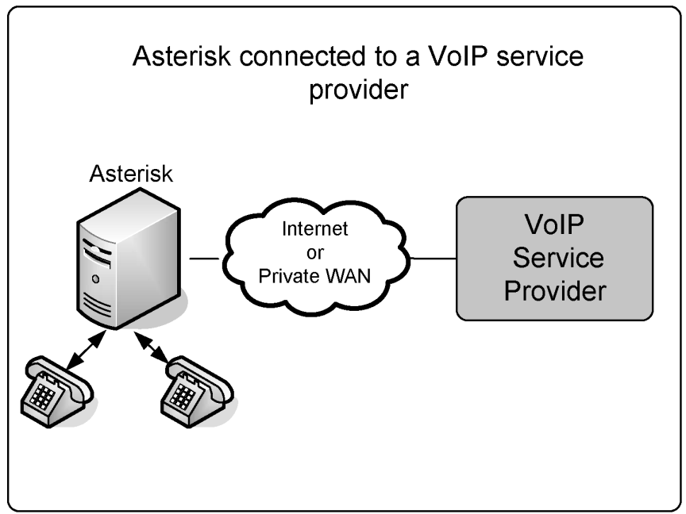

- username
- secret and remotesecret (Use secret to authenticate inbound requests and remotesecret for outbound requests)
- hostname
- domain
- codecs allowed

This configuration will allow your provider to locate Asterisk’s IP address. In the following statement, we are telling Asterisk to register to a SIP provider defined by the hostname and inform the provider of Asterisk’s IP address. The statement says that you want to receive calls at extension 4100. In the [general] section of the sip.conf file, enter the following line:

```
register=>name:secret@hostname/4100
```

Step 2: Configure the [peer] on sip.conf Create an entry of peer type to the desired provider to simplify Asterisk’s dialing.

```
[provider]
context=incoming
type=friend
dtmfmode=rfc2833
directmedia=no
username=username
remotesecret=secret
host=hostname
fromuser=username
fromdomain=domain
insecure=invite
disallow=all
allow=ulaw ; or any other codec available from your provider
```

Step 3: Create a route to the provider in the dial plan We will choose the digits 010 as the destination route to the provider. To dial #610000 inside the provider, simply dial 010610000.

```
exten=>_010.,1,Set(CALLERID(num)=username)
exten=>_010.,n,Set(CALLERID(Name)=”Flavio Gonçalves”)
exten=>_010.,n,Dial(SIP/${EXTEN:3}@provider)
exten=>_010.,n,Hangup
```

##### SIP options specific to the provider scenario

The following discussion examines the details of the options set in the sip.conf file for connection to a VoIP provider.

```
register=>username:password@hostname/4100
```

The instruction registered in the sip.conf file is used to register with a provider. The register transaction is authenticated with the name and secret. You can use a slash (“/”) to provide an extension for incoming calls. Technically speaking, the extension will be placed in the “Contact” header field of the SIP request. The registering behavior can be controlled by certain parameters:

```
registertimeout=20
registerattempts=10
```

To check if registration was successful, use the following console command (legacy chan_sip):

```
CLI>sip show registry
```

> **[2nd-ed note]** On Asterisk 22 the equivalent command is
> `pjsip show registrations` (outbound registrations) and
> `pjsip show endpoints` for endpoint status.

The parameter “username” is used in the authentication digest. The digest is computed using username, secret, and realm:

```
username=username
```

Host defines the VoIP provider address or name:

```
host=hostname
```

The parameters Fromuser and Fromdomain are sometimes required for authentication. These parameters are used in the SIP From header field:

```
fromuser=username
fromdomain=hostname
```

When you connect to a VoIP provider, credentials are required. After the initial invite, the provider sends you a message called “407 Proxy Authentication Required”; you provide the credentials in the subsequent INVITE message. For incoming calls, your Asterisk server will ask for credentials for the provider. Obviously, the provider does not have a valid credential for your Asterisk server. When you use insecure=invite, you are telling Asterisk not to send the “407 Proxy Authentication Required” to the provider and to accept incoming calls. You can also use insecure=port, invite to match the peer based on the IP address without matching the port number.

```
insecure=invite, port
```

#### Connecting two Asterisk servers together using SIP

You can use SIP to interconnect two Asterisk boxes. It is important to pay attention to the dial plan before moving on with this configuration. Users generally want to connect other PBXs with minimal effort. The idea here is to use an extension number only to connect to the other PBX. Step 1: Edit the sip.conf file in server A:

```
[B]
type=user
secret=B
host=A
disallow=all
allow=ulaw
directmedia=no
[B-out]
type=peer
fromuser=A
username=A
remotesecret=A
host=B
disallow=all
allow=ulaw
directmedia=no
```

Step 2: Edit the sip.conf file in server B:

```
[A]
type=user
host=B
secret=A
disallow=all
allow=ulaw
directmedia=no
[A-out]
```

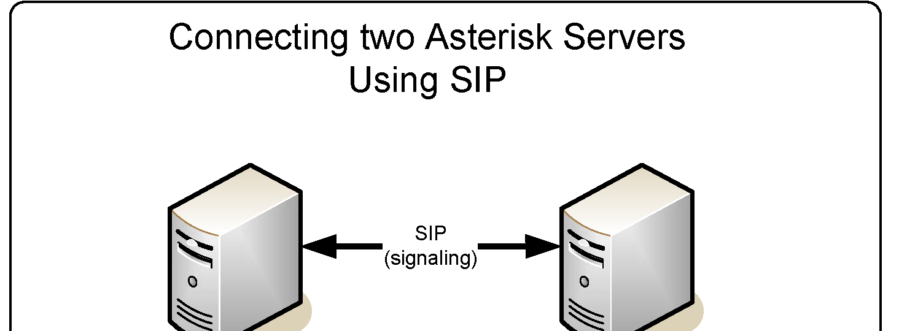

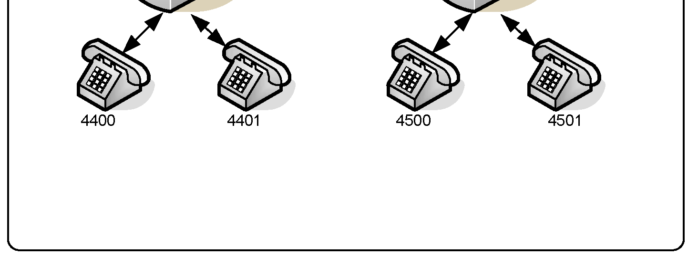

```
type=peer
host=A
fromuser=B
username=B
remotesecret=B
disallow=all
allow=ulaw
directmedia=no
```

Step 3: Edit the extensions.conf file in server A:

```
[default]
exten=_44XX,1,dial(SIP/${EXTEN},20)
exten=_44XX,2,hangup()
exten=_45XX,1,dial(SIP/B-out/${EXTEN})
exten=_45XX,2,hangup()
```

Step 4: Edit the extensions.conf file in server B:

```
[default]
exten=_44XX,1,dial(SIP/A-out/${EXTEN})
exten=_44XX,2,hangup()
exten=_45XX,1,dial(SIP/${EXTEN})
exten=_45XX,2,hangup()
```

#### Asterisk domain support

The SIP protocol follows the Internet architecture. The first thing to do before configuring SIP is to correctly set the DNS servers. In a SIP environment, you can call a user located in any SIP proxy, and other users can call you as well using your SIP Uniform Resource Identifier (URI). To set a DNS server for SIP, you have to add SRV records to your DNS server.

```
; SIP server/proxy and its backup server/proxy
sip1.yourdomain.com
21600 IN A
200.180.4.169
sip2.yourdomain.com
21600 IN A
200.175.61.150
;
; DNS SRV records for SIP
_sip._udp.yourdomain.com  21600 IN SRV 10 0 5060 sip1.voip.school.
_sip._udp.yourdomain.com  21600 IN SRV 20 0 5060 sip2.voip.school.
```

After configuring the DNS, you can use the URI, which points to a SIP user, SIP phone, or telephone extension. A SIP URI looks similar to an email address (e.g., sip:chuck@yourpartnerdomain.com). Using SIP URIs, no telephone number is needed to make a call from one SIP phone to another. To dial an external user, simply use a statement as the one shown below.

```
exten=4000,1,dial(SIP/chuck@yourpartnerdomain.com)
```

Certain parameters can control domain behavior.

```
srvlookup=yes
```

This parameter enables DNS SRV lookups on outbound calls. Using this parameter, it is not possible to dial calls using SIP names based on domain.

```
allowguest=yes
```

This parameter allows an external invite to be processed without authentication. It processes the call within the context defined in the general section or in the domain statement. Warning: If you define a context in the general section with access to PSTN, an external user can dial the PSTN over your PBX. In this case, you will incur any charges. Allow only your own extensions in the context defined in the general section.

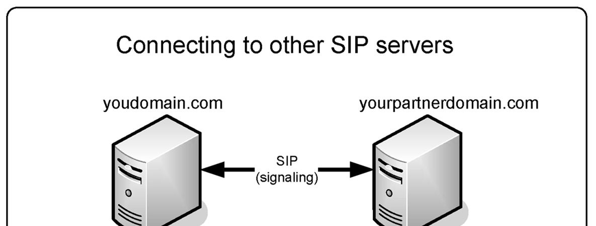

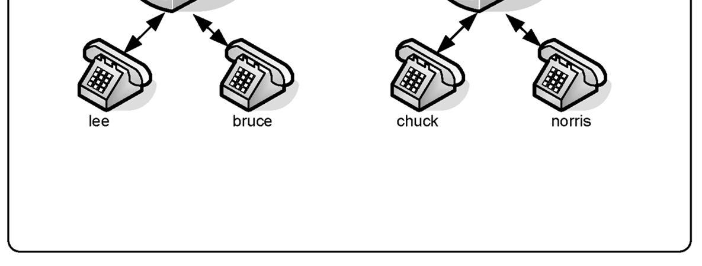

```
domain=acme.com,default
```

The domain command allows you to handle more than one domain within Asterisk. If a call comes from one specific domain, it is directed to a specific context.

```
;autodomain=yes
```

This parameter includes the local IP and hostname in the allowed domains.

```
;allowexternaldomains=no
```

The default is yes. Uncomment the line to disallow calls to outside domains.

### Advanced configurations (sip.conf — legacy, removed in Asterisk 21+)

This section will explain some advanced parameters of the legacy SIP channel, such as presence, codec selection, DTMF options, and QoS packet marking. The **concepts** (BLF/presence, codec negotiation, DTMF modes, DSCP marking) carry over to PJSIP, but the `sip.conf` parameter names shown here do **not** exist in Asterisk 22. See the PJSIP section for the `pjsip.conf` equivalents (for example, DTMF mode is `dtmf_mode=` on a PJSIP endpoint, and codecs are set with `allow=`/`disallow=`).

#### SIP Presence

SIP presence is partially implemented in Asterisk. Asterisk supports requests such as SUBSCRIBE and NOTIFY users depending on the state of a channel. Asterisk does not support the SIP method PUBLISH. In other words, you can subscribe to the states (busy, idle, and ringing) of a channel, but cannot publish information such as “away” or “do not disturb”. The most common scenario for presence is busy lamp field (BLF), in which you simulate the behavior of a KS system with lamps for each extension and trunk. SIP parameters for presence:

- allowsubscribe=yes: Allow SIP subscription methods
- subscribecontext=sip_subscribers: Context where to look for hints
- notifyring=yes: Send SIP NOTIFY on ring
- notifyhold=yes: Send SIP NOTIFY on hole
- counteronpeer (renamed from limitonpeer for Asterisk 1.4.x): Apply the counter only on the peer side
- callcounter=yes: Enable call counters in the device.
- busylevel=1: Threshold for the number of calls for considering the device as busy.

For example: Step 1: Testing SIP presence with Asterisk is not that hard. First, let’s configure the files sip.conf

```
and extensions.conf.
```

In the file sip.conf

```
[general]
bindaddr=0.0.0.0
bindport=5060
disallow=all
allow=ulaw
allowsubscribe=yes
notifyringing=yes
notifyhold=yes
limitonpeer=yes
counteronpeer=yes
subscribecontext=default
[2000]
type=friend
host=dynamic
context=default
dtmfmode=rfc2833
secret=senha
callcounter=yes
busylevel=1
[2001]
type=friend
host=dynamic
context=default
dtmfmode=rfc2833
secret=senha
callcounter=yes
busylevel=1
In the file extensions.conf
[default]
exten=2000,hint,SIP/2000
exten=2001,hint,SIP/2001
exten=_20XX,1,dial(SIP/${EXTEN})
exten=_20XX,n,Hangup()
```

Step 2: Now configure the soft-phone to use presence. We will show you how to configure X-Lite.

- Sequence: right-click->SIP Account Settings->Properties->Presence
- Change the presence model from peer-to-peer to presence agent, which will make the soft-phone subscribe Asterisk for SIP events.

Step 3: Add the contact to other soft-phones. In this example, the Xlite is account 2000, so we will add a contact for account 2001. Sequence: Open the right panel (presence panel in Xlite)->Click in Contacts->Add a contact. Fill the name 2001. Display as 2001 and don’t forget to check the box Show this contact’s

```
availability
```

Step 4: Now call extension 2001 and check the status of the phone in the right panel of the soft- phone. Use the console commands core show hints to see the presence status changing in the server and (legacy chan_sip) sip show inuse to show how many calls you have on each line. On Asterisk 22, use `pjsip show endpoints` to inspect endpoint and channel state.

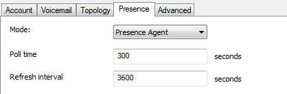

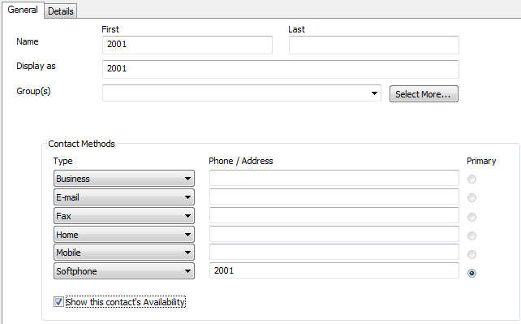

#### Codec configuration

Codec configuration is simple and straightforward. You can set the words allow and disallow in the [general] section or peer/user section. The best practice is to standardize the codec to avoid transcoding, which is processor intensive. Please use the same codec for messages and prompts.

```
[general]
disallow=all
allow=g729
```

#### DTMF options

On certain occasions, you will pass digits to an application such as voicemail or interactive voice response (IVR). It is important to pass DTMF correctly. The simplest method for passing DTMF is called inband. It is set in the [general] or peer/user section of the sip.conf file. When you set dtmfmode=inband, DTMF tones are generated as sounds in the audio channel. The main issue with this method is that, when you compress the audio channel using a codec such as g729, sounds are distorted and DTMF tones are not properly recognized. If you are planning to use dtmfmode=inband, use the g.711 codec (ulaw and alaw).

```
dtmfmode=inband
```

Another approach is to use RFC2833, which allows you to pass DTMF tones as named events in the RTP packets. A table of events corresponding to tones is provided below. Event Codification

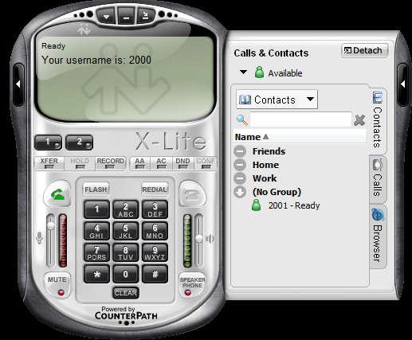

0—-9 0—9 * # A—D Flash

```
dtmfmode=rfc2833
```

Finally, you can pass DTMF digits inside SIP packets, instead of RTP packets. This method is defined in the RFC3265 (signaling events) and RFC2976.

```
dtmfmode=info
```

Following the release of version 1.2, it is now possible to use:

```
dtmfmode=auto
```

This tries to use the RFC2833; if it is not possible, use band tones.

#### Quality of service (QoS) marking configuration

QoS is a set of techniques responsible for voice quality. QoS is implemented in such a way as to reduce bandwidth, latency, and jitter. The main QoS functions are packet scheduling, fragmentation, and header compression. QoS is implemented in switches and routers, not by Asterisk itself. However, Asterisk can help routers and switches by marking packets for express delivery. Marking is done using differentiated services code points (DSCP) defined in RFCs 2474 and RFC2475.

```
tos_sip=cs3
tos_audio=ef
tos_video=af41
```

Starting from version 1.4, you can specify different codes for signaling (SIP), audio (RTP), and video (RTP).

### SIP authentication (sip.conf — legacy, removed in Asterisk 21+)

> **Legacy:** The `sip.conf` parameters in this section (`allowguest`,
> `insecure`, `autocreatepeer`, `secret`/`remotesecret`, `md5secret`,
> `deny`/`permit`) belong to the removed chan_sip driver. On Asterisk 22,
> authentication is configured with PJSIP `auth` objects
> (`type=auth`, `auth_type=userpass`, `username=`, `password=`) referenced by an
> endpoint, and IP access control is done with `permit=`/`deny=` on the endpoint
> or via an `acl`. See the PJSIP section.

When Asterisk receives a SIP call, it follows the rules described in the following diagram. Three parameters play an important role in SIP authentication:

```
allowguest=yes/no
```

This parameter controls whether a user without a corresponding peer can authenticate without a name and secret. We discussed this parameter in the domain support section.

```
insecure=invite,port
```

When we use insecure=invite, Asterisk does not generate the message “407 Proxy Authentication Required”. Without this message, the user can make a call without authentication. This is often used to connect to VoIP service providers. The calls coming from the VoIP service provider are usually not authenticated.

```
autocreatepeer=yes/no
```

This command is used when Asterisk is connected to a SIP proxy. It dynamically creates a peer to each call. When this option is enabled, any UAC can connect to the Asterisk server. It is important to limit the IP connection to the SIP proxy. The SIP proxy, in turn, takes care of access control. Peer configuration is based on the general options as well as the “Contact” header field of the SIP packet. Warning: Use this with extreme caution as it completely opens Asterisk.

```
secret=secret, remotesecret=secret
```

This parameter configures the secret for authentication use secret for inbound requests and remotesecret for outbound requests. If you do not want to present the secrets in text files, you can use md5secret to include a hash instead of the secret. To generate the MD5 secret, you can use:

```
echo –n “username:realm:secret” |md5sum
```

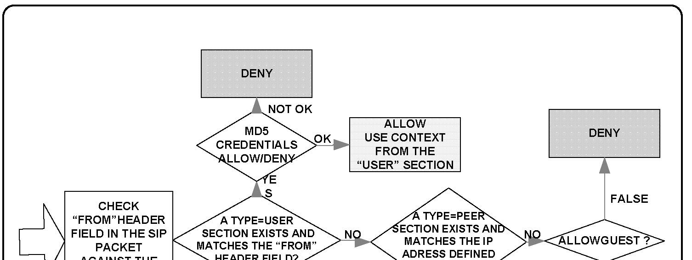

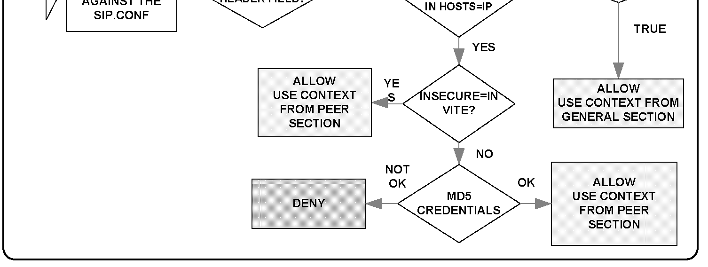

Then use the following statement:

```
md5secret=0b0e5d467890....
```

Warning: Do not forget to use the –n parameter; the carriage return will be used in the md5 computation.

```
deny=0.0.0.0/0.0.0.0
permit=192.168.1.0/255.255.255.0
```

The statements above will deny all IP addresses and allow UAC only from the local network (192.168.1.0/24).

#### RTP options

It is possible to control some RTP parameters.

```
rtptimeout=60
```

This terminates calls without RTP activity for more the 60 seconds when not in hold.

```
rtpholdtimeout=120
```

This terminates calls without RTP activity even on hold (should be bigger than rtptimeout).

### SIP NAT Traversal

> **Note:** The NAT *theory* in this section (the four NAT types, the
> Contact-header problem, keep-alives, and forcing media through the server) is
> protocol-level and fully applies to Asterisk 22. The `sip.conf` parameters
> shown (`nat=`, `qualify=`, `directmedia=`, `externaddr=`, `localnet=`) are
> **legacy chan_sip** and were removed in Asterisk 21+. On PJSIP these map to
> transport/endpoint settings such as `rewrite_contact=yes`, `force_rport=yes`,
> `rtp_symmetric=yes`, `direct_media=no`, `external_media_address`,
> `external_signaling_address`, and `local_net=` on the transport, plus
> `qualify_frequency=` on the AOR. See the PJSIP section and the migration guide
> below.

Network Address Translation (NAT) is a feature used by most networks to save Internet IP addresses. Usually, a company receives a small block of IP addresses, and end users receive one IP address dynamically when connected to the Internet. NAT solves the addressing problem by mapping internal addresses to external addresses. It stores a mapping of internal to external addresses in its memory. This mapping is valid for a specific length of time, after which the mapping is discarded. The mapping uses IP:port pairs for the internal and external addresses. Four kinds of NAT exist:

- Full Cone
- Restricted Cone
- Port Restricted Cone
- Symmetric

#### Full Cone

The first NAT, full cone, represents a static mapping from an external IP:port pair to an internal IP:port pair. Any external computer can connect to it using the external IP:port pair. This is the case in non-stateful firewalls implemented with the use of filters.

#### Restricted Cone

In the restricted cone scenario, the external IP:port pair is opened only when the internal computer sends data to an outside address. However, the restricted cone NAT blocks any incoming packets from a different address. In other words, the internal computer has to send data to an external computer before it can send data back.

#### Port Restricted Cone

The port restricted cone firewall is almost identical to the restricted cone. The only difference is that, now, the incoming packet has to come from exactly the same IP and port of the sent packet.

#### Symmetric

The last type of NAT is called symmetric. It is different from the first three in that a specific mapping is done to each external address. Only specific external addresses are allowed to come back by the NAT mapping. It is not possible to predict the external IP:port pair that will be used by the NAT device. The other three types of NAT allow the use of an external server to discover the external IP address for communication. With symmetric NAT, even if you can connect to an external server, the discovered address cannot be used for any other device except for this server.

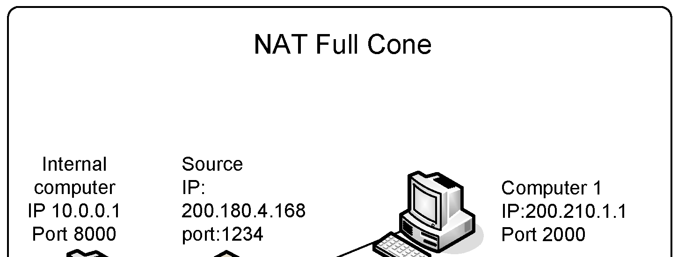

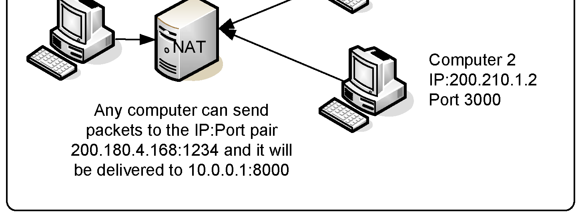

#### NAT firewall table

The following table summarizes the three types of NAT.

- Need to send It is possible to It restricts the data before determine the IP:port incoming packets to receiving pair for returning the destination IP:port packets

Full Cone No Yes No Restricted Cone Yes Yes Only IP Port Restricted Cone Yes Yes Yes Symmetric Yes No Yes

#### SIP signaling and RTP over NAT

Some of the biggest issues in NAT traversal are that you have to solve two problems: SIP signaling and audio (RTP). Most problems of one-way audio are NAT related. An interesting thing about SIP is that, when a UAC sends a packet, it embeds the IP address in the SIP “Contact” header field. Usually this is an internal (RFC1918) address; responses to this packet cannot be routed over the Internet back to the UAC. The parameter nat has changed during recent version. Now there are five options:

- nat = no
- Do no special NAT handling other than RFC3581
- nat = force_rport
- Pretend there was an rport parameter even if there wasn't

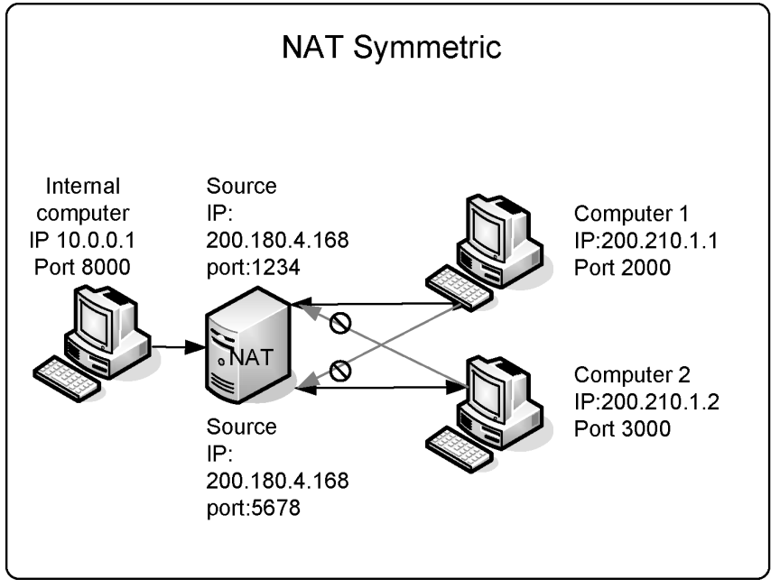

- nat = comedia
- Send media to the port Asterisk received it from regardless of where

the SDP says to send it.

- nat = auto_force_rport Set the force_rport option if Asterisk detects NAT (default)
- nat = auto_comedia Set the comedia option if Asterisk detects NAT

When you put the statement “nat=force_rport” in the sip.conf file, you are telling Asterisk to ignore the address contained in the “Contact” header field of the SIP header and use the source IP address and port in the packet’s IP header and also to send the media back to the address from where it was received ignoring the content of the SDP header.

```
nat=force_rport,comedia
```

It is necessary to keep the NAT mapping open. If NAT times out, Asterisk cannot send an invite to the UAC. The UAC is able to send calls, but not receive any. The following statement can be used to keep NAT open.

```
qualify=yes
```

Qualify will send a SIP packet using the OPTIONS method regularly, which will help keep NAT open. Even with SIP signaling resolved, we now have the challenge of passing RTP from one phone to another. If the user’s NAT is of the symmetric type, it is not possible to send packets from one UAC to another directly. In this case, we have to force the RTP through Asterisk using: [something missing?] Qualify sends an OPTION each 60 seconds and every 10th second when the host is not reachable. You can use “sip show peers” to see the latency for the peers.

```
directmedia=no
```

These configurations are appropriate for most cases. However, it is possible to optimize the traffic using advanced techniques like Simple Traversal of UDP over NAT (STUN), which is useful with full cone, restricted cone, port restricted cone, and Application Layer Gateway (ALG). Using these techniques, you do not need to do anything in Asterisk for NAT traversal. Unfortunately, most firewalls today—even home DSL/cable routers—are symmetric, making STUN unusable. ALG could solve the problem, but it is not supported, not implemented, or buggy in most cases.

#### Asterisk behind NAT

All the previous scenarios assume that the Asterisk server has an external (valid) Internet address. Sometimes the Asterisk server is implemented behind a firewall with NAT. In this case, it is necessary to do some extra configurations. Step 1: Configure the firewall to redirect the UDP port 5060 statically to the Asterisk server. Step 2: Configure the firewall to redirect the UDP ports from 10000 to 20000 statically. If you want to restrict the number of opened ports, you can edit the rtp.conf file to change the RTP port range. Another way is to use an intelligent firewall that supports the SIP protocol to open the RTP ports dynamically.

```
; RTP Configuration
;
[general]
;
; RTP start and RTP end configure start and end addresses
;
rtpstart=10000
rtpend=20000
```

Step 3: Configure Asterisk to include the external address in the header fields of the SIP packets including Session Description Protocol (SDP). You can accomplish this by adding the following two statements to the sip.conf file:

```
externaddr=200.180.4.168
;External IP address
localnet=192.168.1.0/255.255.255.0
;Internal Network Address
nat=force_rport,comedia
```

The first parameter externaddr tells Asterisk to include the external IP address inside the SIP headers for external destinations. The second parameter localnet allows Asterisk to differentiate between external and internal addresses. Optionally, you can use externhost if you use a Dynamic DNS with a DHCP address on the server.

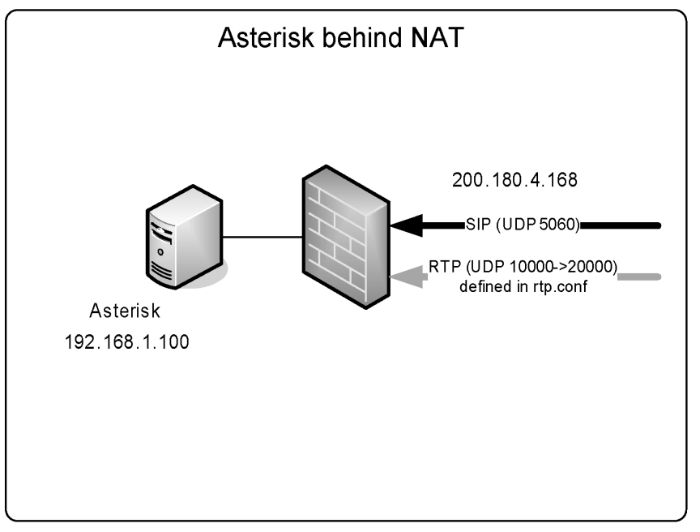

### SIP limitations

Asterisk uses the incoming RTP flow to synchronize the outgoing flow. If the incoming flow is interrupted (silence suppression), music-on-hold will be cut. In other words, you cannot use silence suppression in phones or providers with Asterisk.

### SIP dial strings

> **Legacy:** The `SIP/...` dial-string technology shown below is the removed
> chan_sip driver. On Asterisk 22 use the `PJSIP/...` technology instead — for
> example `Dial(PJSIP/2000)` or `Dial(PJSIP/${EXTEN}@provider)`. The forms and
> meaning are otherwise analogous.

You can call a SIP destination using different dial strings:

```
SIP/peer
```

- ; Need to have a defined peer in sip.conf

```
SIP/flavio@voffice.com.br ; By the URI
SIP/[exten@]peer[:portno]
SIP/[user:password@domain/extension
```

Examples include:

```
exten=>s,1,Dial(SIP/ipphone)
exten=>s,1,Dial(SIP/info@voffice.com.br)
exten=>s,1,Dial(SIP/192.168.1.8:5060,20)
exten=>s,1,Dial(SIP/8500@sip.com:9876)
```

## PJSIP: the SIP channel

PJSIP is the SIP channel in Asterisk. It was first introduced in Asterisk 12 and, after years of development, became the default and recommended SIP channel. In Asterisk 22 (the current LTS) it is the only SIP channel driver: the old module chan_sip was deprecated for several releases and was finally **removed in Asterisk 21**, so it no longer exists in Asterisk 22. PJSIP is based on Teluu’s project called pjproject. The pjproject stack is employed by many softphones and commercial SIP implementations. It is a versatile and mature SIP stack.

### Why to use PJSIP

The PJSIP channel driver brought many features and solved several long-standing problems with the old chan_sip. Even though chan_sip is gone, it is useful to understand why PJSIP replaced it.

#### Features

The channel supports many features, some deserve mention here

- Multiple registrations:. You may use more than one phone connected to the same Address of Record. In other words, you can connect two phones to the same endpoint.
- Friendly Application Program Interface (API). The API is friendly and easier to extend compared to the monolithic chan_sip.
- Multiple transports: You can listen to multiple addresses, ports and transports when using PJSIP. With the old channel you had to use the same address for all peers. PJSIP is more flexible.

#### Problems with chan_sip

- Monolithic: chan_sip was monolithic and any change in the code was becoming very risky. So the pace of innovation was compromised in the channel.
- No official support: chan_sip was deprecated and then removed in Asterisk 21. It does not exist at all in Asterisk 22.
- Adoption note: PJSIP configuration is more verbose than chan_sip was — it requires a little more effort and more lines of configuration. That extra complexity slowed early adoption, but PJSIP is now mature, universal, and the only SIP option, so learning it is no longer optional.

### PJSIP modules

The PJSIP channel is implemented by many modules described below:

#### res_pjsip

This is the base layer of PJSIP and the main module. It is responsible for some of the main services.

#### res_pjsip_session

This module is responsible for media sessions, session description protocol processing and some addons

#### res_pjsip_messaging

Process SIP messages and parse SIP headers.

#### res_pjsip_registrar

Responsible to handle SIP registrations

#### res_pjsip_pubsub

Responsible to process subscribe, notify and publish. These messages are responsible to handle SIP presence and BLF (Busy Lamp Field).

### PJSIP configuration

PJSIP has many different sections. The format of the section are:

```
[Section Name]
Option = Value
Option = Value
```

#### End point section

The most important configuration object is the endpoint. The endpoint configuration has core functionality and has to be associated with an AOR and Transport section. Example:

```
[xlite]
type=endpoint
transport=transport-udp-main
context=from-internal
disallow=all
allow=ulaw
aors=xlite
auth=xlite
```

If you look at the example above, the endpoint is a kind of glue linking all sections together. It specifies a transport, the address of record and the authentication for a phone. Also defines the most important part, the context entry point in the dialplan.

#### Address of Record (AOR)

This object tells Asterisk where to contact the endpoint. It stores the contact addresses. It also allow the configuration of mailboxes. Example:

```
[xlite]
type=aor
max_contacts=2
```

#### Authentication

This section is responsible for inbound and outbound authentication. The documentation is found at the example file pjsip.conf. Example:

```
[xlite]
type=auth
auth_type=userpass
username=xlite
password=#supersecret#
```

#### Transport

The transport section allows you to define IPV4 and IPV6 addresses and the transport protocol, TCP, UDP, TLS, Websockets and so on. You may also configure Natted addresses in this section. You can create multiple transports, but they cannot share the same IP and port and you cannot bind multiple TCP or TLS transports of the same IP version. Example:

```
[transport-udp-main]
type=transport
protocol=udp
bind=0.0.0.0:5060
```

#### Registration

This object is used to configure an outbound registration. Example:

```
[siptrunk]
type=registration
outbound_auth=siptrunk
server_uri=sip:1020@sip.flagonc.com:5600
client_uri=sip:1020@sip.flagonc.com
contact_user=9999
```

#### Identify

This object controls which SIP request belongs to each endpoint. If you do not have an identify section, the system will match the content of the “From” header with the endpoint name. Using this section, you can assign specific IP addresses to specific endpoints, identified by username or IP. Example:

```
[siptrunk]
type=identify
endpoint=siptrunk
match=52.37.87.85
```

#### ACL

The ACL object allows you to configure specific networks with access to the endpoint. Now ACLs are defined in a specific section or in the acl.conf. Example:

```
[acl]
type=acl
deny=0.0.0.0/0.0.0.0
permit=209.16.236.0
permit=209.16.236.1
```

### Relationship between entities

The relationship between the configuration objects provides a great flexibility for configuration. However, it seems a bit complex for anyone starting. Identify Endpoint ACL Domain Alias Transport Auth AOR Contact Registration The graphic above means:

#### Relationships:

- ENDPOINT/AOR many to many
- ENDPOINT/AUTH Zero to Many to Zero to One
- ENDPOINT/IDENTIFY Zero to Many to One
- ENDPOINT/AUTH Zero to Many to One
- ENDPOINT/TRANSPORT Zero to Many to at least one
- REGISTRATION/AUTH Zero to many to zero to one
- REGISTRATION/TRANSPOPRT Zero to many to at least one
- AOR/CONTACT many to many ACL, DOMAIN_ALIAS don’t have relationship configurations

### Configuring a Softphone

To configure a softphone you have to define many different sections. Below an example on how to configure a softphone.

```
[transport-udp-main]
type=transport
protocol=udp
bind=0.0.0.0:5060
[xlite]
type=endpoint
transport=transport-udp-main
context=from-internal
disallow=all
allow=ulaw
aors=xlite
auth=xlite
[xlite]
type=auth
auth_type=userpass
username=xlite
password=#supersecret#
[xlite]
type=aor
max_contacts=2
```

The configuration above sets a transport for UDP in the port 5060, then define an endpoint, its authentication by username and password and then the Address of Record with a maximum of two contacts.

### Configuring a SIP trunk

To configure a SIP trunk you need to have the IP address or Host of the SIP trunk, name and password. You have to create a new registration section for this purpose.

```
[siptrunk]
type=endpoint
transport=transport-udp-main
context=from-siptrunk
direct_media=no
disallow=all
allow=ulaw
outbound_auth=siptrunk
aors=siptrunk
[siptrunk]
type=aor
contact=sip:sip.flagonc.com:5600
[siptrunk]
type=auth
auth_type=userpass
username=1020
password=supersecret
[siptrunk]
type=registration
outbound_auth=siptrunk
server_uri=sip:1020@sip.flagonc.com:5600
client_uri=sip:1020@sip.flagonc.com
contact_user=9999
[siptrunk]
type=identify
endpoint=siptrunk
match=sip.flagonc.com
```

### Nat traversal on res_pjsip

Network Address Translation was created a long time ago as a way to deal with the shortage of IP version 4 addresses. Many people also use NAT as a security feature hiding the internal addresses of a network from the public Internet. Sometimes you will have to handle NAT traversal. In some cases, the server can be behind NAT, such as where you are deploying the server in the cloud. Many times if you are deploying in the cloud your users will also be behind a NAT router. To organize things, we will split this into two parts. The first one is the Asterisk server behind NAT such as in a cloud deployment. In the second section, we will cover how to support clients behind NAT using res_pjsip.

#### Asterisk Server behind NAT

When the Asterisk server is behind NAT, you should inform the external and internal local addresses in the transport section. We will have the following directives.

##### direct_media

Similar to the one in chan_sip. Does the media flow directly from peer to peer or thru the server? For NAT it should flow thru the server. For NAT select no. Example:

```
direct_media=no
```

##### external_media_address

Media address to handle external RTP. Usually the same as the external_media_signaling. Use the public IP address of your server for media and signalling. Example:

```
external_media_address=54.232.1.20
```

##### external_signaling_address

External SIP address where to receive messages. Example:

```
external_signaling_address=54.232.1.20
```

##### local_net

The network you consider your local network. Example:

```
local_net=172.16.30.0/24
local_net=127.0.0.1/32
```

#### Complete example for transport for an Asterisk server behind NAT

To use an Asterisk server behind NAT you have to do two steps. First, define a transport behind NAT. Two, associate this transport to the endpoint.

##### Creating the transport behind NAT

To create the transport behind NAT in the file pjsip.conf create a section like below.

```
[tnat]
type=transport
protocol=udp
bind=0.0.0.0
local_net=172.16.30.0/24
local_net=127.0.0.1/32
external_media_address=54.232.1.20
external_signaling_address=54.232.1.20
```

Associate the transport to an endpoint

```
[6000]
type=endpoint
transport=tnat
context=from-internal
direct_media=no
auth=6000
aors=6000
```

For SIP trunks you should also associate the transport to the registration section as below.

```
[siptrunk_reg]
type=registration
transport=tnat
server_uri=sip:sip.flagonc.com:5600
outbound_auth=siptrunk_auth
client_uri=sip:23456789@flagonc.com
contact_user=9999
```

#### Using Asterisk with clients behind NAT

To use phones behind NAT you have to configure some additional parameters per endpoint.

##### direct_media

Similar to the one in chan_sip. Does the media flow directly from peer to peer or thru the server? For NAT it should flow thru the server. Example:

```
direct_media=no
```

##### rtp_symmetric

This is what we call comedia. Instead of relying in the address defined in this SDP header as usual in SIP, use the address from where you receive the first rtp packet and send back from the same address. Example:

```
rtp_symmetric=yes
```

##### force_rport

This is the behaviour defined in the RFC3581. Rather than using the address in the VIA header, send back the responses from where the requests are coming from. Example:

```
force_rport=yes
```

##### qualify_frequency

This setting has to be applied to the AOR (not the endpoint). There is also the last step, to configure the qualify option. You should always have some packets pinging the destination to keep the NAT mapping open. This is set in the AOR section. Example:

- qualify_frequency=15

Complete example of an endpoint where the server and the client are behind NAT

```
[6000]
type=endpoint
transport=tnat
context=from-internal
direct_media=no
force_rport=yes
rtp_symmetric=yes
auth=6000
aors=6000
[6000]
type=aor
qualify_frequency=15
```

### Channel Naming

As usual one of the important aspects of a channel is its naming and PJSIP has some interesting details. You can start in a way that is similar to the SIP channel

```
exten=>6000,1,Dial(PJSIP/6000,20,tT)
```

The novelty is the possibility to dial all contacts. This was not possible with the old chan_sip. The function PJSIP_DIAL_CONTACTS will be translated to the list of contacts to dial.

```
exten=>6000,dial(${PJSIP_DIAL_CONTACTS(6000)},20,tT)
```

To dial a trunk is slightly different than the previous version. Assume the trunk won’t be registered to your platform or don’t have and IP address associated with your AOR address of record. You can specify the address of the trunk directly in the line. Using an international dial as the example.

```
exten=>9011.,1,Dial(PJSIP/siptrunk/sip:${EXTEN:1}@sip.flagonc.com)
```

If you prefer to specify the address of the trunk in the AOR section, you may also use.

```
exten=>9011.,Dial(PJSIP/${EXTEN:1}@siptrunk
```

### PJSIP configuration wizard

PJSIP is powerful but verbose to configure: many different sections, and templates that can be confusing at first. The good news is the PJSIP configuration wizard. By defining each channel in a few lines, it allows you to create templates and simplify the configuration of new devices. Use the file pjsip_wizard.conf to configure. You still have to define transport and global sections in the file pjsip.conf. Personally, I prefer to use the wizard just for phones, for sip trunks usually the number is not big and you can configure directly in pjsip. The biggest advantage of the wizard is the possibility to use templates and create phones quickly.

```
[phone_default](!)
type = wizard
accepts_auth = yes
accepts_registrations = yes
transport = tnat
endpoint/allow = ulaw
endpoint/context = from-internal
endpoint/direct_media=no
endpoint/force_rport=yes
endpoint/rtp_symmetric=yes
aor/qualify_frequency=15
[xlite](phone_default)
inbound_auth/username = xlite
inbound_auth/password = supersecret
[zoiper](phone_default)
inbound_auth/username = zoiper
inbound_auth/password = supersecret
```

### Loading and unloading PJSIP

In Asterisk 22 there is no longer a chan_sip channel to coexist with: chan_sip was removed in Asterisk 21, so PJSIP is the only SIP channel and there is no conflict to manage. PJSIP modules are loaded by default. In rare cases you may still want to control module loading from the modules.conf file — for example, to disable PJSIP on a server that only uses IAX2 or DAHDI.

> **[2nd-ed note]** On older Asterisk 16/18 systems this section described running chan_sip and PJSIP side by side and using `noload => chan_sip.so` to disable the legacy channel. Since chan_sip no longer exists in 21+, that part has been dropped. Confirm whether you want to keep any historical note for readers upgrading from very old releases.

#### To disable PJSIP

Edit the file modules.conf and add the following lines.

```
noload => res_pjsip.so
noload => res_pjsip_pubsub.so
noload => res_pjsip_session.so
noload => chan_pjsip.so
noload => res_pjsip_exten_state.so
noload => res_pjsip_log_forwarder.so
```

### Console commands

Now that you configured your PJSIP endpoints, it is time to see how to check your configuration. There are many console commands to help you with this task. After editing pjsip.conf, reload the configuration with:

```
module reload res_pjsip.so
```

A plain `reload` (or `core reload`) reloads all modules including PJSIP. (Note there is no bare `pjsip reload` command — `pjsip reload` only exists in the form `pjsip reload qualify aor|endpoint`.) On legacy chan_sip you could list all available SIP console commands with `help sip`; on Asterisk 22 the equivalent is `help pjsip`.

#### pjsip show endpoints

This command shows the endpoints available. In the picture below, we have a screenshot. You can see the address of the xlite softphone and see that is available.

#### pjsip show endpoint <endpoint>

With the command above, you can see each parameter of the endpoint. The list below was cut to less than half of the current parameters.

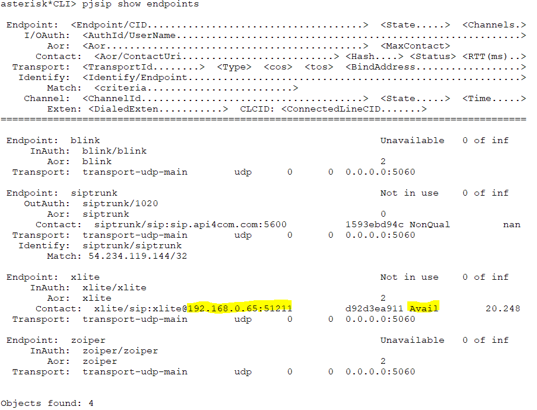

#### pjsip show aors

This command lists the configured Address of Record objects and their contacts, so you can confirm where Asterisk will send calls for each endpoint.

#### pjsip show registrations

The command below shows the registrations made by our own server.

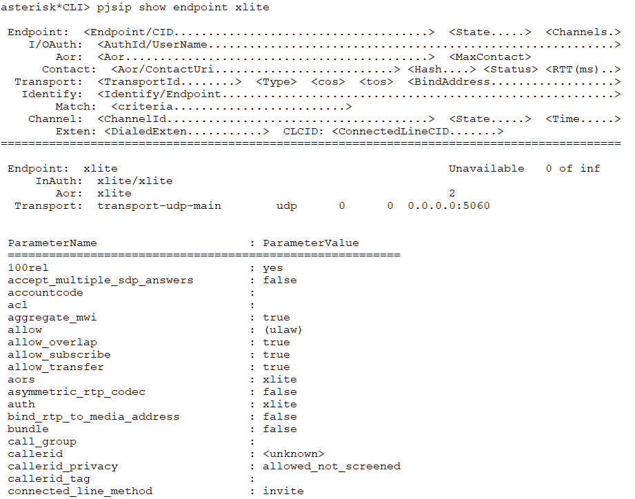

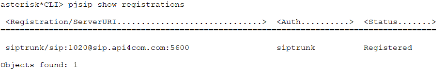

#### pjsip list

The command list is a little friendlier and show less data, but better structured. Listing endpoints. Listing contacts

#### pjsip set logger on

The most useful troubleshooting command is the SIP packet logger. It prints every SIP request and reply to the console as it is sent or received, which is invaluable when diagnosing registration and call setup problems.

```
pjsip set logger on
pjsip set logger off
```

You can also restrict the logging to a single host with `pjsip set logger host <ip>`.

#### pjsip set history on

A great addition to PJSIP is the concept of history. You can capture and analyse SIP request and replies in real time in an easy way. To start history use the command below. Now you can show history Then to see a specific request or reply show the history item.

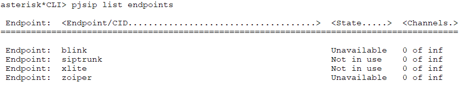

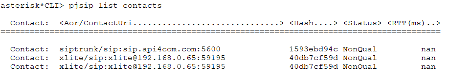

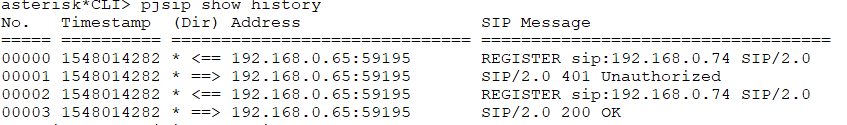

Very easy, isn’t it? You may also clear the history whenever you want using `pjsip set history clear`.

## Migrating from sip.conf to pjsip.conf

Because `chan_sip` was removed in Asterisk 21 and is gone in Asterisk 22, any
existing `sip.conf` deployment must be migrated to PJSIP. The biggest conceptual
shift is that a single `sip.conf` `[peer]` or `[friend]` is split into several
PJSIP objects, each with a `type=`: an **endpoint** (call/codec/media settings),
one or more **aor** objects (where the device can be reached / registration),
an **auth** object (credentials), and a shared **transport** (the listening
socket, NAT addresses). The following table maps the most common concepts.

| Legacy sip.conf concept | PJSIP equivalent (pjsip.conf) |
| --- | --- |
| `[peer]` / `[friend]` block | `type=endpoint` + `type=aor` + `type=auth` (referenced via `auth=` and `aors=`) |
| `type=friend` / `type=peer` / `type=user` | a single `type=endpoint` (PJSIP has no friend/peer/user distinction) |
| `host=dynamic` (device registers) | `type=aor` with `max_contacts=1`; the device REGISTERs to update its contact |
| `host=<ip/hostname>` (static) | `type=aor` with a static `contact=sip:host:port` |
| `register=>user:secret@host/ext` (outbound) | `type=registration` (`server_uri=`, `client_uri=`, `outbound_auth=`) |
| `secret=` / `username=` | `type=auth`, `auth_type=userpass`, `username=`, `password=` |
| `context=` | `context=` on the endpoint |
| `disallow=all` / `allow=ulaw` | `disallow=all` / `allow=ulaw` on the endpoint (same syntax) |
| `dtmfmode=rfc2833` | `dtmf_mode=rfc4733` (PJSIP) — also `inband`, `info`, `auto` |
| `directmedia=yes/no` | `direct_media=yes/no` on the endpoint |
| `nat=force_rport,comedia` | `force_rport=yes`, `rewrite_contact=yes`, `rtp_symmetric=yes` (endpoint) |
| `qualify=yes` | `qualify_frequency=` (seconds) on the **aor** |
| `externaddr=` | `external_media_address=` and `external_signaling_address=` on the **transport** |
| `localnet=` | `local_net=` on the **transport** |
| `insecure=invite` (provider, no auth) | omit `auth=`/`outbound_auth=` and use `identify` (`type=identify`, `match=`) |
| `allowguest=yes` | `anonymous` endpoint + `allow_unauthenticated_options` (use with care) |
| `tos_sip` / `tos_audio` | `tos_audio` / `tos_video` (and `cos_audio` / `cos_video`) on the endpoint |

A registering extension that looked like this in legacy `sip.conf`:

```
[2000]
type=friend
host=dynamic
context=default
dtmfmode=rfc2833
disallow=all
allow=ulaw
secret=senha
```

becomes the following in `pjsip.conf` on Asterisk 22:

```
[2000]
type=endpoint
context=default
disallow=all
allow=ulaw
dtmf_mode=rfc4733
direct_media=no
auth=2000
aors=2000

[2000]
type=auth
auth_type=userpass
username=2000
password=senha

[2000]
type=aor
max_contacts=1
qualify_frequency=60
```

> **[2nd-ed note]** Confirm the exact set of NAT parameters and `identify`/`acl`
> usage you want to recommend for the provider scenario, so this
> migration table stays consistent with the worked examples in the PJSIP section.

### The sip_to_pjsip.py conversion script

Asterisk ships a helper script, **`sip_to_pjsip.py`**, that reads an existing
`sip.conf` and produces a `pjsip.conf`. You can run it directly in the
/etc/asterisk directory. The utility is in the Asterisk source tree under
`contrib/scripts/sip_to_pjsip/`, where `${PATH_TO_ASTERISK_SOURCE}` is the path
where the Asterisk source files are found (usually /usr/src/asterisk-22.x.y/):

```
${PATH_TO_ASTERISK_SOURCE}/contrib/scripts/sip_to_pjsip/sip_to_pjsip.py
```

If you run it with the `--help` option you will see its options:

```
-h, --help                help
-p, --prefix PREFIX       prefix to use for the included config files
-q, --quiet               suppress warnings and informational messages
```

It also accepts optional positional arguments — `[input-file [output-file]]`,
defaulting to `sip.conf` and `pjsip.conf` in the current directory.

Treat its output as a **starting point**: review every generated object,
especially transports, NAT settings, and codec lists, and test thoroughly before
going to production.

Let’s migrate the sip.conf in our companion labs at VoIP School Blackbelt (voip.school)

#### sip.conf

```
[general]
bindport=5060
bindaddr=0.0.0.0
context=dummy
disallow=all
allow=ulaw
alwaysauthreject=yes
allowguest=no
register=>1020:supersecret@sip.api4com.com:5600/9999
[zoiper]
type=friend
secret=#supersecret#
host=dynamic
qualify=yes
directmedia=no
context=from-internal
[xlite]
type=friend
secret=#supersecret#
host=dynamic
qualify=yes
directmedia=no
context=from-internal
[siptrunk]
type=peer
defaultuser=1020
secret=supersecret
port=5600 ; nor 5060, 5600
insecure=invite
host=sip.api4com.com
fromuser=1020
fromdomain=sip.api4com.com
context=from-siptrunk
```

#### pjsip.conf

```
;--
;;;;;;;;;;;;;;;;;;;;;;;;;;;;;;;;;;;;;;;;;;;;;;;;;;
Non mapped elements start
;;;;;;;;;;;;;;;;;;;;;;;;;;;;;;;;;;;;;;;;;;;;;;;;;;
[general]
bindport = 5060
[zoiper]
qualify = yes
[xlite]
qualify = yes
[siptrunk]
defaultuser = 1020
;;;;;;;;;;;;;;;;;;;;;;;;;;;;;;;;;;;;;;;;;;;;;;;;;;
Non mapped elements end
;;;;;;;;;;;;;;;;;;;;;;;;;;;;;;;;;;;;;;;;;;;;;;;;;;
--;
[transport-udp]
type = transport
protocol = udp
bind = 0.0.0.0:5060
[reg_sip.api4com.com]
type = registration
retry_interval = 20
max_retries = 10
contact_user = 9999
expiration = 120
transport = transport-udp
outbound_auth = auth_reg_sip.api4com.com
client_uri = sip:1020@sip.api4com.com:5600
server_uri = sip:sip.api4com.com:5600
[auth_reg_sip.api4com.com]
type = auth
password = supersecret
username = 1020
[zoiper]
type = aor
max_contacts = 1
[zoiper]
type = auth
username = zoiper
password = #supersecret#
[zoiper]
type = endpoint
context = from-internal
disallow = all
allow = ulaw
direct_media = no
auth = zoiper
outbound_auth = zoiper
aors = zoiper
[xlite]
type = aor
max_contacts = 1
[xlite]
type = auth
username = xlite
password = #supersecret#
[xlite]
type = endpoint
context = from-internal
disallow = all
allow = ulaw
direct_media = no
auth = xlite
outbound_auth = xlite
aors = xlite
[siptrunk]
type = aor
contact = sip:1020@sip.api4com.com:5600
[siptrunk]
type = identify
endpoint = siptrunk
match = sip.api4com.com
[siptrunk]
type = auth
username = siptrunk
password = supersecret
[siptrunk]
type = endpoint
context = from-siptrunk
disallow = all
allow = ulaw
from_user = 1020
from_domain = sip.api4com.com
auth = siptrunk
outbound_auth = siptrunk
aors = siptrunk
```

While the conversion seems ok, we can see that some elements such as qualify=yes cannot be mapped directly. To fix you have to add to the aor section the command qualify_frequency=time in seconds. Example below.

```
[xlite]
type = aor
max_contacts = 1
qualify_frequency=15
```

Full PJSIP configuration is covered in the PJSIP section of this chapter, and the official documentation at docs.asterisk.org has full coverage of the channel. In our companion labs at voip.school, lab 5 lets you practice what you have just learned.

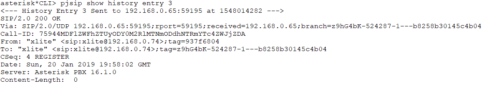

> **[2nd-ed note]** Add a combined end-of-chapter quiz covering SIP fundamentals, PJSIP
> objects, and sip.conf→pjsip.conf migration (the original ch8/ch9 quizzes were dropped in the merge).
