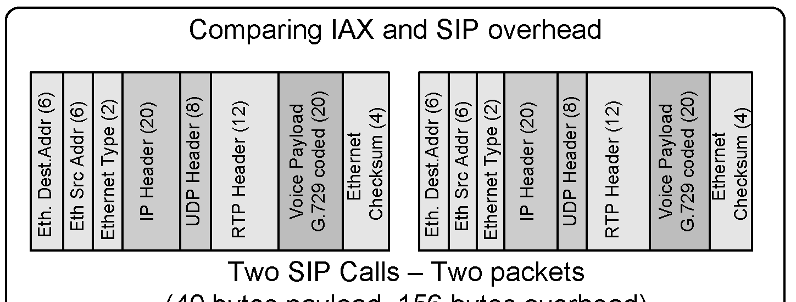
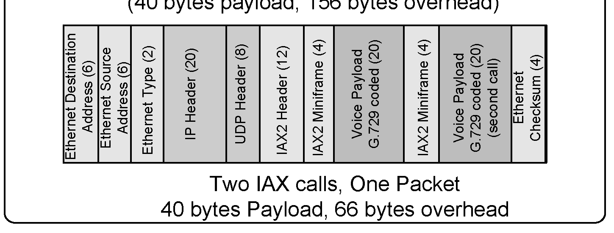
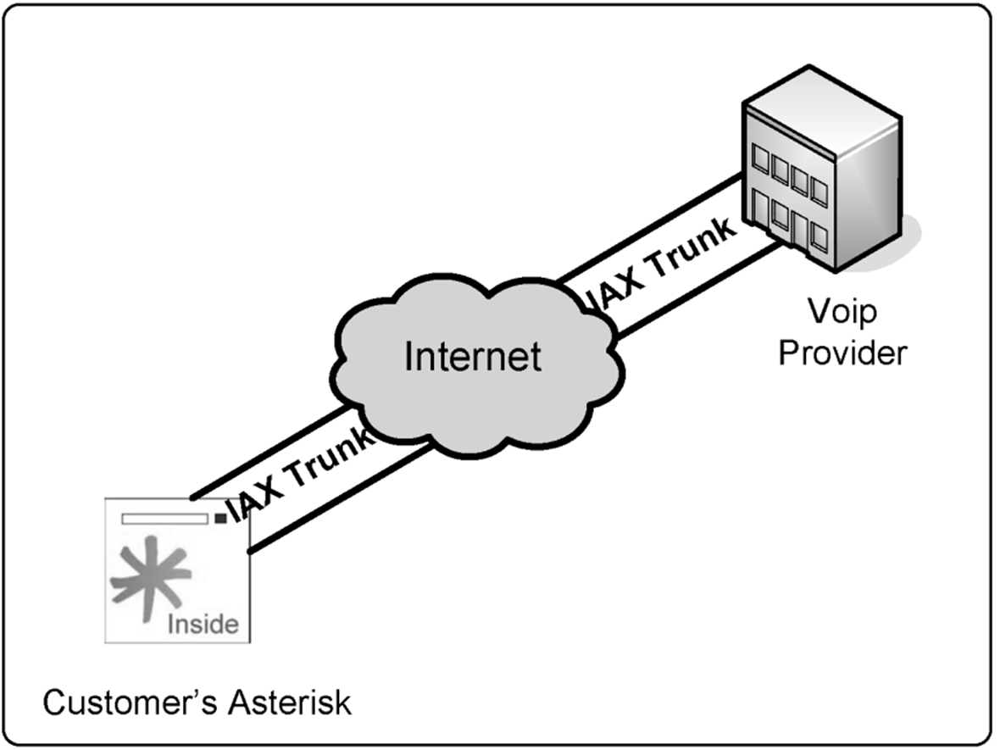
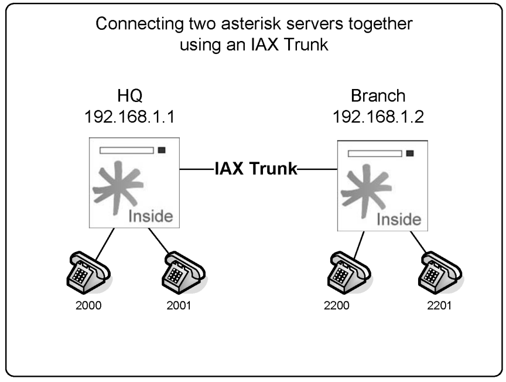
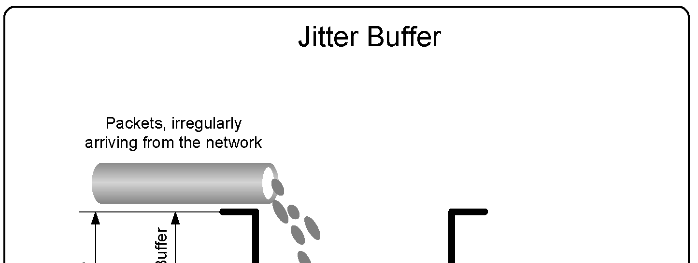
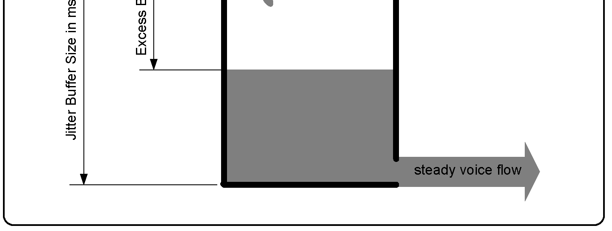

# The IAX Protocol

In this chapter, we will learn about the Inter-Asterisk eXchange (IAX) protocol, including its strengths and weaknesses. Details such as trunk mode and the interconnection of two Asterisk servers will also be covered. All references in this document correspond to IAX version 2. The IAX protocol provides media transport and signaling for voice and video. IAX is very innovative; it saves bandwidth in trunk mode and is much simpler than SIP when you need to traverse NAT. The primary use for IAX nowadays is to interconnect Asterisk servers. IAX was created primarily for voice, but it can also accommodate video and other multimedia streams. IAX was inspired from other VoIP protocols, such as SIP and MGCP. Instead of using two separate protocols for signaling and media, IAX unified them to make a unique protocol. IAX does not use RTP for media transport; instead, it embeds the media in the same UDP connection.

> **[2nd-ed note — Status in Asterisk 22]** `chan_iax2` is still included and fully supported in Asterisk 22 LTS, so everything in this chapter remains valid. However, IAX2 is now a legacy protocol and sees relatively little new deployment. The VoIP industry has largely converged on SIP (via `chan_pjsip` in Asterisk 22) for both provider trunking and server interconnection. IAX2's primary remaining selling point is its **single-port NAT traversal**: all signaling and media flow over a single UDP port (4569 by default), which greatly simplifies firewall and NAT configuration compared to SIP + RTP. If you are building a new Asterisk-to-Asterisk trunk and NAT is not a concern, PJSIP trunks are the recommended modern approach. IAX2 is kept here because it is still a valid choice, especially in environments where only one UDP port can be opened through a firewall.

## Objectives

By the end of this chapter, you should be able to:

- Identify strengths and weakness of IAX protocol
- Describe usage scenarios for the IAX protocol
- Describe the advantages of IAX trunk mode
- Configure iax.conf for phones
- Configure iax.conf for connection to a VoIP provider
- Configure iax.conf for Asterisk interconnection
- Understand IAX authentication

## IAX design

The main objectives for IAX design are:

- To reduce the bandwidth required for media transport and signaling
- To provide NAT transparency
- To be able to transmit the dial plan information
- To support the efficient use of paging and intercom

IAX is a peer-to-peer signaling and media protocol that is similar to SIP without using RTP. The basic approach is to multiplex the multimedia streams over a single UDP connection between two hosts. The greatest benefit of this approach is its simplicity when traversing connections over NAT, regularly found in xDSL modems. IAX uses a single port, UDP 4569 by default, and then uses a call number with 15 bits to multiplex all streams. The IAX protocol uses registration and authentication processes similar to the SIP protocol. A description of the protocol can be found at http://www.ietf.org/internet-drafts/draft-guy-iax-05.txt

## Bandwidth usage

The bandwidth used in VoIP networks is affected by several factors; codecs and protocol headers are the most important. The IAX protocol has a surprising feature called trunk mode, whereby it multiplexes several calls using a single header. By playing with the Asterisk bandwidth calculator, you will see how IAX trunks can save you up to 80% of the traffic with multiple calls.


## Channel naming

It is important to understand channel-naming conventions as you will use these names when specifying a channel in the dial plan. The format of an IAX channel name used for outbound channels is:

```
IAX/[<user>[:<secret>]@]<peer>[:<portno>][/<exten>[@<context>][/<options>]
```

<user> UserID on remote peer, or name of client configured in iax.conf <secret> The password. Alternatively it can be the filename for an RSA key without the trailing extension (.key or .pub) and enclosed in square brackets <peer> Name of server to connect to <portno> Port number for connection <exten> Extension in the remote Asterisk server <context> Context in the remote Asterisk server <options> The only option available is ‘a’ meaning ‘request autoanswer’

### Outbound channels example:

Outbound channels are seen in the Asterisk console. IAX2/8590:secret@myserver/8590@default Call the 8590 extension in myserver. It uses 8590:secret as the name/password pair





IAX2/iaxphone Call "iaxphone" IAX2/judy:[judyrsa]@somewhere.com Call somewhere.com using judy as the username and a RSA key for authentication

### The format of an incoming IAX channel is:

Inbound channels are seen in the Asterisk console.

```
IAX2/[<username>@]<host>]-<callno>
```

<username> Username if known <host> Host connecting <callno> Local call number Incoming channel example: IAX2[flavio@8.8.30.34]/10 Call number 10 from IP address 8.8.30.34 using flavio as the user. IAX2[8.8.30.50]/11 Call number 11 from IP address 8.8.30.50.

## Using IAX

You may use IAX in several ways. In this section, we will show you how to configure IAX for several scenarios, including:

- Connecting a soft-phone using IAX
- Connecting IAX to a VoIP provider using IAX
- Connecting two servers using IAX
- Connecting two servers using IAX in trunk mode
- Debugging an IAX connection
- Using RSA pair keys for authentication

### Connecting a soft-phone using IAX

Asterisk supports IP phones based on IAX such as the ATCOM and the old ATA from Digium (called IAXy) as well as soft-phones such as Zoiper. The process for soft-phones, ATAs, and hard- phones is similar. To configure an IAX device, you need to edit the iax.conf file in /etc/asterisk

```
directory.
```

We will use the Zoiper (www.zoiper.com) as an example. It is a full-featured and free soft-phone. Step 1: Make a backup of the original iax.conf file using:

```
#cd /etc/asterisk
#mv iax.conf iax.conf.backup
```

Step 2: Start editing a new iax.conf file:

```
[general]
bindport=4569
bindaddr=8.8.1.4
bandwidth=high
```

- ; Very important parameter, it changes the codecs available

```
disallow=all
allow=ulaw
jitterbuffer=no
forcejitterbuffer=no
tos=lowdelay
autokill=yes
[guest]
type=user
context=guest
callerid="Guest IAX User"
; Trust Caller*ID Coming from iaxtel.com
;
[iaxtel]
type=user
context=default
auth=rsa
inkeys=iaxtel
;
; Trust Caller*ID Coming from iax.fwdnet.net
;
[iaxfwd]
type=user
context=default
auth=rsa
inkeys=freeworlddialup
;
; Trust callerid delivered over DUNDi/e164
;
;
;[dundi]
;type=user
;dbsecret=dundi/secret
;context=dundi-e164-local
[2003]
type=friend
context=default
secret=senha
host=dynamic
```

I’ve tried to preserved the default (non-commented) lines of the sample file. The following parameters were modified:

```
bandwidth=high
```

This line affects the codec selection. Using the high setting allows for the selection of a high bandwidth and a high quality codec such as g.711 defined by the ulaw keyword. If you keep the default parameter, you will not be able to choose ulaw. In this case, Asterisk will give you the message “no codec available” for the configuration below.

```
disallow=all
allow=ulaw
```

In the commands described above, we disabled all codecs and enabled just ulaw. In LANs, most people prefer to use ulaw because it is not processor-intensive and saves CPU cycles. Even using more bandwidth, this codec is preferable because in LANs you usually have a 100-megabits Ethernet or even a Gigabit. A voice call using ulaw uses almost 100 kilobits per second of bandwidth from your network, which is a very light use for today’s high-speed LANs. In WAN or Internet networks, you will usually disable ulaw, trading some available CPU cycles by voice compression for better bandwidth use. The codecs gsm , g729, and ilbc provide a good compression factor as well.

```
[2003]
type=friend
context=default
secret=senha
host=dynamic
```

In the above commands, we have defined a friend named [2003]. The context is the default (in the first labs we always use the default context to avoid confusion; this context will be fully explained in chapter 9). The line “host=dynamic” provides a dynamic registration of the phone’s IP address. Step 3: Download and install Zoiper™ from the following URL: http://www.zoiper.com/ Note: URLs frequently change. Please resort to “googling” if you cannot find the file at this specific URL. You can choose other soft-phones for the lab as well. Step 4: Configure an Asterisk account by clicking the right button over the Zoiper. You should see a screen similar to the one below: Step 5: Configure the extensions.conf file to test your IAX device.

```
[default]
exten=>2000,1,Dial(SIP/2000)
exten=>2001,1,Dial(SIP/2001)
exten=>2003,1,Dial(IAX2/2003)
```

Now you can dial between the SIP phones created in Chapter 3 and the IAX phone created in the lab.

### Connecting to a VoIP provider using IAX

A few VoIP providers support IAX. You can easily find an IAX provider by searching for “IAX providers”. Using an IAX provider makes a lot of sense as IAX can save a lot of bandwidth, easily traverses NAT, and can authenticate using RSA key pairs.

> **[2nd-ed note]** The number of IAX-capable commercial VoIP providers has declined significantly since Asterisk 16. Most providers now offer SIP/PJSIP trunks exclusively. Before choosing an IAX provider, confirm they actively maintain their IAX infrastructure. For new provider integrations, a PJSIP trunk is the recommended alternative.

### Connecting to a provider using IAX

Step 1: Open an account in your favorite provider. Your provider will provide you three things.

- Name
- Secret
- IP address or Host name
- RSA public key

Step 2: Configure the iax.conf file to register your Asterisk with your provider. Add the following lines to the [general] section of the file.

```
[general]
register=>name:secret@hostname/2003
```

In the instructions described above, you registered with your provider using your account and password. The moment you receive a call, it will be forwarded to the 2003 extension.

```
[name]
```

- ; Your account name or number

```
type=peer
secret=secret
; Your password
host=hostname
```

In the instructions described above, we have created a peer corresponding to the provider for dialing purposes.

```
[nameiax]
type=user
context=default
auth=rsa
inkeys=hostname
```



This is required for RSA authentication. Using the public key from your provider allows you to be sure that the call being received is really from the true provider. If anyone else tries to use the same path, they will not be able to authenticate it because they do not have the corresponding private key. Step 4: Try the connection. To test the connection, call any number. Some vendors provide an echo test. To accomplish this, please edit the file extensions.conf.

```
[default]
exten=>*98,1,Dial(IAX2/name:secret@hostname/*98,20,r)
```

Go to the Asterisk CLI and issue a reload. To verify if Asterisk is registered with the provider, use the next command.

```
CLI>reload
CLI>iax2 show register
```

Now simply dial *98 on the soft-phone connected to the Asterisk server.

### Connecting two Asterisk servers through an IAX trunk

It is very easy to connect one server to another. You won’t need to register them because the IP addresses are already known. You will have to create the peers and users in the iax.conf file. All extensions in the HQ site start with 20 followed by two digits (e.g., 2000). In the Branch, all extensions start with 22 followed by two digits (e.g., 2200). We will use the trunk. You will need a DAHDI timing source to enable this feature. Step 1: Edit the iax.conf file in the Branch server.



```
[general]
bindport=4569                   ; bindport and bindaddr may be specified
bindaddr=0.0.0.0                ; more than once to bind to multiple
disallow=all
allow=ulaw
;allow=gsm
[Branch]
type=user
context=default
secret=password
host=192.168.2.10
trunk=yes
notransfer=yes
[HQ]
type=peer
context=default
username=HQ
secret=password
host=192.168.2.10
callerID='HQ'
trunk=yes
notransfer=yes
[2200]
type=friend
auth=md5
context=default
secret=password
host=dynamic
callerid='2000'
[2201]
type=friend
auth=md5
context=default
secret=password
host=dynamic
callerid='2001'
```

Step 2: Configure the file extensions.conf in the Branch server

```
[general]
static=yes
writeprotect=no
autofallthrough=yes
clearglobalvars=no
priorityjumping=no
[default]
exten=>_20XX,1,dial(IAX2/HQ/${EXTEN},20)
exten=>_20XX,2,hangup
exten=>_22XX,1,dial(IAX2/${EXTEN},20)
exten=>_22XX,2,hangup
```

Step 3: Configure the iax.conf file in the HQ server

```
[general]
bindaddr=0.0.0.0
bindport=4569
disallow=all
allow=ulaw
allow=gsm
[Branch]
type=peer
context=default
username=Branch
secret=password
host=192.168.2.9
callerid="Branch"
trunk=yes
notransfer=yes
[HQ]
type=user
secret=password
context=default
host=192.168.2.9
callerid="HQ"
trunk=yes
notransfer=yes
[2000]
type=friend
auth=md5
context=default
secret=password
callerid="2200"
host=dynamic
[2001]
type=friend
auth=md5
context=default
secret=password
callerid="2201"
host=dynamic
```

Step 4: Configure the extensions.conf file in the HQ server.

```
[general]
static=yes
writeprotect=no
autofallthrough=yes
clearglobalvars=no
priorityjumping=no
[default]
exten=>_22XX,1,Dial(IAX2/Branch/${EXTEN})
exten=>_22XX,2,hangup
exten=>_20XX,1,Dial(IAX2/${EXTEN})
exten=>_20XX,2,hangup
```

Step 5: Test a call from the phone 2000 in the HQ server to the phone 2200 in the Branch server.

## IAX authentication

Now let’s analyze the IAX authentication process from the practical standpoint to help you choose the best method for each specific requirement.

### Incoming connections

When Asterisk receives an incoming connection, the initial information can include a user name (from the field “username=”) or not. The incoming connection has an IP address too, which Asterisk uses for authentication as well. If a user is provided, Asterisk: 1. Searches iax.conf for an entry with type=user (or type=friend with a section name matching the username). If it did not find it, Asterisk refuses the connection. 2. If the entry found has deny/allow configurations, it compares the IP address from the caller to determine whether to accept the call or not depending on the deny/allow clauses. 3. It checks the password (secret) using plaintext, md5, or RSA. 4. It accepts the connection and sends the call to the context specified in the line “context=” from the iax.conf file. If a username is not provided, Asterisk: 1. Searches for an entry containing type=user (or type=friend) in the iax.conf file without a specified secret. It checks deny/allow clauses as well. If an entry is found, the connection is accepted and the section name is used as the user’s name. 2. Searches for an entry containing type=user (or type=friend) in the iax.conf file with a secret or RSA key specified. It checks deny/allow clauses. If an entry is found, it tries to authenticate the caller using the specified secret; if it matches, it accepts the connection. Section name is the user’s name. Let’s suppose your iax.conf file has the following entries:

```
[guest]
type=user
context=guest
[iaxtel]
type=user
context=incoming
auth=rsa
inkeys=iaxtel
[iax-gateway]
type=friend
allow=192.168.0.1
context=incoming
host=192.168.0.1
[iax-friend]
type=user
secret=this_is_secret
auth=md5
context=incoming
```

If a call has a specified username, such as:

- guest
- iaxtel
- iax-gateway
- iax-friend

Asterisk will try to authenticate the call using only the corresponding entry in the iax.conf file. If any other names are specified, the call would be rejected. If no user is specified, Asterisk will try to authenticate the connection as guest. However, if guest does not exist, it will try any other connections with a matching secret. In other words, if you don’t have a guest section in your iax.conf file, a malicious user could try to guess any matching secret by not specifying the user name. IP addresses’ deny/allow restrictions apply too. A good way to avoid secret guessing is to use RSA authentication. Another method is to restrict the IP addresses allowed to call in.

### IP address restrictions

permit = <ipaddr>/<netmask> Rules are interpreted in sequence, and all are evaluated (this concept is different from ACLs deny = <ipaddr>/<netmask> usually found in routers and firewalls). Example #1 permit=0.0.0.0/0.0.0.0 deny=192.168.0.0/255.255.255.0 Will deny any packet from 192.168.0.0/24 network Example #2 deny=192.168.0.0/255.255.255.0 permit=0.0.0.0/0.0.0.0 It will permit any packet. The last instruction supersedes the first.

### Outbound connections

Outbound connections acquire authentication information using the following methods:

- The IAX2 channel description passed by the dial() application.
- An entry with type=peer or type=friend in the iax.conf file.
- A combination of both methods.

### Connecting two Asterisk servers using RSA keys

It is possible to use IAX with strong authentication using asymmetric RSA keys. According to the source code (res_krypto.c), Asterisk uses RSA keys with an SHA-1 algorithm for message digests instead of the weaker MD5. Below is a step-by-step guide for setting up two servers using RSA keys.

#### Configuring the server for the branch

Step 1: Generate the RSA keys in the branch server

```
astkeygen –n
```

When asked, use the key name branch. We have used the parameter –n to avoid passing a passphrase whenever Asterisk reinitializes. If you want to improve the security, don’t use the –n and start Asterisk with asterisk -i Step 2: Copy the keys to the directory /var/lib/asterisk/keys

```
cp branch.* /var/lib/asterisk/keys
```

Step 3: Copy the public key to the HQ server

```
scp branch.pub root@hq_ip_address:/var/lib/asterisk/keys
```

Step 4: Edit the iax.conf file in the Branch server.

```
[general]
bindport=4569                   ; bindport and bindaddr may be specified
bindaddr=0.0.0.0                ; more than once to bind to multiple
disallow=all
allow=ulaw
;Create an entry for the HQ server
[hq]
type=user
context=default
host=192.168.2.10
trunk=yes
notransfer=yes
auth=rsa
inkeys=hq
[2200]
type=friend
auth=md5
context=default
secret=password
host=dynamic
callerid='2200'
[2201]
type=friend
auth=md5
context=default
secret=password
host=dynamic
callerid='2201'
```

Step 8: Configure the extensions.conf file in the Branch server

```
 [default]
exten=>_20XX,1,dial(IAX2/branch:[branch]@192.168.2.10/${EXTEN},20)
exten=>_20XX,2,hangup
exten=>_22XX,1,dial(IAX2/${EXTEN},20)
exten=>_22XX,2,hangup
```

#### Configuring the server for the headquarters

Step 1: Generate the RSA keys in the HQ server

```
astkeygen –n
```

When asked use the key name hq. Step 2: Copy the keys to the directory /var/lib/asterisk/keys

```
cp hq.* /var/lib/asterisk/keys
```

Step 3: Copy the public key to the BRANCH server

```
scp hq.pub root@branch_ip_address:/var/lib/asterisk/keys
```

Step 4: Configure the iax.conf file in the HQ server

```
[general]
bindaddr=0.0.0.0
bindport=4569
disallow=all
allow=ulaw
allow=gsm
;Configure an entry for the branch server
[branch]
type=user
context=default
host=192.168.2.9
trunk=yes
notransfer=yes
auth=rsa
inkeys=branch
[2000]
type=friend
auth=md5
context=default
secret=password
callerid="2000"
host=dynamic
[2001]
type=friend
auth=md5
context=default
secret=password
callerid="2001"
host=dynamic
```

Step 10: Configure the extensions.conf file in the HQ server.

```
[default]
exten=>_22XX,1,Dial(IAX2/hq:[hq]@192.168.2.9/${EXTEN})
exten=>_22XX,2,hangup
exten=>_20XX,1,Dial(IAX2/${EXTEN})
exten=>_20XX,2,hangup
```

Step 11: Test a call from the 2000 phone in the HQ server to the 2200 phone in the Branch server.

## The iax.conf file configuration

The file iax.conf has several parameters; discussing each parameter one by one would be boring and counterproductive. All parameters, along with a description, can be found in the sample file. In the wiki www.voip-info.org you will find detailed information about each one. Here we will show some of the most important parameters for the configuration of the general section, peers, and users.

### [General] Section

Server addresses bindport = <portnum> Configures the IAX UDP port. Default is 4569. bindaddr = <ipaddr> Use 0.0.0.0 to bind Asterisk to all interfaces or specify the IP address of a specific interface. Codec selection bandwidth = [low|medium|high] High = all codecs Medium = all codecs except ulaw and alaw Low = low bandwidth codecs allow/disallow = Codec selection fine tuning [alaw|ulaw|gsm|g.729| etc.]

## Jitter buffer

Jitter is the delay variation between packets. It is the most important factor affecting voice quality. A Jitter buffer is used to compensate for the delay variation. It sacrifices latency in favor of lower jitter. You can make an analogy between the jitter buffer and a water tank. Both can receive packets or water at irregular intervals, but will ultimately deliver a regular flow.





A small jitter (i.e., below 20 ms) is usually imperceptible. However, jitter above this level is annoying. The latency or delay should be kept to below 150ms. Creating a jitter buffer will sacrifice some delay for a lower jitter—a concept known as “delay-budget”. You can affect the jitter buffer using these parameters:

- Jitterbuffer=<yes/no> – Enables or disables
- Dropcount=<number> - Maximum amount of frames that should be delayed in the last two seconds. The recommended setting is 3 (1.5% of dropped frames)
- Maxjitterbuffer=<ms> - Usually below 100 ms
- Maxexcessbuffer=<ms> - If the network delay improves, the jitter buffer could be oversized. Consequently, Asterisk will try to reduce it.
- Minexcessbuffer=<ms> - Once the excess buffer drops to this value, Asterisk starts to increase the buffer size.

## Frame tagging

The parameter below marks the IP packet in the type of service field. Routers can read this tag, thereby prioritizing traffic. Asterisk uses DSCP codes for this field (RFC 2474). Allowed values are CS0, CS1, CS2, CS3, CS4, CS5, CS6, CS7, AF11, AF12, AF13, AF21, AF22, AF23, AF31, AF32, AF33, AF41, AF42, AF43, and ef (i.e., expedited forwarding).

```
tos=ef
```

## IAX2 Encryption

IAX supports call encryption using a symmetric key, 128-bit block cipher called AES (Advanced Encryption Standard). It is very simple to activate the encryption between IAX trunks. In the file iax.conf use:

```
encryption=yes
```

To force the encryption:

```
forceencryption=yes
```

To guarantee compatibility with older versions, you may need to disable key rotation using:

```
keyrotate=no
```

## IAX2 debug commands

Below are some of the most important troubleshooting console commands for Asterisk.

```
iax2 show netstats
vtsvoffice*CLI> iax2 show netstats
                        -------- LOCAL ---------------------  -------- REMOTE ---------------
-----
Channel           RTT  Jit  Del  Lost   %  Drop  OOO  Kpkts  Jit  Del  Lost   %  Drop  OOO
Kpkts
IAX2/8590-1        16   -1    0    -1  -1     0   -1      1   60  110     3   0     0    0
0
iax2 show channels
vtsvoffice*CLI> iax2 show channels
Channel       Peer             Username    ID (Lo/Rem)  Seq (Tx/Rx)  Lag      Jitter  JitBuf
Format
IAX2/8590-2   8.8.30.43        8590        00002/26968  00004/00003  00000ms  -0001ms  0000ms
unknow
iax2 show peers
vtsvoffice*CLI> iax2 show peers
Name/Username    Host                 Mask             Port          Status
8584             (Unspecified)   (D)  255.255.255.255  0             UNKNOWN
8564             (Unspecified)   (D)  255.255.255.255  0             UNKNOWN
8576             (Unspecified)   (D)  255.255.255.255  0             UNKNOWN
8572             (Unspecified)   (D)  255.255.255.255  0             UNKNOWN
8571             (Unspecified)   (D)  255.255.255.255  0             UNKNOWN
8585             (Unspecified)   (D)  255.255.255.255  0             UNKNOWN
8589             (Unspecified)   (D)  255.255.255.255  0             UNKNOWN
8590             8.8.30.43       (D)  255.255.255.255  4569          OK (16 ms)
3232             (Unspecified)   (D)  255.255.255.255  0             UNKNOWN
9 iax2 peers [1 online, 8 offline, 0 unmonitored]
iax2 debug
```

Looking at this output, identify the beginning and end of the call. Observe the delay and jitter information obtained using poke and pong packets. These packets help create the output of the “iax2 show netstats” command.

```
vtsvoffice*CLI> iax2 debug
IAX2 Debugging Enabled
Rx-Frame Retry[ No] -- OSeqno: 000 ISeqno: 000 Type: IAX     Subclass: REGREQ
   Timestamp: 00003ms  SCall: 26975  DCall: 00000 [8.8.30.43:4569]
   USERNAME        : 8590
   REFRESH         : 60
Tx-Frame Retry[000] -- OSeqno: 000 ISeqno: 001 Type: IAX     Subclass: REGAUTH
   Timestamp: 00009ms  SCall: 00003  DCall: 26975 [8.8.30.43:4569]
   AUTHMETHODS     : 2
   CHALLENGE       : 137472844
   USERNAME        : 8590
Rx-Frame Retry[ No] -- OSeqno: 001 ISeqno: 001 Type: IAX     Subclass: REGREQ
   Timestamp: 00016ms  SCall: 26975  DCall: 00003 [8.8.30.43:4569]
   USERNAME        : 8590
   REFRESH         : 60
   MD5 RESULT      : f772b6512e77fa4a44c2f74ef709e873
Tx-Frame Retry[000] -- OSeqno: 001 ISeqno: 002 Type: IAX     Subclass: REGACK
   Timestamp: 00025ms  SCall: 00003  DCall: 26975 [8.8.30.43:4569]
   USERNAME        : 8590
   DATE TIME       : 2006-04-17  16:03:00
   REFRESH         : 60
   APPARENT ADDRES : IPV4 8.8.30.43:4569
   CALLING NUMBER  : 4830258590
   CALLING NAME    : Flavio
Rx-Frame Retry[ No] -- OSeqno: 002 ISeqno: 002 Type: IAX     Subclass: ACK
   Timestamp: 00025ms  SCall: 26975  DCall: 00003 [8.8.30.43:4569]
Tx-Frame Retry[000] -- OSeqno: 000 ISeqno: 000 Type: IAX     Subclass: POKE
   Timestamp: 00003ms  SCall: 00006  DCall: 00000 [8.8.30.43:4569]
Rx-Frame Retry[ No] -- OSeqno: 000 ISeqno: 001 Type: IAX     Subclass: ACK
   Timestamp: 00003ms  SCall: 26976  DCall: 00006 [8.8.30.43:4569]
Rx-Frame Retry[ No] -- OSeqno: 000 ISeqno: 001 Type: IAX     Subclass: PONG
   Timestamp: 00003ms  SCall: 26976  DCall: 00006 [8.8.30.43:4569]
   RR_JITTER       : 0
   RR_LOSS         : 0
   RR_PKTS         : 1
   RR_DELAY        : 40
   RR_DROPPED      : 0
   RR_OUTOFORDER   : 0
Tx-Frame Retry[-01] -- OSeqno: 001 ISeqno: 001 Type: IAX     Subclass: ACK
   Timestamp: 00003ms  SCall: 00006  DCall: 26976 [8.8.30.43:4569]
Rx-Frame Retry[ No] -- OSeqno: 000 ISeqno: 000 Type: IAX     Subclass: NEW
   Timestamp: 00003ms  SCall: 26977  DCall: 00000 [8.8.30.43:4569]
   VERSION         : 2
   CALLING NUMBER  : 8590
   CALLING NAME    : 4830258590
   FORMAT          : 2
   CAPABILITY      : 1550
   USERNAME        : 8590
   CALLED NUMBER   : 8580
   DNID            : 8580
Tx-Frame Retry[000] -- OSeqno: 000 ISeqno: 001 Type: IAX     Subclass: AUTHREQ
   Timestamp: 00007ms  SCall: 00004  DCall: 26977 [8.8.30.43:4569]
   AUTHMETHODS     : 2
   CHALLENGE       : 190271661
   USERNAME        : 8590
Rx-Frame Retry[Yes] -- OSeqno: 000 ISeqno: 000 Type: IAX     Subclass: NEW
   Timestamp: 00003ms  SCall: 26977  DCall: 00000 [8.8.30.43:4569]
   VERSION         : 2
   CALLING NUMBER  : 8590
   CALLING NAME    : 4830258590
   FORMAT          : 2
   CAPABILITY      : 1550
   USERNAME        : 8590
   CALLED NUMBER   : 8580
   DNID            : 8580
Tx-Frame Retry[-01] -- OSeqno: 000 ISeqno: 001 Type: IAX     Subclass: ACK
   Timestamp: 00003ms  SCall: 00004  DCall: 26977 [8.8.30.43:4569]
Rx-Frame Retry[ No] -- OSeqno: 001 ISeqno: 001 Type: IAX     Subclass: AUTHREP
   Timestamp: 00063ms  SCall: 26977  DCall: 00004 [8.8.30.43:4569]
   MD5 RESULT      : 57cc5c48affba14106c29439944413a1
Tx-Frame Retry[000] -- OSeqno: 001 ISeqno: 002 Type: IAX     Subclass: ACCEPT
   Timestamp: 00054ms  SCall: 00004  DCall: 26977 [8.8.30.43:4569]
   FORMAT          : 1024
Tx-Frame Retry[000] -- OSeqno: 002 ISeqno: 002 Type: CONTROL Subclass: ANSWER
   Timestamp: 00057ms  SCall: 00004  DCall: 26977 [8.8.30.43:4569]
Tx-Frame Retry[000] -- OSeqno: 003 ISeqno: 002 Type: VOICE   Subclass: 138
   Timestamp: 00090ms  SCall: 00004  DCall: 26977 [8.8.30.43:4569]
Rx-Frame Retry[ No] -- OSeqno: 002 ISeqno: 002 Type: IAX     Subclass: ACK
   Timestamp: 00054ms  SCall: 26977  DCall: 00004 [8.8.30.43:4569]
Rx-Frame Retry[ No] -- OSeqno: 002 ISeqno: 003 Type: IAX     Subclass: ACK
   Timestamp: 00057ms  SCall: 26977  DCall: 00004 [8.8.30.43:4569]
Rx-Frame Retry[ No] -- OSeqno: 002 ISeqno: 004 Type: IAX     Subclass: ACK
   Timestamp: 00090ms  SCall: 26977  DCall: 00004 [8.8.30.43:4569]
Rx-Frame Retry[ No] -- OSeqno: 002 ISeqno: 004 Type: VOICE   Subclass: 138
   Timestamp: 00210ms  SCall: 26977  DCall: 00004 [8.8.30.43:4569]
Tx-Frame Retry[-01] -- OSeqno: 004 ISeqno: 003 Type: IAX     Subclass: ACK
   Timestamp: 00210ms  SCall: 00004  DCall: 26977 [8.8.30.43:4569]
Rx-Frame Retry[ No] -- OSeqno: 003 ISeqno: 004 Type: IAX     Subclass: PING
   Timestamp: 02083ms  SCall: 26977  DCall: 00004 [8.8.30.43:4569]
Tx-Frame Retry[000] -- OSeqno: 004 ISeqno: 004 Type: IAX     Subclass: PONG
   Timestamp: 02083ms  SCall: 00004  DCall: 26977 [8.8.30.43:4569]
   RR_JITTER       : 0
   RR_LOSS         : 0
   RR_PKTS         : 1
   RR_DELAY        : 40
   RR_DROPPED      : 0
   RR_OUTOFORDER   : 0
Rx-Frame Retry[ No] -- OSeqno: 004 ISeqno: 005 Type: IAX     Subclass: ACK
   Timestamp: 02083ms  SCall: 26977  DCall: 00004 [8.8.30.43:4569]
Rx-Frame Retry[ No] -- OSeqno: 004 ISeqno: 005 Type: IAX     Subclass: HANGUP
   Timestamp: 08693ms  SCall: 26977  DCall: 00004 [8.8.30.43:4569]
   CAUSE           : Dumped Call
```

To turn off debugging, use:

```
vtsvoffice*CLI>iax2 no debug
```

## Summary

This chapter has reviewed the strengths and weaknesses of the IAX protocol. It has demonstrated how IAX works in several scenarios, such as soft-phones and a trunk between two Asterisk servers. Trunk mode allows you to save bandwidth by carrying more than one call in a single packet. Finally, you learned console commands that you can use to check the status and debug the protocol.

## Quiz

1. Two of the main benefits of IAX are bandwidth savings and easier NAT traversal. A. False B. True 2. IAX protocols use different UDP ports for signaling and media. A. False B. True 3. The bandwidth used by the IAX protocol is the voice payload plus the following headers (mark all that apply): A. IP B. UDP C. IAX D. RTP E. cRTP 4. It is important to match the codec payload (20 to 30 ms) with frame synchronization (20ms default) when using trunk mode. A. False B. True 5. When IAX is used in trunk mode, just one header is used for multiple calls. A. False B. True 6. IAX is the most used protocol to connect to service providers because it is easier for NAT traversal. A. False B. True

> **[2nd-ed note]** Question 6 answer (A — False) remains correct and is actually even more true in Asterisk 22: SIP/PJSIP is overwhelmingly the dominant provider interconnection protocol today. 7. In an IAX channel as shown below, the option <secret> can be a password or a ____________________.

```
IAX/[<user>[:<secret>]@]<peer>[:<portno>][/<exten>[@<context>][/<options>]]
```

8. The IAX2 show registry provides information about: A. Registered users B. Providers to which Asterisk is connected 9. Jitter buffer sacrifices latency to have a steady flow of voice. A. False B. True 10. RSA keys might be used for IAX authentication. You have to keep the ___________ key secret and give your customers the matching ___________ key. A. public, private B. private, public C. shared, private D. public, shared Answers: 1-B,2-A,3-ABC,4-B,5-B,6-A,7-KEY, 8-A,9-B,10-B
