# Dial Plan advanced features

Chapter 3 discussed the basics of a dial plan. For didactical reasons, we didn’t explain all the features, but only some of the most important ones. This chapter will delve more deeply into the dial plan, describing advanced techniques, new applications, and concepts.

## Objectives

By the end of this chapter, you should be able to:

- Simplify your extension entries
- Address dial plan security and filtering extensions
- Receive calls using an IVR menu
- Use subroutines to avoid unnecessary rewrites
- Implement some dial plan security using “Include”
- Implement follow-me using AsteriskDB
- Implement after-hours behavior in your PBX
- Use the switch command to transfer to another PBX
- Implement the privacy manager
- Implement voicemail
- Implement a corporate directory

## Simplifying your Dial Plan

You can simplify your dial plan using the keyword “same” to define an extension. It should reduce the number of typos in the dial plan. Check the example below:

```
exten => 4000,1,NoOp()
same  =>      n,Dial(PJSIP/005C2B313E22)
```

## Dial Plan Security

A flaw was discovered in the Asterisk dial plan that allows a user to inject a new channel and dial number into your dial plan. Let’s suppose that you have the following line in your server `exten=>_X.,1,Dial(PJSIP/${EXTEN})` and some malicious user dialed the number `3000&DAHDI/1/011551123456789` in the softphone. The SIP protocol, by default, accepts any alphanumeric characters, so the extension dialed will actually trigger two calls: one for the channel PJSIP/3000 and the other for the channel DAHDI/011551123456789, which is an international number. Thus, any user with access to an extension can actually dial anywhere in the world. The easiest way to avoid this behavior is to filter the numbers before calling the dial application. The function FILTER() is very handy for this. Example:

```
exten=>_X.,1,DIAL(PJSIP/${FILTER(0-9,${EXTEN})})
```

The application filter will allow you to filter all characters from the dialed number except for the numbers 0 to 9. More information can be found in the file README-SERIOUSLY.bestpractices.txt available from Asterisk.

## Receiving calls using an IVR menu.

In the last section, you received all calls using DID or forwarding to the operator. Now you will learn how to implement an IVR menu as well as create an auto-attendant service. Before getting into the specifics, let’s examine some new applications. We put the output of the command `core show application` below simply to make it easier for readers. You can obtain these descriptions yourself using `core show application <application_name>`.

### The Background() application

This application will play the given list of files while waiting for an extension to be dialed by the calling channel. To continue waiting for digits after this application has finished playing files, the WaitExten application should be used. The langoverride option explicitly specifies which language to attempt to use for the requested sound files. Any context that is specified will be the dial plan context that this application uses when exiting to a dialed extension. If one of the requested sound files does not exist, call processing will be terminated. Options:

- s - Causes the playback of the message to be skipped if the channel is not in the 'up' state (i.e., it hasn't been answered yet). If this happens, the application will return immediately.
- n - Don't answer the channel before playing the files.
- m - Only break if a digit hit matches a one-digit extension in the destination context.

### The Record() application

This application records from the channel into a given filename. If the file exists, it will be overwritten.

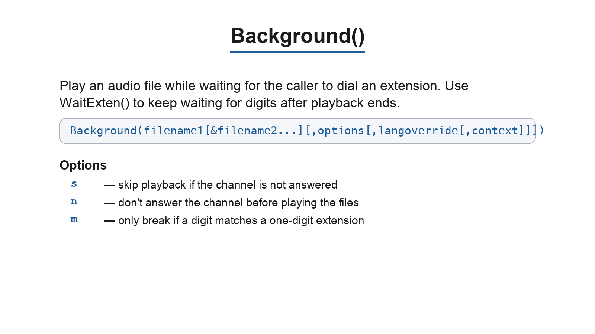

- 'format' is the format of the file type to be recorded (wav, gsm, etc).
- 'silence' is the number of seconds of silence allowed before returning.
- 'maxduration' is the maximum recording duration in seconds; if it is missing or zero, there is no maximum.
- 'options' may contain any of the following letters:
    - `a` — appends to an existing recording rather than replacing it
    - `n` — do not answer, but record anyway if the line is not yet answered
    - `q` — quiet (do not play a beep tone)
    - `s` — skips recording if the line is not yet answered
    - `t` — use the alternate `*` terminator key (DTMF) instead of the default `#`
    - `x` — ignore all terminator keys (DTMF) and keep recording until hang-up

If filename contains %d, these characters will be replaced with a number incremented by one each time the file is recorded. Use core show file formats to see the available formats on your system. The user can press # to terminate the recording and continue to the next priority. If the user hangs up during a recording, all data will be lost and the application will terminate.

### The Playback() application

This application plays back given filenames (do not include extension). Options may also be included following a pipe symbol. The 'skip' option causes the playback of the message to be skipped if the channel is not in the 'up' state (i.e., hasn't been answered yet).

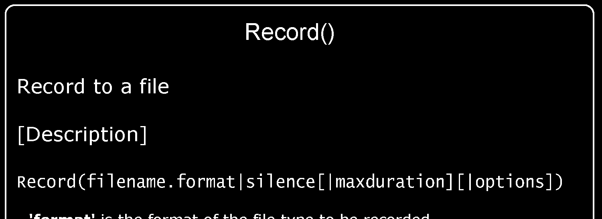

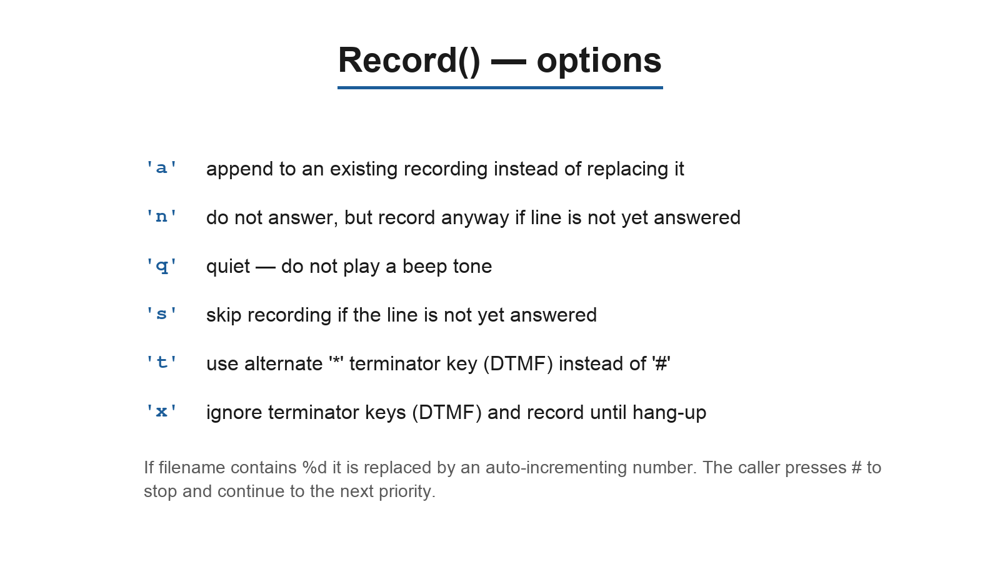

If 'skip' is specified, the application will return immediately should the channel not be off the hook. Otherwise, unless 'noanswer' is specified, the channel will be answered before the sound is played. Not all channels support playing messages while still on the hook. If 'j' is specified, the application will jump to priority n+101 when the file does not exist, if present. This application sets the following channel variable upon completion:

- PLAYBACKSTATUS — the status of the playback attempt as a text string, one of:
    - `SUCCESS`
    - `FAILED`

### The Read() application

This application reads a predetermined number of string digits, a certain number of times, from the user into the given variable.

- filename -- file to play before reading digits or tone with option i
- maxdigits -- maximum acceptable number of digits. Stops reading after maxdigits have been entered (without requiring the user to press the # key). Defaults to 0 - no limit - to wait for the user to press the # key. Any value below 0 means the same. The maximum accepted value is 255.

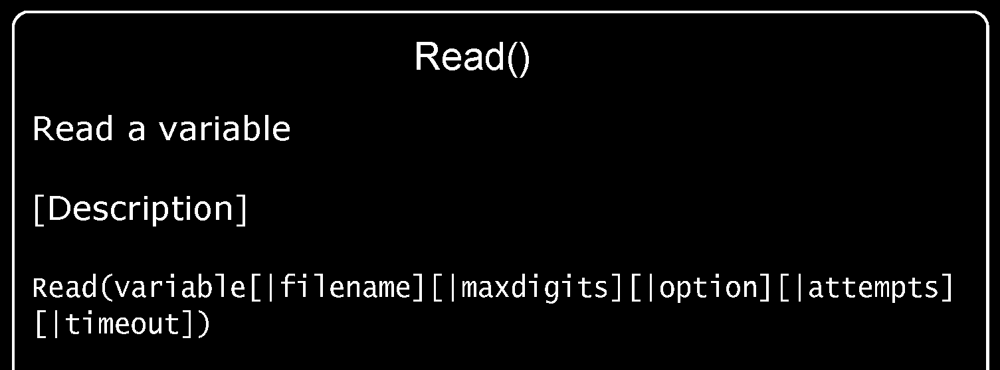

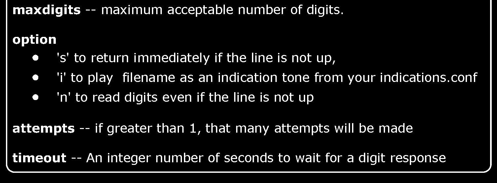

- option -- options are `s`, `i`, `n`:
    - `s` — return immediately if the line is not up
    - `i` — play filename as an indication tone from your `indications.conf`
    - `n` — read digits even if the line is not up
- attempts -- if greater than 1, the number of attempts that will be made in case no data are entered
- timeout -- An integer number of seconds to wait for a digit response. If greater than 0, that value will override the default timeout.

The read() application should disconnect if the function fails or errors out.

### The Gotoif() application

This application will cause the calling channel to jump to the specified location in the dial plan based on the evaluation of the given condition. The channel will continue at labeliftrue if the condition is true, or 'labeliffalse' if the condition is false. The labels are specified with the same syntax as that used within the Goto application. If the label chosen by the condition is omitted, no jump is performed; rather, the execution continues with the next priority in the dial plan.

### Lab: Building an IVR menu step-by-step

Let’s create an IVR menu with the following functionality. When dialed, the IVR plays back an audio file with the message “Welcome to the XYZ Corporation; press 1 for sales, 2 for tech support, 3 for training, or wait to speak to a representative.” The digits route the caller as follows:

- `1` — transfer to sales (PJSIP/4001)
- `2` — transfer to tech support (PJSIP/4002)
- `3` — transfer to training (PJSIP/4003)
- No digit pressed — transfer to the operator (PJSIP/4000)

**Step 1 – Record the prompts**

Let’s create an extension to record the prompts. To record a prompt, dial from a soft phone to `9003<filename>` (for example, `9003welcome`). When you hear the beep, start recording; press `#` to stop. You will hear a beep, and the system will play back the recorded prompt.

**Step 2 – Create the menu logic**

When dialing the 9004 extension, processing jumps to the menu in the `s` extension, priority 1.

### Matching as you dial

This is a company setup menu for receiving calls. The `Background()` application plays the welcome prompt and then waits for digits, matching what the caller dials against the extensions defined in the current context.

```
[incoming]
exten=>s,1,Background(welcome)
exten=>1,1,Dial(DAHDI/1)
exten=>2,1,Dial(DAHDI/2)
exten=>21,1,Dial(DAHDI/3)
exten=>22,1,Dial(DAHDI/4)
exten=>31,1,Dial(DAHDI/5)
exten=>32,1,Dial(DAHDI/6)
```

When you dial this company, the welcome message is played first. After that, Asterisk waits for a digit to be dialed:

| Dialed number | Asterisk action |
|---------------|-----------------|
| 1 | Immediately calls `Dial(DAHDI/1)` |
| 2 | Waits for the timeout, then calls `Dial(DAHDI/2)` |
| 21 | Immediately calls `Dial(DAHDI/3)` |
| 22 | Immediately calls `Dial(DAHDI/4)` |
| 3 | Waits for the timeout, then disconnects |
| 31 | Immediately calls `Dial(DAHDI/5)` |
| 32 | Immediately calls `Dial(DAHDI/6)` |

It is important to avoid ambiguity in the menus. Everybody wants to be answered quickly. For this reason, you should not use numbers 2, 21, or 22.

### Lab: Using the Read() application

Please try the lab with the read() application. Read accept digits from the user and inserts them into the specified variable; you can then use the gotoif application to redirect the call.

## Context inclusion

A context can include the contents of another context. In the example above, any channel can dial any extension in the internal context, but only the 4003 channel can dial international extensions. You can use context inclusion to make dial plan creation easier. Using context inclusion, you can control who has access to what extensions.

### Troubleshooting the message “number not found”

It is very common to receive the message “number not found”. Most people confuse the concept of included contexts because it is really not intuitive. As a rule of thumb, first go to the incoming channel configuration file, such as `pjsip.conf`, `chan_dahdi.conf`, and `iax.conf`, and determine the current context. Then, go to the dial plan in the file extensions.conf and check if the number dialed can be found in that context. If not, something is wrong with your dial plan. The golden rules of contexts are: 1. A channel can only dial numbers within the same context as the channel. 2. The context where the call is processed is defined in the incoming channel configuration file (`chan_dahdi.conf`, `iax.conf`, `pjsip.conf`).

## Using the switch statement

You can send the dial plan processing to another server using the switch command. You will need the name and key of the other server. The context is the destination context.

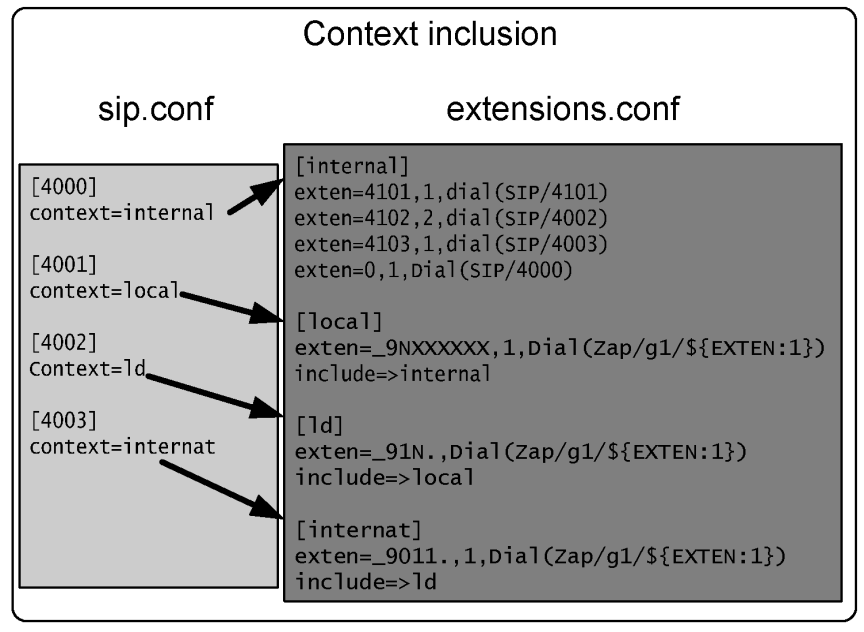

## Dial plan processing order

When Asterisk receives an incoming call, it looks in the context defined by the channel. In some cases, if more than one pattern matches the dialed number, Asterisk cannot process the call in the exact way you think it should. You can see the matching order using the dialplan show CLI command. Example: Let’s say that you want to dial 912 to route to an analog trunk (DAHDI/1) and all other numbers starting with 9 to another analog trunk (DAHDI/2). You would write something like:

```
[example]
exten=>_912.,1,Dial(DAHDI/1/${EXTEN})
exten=>_9.,1,Dial(DAHDI/2/${EXTEN})
```

If two patterns match an extension, you can control what extension is processed first using the included contexts. An included context is processed later than a pattern in the same context.

## The #INCLUDE statement

Should we use a big file or several files? You can use the #include <filename> statement to include other files in your extensions.conf. For example, we could create a users.conf for local users and services.conf for special services. Be careful to not confuse #include <filename> with the

```
include=>context statement.
```

## Subroutines with GOSUB

In older versions of Asterisk you had the command Macro. This command was deprecated a long time ago in favor of GOSUB. We will demonstrate here how to create subroutines for voicemail processing in an easy and ordered way. Command format:

```
gosub([[context,]exten,]priority[(arg1[,...][,argN])])
```

The command GOSUB has been available since Asterisk 1.6 and supports passing arguments (available inside the subroutine as `${ARG1}`, `${ARG2}`, and so on). With arguments, it is now possible to replace completely the old Macro commands. Macros (`app_macro`) were removed in Asterisk 21; you must use GOSUB for subroutines.

### Creating the subroutine

The definition is very similar. Look at the subroutine below defined for voicemail with the name stdexten (choose the name you like). After calling the command Dial with the first argument (name of the channel) we check the ${DIALSTATUS} to send the call logic to the next step.

```
[stdexten]
exten=>s,1,Dial(${ARG1},20,tT)
exten=>s,n,Goto(${DIALSTATUS})
exten=>s,n,hangup()
exten=>s,n(BUSY),voicemail(${ARG2},b)
exten=>s,n,hangup()
exten=>s,n(NOANSWER),voicemail(${ARG2},u)
exten=>s,n,hangup()
exten=>s,n(CANCEL),hangup
exten=>s,n(CHANUNAVAIL),hangup
exten=>s,n(CONGESTION),hangup
```

### Calling a subroutine

Pay attention when calling the subroutine to use parenthesis before the parameters.

```
exten=>6000,1,Gosub(stdexten,s,1(PJSIP/6000,${EXTEN}))
exten=>6001,1,Gosub(stdexten,s,1(PJSIP/6001,${EXTEN}))
exten=>6002,1,Gosub(stdexten,s,1(PJSIP/6002,${EXTEN}))
exten=>6003,1,Gosub(stdexten,s,1(PJSIP/6003,${EXTEN}))
```

## Using Asterisk DB

To implement call forward and black lists, we need some way to store and restore data. Fortunately, Asterisk provides a mechanism for storing and retrieving data from a built-in database called AstDB. In modern Asterisk (including Asterisk 22) AstDB is backed by **SQLite3** (the file `/var/lib/asterisk/astdb.sqlite3`); Asterisk 1.8 and earlier used Berkeley DB v1. This is similar to the Windows registry database using the family and keys hierarchical concept. The data persist between Asterisk restarts. The family/key API is unchanged from the older backend; only the on-disk storage format changed.

### Functions, applications, and CLI commands

There are some functions, applications, and CLI commands that work with AstDB:

- variable=${DB(<family/key>)}
- DB(<family/key>)=value
- DB_EXISTS(<family/key>)

Examples:

```
exten=_*21*XXXX,1,Set(DB(CFIM/${CALLERID(num)})=${EXTEN:4})
exten=s,1,Set(temp=${DB(CFIM/${EXTEN})})
```

Some applications can be used to manipulate AstDB:

- DB_DELETE(<family/key>) — function that returns and deletes a single key
- DBdeltree(<family>) — application that deletes a whole family/subtree

The old `DBdel()` application no longer exists in Asterisk 22. Delete a single key with the `DB_DELETE()` dialplan function — e.g. `Set(x=${DB_DELETE(family/key)})` or, as a write operation, `Set(DB_DELETE(family/key)=)`. `DBdeltree()` (delete a whole family/subtree) is still an application.

It is possible to use CLI commands to set and delete keys as well:

- database del
- database put
- database show <family[/key]>
- database showkey
- database deltree
- database get

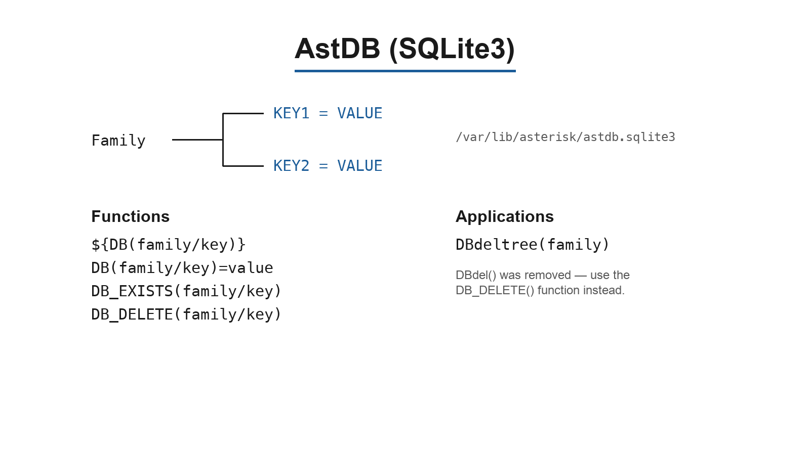

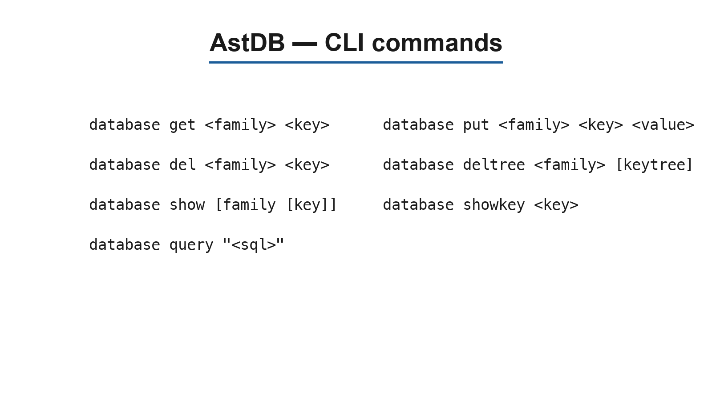

### Implementing Call Forward, DND, and Blacklists

In this example, you will learn how to implement call forward immediate and call forward on busy. We will use *21* to program call forward immediate and *61* to program call forward on busy status. To cancel the programming, use #21# and #61#, respectively. Use the above example to populate the database. Families used:

- CFIM – Call Forward Immediate
- CFBS – Call Forward on Busy status
- DND – Do Not Disturb

Try populating the database dialing:

- *21* (Destination extension for call forwarding immediate)
- *61* (Destination extension for call forwarding on busy status)
- *41* (Extension to put on do not disturb)

Use the CLI command database show to see the families, keys, and values added.

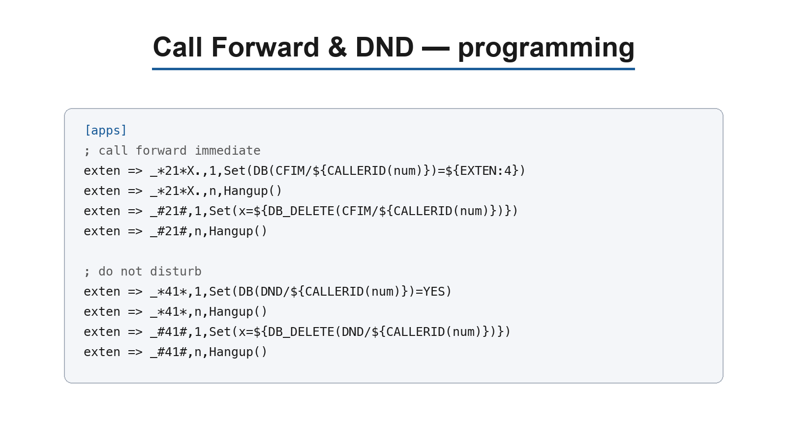

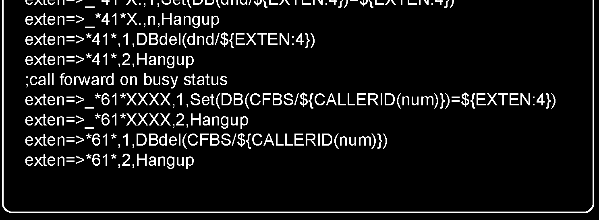

### Call Forward, Blacklist, DND

The subroutine verifies whether the database contains the key:value pairs corresponding to CFIM, CFBS, or DND, and then handles them appropriately. The following subroutine calls the dialing routine:

```
exten=_4XXX,1,gosub(stdexten,s,1(${EXTEN}))
```

## Using a blacklist

The old `LookupBlacklist()` application was **removed** from Asterisk (it disappeared together with the legacy "priority+101 jump" mechanism). In Asterisk 22 you build a blacklist directly with the `DB_EXISTS()` function (which both tests for a key and, when found, exposes its value in `${DB_RESULT}`) plus `GotoIf`. Store each blocked number as a key in a `blacklist` family, then check the caller ID at the top of your incoming context:

```
[incoming]
exten => s,1,GotoIf($[${DB_EXISTS(blacklist/${CALLERID(num)})}]?blocked,s,1)
exten => s,n,Dial(PJSIP/4000,20,tT)
exten => s,n,Hangup()
[blocked]
exten => s,1,Answer()
exten => s,2,Playback(blockedcall)
exten => s,3,Hangup()
```

`DB_EXISTS(blacklist/${CALLERID(num)})` returns `1` when the caller's number is present in the database (sending the call to the `blocked` context) and `0` otherwise, so the call proceeds to the normal `Dial()`.

To insert a number in the blacklist, we can use the same resource as before, using *31* followed by the extensions to be blacklisted. To remove a number from the blacklist, you should use #31# followed by the number to be removed.

```
[apps]
exten=>_*31*X.,1,Set(DB(blacklist/${EXTEN:4})=1)
exten=>_*31*X.,2,Hangup()
exten=>_#31#X.,1,Set(x=${DB_DELETE(blacklist/${EXTEN:4})})
exten=>_#31#X.,2,Hangup()
```

You can also insert the numbers in the blacklist using the console CLI:

```
*CLI>database put blacklist <name/number> 1
```

Note: Any value can be associated with the key. The `DB_EXISTS()` test searches for the key, not the value. To erase the number from the blacklist, you can use:

```
*CLI>database del blacklist <name/number>
```

## Time-based contexts

In the following figure, we have a dial plan with three contexts. The [incoming] context is where the calls are usually received. We have included four lines that change behavior depending on the system time, as exemplified below:

```
include => context,<times>,<weekdays>,<mdays>,<months>
```

Modern Asterisk (including 22) separates the time-include fields with **commas**, not pipes. The legacy pipe form (`include => context|times|weekdays|mdays|months`) is parsed as a plain literal context name and silently fails to apply any time condition.

During regular working hours, processing will be redirected to the mainmenu, where it will probably call an IVR to handle the incoming call. If the call takes place after hours, it will call the security extension defined in the ${SECURITY} variable. If the security extension does not answer the call, it will be sent to the operator’s voicemail.

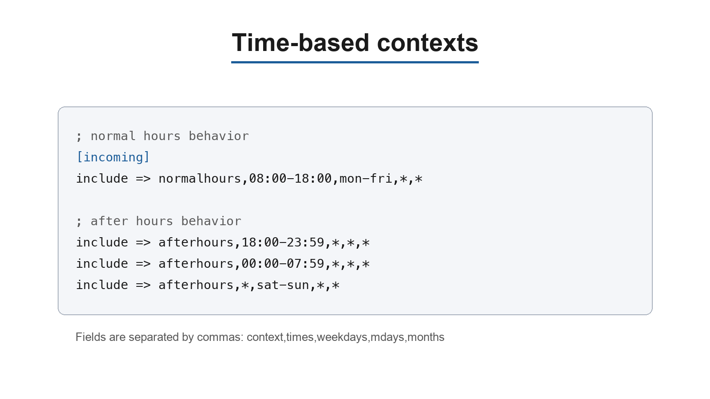

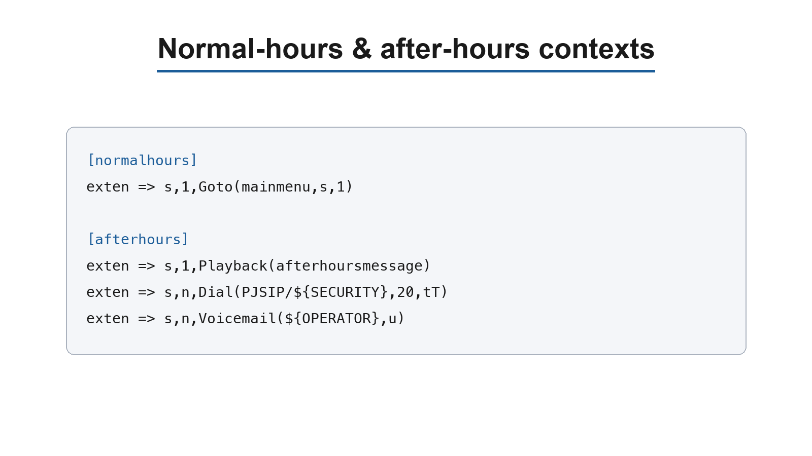

## Time-based messages using gotoiftime()

The GotoIfTime() syntax is shown below.

```
GotoIfTime(times,weekdays,mdays,months[,timezone]?[labeliftrue][:labeliffalse])
```

In Asterisk 22 the field separator is a **comma**, not a pipe (the pipe form was deprecated in Asterisk 1.6). An optional `timezone` field is supported, and each branch label uses the usual `[[context,]extension,]priority` form.

This application can replace the time-based context and seems easier to understand and read. You can specify the time as follows:

- <timerange>=<hour>':'<minute>'-'<hour>':'<minute> |"*"
- <daysofweek>=<dayname>|<dayname>'-'<dayname>|"*"
- <dayname>="sun"|"mon"|"tue"|"wed"|"thu"|"fri"|"sat"
- <daysofmonth>=<daynum>|<daynum>'-'<daynum> |"*"
- <daynum>=number from 1 to 31
- <hour>=number from 0 to 23
- <minute>=number from 0 to 59
- <months>=<monthname>|<monthname>'-'<monthname>|"*"
- <monthname>="jan"|"feb"|"mar"|"apr"|"may"|"jun"|"jul"|"aug"|"sep"|"oct"|"nov"|"dec"

Names for days and months are not case sensitive.

```
exten=>s,1,GotoIfTime(8:00-18:00,mon-fri,*,*?normalhours,s,1)
```

The previous statement transfers the processing to the extension s in the normalhours context if the call is between 08:00AM and 06:00PM from Monday to Friday.

## Using DISA to get a new dial tone

DISA, or “direct inward system access,” is a system that allows users to receive a second dial tone. It permits users to dial again to another destination. It is often used by technicians when dialing long distance calls for technical support on weekends; instead of dialing from their homes directly to the destination, they call the office’s DISA number, receive a dial tone, and then call the destination. Long-distance charges incur at the company instead of the home phone.

```
DISA(passcode|filename[,context[,cid[,mailbox[@context][,options]]]])
```

Example:

```
exten => s,1,DISA(no-password,default)
```

Using the previous statement, the user dials the PBX and—without requiring any password—receives a dial tone. Any call using DISA will be processed using the `default` context. The arguments for this application include a global password or individual password within a file. If no context is specified, the `disa` context is assumed. If you use a password file, the complete path has to be specified. A caller ID can be specified for the DISA external dialing too. Example:

```
exten => s,1,DISA(numeric-passcode,default,"Flavio" <4830258590>)
```

Asterisk 22 uses commas as argument separators (the pipe form was deprecated in 1.6). The first argument is either a single passcode or the path to a passcode file, and the default context when none is given is `disa`.

## Limit simultaneous calls

The GROUP() function allows you to count how many active channels you have in one group at the same time. Example: You have a branch in Rio de Janeiro, where phones follow the pattern “_214X”. This location is served by a leased line, with 64K reserved for voice bandwidth. In this case, the maximum number of allowed calls is 2 (G.729, about 31.2K per call). To limit calls to Rio by two:

```
exten=>_214X,1,set(GROUP()=Rio)
exten=>_214X,n,Gotoif($[${GROUP_COUNT()} > 1]?outoflimit)
exten=>_214X,n,Dial(PJSIP/${EXTEN})
exten=>_214X,n,hangup
exten=>_214X,n(outoflimit),playback(callsexceedcapacity)
exten=>_214X,n,hangup
```

## Voicemail

Voicemail is a computerized telephone answering system that records incoming voice messages, saving them on disk or sending them via e-mail. Sometimes it has a directory where you can look up voicemail boxes by name. In the past, voicemail systems were very expensive. Now, with IP telephony, voicemail is becoming a standard feature.

To configure voicemail, you should go through the following steps.

**Step 1: Edit `voicemail.conf` and set the general parameters.**

- `format` — codec used to record the message (e.g., wav49, wav, gsm)
- `serveremail` — who the e-mail notification should appear to come from
- `maxmsg` — maximum number of messages in the mailbox; after this threshold, messages are discarded
- `maxsecs` — maximum length of a voicemail message, in seconds
- `minsecs` — minimum length of a message, in seconds; below this threshold, no message is recorded
- `maxsilence` — how many seconds of silence to treat as the end of the message

**Step 2: Edit `voicemail.conf` and create the users’ mailboxes.**

### Voicemail.conf

A mailbox is defined with one line per mailbox, in the form:

```
mailboxID => pincode,fullname,email,pager-email,options
```

The fields are:

- **MailboxID** — usually the extension number
- **Pincode** — password to access the voicemail system
- **Full name** — used by the directory application
- **E-mail** — address for voicemail notification
- **Pager e-mail** — address for notification via an SMS gateway or pager
- **Options** — per-mailbox options (the same options as in `[general]`, but applied to this mailbox)

Voicemail has several options that control its behavior. For now, we will stick to the default options and concentrate on the mailbox definition. After the `[general]` section in the file, you start configuring the mailbox IDs, each in its own context. Example:

```
[general]
[default]
1234=>1234,SomeUser,email@address.com,pager@address.com,saycid=yes|dialout=fromvm|callback=fromvm|review=yes|operator=yes
```

Please check for advanced options in the file `voicemail.conf`.

**Step 3: Configure the file `extensions.conf`.**

The `stdexten` subroutine shown earlier (under *Subroutines with GOSUB*) is exactly the call/voicemail handler you need here: it dials the extension and uses the value of the channel variable `${DIALSTATUS}` to redirect the call flow to the proper voicemail greeting (`b` for busy, `u` for unavailable). Call it with `Gosub(stdexten,s,1(PJSIP/<device>,<mailbox>))` from each extension in `extensions.conf`.

## Using the VoiceMailMain() application

The application voicemailmain() is used to configure the voicemail mailbox. Users can dial the application, record their greeting, and listen to their voicemail. To call the application in the dial plan, use:

```
exten=>9000,1,VoiceMailMain()
```

Below you will find a list of the options available for the application.

### Voicemail application syntax

This application allows the calling party to leave a message for a specified list of mailboxes. When multiple mailboxes are specified, the greeting will be taken from the first specified mailbox. The dial plan execution will stop if the specified mailbox does not exist. The syntax is shown below:

```
 [Synopsis]
Leave a Voicemail message.
[Description]
This application allows the calling party to leave a message for the specified
list of mailboxes. When multiple mailboxes are specified, the greeting will
be taken from the first mailbox specified. Dialplan execution will stop if
the specified mailbox does not exist.
The Voicemail application will exit if any of the following DTMF digits are
received:
    0 - Jump to the 'o' extension in the current dialplan context.
    * - Jump to the 'a' extension in the current dialplan context.
This application will set the following channel variable upon completion:
${VMSTATUS}: This indicates the status of the execution of the VoiceMail
application.
    SUCCESS
    USEREXIT
    FAILED
[Syntax]
VoiceMail(mailbox[@context][&mailbox[@context][&...]][,options])
[Arguments]
options
```

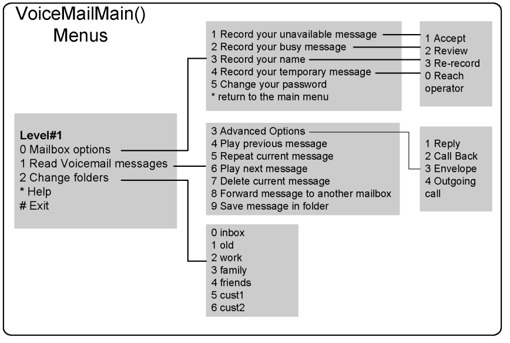

```
    b: Play the 'busy' greeting to the calling party.
    d([c]): Accept digits for a new extension in context <c>, if played
    during the greeting. Context defaults to the current context.
    g(#): Use the specified amount of gain when recording the voicemail
    message. The units are whole-number decibels (dB). Only works on supported
    technologies, which is DAHDI only.
    s: Skip the playback of instructions for leaving a message to the
    calling party.
    u: Play the 'unavailable' greeting.
    U: Mark message as 'URGENT'.
    P: Mark message as 'PRIORITY'.
```

In all cases, the beep.gsm file will be played before the recording begins. Voicemail messages will be stored in the inbox directory.

```
/var/spool/asterisk/voicemail/context/boxnumber/INBOX/
```

If a caller presses 0 (zero) during the announcement, it will be moved to the ‘o’ (out) extension in the voicemail current context. This can be used to exit to the operator. If during the recording the caller presses # or the silence limit times out, recording is stopped and the call goes to the next priority. Make sure that you handle the call after the voicemail is played, as shown below.

```
exten=>somewhere,5,Playback(Goodbye)
exten=>somewhere,6,Hangup
```

### Tagging voicemail messages as urgent

You may tag some messages as “urgent.” Two methods are available for this:

- Pass the option ‘U’ in the application voicemail()
- Specify review=yes in the file voicemail.conf. If using this option, the user will be able to tag the message as urgent after recording the voice instructions.

## Sending voicemail to e-mail

In some cases (like mine), we simply do not use the voicemailmain() application to read e-mail. It is simpler and more practical to send all messages to e-mail with the audio attached. Using the parameters ‘attach’ and ‘delete’, you can send all mails to e-mail and delete them from the mailbox.

```
attach=yes
delete=yes
```

To send voicemail to e-mail, the voicemail application uses the message transfer agent (MTA), a component of your operating system. Debian uses Exim as the MTA. The application that sends the e-mail is defined in the ‘mailcmd’ parameter.

```
mailcmd =/usr/sbin/sendmail -t
```

In the Debian distribution of Linux, the MTA is Exim. To configure Exim in Debian, use:

```
dpkg-reconfigure exim4-config
```

You can choose to make your MTA send an e-mail directly through SMTP or a smarthost (usually your company’s mail server). Verify with your e-mail administrator the best way to send e-mail from the Asterisk server to your e-mail server.

## Customizing the e-mail message

You can control how messages are sent by setting up the following variables: Variables for e-mail subject and e-mail body:

- VM_NAME
- VM_DUR
- VM_MSGNUM
- VM_MAILBOX
- VM_CIDNUM
- VM_CIDNAME
- VM_CALLERID
- VM_DATE

The e-mail body and subject are built from a template that you set in the `[general]` section of `voicemail.conf`. You can modify both the body and the subject, but the size limit of the message is 512 bytes. In the template, `\n` inserts a newline and `\t` inserts a tab.

The `emailsubject` example below is straightforward. The `emailbody` example is very close to the default; the default shows just the CIDNAME when it is not null, otherwise the CIDNUM, or "an unknown caller" when both are null.

```
emailsubject=[PBX]: New message ${VM_MSGNUM} in mailbox ${VM_MAILBOX}

emailbody=Dear ${VM_NAME}:\n\n\tjust wanted to let you know you were just left a ${VM_DUR} long message (number ${VM_MSGNUM})\nin mailbox ${VM_MAILBOX} from ${VM_CALLERID}, on ${VM_DATE}, so you might\nwant to check it when you get a chance. Thanks!\n\n\t\t\t\t--Asterisk\n
```

## Voicemail Web interface

There is a Perl script in the source distribution called `vmail.cgi`, located at `contrib/scripts/vmail.cgi` in the Asterisk source tree (it still ships with Asterisk 22). The command `make install` does not install this interface; you must run `make webvmail` from the source directory. This script requires the Perl command interpreter and a web server (such as Apache) to be installed on the server.

```
make webvmail
```

The `make webvmail` target installs the script (setuid root) into your web server's CGI directory (`HTTP_CGIDIR`) and copies the supporting images from `images/*.gif` into `HTTP_DOCSDIR/_asterisk` (by default `/var/www/html/_asterisk`). If those paths do not match your web server layout, edit the `HTTP_CGIDIR` and `HTTP_DOCSDIR` variables in the top-level `Makefile` before running the target.

## Voicemail notification

You can configure voicemail to send a notify message to your phone when you have new voicemail. In Asterisk 22, Message Waiting Indication (MWI) works with PJSIP and SIP phones as well as DAHDI phones. To indicate an unheard voicemail, an indicator light may blink or the phone may play a shutter tone. You need to configure the mailbox in the corresponding channel configuration file. Example: `pjsip.conf` (in the endpoint section):

```
mailboxes=8590
```

In PJSIP the mailbox hint is set with the `mailboxes` option inside the endpoint section of `pjsip.conf`, rather than the old `mailbox=` of `sip.conf`. MWI subscriptions are handled by the `res_pjsip_mwi` module.


### Lab: Message Notification in the Phone

This lab was tested using a SIP softphone.

1. Edit `pjsip.conf` and add `mailboxes=4401` in the endpoint section for the device named 4401.
2. Edit the `extensions.conf` and create an extension to record a voicemail to 4401 extensions.

```
exten=9008,1,voicemail(4401,b)
```

3. Go to the console and reload.
4. In the SipPulse Softphone, open the SIP account settings and enable voicemail (message-waiting) checking for the account.
5. Dial 9008 and leave a message.
6. Observe the message icon on the phone.

## Using the directory application

This application allows you to quickly find a user to dial. The list of names and corresponding extensions are retrieved from the voicemail configuration file voicemail.conf. Syntax for the application can be shown using core show application directory:

```
-= Info about application 'Directory' =-
[Synopsis]
Provide directory of voicemail extensions.
[Description]
This application will present the calling channel with a directory of
extensions from which they can search by name. The list of names and
corresponding extensions is retrieved from the voicemail configuration file,
"voicemail.conf".
This application will immediately exit if one of the following DTMF digits
are received and the extension to jump to exists:
'0' - Jump to the 'o' extension, if it exists.
'*' - Jump to the 'a' extension, if it exists.
[Syntax]
Directory([vm-context][,dial-context[,options]])
[Arguments]
vm-context
    This is the context within voicemail.conf to use for the Directory.
    If not specified and 'searchcontexts=no' in "voicemail.conf", then
    'default' will be assumed.
dial-context
    This is the dialplan context to use when looking for an extension
    that the user has selected, or when jumping to the 'o' or 'a' extension.
options
    e: In addition to the name, also read the extension number to the
    caller before presenting dialing options.
    f(n): Allow the caller to enter the first name of a user in the
    directory instead of using the last name.  If specified, the optional
    number argument will be used for the number of characters the user should
    enter.
    l(n): Allow the caller to enter the last name of a user in the
    directory.  This is the default.  If specified, the optional number
    argument will be used for the number of characters the user should enter.
    b(n):  Allow the caller to enter either the first or the last name
    of a user in the directory.  If specified, the optional number argument
    will be used for the number of characters the user should enter.
    m: Instead of reading each name sequentially and asking for
    confirmation, create a menu of up to 8 names.
    p(n): Pause for n milliseconds after the digits are typed.  This
    is helpful for people with cellphones, who are not holding the receiver
    to their ear while entering DTMF.
    NOTE: Only one of the <f>, <l>, or <b> options may be specified.
    *If more than one is specified*, then Directory will act as  if <b> was
    specified.  The number of characters for the user to type defaults to
    '3'.
```

### Lab: Using the directory application

1. Edit the voicemail.conf file to add two extensions in the dial plan

```
[default]
; Define maximum number of messages per folder for a particular context.
;maxmsg=50
4400=>4400,Clint Eastwood,ceastwood@voip.school
4401=>4401,John Wayne,jwayne@voip.school
```

2. Create these extensions in your dial plan

```
exten=9006,1,VoiceMailMain()
exten=9006,n,Hangup()
exten=9007,1,Directory(default,default)
exten=9007,n,Hangup()
```

3. Go to the console and reload
4. Dial 9006 and record a name for each extension (4400, 4401)
5. Dial 9007 and select the three letters of the last name for one extension (Eas=327). If this is the correct option, press ‘1’ to transfer to the name.

## Lab: Putting it all together

Thus far, you have learned several dial plan concepts. Let’s put all the applications, functions, and concepts in a dial plan example so you can understand how they are used together. Let’s guide you through the whole PBX configuration for the scenario below.

- 4 analog trunks
- 16 SIP-based extensions
- 3 service classes:
    - restrict (internal, local, and 1-800)
    - ld (long distance)
    - ldi (international)
- After-hours message
- Auto attendant

### Step 1 – Configuring channels

**Analog trunks (`chan_dahdi.conf`).** First, we will configure the analog trunks in the DAHDI channel configuration file `chan_dahdi.conf`. In this case, we will use a T400P Digium card with 4 FXO interfaces. Let’s assume that the driver is already loaded and the driver configuration file (/etc/dahdi/system.conf) is correctly configured.

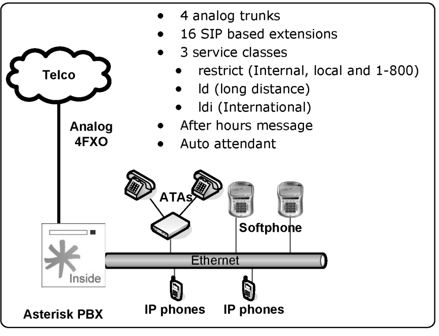

```
signalling=fxs_ks
language=en
context=incoming
group=1
channel => 1-4
```

**SIP channels (`pjsip.conf`).** We have chosen the dial plan numbering from 2000 to 2099. Two codecs will be used: G.729 and G.711 ulaw. The first one will be used for phones using Asterisk over the Internet or WAN while the second one will be used for phones using the local network. In `pjsip.conf`, we will arbitrate which devices will belong to each class of service (restrict, ld, ldi). To reduce the vulnerability to brute force attacks, we will use the phone’s MAC addresses as device names. I strongly advise that you use strong passwords to avoid brute force attacks!

We define a transport and three reusable templates — an endpoint base with the
shared codecs, a digest auth, and a single-contact AOR — then attach each device
to the templates and override only what differs (its class-of-service context and
credentials). `host=dynamic` becomes an AOR that the phone registers against, and
`directmedia` becomes `direct_media`:

```ini
; pjsip.conf
[transport-udp]
type=transport
protocol=udp
bind=0.0.0.0:5060

[endpoint-base](!)
type=endpoint
disallow=all
allow=ulaw,gsm
direct_media=yes

[auth-digest](!)
type=auth
auth_type=digest

[aor-single](!)
type=aor
max_contacts=1

[00001A000002](endpoint-base)
context=restrict
auth=00001A000002
aors=00001A000002
mailboxes=20
[00001A000002](auth-digest)
username=00001A000002
password=#s2cr2t#
[00001A000002](aor-single)

[00001A000003](endpoint-base)
context=ld
dtmf_mode=rfc4733
auth=00001A000003
aors=00001A000003
mailboxes=20
[00001A000003](auth-digest)
username=00001A000003
password=#s3cr3t#
[00001A000003](aor-single)

[00001A000004](endpoint-base)
context=ldi
dtmf_mode=rfc4733
auth=00001A000004
aors=00001A000004
mailboxes=20
[00001A000004](auth-digest)
username=00001A000004
password=#s3cr3t#
[00001A000004](aor-single)
```

### Step 2 – Configure the dial plan

Now let’s start to configure the extensions.conf. Define internal extensions and local dialing

```
[restrict]
exten=>_2000,1,Dial(PJSIP/00001A000002,20,t)
exten=>_2030,1,Dial(PJSIP/00001A000003,20,t)
exten=>_2040,1,Dial(PJSIP/00001A000004,20,t)
exten=>_9XXXXXXX,1,Dial(DAHDI/g1/${EXTEN:1},20) ; local calls
exten=>_91800.,1,Dial(DAHDI/g1/${EXTEN:1},20); 1-800
```

Define LD (long distance)

```
[ld]
Include=>restrict
exten=>_9NXXNXXXXXX,1,Dial(DAHDI/g1/${EXTEN:1},20)
```

Define international calls

```
[ldi]
include=>ld
exten=>_901X.,1,Dial(DAHDI/g1/${EXTEN:1},20)
```

### Step 3 - Receiving calls using an auto-attendant

To receive calls, use two contexts. The first one is for normal-hours operation, where the call will be received by an auto-attendant. The second one is for after hours, where the caller will receive a message such as “you have called company XYZ, our normal hours are from 08:00 AM to 06:00 PM; if you know the destination extension number you can try dialing it now or hang up.” Menus: Normal-hours, After-hours In the menus below, the system will play a message warning the caller that the company was reached after regular working hours, allowing the caller to dial the destination extension number (someone may be working after regular working hours).

```
[incoming]
include=>normalhours,08:00-18:00,mon-fri,*,*
include=>afterhours,18:00-23:59,*,*,*
include=>afterhours,00:00-07:59,*,*,*
include=>afterhours,*,sat-sun,*,*
[normalhours]
exten=>s,1,Goto(mainmenu,s,1)
[afterhours]
exten=>s,1,Background(afterhours)
exten=>s,2,hangup()
exten=>i,1,hangup()
exten=>t,1,hangup()
include=>restrict
```

Menus: Main and Sales During normal working hours, the call is answered by an auto-attendant menu, receiving a message such as “welcome to XYZ Company; dial 1 for sales, 2 for tech support, 3 for training, or the desired extension number”.

```
[globals]
OPERATOR=PJSIP/2060
SALES=PJSIP/2035
TECHSUPPORT=PJSIP/2004
TRAINING=PJSIP/2036
[mainmenu]
exten=> s,1,Background(welcome)
exten=>1,1,Goto(sales,s,1)
exten=>2,1,Goto(techsupport,s,1)
exten=>3,1,Goto(training,s,1)
exten=>i,1,Playback(Invalid)
exten=>i,2,hangup()
exten=>t,1,Dial(${OPERATOR},20,Tt)
include=>restrict
[sales]
exten=>s,1,Dial(${SALES},20,Tt)
[techsupport]
exten=>s,1,Dial(${TECHSUPPORT},20,Tt)
[training]
exten=>s,1,Dial(${TRAINING},20,Tt)
```

With all these statements, the functionality of your dialing plan is now ready. In the next section, we will demonstrate how to operate the PBX.

## Summary

In this chapter, you have learned how to receive calls using an IVR or an auto-attendant. You have studied the concept of context inclusion and implemented a few examples. subroutines were used to avoid repetitive typing, and the Asterisk database (AstDB, backed by SQLite3 in Asterisk 22) was used for functions that require data storage (e.g., call forward, do not disturb, blacklists). Finally, you have learned how to implement after-hours behavior and implemented a complete dial plan using these concepts.

## Quiz

1. A time-dependent context include uses the form `include => context,<times>,<weekdays>,<mdays>,<months>`. What does `include => normalhours,08:00-18:00,mon-fri,*,*` do?
   - A. Execute the extensions Monday to Friday, 08:00 to 18:00
   - B. Execute the options every day in all months
   - C. Nothing; the format is invalid
2. In modern Asterisk (including Asterisk 22), the fields of a time-based `include =>` and of `GotoIfTime()` are separated by which character?
   - A. The pipe `|`
   - B. The comma `,`
   - C. The semicolon `;`
   - D. The slash `/`
3. To dial several channels at once (ringing them simultaneously), you separate them inside `Dial()` with the ___ character.
4. A voice menu that plays a prompt while waiting for the caller to dial an extension is usually created with the ___ application.
5. You can include the contents of another file inside `extensions.conf` using the ___ statement (note: this is different from the `include =>` context statement).
6. In Asterisk 22, the built-in AstDB database is backed by:
   - A. Berkeley DB v1
   - B. MySQL
   - C. SQLite3
   - D. PostgreSQL
7. When you use `Dial(type1/identifier1&type2/identifier2)`, Asterisk dials each channel in sequence, waiting 20 seconds between them.
   - A. False
   - B. True
8. With the Background() application, you must wait until the message finishes playing before you can press a DTMF digit to choose an option.
   - A. False
   - B. True
9. Given the syntax `Goto([[context,]extension,]priority)`, which of the following are valid invocations of the Goto() application? (mark all that apply)
   - A. Goto(context,extension)
   - B. Goto(context,extension,priority)
   - C. Goto(extension,priority)
   - D. Goto(priority)
10. To delete a single key from AstDB in the Asterisk 22 dial plan, you use:
    - A. The `DBdel()` application
    - B. The `DB_DELETE()` function
    - C. The `DBdeltree()` application
    - D. The `LookupBlacklist()` application

**Answers:** 1 — A · 2 — B · 3 — `&` · 4 — Background() · 5 — #include · 6 — C · 7 — A · 8 — A · 9 — B, C, D · 10 — B
