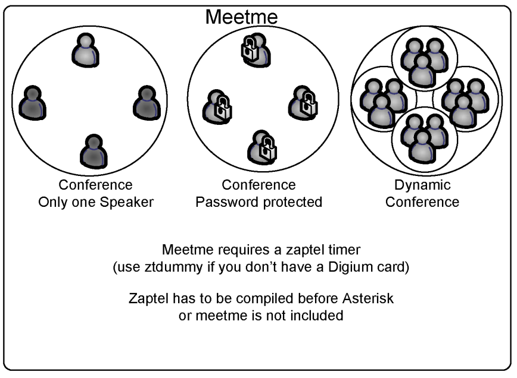

# Using PBX features

In SIP systems, most of the phone features are implemented in the endpoint. A variety of SIP phones and manufacturers exist, and the interoperability is not guaranteed. The Asterisk development team has done an amazing job of implementing most of the features in the PBX itself, making Asterisk almost endpoint independent. However, sometimes you will find the same function being done by both the phone and Asterisk itself. The integration of the phone and the PBX is the next frontier on usability and where proprietary systems are focusing right now. In this chapter, you will learn how to use most of these features.

## Objectives

By the end of this chapter, you will be able to understand and use:

- Call Parking
- Call Pickup
- Call Transfer
- Call Conference (ConfBridge)
- Call Recording
- Music on hold

## Where features are implemented

First and foremost, it is important to understand when the PBX features are being executed versus when the phone is doing all the work. For example, you may transfer a call using the TRANSFER button on the phone or by dialing # (unconditional transfer executed by the PBX itself).

## Features implemented by Asterisk

These features are implemented in the PBX by the Asterisk code:

- Music on hold
- Call parking
- Call pickup
- Call recording
- ConfBridge conference room
- Call transfer (blind and consultative)

## Features usually implemented by the dial plan

These features need to be programmed in the Asterisk dial plan (extensions.conf):

- Call forward on busy
- Call forward immediate
- Call forward on unanswered
- Call filtering (blacklist)
- Do not disturb
- Redial

## Features usually implemented by the phone

These features are implemented by the phone’s firmware:


- Call on hold
- Blind transfer
- Consultative transfer
- Three-way conference
- Message waiting indicator

## The features configuration file

Some of the features presented in this chapter are configured in the features.conf configuration file. It is possible to change the behavior of some features by modifying this file. We have included the relevant excerpt below. In the next sections of this chapter, we will describe each feature. Excerpt from the sample file (Asterisk 22)

![The `[featuremap]` section of features.conf, with the default DTMF feature codes](../images/13-pbx-features-fig02.png)

> **[2nd-ed note]** As of Asterisk 12+, call parking was moved out of features.conf/app_features into its own module `res_parking` with configuration in `res_parking.conf` (also referred to as `parking.conf`). The `[general]` parking block below (parkext, parkpos, context, parkingtime, etc.) should be updated to show `res_parking.conf` syntax. The `[featuremap]` section remains in `features.conf`.

```
[general]
parkext => 700                  ; What extension to dial to park        (all parking lots)
parkpos => 701-720              ; What extensions to park calls on. (defafult parking lot)
                                ; These needs to be numeric, as Asterisk starts from the start
position
                                ; and increments with one for the next parked call.
context => parkedcalls          ; Which context parked calls are in (default parking lot)
;parkinghints = no              ; Add hints priorities automatically for parking slots (default is
no).
;parkingtime => 45              ; Number of seconds a call can be parked for
                                ; (default is 45 seconds)
;comebacktoorigin = yes ; Whether to return to the original calling extension upon parking
                                ; timeout or to send the call to context 'parkedcallstimeout' at
                                ; extension 's', priority '1' (default is yes).
;courtesytone = beep            ; Sound file to play to the parked caller
                                ; when someone dials a parked call
                                ; or the Touch Monitor is activated/deactivated.
;parkedplay = caller            ; Who to play the courtesy tone to when picking up a parked call
                                ; one of: parked, caller, both  (default is caller)
;parkedcalltransfers = caller   ; Enables or disables DTMF based transfers when picking up a parked
call.
                                ; one of: callee, caller, both, no (default is no)
;parkedcallreparking = caller   ; Enables or disables DTMF based parking when picking up a parked
call.
                                ; one of: callee, caller, both, no (default is no)
;parkedcallhangup = caller      ; Enables or disables DTMF based hangups when picking up a parked
call.
                                ; one of: callee, caller, both, no (default is no)
;parkedcallrecording = caller   ; Enables or disables DTMF based one-touch recording when picking up a
parked call.
                                ; one of: callee, caller, both, no (default is no)
;adsipark = yes                 ; if you want ADSI parking announcements
;findslot => next               ; Continue to the 'next' free parking space.
                                ; Defaults to 'first' available
;parkedmusicclass=default       ; This is the MOH class to use for the parked channel
                                ; as long as the class is not set on the channel directly
                                ; using Set(CHANNEL(musicclass)=whatever) in the dialplan
;transferdigittimeout => 3      ; Number of seconds to wait between digits when transferring a call
                                ; (default is 3 seconds)
;xfersound = beep               ; to indicate an attended transfer is complete
;xferfailsound = beeperr        ; to indicate a failed transfer
;pickupexten = *8               ; Configure the pickup extension. (default is *8)
;featuredigittimeout = 1000     ; Max time (ms) between digits for
                            ; feature activation  (default is 1000 ms)
;atxfernoanswertimeout = 15 ; Timeout for answer on attended transfer default is 15 seconds.
;atxferdropcall = no        ; If someone does an attended transfer, then hangs up before the
transferred
                            ; caller is connected, then by default, the system will try to call back
the
                            ; person that did the transfer.  If this is set to "yes", the callback
will
                            ; not be attempted and the transfer will just fail.
;atxferloopdelay = 10       ; Number of seconds to sleep between retries (if atxferdropcall = no)
;atxfercallbackretries = 2  ; Number of times to attempt to send the call back to the transferer.
                            ; By default, this is 2.
; Note that the DTMF features listed below only work when two channels have answered and are bridged
;together. They can not be used while the remote party is ringing or in progress. If you require this
feature you can use
; Local/ channels in combination with Answer to accomplish it.
[featuremap]
;blindxfer => #1                ; Blind transfer  (default is #) -- Make sure to set the T and/or t
option in the Dial() or Queue() app call!
;disconnect => *0               ; Disconnect  (default is *) -- Make sure to set the H and/or h option
in the Dial() or Queue() app call!
;automon => *1                  ; One Touch Record a.k.a. Touch Monitor -- Make sure to set the W
and/or w option in the Dial() or Queue() app call!
;atxfer => *2                   ; Attended transfer  -- Make sure to set the T and/or t option in the
Dial() or Queue()  app call!
;parkcall => #72        ; Park call (one step parking)  -- Make sure to set the K and/or k option in
the Dial() app call!
;automixmon => *3               ; One Touch Record a.k.a. Touch MixMonitor -- Make sure to set the X
and/or x option in the Dial() or Queue() app call!
```

## Call Transfer

Call transfer can be implemented by the phone, by ATA, or by Asterisk itself. Refer to your phone manual to understand how calls are transferred. If your phone does not support call transfer, you can use Asterisk to accomplish this task. Call transfer is implemented in two different ways. The first way is to use the blind transfer feature: dial # followed by the number to be transferred. Sometimes you will use the transfer feature of your IP phone or IP soft phone. You can change the transfer character by editing the blindxfer parameter in the features.conf file. You can enable assisted transfer in Asterisk by removing the ; before the atxfer parameter in the features.conf file. During a conversation, you would press *2. Asterisk will say “transfer” and will give you a dial tone. The caller is sent to music on hold. After you speak to the destination person and hang up the phone, the system bridges the caller to the destination.


### Configuration task list

1. If the phone is SIP based, make sure that the option directmedia is equal to no or use a t or T option in the dial() application

## Call parking

This feature is used to park a call. This helps, for example, when you are answering a phone call outside of your room and you want to transfer the call back to your desk. You may accomplish this by parking the call in an extension. Once you reach your desk, simply dial the number of the parking extension to recover the call.


By default, the 700 extension is used to park a call. In the middle of a conversation, press # to transfer the call to the 700 extension. Now the Asterisk will announce your parking extension, such as 701 or 702. Hang up the phone, and the caller will be placed on hold. Go to your desk phone and dial the announced parking extension to recover the call. If the caller is parked for a long time, the timeout feature will trigger and the original dialed extension will ring again.

### Configuration task list

Follow the steps below to enable call parking. Step 1: Enable call parking: (required) In the extensions.conf file, type the following statement.

```
include=>parkedcalls
```

Step 2: Test the call parking feature by dialing #700. Notes:

- The parking extension won’t be shown in the dialplan show CLI command.
- It is necessary to reload the parking module after changing the parking configuration file: `module reload res_parking.so`. For features.conf changes, `module reload features.so`.
- To park a call, you need to transfer to #700. Verify the options t and T in the dial() application.

## Call pickup

Call pickup allows you to capture a call from a colleague in the same call group. This would help avoid, for example, having to wake up to take a call that is ringing to another person in your room, but who is not present. By dialing *8, you can capture a call within your call group. This number can be modified in the

```
features.conf file.
```


### Configuration task list

Follow the steps below to configure the call pickup feature. Step 1: Configure a call group for your extensions. This is done in the channel configuration file (pjsip.conf, iax.conf, chan_dahdi.conf). For PJSIP endpoints, set `call_group` and `pickup_group` in the endpoint section of `pjsip.conf` (pjsip.conf uses snake_case option names). This task is required.

For PJSIP (pjsip.conf):
```
[4x00]
type=endpoint
call_group=1
pickup_group=1,2
```


Step 2: Change the call-pickup feature number (optional).

```
pickupexten=*8; Configures the call pickup extension
```

## Conference (call conference)

There are different ways to implement a conference on Asterisk. The first option is simply to use the three-way conference capability of the phone. By using this feature in the phone you do not require any support in the server itself. However, when you want a conference with more than 3 people, you should run a conference room. Asterisk's modern conference application is ConfBridge (`app_confbridge`).

ConfBridge supports HD voice conferences and video conferencing. There are some limitations for videoconference such as no transcoding — all participants have to use the same codec and profile. The videoconference uses a follow-the-talker mode, displaying the image of the last person to speak. You may easily configure new DTMF menus in ConfBridge.

> **[2nd-ed note]** MeetMe (`app_meetme`) was **deprecated in Asterisk 19** and was scheduled for removal in Asterisk 21, but that removal was paused (at the request of the ViciDial project). The module source still ships with Asterisk 22, but it requires DAHDI and is **not built by the default Asterisk 22 build** — a standard install has no `app_meetme.so` and the `MeetMe()` application is unavailable. All new conference room deployments must use ConfBridge. The MeetMe section below is retained for historical reference only.

### Confbridge

To start a conference room, the syntax is listed below.

```
ConfBridge(conference,bridge_profile,user_profile,menu)
```

To get a complete description of the command you can use core show application confbridge.


As you can see above there are three important sections: Bridge_profile: You define the profile in the file confbridge.conf. There you may select the maximum number of participants, recording, video_mode and many other bridge parameters.

It doesn’t make sense to reproduce the entire example file here, so let me give you a simple example on how to configure a bridge_profile in the file confbridge.conf.

```
[default_bridge]
type=bridge
max_members=10
record_conference=yes
```

User_profile: Here you define options that are specific per user such as the user is an administrator or not. Music on hold and many other options can be set per user. Example:

```
[admin_user]
type=user
admin=yes
```

Menu: In the menu section you may define you keyboard mapping for the application where to toggle mute and unmute. Check the file confbridge.conf to see the options. Example:

```
[my_menu]
type=menu
*=playback_and_continue
1=toggle_mute
2=decrease_listening_volume
3=increase_listening_volume
4=decrease_talking_volume
5=increase_talking_volume
6=leave_conference
```

#### Confbridge functions

As opções da ponte de conferência podem ser passadas dinamicamente no plano de discagem usando a função CONFBRIDGE(). Veja os exemplos abaixo:

```
exten => 1,1,Answer()
exten => 1,n,Set(CONFBRIDGE(user,template)=default_user)
exten => 1,n,Set(CONFBRIDGE(user,admin)=yes)
exten => 1,n,Set(CONFBRIDGE(user,marked)=yes)
exten => 1,n,ConfBridge(vendas)
```

## Meetme (Legacy — deprecated, not built by default in Asterisk 22)

> **[2nd-ed note]** `app_meetme` was deprecated in Asterisk 19. Its planned removal in Asterisk 21 was paused, so the source still ships in Asterisk 22, but the module is not built by the default Asterisk 22 build (it depends on DAHDI). A standard Asterisk 22 install therefore has no `MeetMe()` application. The content below is kept for historical reference and for readers upgrading from older systems. **For new installations, use ConfBridge (see above).** The DAHDI dependency and `dahdi_dummy` module are not required for ConfBridge.

Alternatively, in older Asterisk versions you could use the meetme() application. Meetme is a conference bridge that is very simple to use. Remember, meetme was deprecated in Asterisk 19 and depends on the DAHDI module for synchronization.



### The meetme() application

Using the meetme show CLI command, you can obtain the description above. To use meetme, you need to compile the DAHDI drivers and have at least one DAHDI kernel module loaded. If you don’t have at least one DAHDI card installed, load the dahdi_dummy kernel module to provide a timing source. Description:

![The MeetMe() application: syntax `MeetMe([confno][,[options][,pin]])` and its main option flags](../images/13-pbx-features-fig08.png)

The meetme() application gets the user into a specified meetme conference. If the conference number is omitted, the user will be prompted to enter one. The user can leave the conference by hanging up or—if the p option is specified—by pressing #. Please note: The DAHDI kernel modules and at least one hardware driver (or dahdi_dummy) must be present for conferencing to operate properly. In addition, the chan_dahdi channel driver must be loaded for the i and r options to operate at all. The option string may contain zero or one or more of the following characters:

- 'a' -- sets admin mode
- 'A' -- sets marked mode
- 'b' – runs the AGI script specified in ${MEETME_AGI_BACKGROUND}Default: conf- background.agi (Note: This does not work with non-DAHDI channels in the same conference)
- 'c' -- announces user(s) count upon joining a conference
- 'd' -- dynamically adds conference
- 'D' -- dynamically adds conference, prompting for a PIN
- 'e' -- selects an empty conference
- 'E' -- selects an empty pinless conference
- 'i' -- announces a user joining/leaving with review
- 'I' -- announces a user joining/leaving without review
- 'l' -- sets listen only mode (Listen only, no talking)
- 'm' -- sets initially muted
- 'M' -- enables music on hold when the conference has a single caller
- 'o' -- sets talker optimization, which treats talkers who aren't speaking as being muted, meaning (a) no encode is done on transmission and (b) received audio that is not registered as talking is omitted, causing no buildup in background noise
- 'p' -- allows users to exit the conference by pressing '#'
- 'P' -- always prompts for the pin even if it is specified
- 'q' -- quiet mode (don't play enter/leave sounds)
- 'r' -- Records conference (records as ${MEETME_RECORDINGFILE}using format ${MEETME_RECORDINGFORMAT}). Default filename is meetme-conf-rec- ${CONFNO}-${UNIQUEID} and the default format is wav.
- 's' -- Presents menu (user or admin) when '*' is received ('send' to menu)
- 't' -- sets talk only mode. (Talk only, no listening)
- 'T' -- sets talker detection (sent to manager interface and meetme list)
- 'w[(<secs>)]' -- waits until the marked user enters the conference
- 'x' -- closes the conference when the last marked user exits
- 'X' -- allows the user to exit the conference by entering a valid single digit extension ${MEETME_EXIT_CONTEXT} or the current context if that variable is not defined.
- '1' -- does not play message when the first person enters

### Meetme configuration file

This file is used to configure the application meetme. For example:

```
;
; Configuration file for MeetMe simple conference rooms for Asterisk of course.
;
; This configuration file is read every time you call app meetme()
[general]
;audiobuffers=32        ; The number of 20ms audio buffers to be used
                        ; when feeding audio frames from non-DAHDI channels
                        ; into the conference; larger numbers will allow
                        ; for the conference to 'de-jitter' audio that arrives
                        ; at different timing than the conference's timing
                        ; source, but can also allow for latency in hearing
                        ; the audio from the speaker. Minimum value is 2,
                        ; maximum value is 32.
;
[rooms]
;
; Usage is conf => confno[,pin][,adminpin]
;
conf=>9000
conf=>9001,123456
```

It is not necessary to use either reload or restart to make Asterisk see the changes in the meetme.conf file.

### Meetme-related applications

The meetme() application has two other support applications.

```
MeetMeCount(confno[|var])
```

This plays the number of users in the conference. If a variable is specified, it does not play the message but sets the number of users to it.

```
MeetMeAdmin(confno,command,[user]):
```

Run the admin command for a conference:

- 'e' -- Ejects the last user that joined
- 'k' -- Kicks one user out of the conference
- 'K' -- Kicks all users out of the conference
- 'l' -- Unlocks the conference
- 'L' -- Locks the conference
- 'm' -- Unmutes one user
- 'M' -- Mutes one user
- 'n' -- Unmutes all users in the conference
- 'N' -- Mutes all non-admin users in the conference
- 'r' -- Resets one user's volume settings
- 'R' -- Resets all users’ volume settings
- 's' -- Lowers entire conference speaking volume
- 'S' -- Increases entire conference speaking volume
- 't' -- Lowers one user's talk volume
- 'T' -- Lowers all users’ talk volume
- 'u' -- Lowers one user's listen volume
- 'U' -- Lowers all users’ listen volume
- 'v' -- Lowers entire conference listening volume
- 'V' -- Increases entire conference listening volume

### Meetme configuration task list

Follow the steps below to configure the meetme conferencing application. Step 1: Choose the extension for the Meetme room (required) Step 2: Edit the meetme.conf file to configure the passwords (optional)

### Examples

Example #1: Simple meetme room 1. In the extensions.conf file, create the conference room 101

```
exten=>500,1,MeetMe(101,,123456)
```

2. In the meetme.conf file, establish the password for room 101. Important Note: The meetme() application needs a timer to work. If you don’t have digium hardware installed and configured, use dahdi_dummy as a timing source.

## Call Recording

There are several ways to record a call in Asterisk. You can use the mixmonitor() application to easily record calls.

### Using the mixmonitor application

The mixmonitor application records the audio in the current channel to the specified file. If the filename is an absolute path, it uses that path. Otherwise, it creates the file in the configured monitoring directory from asterisk.conf.


### Mixmonitor()

Record a call and mix the audio during the recording [Description] MixMonitor(<file>.<ext>[|<options>[|<command>]]) Records the audio on the current channel to the specified file. options: a- Append to the file instead of overwriting it. b-Only save audio to the file while the channel is bridged. Note: does not include conferences. v(<x>) - Adjust the heard volume by a factor of <x> V(<x>) - Adjust the spoken volume by a factor of <x> W(<x>) - Adjust both heard and spoken volumes Valid options:

- a - Appends to the file instead of overwriting it.
- b - Only saves audio to the file while the channel is bridged.
- Note: does not include conferences.
- v(<x>) - Adjusts the audible volume by a factor of <x> (ranging from -4 to 4)
- V(<x>) - Adjusts the spoken volume by a factor of <x> (ranging from -4 to 4)
- W(<x>) - Adjusts both audible and spoken volumes by a factor of <x> (ranging from -4 to 4)
- <command> will be executed when the recording is over. Any strings matching ^{X} will be unescaped to ${X} and all variables will be evaluated at that time. The variable MIXMONITOR_FILENAME will contain the filename used to record.

An interesting resource is automon, which allows you to simply dial *1 to immediately start recording. Example:

```
exten=>_4XXX,1,Set(DYNAMIC_FEATURES=automon)
exten=>_4XXX,2,Dial(PJSIP/${EXTEN},20,jtTwW);wW enables the recording.
```

The audio channels are incoming (IN) and outgoing (OUT) and are separated into two distinct files in the directory /var/spool/asterisk/monitor. Both files can be mixed using the sox application.

```
debian#soxmix *in.wav *out.wav output.wav
```

If you don’t want to use Set() before the Dial() application, you can set this in the globals section:

```
[globals]
DYNAMIC_FEATURES=>automon
```

### Music on hold

Music on hold (MOH) has changed several times among versions 1.0, 1.2, and 1.4. In the latest version, MOH defaults to “FILE-BASED”. In other words, Asterisk will supply the MOH files in formats such as g729, alaw, ulaw, and gsm. Thus, it is not necessary to transcode the music before sending it to the channel. This saves processor time, which is a welcomed modification for those working with production systems. In older versions, MOH was usually provided by MP3 (it still can be configured that way). Providing MOH using MP3 obligates Asterisk to transcode, spending valuable CPU power in the process. The new configuration file is shown below. Note that the default class now uses the native file format mode=files. All other modes are commented. Each section is a class. The only uncommented class at this point is default. If you want to have different classes for different files, you will need to create new sections (classes).


```
; Music on Hold -- Sample Configuration
;[samplemp3]
;mode=quietmp3
;directory=/var/lib/asterisk/mohmp3
;
; valid mode options:
; quietmp3      -- default
; mp3           -- loud
; mp3nb         -- unbuffered
; quietmp3nb    -- quiet unbuffered
; custom        -- run a custom application (See examples below)
; files         -- read files from a directory in any Asterisk supported
;                  media format. (See examples below)
;[manual]
;mode=custom
; Note that with mode=custom, a directory is not required, such as when reading
; from a stream.
;directory=/var/lib/asterisk/mohmp3
;application=/usr/bin/mpg123 -q -r 8000 -f 8192 -b 2048 --mono -s
;[ulawstream]
;mode=custom
;application=/usr/bin/streamplayer 192.168.100.52 888
;format=ulaw
; mpg123 on Solaris does not always exit properly; madplay may be a better
; choice
;[solaris]
;mode=custom
;directory=/var/lib/asterisk/mohmp3
;application=/site/sw/bin/madplay -Q -o raw:- --mono -R 8000 -a -12
;
;
; File-based (native) music on hold
;
; This plays files directly from the specified directory, no external
; processes are required. Files are played in normal sorting order
; (same as a sorted directory listing), and no volume or other
; sound adjustments are available. If the file is available in
; the same format as the channel's codec, then it will be played
; without transcoding (same as Playback would do in the dialplan).
; Files can be present in as many formats as you wish, and the
; 'best' format will be chosen at playback time.
;
; NOTE:
; If you are not using "autoload" in modules.conf, then you
; must ensure that the format modules for any formats you wish
; to use are loaded _before_ res_musiconhold. If you do not do
; this, res_musiconhold will skip the files it is not able to
; understand when it loads.
;
[default]
mode=files
directory=/var/lib/asterisk/moh
;
;[native-random]
;mode=files
;directory=/var/lib/asterisk/moh
;random=yes     ; Play the files in a random order
```

### MOH configuration tasks

Now, to use music on hold, set the MOH class in the channel configuration files (chan_dahdi.conf, pjsip.conf, iax.conf, and so on). For PJSIP endpoints, set `moh_suggest` in the endpoint section of `pjsip.conf` (the legacy `musicclass` option name applies to chan_dahdi and other channel drivers, not to PJSIP). The freeplay tunes installed are now in wav format. At the time of installation, you can select (using make menuselect) the MOH file formats available. If you want to add new MOH files, you will have to supply them in the required formats. For example:

```
In /etc/asterisk/chan_dahdi.conf, add the line:
[channels]
musiconhold=default
Edit the file /etc/asterisk/musiconhold.conf
[default]
mode=files
directory=/var/lib/asterisk/moh
```

In the dial plan, you can hear the MOH using the following example:

```
Exten=>100,1,SetMusicOnHold(default)
Exten=>100,2,Dial(DAHDI/2)
```

To configure the file extensions.conf to test the MOH:

```
[local]
exten => 6601,1,WaitMusicOnHold(30)
```

## Application Maps

Application maps allow you to add new features by using the `[applicationmap]` section of the features.conf file. Suppose you need to identify the type of customer you are answering to a call center. You could create an application map for each customer type, which could count the number of answered customers per type.

## Quiz

1. Which statements are true about call parking?
   - A. By default, extension 800 is used for call parking.
   - B. When you are away from your desk and receive a call, you can park it; the system announces the parking slot, and you dial that slot from any phone to retrieve the call.
   - C. By default, extension 700 parks a call, and calls are parked in slots 701–720.
   - D. You dial 700 to retrieve a parked call.
2. To use the call-pickup feature, all extensions must be in the same ___. For DAHDI channels this is configured in the ___ file.
3. When transferring a call you can choose between a ___ transfer, where the destination is not consulted first, and an ___ transfer, where you talk to the destination before completing it.
4. To make an attended (consultative) transfer you use the ___ sequence; for a blind transfer you use ___.
   - A. #1, *2
   - B. *2, #1
   - C. #2, #1
   - D. #1, #2
5. To host conference calls in Asterisk 22, you use the ___ application.
6. In ConfBridge, a participant is granted administrator privileges (kick, mute others, lock the room) by setting ___ in their user profile (`confbridge.conf`):
   - A. admin=yes
   - B. marked=yes
   - C. moderator=yes
   - D. type=admin
7. The best format for music on hold is MP3, because it uses very little processing power on the Asterisk server.
   - A. True
   - B. False
8. To pick up a call from a specific call group, you must be in the matching ___ group.
9. You can record a call with the MixMonitor() application or the one-touch (automon) feature. By default, automon uses the ___ DTMF sequence.
   - A. *1
   - B. *2
   - C. #3
   - D. #1
10. In ConfBridge, which `confbridge.conf` user-profile option makes a participant join muted (they can hear the conference but cannot be heard until unmuted)?
    - A. startmuted=yes
    - B. listen=only
    - C. muteall=yes
    - D. quiet=yes

**Answers:** 1 — B, C · 2 — pickup group; `chan_dahdi.conf` · 3 — blind; attended · 4 — B · 5 — ConfBridge() · 6 — A · 7 — B · 8 — pickup · 9 — A · 10 — A
