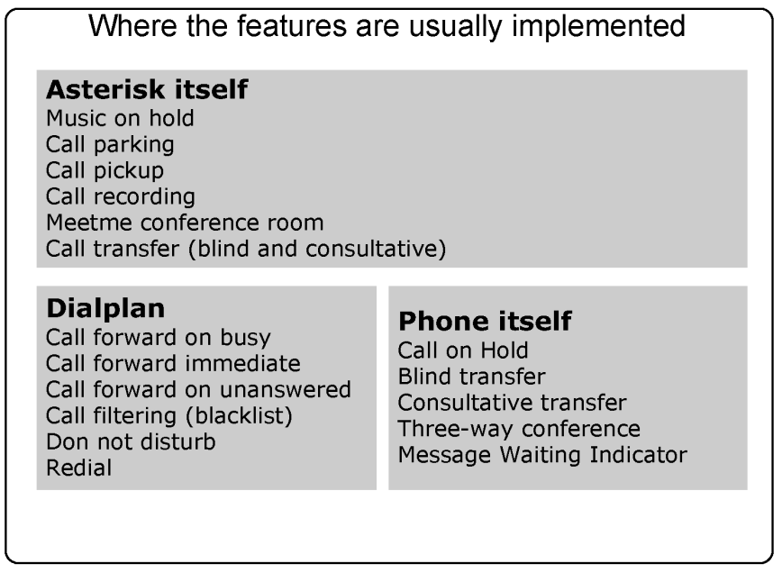
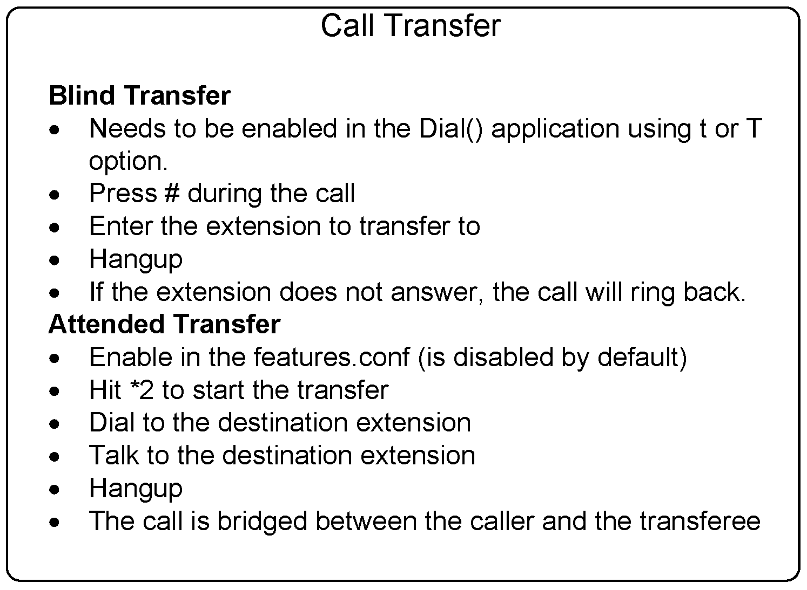
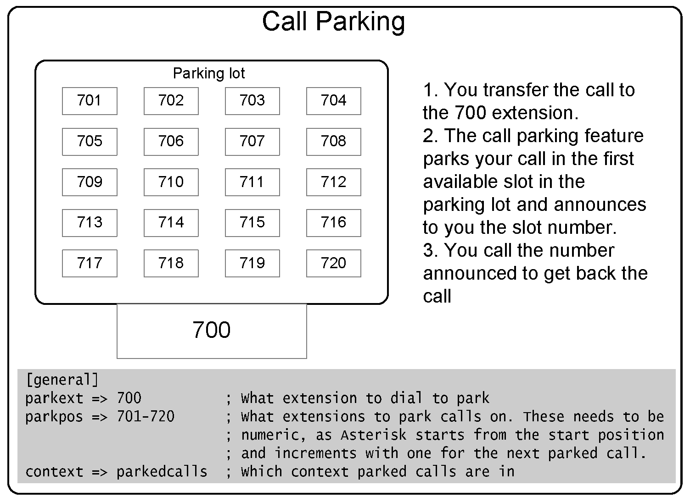
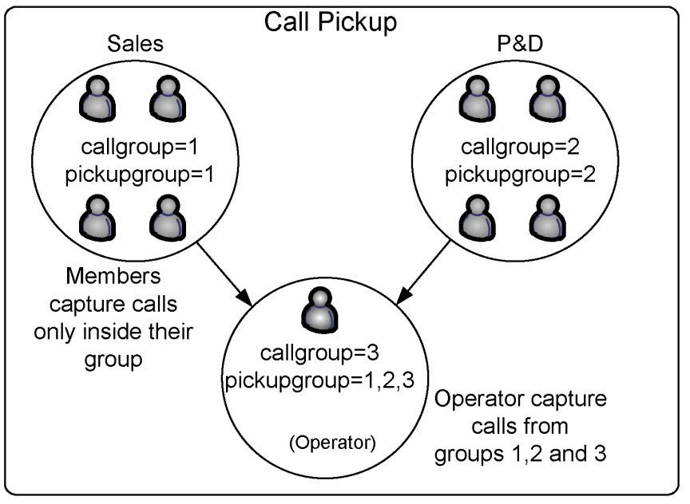
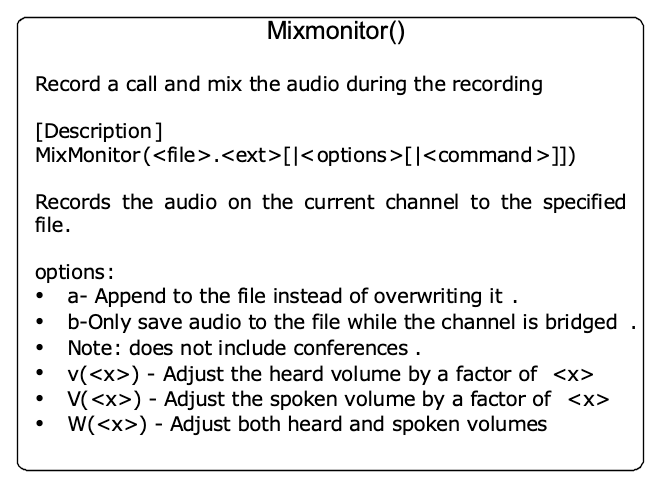
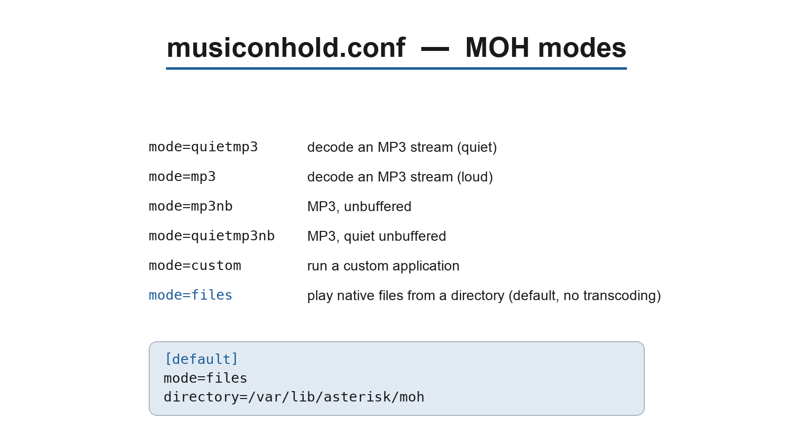

# Using PBX features

In SIP systems, most of the phone features are implemented in the endpoint. A variety of SIP phones and manufacturers exist, and the interoperability is not guaranteed. The Asterisk development team has done an amazing job of implementing most of the features in the PBX itself, making Asterisk almost endpoint independent. However, sometimes you will find the same function being done by both the phone and Asterisk itself. The integration of the phone and the PBX is the next frontier on usability and where proprietary systems are focusing right now. In this chapter, you will learn how to use most of these features.

## Objectives

By the end of this chapter, you will be able to understand and use:

- Call Parking
- Call Pickup
- Call Transfer
- Call Conference (ConfBridge)
- Call Recording
- Music on hold

## Where features are implemented

First and foremost, it is important to understand when the PBX features are being executed versus when the phone is doing all the work. For example, you may transfer a call using the TRANSFER button on the phone or by dialing # (unconditional transfer executed by the PBX itself).

## Features implemented by Asterisk

These features are implemented in the PBX by the Asterisk code:

- Music on hold
- Call parking
- Call pickup
- Call recording
- ConfBridge conference room
- Call transfer (blind and consultative)

## Features usually implemented by the dial plan

These features need to be programmed in the Asterisk dial plan (extensions.conf):

- Call forward on busy
- Call forward immediate
- Call forward on unanswered
- Call filtering (blacklist)
- Do not disturb
- Redial

## Features usually implemented by the phone

These features are implemented by the phone’s firmware:



- Call on hold
- Blind transfer
- Consultative transfer
- Three-way conference
- Message waiting indicator

## The features configuration file

Some of the features presented in this chapter are configured in the features.conf configuration file. It is possible to change the behavior of some features by modifying this file. We have included the relevant excerpt below. In the next sections of this chapter, we will describe each feature. Excerpt from the sample file (Asterisk 22)

![The `[featuremap]` section of features.conf, with the default DTMF feature codes](../images/13-pbx-features-fig02.png)

Since Asterisk 12, call parking was moved out of `features.conf` into its own module, `res_parking`, with configuration in `res_parking.conf`. The parking-lot block below (`parkext`, `parkpos`, `context`, `parkingtime`, and so on) lives in `res_parking.conf`. The `[featuremap]` section (the DTMF feature codes, including `parkcall`) remains in `features.conf`.

The parking-lot options live in `res_parking.conf`. A parking lot named `default` always exists, even if it is not present in the configuration file. The excerpt below is taken from the Asterisk 22 `res_parking.conf.sample`:

```
; res_parking.conf
[default]                       ; Default Parking Lot
parkext => 700                  ; What extension to dial to park. (optional; if
                                ; specified, extensions will be created for parkext and
                                ; the whole range of parkpos)
parkpos => 701-720              ; What range of parking spaces to use - must be numeric.
                                ; Creates these spaces as extensions if parkext is set.
context => parkedcalls          ; Which context parked calls and the default park
                                ; extension are created in
;parkingtime => 45             ; Number of seconds a call can be parked before returning
;comebacktoorigin = yes        ; When a parked call times out, attempt to send it back to
                               ; the peer that parked it (default is yes)
;courtesytone = beep           ; Sound file to play when someone picks up a parked call
;parkedplay = caller           ; Who to play courtesytone to: parked, caller, both (default caller)
;parkedcalltransfers = caller  ; Enable DTMF transfers when picking up a parked call (default no)
;parkedcallreparking = caller  ; Enable DTMF parking when picking up a parked call (default no)
;parkedcallhangup = caller     ; Enable DTMF hangups when picking up a parked call (default no)
;findslot => next              ; 'next' uses the next space after the most recently used one;
                               ; 'first' (default) uses the lowest-numbered space available
;parkedmusicclass = default    ; MOH class to use for the parked channel
```

The DTMF feature codes (including one-step `parkcall`) remain in the `[featuremap]` section of `features.conf`:

```
; features.conf
[featuremap]
;blindxfer => #1                ; Blind transfer  (default is #) -- Make sure to set the T and/or t
option in the Dial() or Queue() app call!
;disconnect => *0               ; Disconnect  (default is *) -- Make sure to set the H and/or h option
in the Dial() or Queue() app call!
;atxfer => *2                   ; Attended transfer  -- Make sure to set the T and/or t option in the
Dial() or Queue()  app call!
;parkcall => #72        ; Park call (one step parking)  -- Make sure to set the K and/or k option in
the Dial() app call!
;automixmon => *3               ; One Touch Record a.k.a. Touch MixMonitor -- Make sure to set the X
and/or x option in the Dial() or Queue() app call!
```

## Call Transfer

Call transfer can be implemented by the phone, by ATA, or by Asterisk itself. Refer to your phone manual to understand how calls are transferred. If your phone does not support call transfer, you can use Asterisk to accomplish this task. Call transfer is implemented in two different ways. The first way is to use the blind transfer feature: dial # followed by the number to be transferred. Sometimes you will use the transfer feature of your IP phone or IP soft phone. You can change the transfer character by editing the blindxfer parameter in the features.conf file. You can enable assisted transfer in Asterisk by removing the ; before the atxfer parameter in the features.conf file. During a conversation, you would press *2. Asterisk will say “transfer” and will give you a dial tone. The caller is sent to music on hold. After you speak to the destination person and hang up the phone, the system bridges the caller to the destination.



### Configuration task list

1. For a PJSIP endpoint, make sure the option `direct_media` is set to `no` (so the media flows through Asterisk and the feature codes are detected), or use a `t`/`T` option in the `Dial()` application

## Call parking

This feature is used to park a call. This helps, for example, when you are answering a phone call outside of your room and you want to transfer the call back to your desk. You may accomplish this by parking the call in an extension. Once you reach your desk, simply dial the number of the parking extension to recover the call.



By default, the 700 extension is used to park a call. In the middle of a conversation, press # to transfer the call to the 700 extension. Now the Asterisk will announce your parking extension, such as 701 or 702. Hang up the phone, and the caller will be placed on hold. Go to your desk phone and dial the announced parking extension to recover the call. If the caller is parked for a long time, the timeout feature will trigger and the original dialed extension will ring again.

### Configuration task list

Follow the steps below to enable call parking. Step 1: Make the parking lot reachable from your dialplan (required). The default parking lot's `context` is `parkedcalls` (set in `res_parking.conf`). Include that context in the context your phones dial from, in `extensions.conf`:

```
include => parkedcalls
```

Step 2: Test the call parking feature by dialing #700. Notes:

- The parking extension won’t be shown in the dialplan show CLI command.
- It is necessary to reload the parking module after changing the parking configuration file: `module reload res_parking.so`. For features.conf changes, `module reload features.so`.
- To park a call, you need to transfer to #700. Verify the `t` and `T` options in the `Dial()` application.

## Call pickup

Call pickup allows you to capture a call from a colleague in the same call group. This would help avoid, for example, having to wake up to take a call that is ringing to another person in your room, but who is not present. By dialing *8, you can capture a call within your call group. This number can be modified in the

```
features.conf file.
```



### Configuration task list

Follow the steps below to configure the call pickup feature. Step 1: Configure a call group for your extensions. This is done in the channel configuration file (pjsip.conf, iax.conf, chan_dahdi.conf). For PJSIP endpoints, set `call_group` and `pickup_group` in the endpoint section of `pjsip.conf` (pjsip.conf uses snake_case option names). This task is required.

For PJSIP (pjsip.conf):
```
[4x00]
type=endpoint
call_group=1
pickup_group=1,2
```


Step 2: Change the call-pickup feature number (optional). This is set in the `[general]` section of `features.conf`, not in `pjsip.conf`:

```
; features.conf
[general]
pickupexten = *8   ; Configures the call pickup extension (default is *8)
```

## Conference (call conference)

There are different ways to implement a conference on Asterisk. The first option is simply to use the three-way conference capability of the phone. By using this feature in the phone you do not require any support in the server itself. However, when you want a conference with more than 3 people, you should run a conference room. Asterisk's modern conference application is ConfBridge (`app_confbridge`).

ConfBridge supports HD voice conferences and video conferencing. There are some limitations for video conferencing such as no transcoding — all participants have to use the same codec and profile. The video conference uses a follow-the-talker mode, displaying the image of the last person to speak. You may easily configure new DTMF menus in ConfBridge.

ConfBridge replaces the old MeetMe application, which was deprecated in Asterisk 19 and removed in Asterisk 21. Unlike MeetMe, ConfBridge does **not** require DAHDI or a hardware timing source: it relies on Asterisk's built-in timing interface (`res_timing_timerfd` on Linux, or `res_timing_pthread`), so no `dahdi_dummy` module is needed. If you are migrating from an older system that used `MeetMe()` and `meetme.conf`, replace those with `ConfBridge()` and `confbridge.conf` as described below.

### ConfBridge

To start a conference room, the syntax is listed below.

```
ConfBridge(conference,bridge_profile,user_profile,menu)
```

To get a complete description of the command you can use core show application confbridge.


> **[2nd-ed note]** A ConfBridge diagram would help here: show several SIP endpoints joining a single named conference (e.g. `101`) through `ConfBridge()`, with one participant flagged as admin, and a callout that the mixing/timing is handled by `res_confbridge` + the built-in `res_timing_*` timer (no DAHDI).

As you can see above there are three important arguments, each mapping to a section type in `confbridge.conf`. **bridge_profile** (a `type=bridge` section): here you select the maximum number of participants (`max_members`), recording (`record_conference`), `video_mode`, and many other bridge-wide parameters.

It doesn’t make sense to reproduce the entire example file here, so let me give you a simple example on how to configure a bridge_profile in the file confbridge.conf.

```
[default_bridge]
type=bridge
max_members=10
record_conference=yes
```

**user_profile** (a `type=user` section): here you define options that are specific per user, such as whether the user is an administrator (`admin=yes`), whether they start muted (`startmuted=yes`), music on hold, and many other per-user options. Example:

```
[admin_user]
type=user
admin=yes
```

**menu** (a `type=menu` section): here you define the keypad (DTMF) mapping for the conference — for example which key toggles mute, adjusts volume, or leaves the conference. Check the `confbridge.conf.sample` file to see all available actions. Example:

```
[my_menu]
type=menu
*=playback_and_continue
1=toggle_mute
2=decrease_listening_volume
3=increase_listening_volume
4=decrease_talking_volume
5=increase_talking_volume
6=leave_conference
```

#### Confbridge functions

The conference bridge options can be passed dynamically in the dial plan using the CONFBRIDGE() function. See the examples below:

```
exten => 1,1,Answer()
exten => 1,n,Set(CONFBRIDGE(user,template)=default_user)
exten => 1,n,Set(CONFBRIDGE(user,admin)=yes)
exten => 1,n,Set(CONFBRIDGE(user,marked)=yes)
exten => 1,n,ConfBridge(sales)
```

### ConfBridge admin commands and migrating from MeetMe

If you are coming from MeetMe, the admin functions you used through `MeetMeAdmin()` and the `a` (admin) option are now expressed through the **admin user profile** (`admin=yes`) plus the **menu** actions. An administrator who joins with an admin profile and a menu containing admin actions can lock the room, kick users, and mute participants live from the keypad. The relevant menu actions in `confbridge.conf` are:

- `admin_kick_last` -- kick the last user who joined
- `admin_toggle_mute_participants` -- mute/unmute all non-admin participants
- `toggle_mute` -- mute/unmute yourself
- `participant_count` -- announce the number of participants
- `leave_conference` -- leave the bridge and continue in the dialplan

These replace the MeetMe `MeetMe()` option flags (`a`, `A`, `m`, `M`, `l`, `x`, …) and the `MeetMeAdmin()` commands (`k`, `K`, `L`, `M`, `N`, …). There is no `meetme.conf` in Asterisk 22; all conference configuration lives in `confbridge.conf`, and changes are applied with `module reload res_confbridge.so`.

### ConfBridge example

To create a conference room reachable at extension 500, in `extensions.conf`:

```
exten => 500,1,Answer()
 same => n,ConfBridge(101,default_bridge,default_user,sample_user_menu)
```

The first caller to dial 500 creates conference `101`; subsequent callers join it. Profiles and menus referenced here (`default_bridge`, `default_user`, `sample_user_menu`) are defined in `confbridge.conf`. To require a PIN, set `pin=` in the user profile; to make a participant a conference administrator, give them a user profile with `admin=yes`.

## Call Recording

There are several ways to record a call in Asterisk. You can use the `MixMonitor()` application to easily record calls. (The older `Monitor` application, which recorded two separate files, was removed; use `MixMonitor` instead.)

### Using the MixMonitor application

The `MixMonitor` application records the audio in the current channel to the specified file. If the filename is an absolute path, it uses that path. Otherwise, it creates the file in the configured monitoring directory from asterisk.conf.



### MixMonitor()

Record a call and mix the audio during the recording. Syntax: `MixMonitor(filename.extension[,options[,command]])`. Records the audio on the current channel to the specified file. Valid options:

- a - Appends to the file instead of overwriting it.
- b - Only saves audio to the file while the channel is bridged.
- Note: does not include conferences.
- v(<x>) - Adjusts the audible volume by a factor of <x> (ranging from -4 to 4)
- V(<x>) - Adjusts the spoken volume by a factor of <x> (ranging from -4 to 4)
- W(<x>) - Adjusts both audible and spoken volumes by a factor of <x> (ranging from -4 to 4)
- <command> will be executed when the recording is over. Any strings matching ^{X} will be unescaped to ${X} and all variables will be evaluated at that time. The variable MIXMONITOR_FILENAME will contain the filename used to record.

An interesting resource is the one-touch recording feature `automixmon`, which lets a party dial a DTMF code (default `*3`) during a call to immediately start (and toggle off) recording. It is built on MixMonitor, so it writes a single mixed file. Example:

```
exten => _4XXX,1,Set(DYNAMIC_FEATURES=automixmon)
 same => n,Dial(PJSIP/${EXTEN},20,jtTXx) ; X and x enable one-touch MixMonitor recording
```

The `X` and `x` options enable the one-touch MixMonitor feature for the caller and callee respectively. Because MixMonitor records a single mixed file, there is no need to combine separate IN/OUT files afterward (the old `automon`/`Monitor` approach, which produced two files for `soxmix`, was removed along with the `Monitor` application).

If you don’t want to use Set() before the Dial() application, you can set this in the globals section:

```
[globals]
DYNAMIC_FEATURES=automixmon
```

### Music on hold

Music on hold (MOH) has changed several times among versions 1.0, 1.2, and 1.4. In the latest version, MOH defaults to “FILE-BASED”. In other words, Asterisk will supply the MOH files in formats such as g729, alaw, ulaw, and gsm. Thus, it is not necessary to transcode the music before sending it to the channel. This saves processor time, which is a welcomed modification for those working with production systems. In older versions, MOH was usually provided by MP3 (it still can be configured that way). Providing MOH using MP3 obligates Asterisk to transcode, spending valuable CPU power in the process. The new configuration file is shown below. Note that the default class now uses the native file format mode=files. All other modes are commented. Each section is a class. The only uncommented class at this point is default. If you want to have different classes for different files, you will need to create new sections (classes).



```
; Music on Hold -- Sample Configuration
;[samplemp3]
;mode=quietmp3
;directory=/var/lib/asterisk/mohmp3
;
; valid mode options:
; quietmp3      -- default
; mp3           -- loud
; mp3nb         -- unbuffered
; quietmp3nb    -- quiet unbuffered
; custom        -- run a custom application (See examples below)
; files         -- read files from a directory in any Asterisk supported
;                  media format. (See examples below)
;[manual]
;mode=custom
; Note that with mode=custom, a directory is not required, such as when reading
; from a stream.
;directory=/var/lib/asterisk/mohmp3
;application=/usr/bin/mpg123 -q -r 8000 -f 8192 -b 2048 --mono -s
;[ulawstream]
;mode=custom
;application=/usr/bin/streamplayer 192.168.100.52 888
;format=ulaw
; mpg123 on Solaris does not always exit properly; madplay may be a better
; choice
;[solaris]
;mode=custom
;directory=/var/lib/asterisk/mohmp3
;application=/site/sw/bin/madplay -Q -o raw:- --mono -R 8000 -a -12
;
;
; File-based (native) music on hold
;
; This plays files directly from the specified directory, no external
; processes are required. Files are played in normal sorting order
; (same as a sorted directory listing), and no volume or other
; sound adjustments are available. If the file is available in
; the same format as the channel's codec, then it will be played
; without transcoding (same as Playback would do in the dialplan).
; Files can be present in as many formats as you wish, and the
; 'best' format will be chosen at playback time.
;
; NOTE:
; If you are not using "autoload" in modules.conf, then you
; must ensure that the format modules for any formats you wish
; to use are loaded _before_ res_musiconhold. If you do not do
; this, res_musiconhold will skip the files it is not able to
; understand when it loads.
;
[default]
mode=files
directory=/var/lib/asterisk/moh
;
;[native-random]
;mode=files
;directory=/var/lib/asterisk/moh
;random=yes     ; Play the files in a random order
```

### MOH configuration tasks

Now, to use music on hold, set the MOH class in the channel configuration files (chan_dahdi.conf, pjsip.conf, iax.conf, and so on). For PJSIP endpoints, set `moh_suggest` in the endpoint section of `pjsip.conf` (the legacy `musicclass` option name applies to chan_dahdi and other channel drivers, not to PJSIP). The freeplay tunes installed are now in wav format. At the time of installation, you can select (using make menuselect) the MOH file formats available. If you want to add new MOH files, you will have to supply them in the required formats. For example:

```
In /etc/asterisk/chan_dahdi.conf, add the line:
[channels]
musiconhold=default
Edit the file /etc/asterisk/musiconhold.conf
[default]
mode=files
directory=/var/lib/asterisk/moh
```

In the dial plan, you can start music on hold on a channel with `StartMusicOnHold` (and stop it with `StopMusicOnHold`):

```
exten => 100,1,StartMusicOnHold(default)
 same => n,Dial(PJSIP/2)
```

To play music on hold for a fixed time as a quick test, use the `MusicOnHold` application with a duration (in seconds):

```
[local]
exten => 6601,1,MusicOnHold(default,30)
```

## Application Maps

Application maps allow you to add new features by using the `[applicationmap]` section of the features.conf file. Suppose you need to identify the type of customer you are answering to a call center. You could create an application map for each customer type, which could count the number of answered customers per type.

## Quiz

1. Which statements are true about call parking?
   - A. By default, extension 800 is used for call parking.
   - B. When you are away from your desk and receive a call, you can park it; the system announces the parking slot, and you dial that slot from any phone to retrieve the call.
   - C. By default, extension 700 parks a call, and calls are parked in slots 701–720.
   - D. You dial 700 to retrieve a parked call.
2. To use the call-pickup feature, all extensions must be in the same ___. For DAHDI channels this is configured in the ___ file.
3. When transferring a call you can choose between a ___ transfer, where the destination is not consulted first, and an ___ transfer, where you talk to the destination before completing it.
4. To make an attended (consultative) transfer you use the ___ sequence; for a blind transfer you use ___.
   - A. #1, *2
   - B. *2, #1
   - C. #2, #1
   - D. #1, #2
5. To host conference calls in Asterisk 22, you use the ___ application.
6. In ConfBridge, a participant is granted administrator privileges (kick, mute others, lock the room) by setting ___ in their user profile (`confbridge.conf`):
   - A. admin=yes
   - B. marked=yes
   - C. moderator=yes
   - D. type=admin
7. The best format for music on hold is MP3, because it uses very little processing power on the Asterisk server.
   - A. True
   - B. False
8. To pick up a call from a specific call group, you must be in the matching ___ group.
9. You can record a call with the MixMonitor() application or the one-touch recording (`automixmon`) feature. By default, `automixmon` uses the ___ DTMF sequence.
   - A. *1
   - B. *2
   - C. *3
   - D. #1
10. In ConfBridge, which `confbridge.conf` user-profile option makes a participant join muted (they can hear the conference but cannot be heard until unmuted)?
    - A. startmuted=yes
    - B. listen=only
    - C. muteall=yes
    - D. quiet=yes

**Answers:** 1 — B, C · 2 — pickup group; `chan_dahdi.conf` · 3 — blind; attended · 4 — B · 5 — ConfBridge() · 6 — A · 7 — B · 8 — pickup · 9 — C · 10 — A
