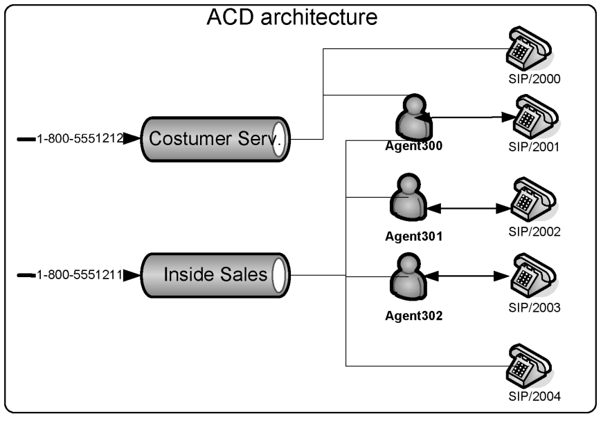
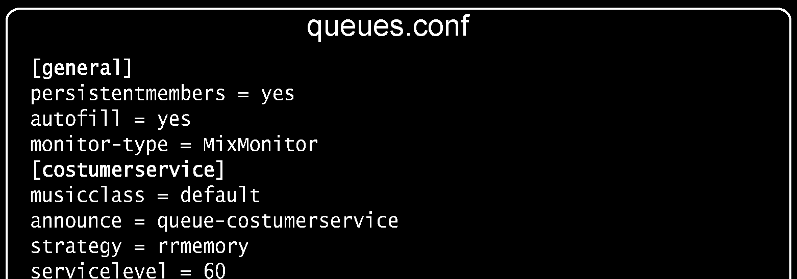
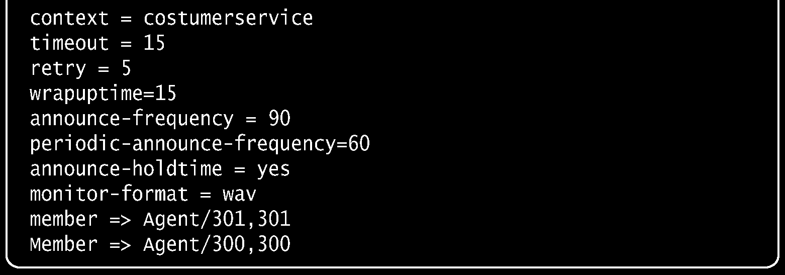
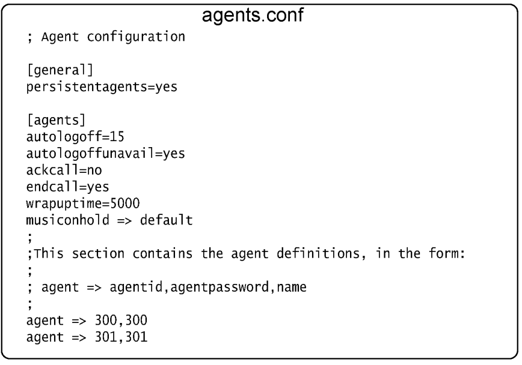

# Call Queues

Call queues also know as ACD (Automatic Call Distribution) are becoming increasingly important for answering customer calls efficiently. An automatic call distributor can help reduce costs, increase service, and improve sales as call distributors affect how your business works—not for a few days, but for many years. In a call center environment, the number one factor is people; they are the most expensive resource. It takes time, money, and patience to hire, train, and motivate agents. With an ACD, you can maximize agents’ productivity by precisely dimensioning the number of agents required, controlling good and bad attendants, and analyzing the call flow.

## Objectives

By the end of this chapter, you should be able to:

- Understand why and how to use call queues
- Understand the basic theory of call queues
- Install and configure the queue system

## How queues work?

Call queues are not exactly a novelty. When you have a high inbound call flow, it is hard to distribute calls appropriately. Using a group strategy where the phone simultaneously rings on all agents does not seem to work, unless you have only a few agents. However, a call queue will only deliver calls to a single available agent each time and put the customer on hold with music when there are no agents available. The queue works by retaining the call while finding an unoccupied agent to answer the call. One of the biggest benefits of the queue is to avoid losing calls while providing the possibility to generate statistics. Usually, a call queue works like this:

- Agents log in to the queue.
- Incoming calls are queued.
- A queuing strategy to distribute the calls is used to send calls to agents.
- Music on hold is played while the caller waits.
- Announcements can be made to callers, notifying them of waiting time
- The call is answered by the agent and statistics are generated.

The main application for queues is customer service. When using queues, you avoid losing calls when your agents are busy. You can add new agents to the queue if you find that the number of callers in the queue is growing. Another advantage with queues is you can now have statistics like call abandon rate, average call duration, and call answering target. These statistics will help you determine how many agents to use to provide better service to your customer.

### ACD architecture

The ACD architecture is formed by queues and agents. One agent can be in two queues at the same time. A queue can have agents, channels, and agent groups.


## Queues

Queues are defined in the queues.conf configuration file. Agents are attendants who log in and are members of queues. Agents are defined in the agents.conf file. The queue system has grown significantly over many releases, making the configuration file extensive. We will explain some of the major parameters. General parameters

```
autofill=yes
```

The old behavior for the queue was serial type. The queue waited for a call to be dispatched before sending the succeeding call to the next agent. If an agent takes 15 seconds to answer a call, the other calls in the queue had to wait until that call was answered. For high-volume queues, this behavior was inefficient. The new behavior autofill=yes does not wait until a call is answered, but rather works in parallel. You can record the calls in the queue using the option mixmonitor. In this mode, calls are recorded and mixed at the same time.

### Queue configuration file

Queues are configured in the queues.conf file. In the figure, you will find a working example of a queue.



### Agents

You can configure your agents in the file agents.conf. Agents can log in from any extension to receive calls. You can dial an agent using:

```
Dial(agent/<name>)
```

#### Agents

Agent 300

- You can check the status of the agents using the command core show agents”
- the command agentlogin is executed and the agent is associated with the current channel.
- The user dials an extension with the application agentlogin .

You can define the agents in the file agents.conf






```
; Agent configuration
[general]
persistentagents=yes
[agents]
autologoff=15
autologoffunavail=yes
ackcall=no
endcall=yes
wrapuptime=5000
musiconhold => default
;
;This section contains the agent definitions, in the form:
;
; agent => agentid,agentpassword,name
;
agent => 300,300
agent => 301,301
```

### Members

Members are active channels responding to the queue. Members can be direct channels (PJSIP, DAHDI) or agents who log in before receiving calls.

> **[2nd-ed note]** chan_sip (`SIP/`) was removed in Asterisk 21. All member channel references in dial plans and queues.conf must use `PJSIP/` (e.g., `member => PJSIP/1001`). MGCP support is also long deprecated.

### Strategies

Calls are distributed among members according to one of these strategies:

- ringall: Plays all channels available until someone answers.
- leastrecent: Distributes to the least recent member.
- fewestcalls: Distributes to the member with fewest calls.
- random: Ring random interface.
- wrandom: Ring random interface, but use the member’s penalty as a weight when calculating their metric.
- rrmemory: Uses round robin with memory; it remembers where it left off with the call in the last pass.
- rrordered: Same as rrmemory, except the queue member order from the config file is preserved.
- linear: Rings members in the order they are listed in queues.conf; for dynamic members, in the order they were added.

> **[2nd-ed note]** The `roundrobin` strategy was replaced by `rrmemory` in early Asterisk releases and is no longer available. Remove it from the strategy list if it appeared in earlier edition text. All strategies listed above are confirmed present in Asterisk 22.

## Agents

Agents are implemented as proxy channels. They can be used inside the queues. Another use for the agent channels is extension mobility. The user can log in using any phone and receive its calls. This allows a user to go to any room to make it an office. You can dial an agent in the dial plan using dial(agent/<name>). You define agents in the agents.conf file.

### Agent Groups

You may choose to use agent groups. This function does not take ACD strategies into consideration. You will probably prefer to list all agents individually. If you want to transfer to an agent group, you

```
can use queues.conf:
member=>agent/@1 ;any agent in group 1
member=>agent/:1,1 ;any agent in group 1, wait for first available, ;do not
use agent groups.
```

### The configuration file for agents

Agents are defined in the file agents.conf. Below is a working example of the file.




## ACD-related applications

The Asterisk queue system makes several applications available to implement the queues in the dial plan. Below, we show some of them.

### The application queue()

This applications queues incoming calls into a particular call queue as defined in queues.conf. The option string may contain zero or more of the following characters: In addition to transferring the call, a call may be parked and then picked up by another user. The optional URL will be sent to the called party if the channel supports it. The optional AGI parameter will set up an AGI script to be executed on the calling party's channel once they are connected to a queue member. The timeout will cause the queue to fail out after a specified number of seconds, checked between each timeout and retry cycle. This application sets the QUEUE status variable upon completion:

- TIMEOUT
- FULL
- JOINEMPTY
- LEAVEEMPTY
- JOINUNAVAIL
- LEAVEUNAVAIL

### The application agentlogin()

This application asks the agent to log in to the system. It always returns -1. While logged in, the agent receiving calls will hear a beep when a new call comes in. The agent can dump the call by pressing the * key.

### The application addQueueMember()

This application dynamically adds a device (e.g., PJSIP/3000) to a queue. If the device already exists, it will return an error.

```
AddQueueMember(queuename[|interface][|penalty]):
```

#### The application removeQueueMember()

This application dynamically removes a device from the queue. If the device does not belong to the queue, it will return an error.

```
RemoveQueueMember(queuename[|interface])
```

### Support applications and CLI commands

Some applications and console commands are capable of helping the work with queues. The following outlines what each application does:

## Configuration tasks

The figure below summarizes the major tasks to create a working queue system. Step 1: Create the call queue In the file queues.conf:

```
[telemarketing]
music = default
;announce = queue-telemarketing
;context = qoutcon
timeout = 2
retry = 2
maxlen = 0
member => Agent/300
member => Agent/301
[auditing]
music = default
;announce = queue-auditing
;context = qoutcon
timeout = 15
retry = 5
maxlen = 0
member => Agent/600
member => Agent/601
```

Step 2: Define agent parameters In the file agents.conf:

```
debian:/etc/asterisk# cat agents.conf
;
; Agent configuration
;
[agents]
; Define maxlogintries to allow agent to try max logins before
; failed.
; default to 3
maxlogintries=5
; Define autologoff times if appropriate.  This is how long
; the phone has to ring with no answer before the agent is
; automatically logged off (in seconds)
autologoff=15
; Define autologoffunavail to have agents automatically logged
; out when the extension that they are at returns a CHANUNAVAIL
; status when a call is attempted to be sent there.
; Default is "no".
;autologoffunavail=yes
; Define ackcall to require an acknowledgement by '#' when
; an agent logs in using agentcallbacklogin.  Default is "no".
;ackcall=no
; Define endcall to allow an agent to hangup a call by '*'.
; Default is "yes". Set this to "no" to ignore '*'.
;endcall=yes
; Define wrapuptime.  This is the minimum amount of time when
; after disconnecting before the caller can receive a new call
; note this is in milliseconds.
;wrapuptime=5000
; Define the default musiconhold for agents
; musiconhold => music_class
;musiconhold => default
;
; Define the default good bye sound file for agents
; default to vm-goodbye
;agentgoodbye => goodbye_file
; Define updatecdr. This is whether or not to change the source
; channel in the CDR record for this call to agent/agent_id so
; that we know which agent generates the call
;updatecdr=no
;
; Group memberships for agents (may change in mid-file)
;
;group=3
;group=1,2
;group=
```

Step 3: Create the agents In the file agents.conf:

```
;agent => agentid,agentpassword,name
[agents]
agent => 300,300,Test Rep - 300
agent => 301,301,Test Rep . 301
agent => 600,600,Test Ver - 600
agent => 601,601,Test Ver . 601
```

Step 4: Insert the queue in the dial plan

```
In the file extensions.conf:
; Telemarketing queue.
exten=>_0800XXXXXXX,1,Answer
exten=>_0800XXXXXXX,2,SetMusicOnHold(default)
exten=>_0800XXXXXXX,3,Set(TIMEOUT(digit)=5)
exten=>_0800XXXXXXX,4,Set(TIMEOUT(response)=10)
exten=>_0800XXXXXXX,5,Background(welcome)
exten=>_0800XXXXXXX,6,Queue(telemarketing)
; Transfer to the queue auditing
exten => 8000,1,Queue,(auditing)
exten => 8000,2,Playback(demo-echotest); No auditor available
exten => 8000,3,Goto(8000,1) ; Verify auditor again
; Agent login for the telemarketing and auditing queues
exten => 9000,1,Wait(1)
exten => 9000,2,AgentLogin()
```

### Configure queue recording

Calls may be recorded using Asterisk's monitor or mixmonitor application. Recording can be enabled from within the queue application, beginning when the call is actually picked up. Only successful calls are recorded, and no recordings are performed while people are listening to MOH. To enable monitoring, simply specify monitor-format. This feature is otherwise disabled. You can set the filename for the recording using Set (MONITOR_FILENAME=<filename>); otherwise

```
it will use MONITOR_FILENAME=${UNIQUEID}.
```

In the file queues.conf:

```
monitor-format = wav
monitor-type = MixMonitor
monitor-join = yes
```

## Queue operation

The following examples explains how to use the queue. Step 1: Agent login Example: An agent in the telemarketing queue picks up the phone and dials #9000. The agent hears an invalid login message and is asked for his/her name and password. The auditing queue follows the same procedure. Step 2: Queue Once in the queue, the agent will hear MOH, if defined. When a call comes in to the telemarketing queue, the agent will hear a beep and will be connected to that call. Step 3: Call ending When the agent finishes the call, he/she can:

- Press ‘*’ to disconnect and stay in the queue.
- Disconnect the phone, thereby disconnecting from the queue.
- Press #8000 to transfer the call for auditing.

## Advanced resources

The Asterisk queue system has some advanced features to prioritize certain customers and agents as well as enable a user menu.

### User menu

You can define a menu for a user while waiting in the queue using one-digit extensions. To enable this option, define a context in the queue configuration queues.conf.

### Penalty

Agents can be configured with a penalty. A queue will send the calls first to users with lower penalty values. For example, since we know that our customers love Susan and her soft voice, we may choose to assign priority 0 to her. Alternatively, the agent named Uber, who has less experience, is less preferred for customer service; therefore, we assign a priority 10 to this agent. In the file queues.conf:

```
[customerservice]
member=300,0,Susan the excellent agent
member=300,10,Uber the new guy
```

### Priority

Queues operate in the FIFO (first in first out) mode. If you want to give priority for special customers (platinum, gold) you can set up differentiated priorities. For platinum or gold customers:

```
exten=>111,1,Playback(welcome)
exten=>111,2,Set(QUEUE_PRIO=10)
exten=>111,3,Queue(customerservice)
```

Blue customers:

```
exten=>112,1,Playback(welcome)
exten=>112,2,Set(QUEUE_PRIO=5)
exten=>112,3,Queue(customerservice)
```

## The application agentcallbacklogin() is removed

The application `agentcallbacklogin()` was deprecated in version 1.2 and was removed in Asterisk 12. It is not available in Asterisk 22. The recommended approach is to use `AddQueueMember()` with a PJSIP interface to dynamically add callback-style members to a queue. The document `queues-with-callback-members.txt` was included in older Asterisk `/doc` directories for migration guidance.

> **[2nd-ed note]** Verify whether the `chan_agent` channel driver (app_agent_pool) is still the preferred mechanism for agent callback behavior in Asterisk 22, or whether direct PJSIP members with `AddQueueMember()`/`RemoveQueueMember()` is now the standard pattern.

## Queue statistics

All events from queues are logged to /var/log/asterisk/queue_log. The format of the queue log is published in the document queuelog.txt in the /doc directory of the Asterisk documentation. Below are some of the most important events logged.

- ABANDON(position|origposition|waittime)
- AGENTDUMP
- AGENTLOGIN(channel)
- AGENTLOGOFF(channel|logintime)
- AGENTCALLBACKLOGOFF(exten@context|logintime|reason)
- COMPLETEAGENT(holdtime|calltime|origposition)
- COMPLETECALLER(holdtime|calltime|origposition)
- CONFIGRELOAD
- CONNECT(holdtime|bridgedchanneluniqueid)
- ENTERQUEUE(url|callerid)
- EXITEMPTY(position|origposition|waittime)
- EXITWITHKEY(key|position)
- EXITWITHTIMEOUT(position)
- QUEUESTART
- RINGNOANSWER(ringtime)
- SYSCOMPAT
- TRANSFER(extension|context|holdtime|calltime)

You can build your own utility to process these events or use a ready-to-run statistics package. We have tested two utilities at voip.school:

- Qlog analyzer (http://www.micpc.com/qloganalyzer/) – Excellent open source package
- Queue metrics (http://queuemetrics.com/) – One of the most complete packages for queue stats

> **[2nd-ed note]** Verify that both third-party statistics tools above are still maintained and compatible with Asterisk 22 queue_log format. Consider adding a reference to the Asterisk REST Interface (ARI) as a modern alternative for building custom queue reporting integrations.

## Summary

In this chapter you have learned how to use an ACD, its architecture, and how to configure it. Some advanced features such as priorities and penalties were also presented.

## Quiz

1. Cite four strategies for routing a call in a queue. 2. It is possible to record a conversation between an agent and a customer using the statement _________________ in the queues.conf file. 3. To log in an agent, you will use the application agentlogin([agentnumber]).When the agent finishes the call, he/she can: A. disconnect and stay in the queue B. hang up the phone and disconnect from the queue C. press #8000 to transfer to call audit D. press # to hang up 4. The required tasks to configure a call queue are: A. Create the queue B. Create the agents C. Configure the agents D. Configure the recording E. Put the queue in the dial plan 5. When in a call queue, you can define a certain number of options that the user can dial. This is done by including a(n) ____________ in the file queues.conf. A. Agent B. Menu C. Context

```
Application
```

6. The support applications AddQueueMember(), AgentLogin(), and RemoveQueueMember() should be included in the __________. A. Dial plan B. Command line interface C. queues.conf D. agents.conf 7. It is possible to record the agents, but doing so requires an external recorder. A. True B. False 8. The parameter wrapuptime is the time the user needs after ending the call to complete business process related to that call. A. True B. False 9. A call can be prioritized depending on the caller ID inside the same queue. A. True B. False Answers: 1-ringall, leastrecent, random, rrmemory 2 – mixmonitor 3 – D 4 – AE 5 – B 6 – A 7-B 8-A 9 -A
