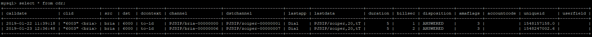

# Asterisk Call Detail Records

Asterisk, like other telephony platforms, allows the billing of phone calls. Several programs on the market can import the records generated by PBXs. Those records are used to verify the correct amount of the bill and statistics, among other things.

## Objectives

By the end of this chapter, the reader should be able to:

- Describe where and in what format the records are generated
- Generate records using ODBC (Open Database Connectivity)
- Implement an authentication scheme integrated with billing

## Asterisk CDR Format

Asterisk generates a call detail record (CDR) for each call. These records are stored, by default, in a text file in a comma separated value (CSV) in the /var/log/asterisk/cdr-csv. The file is organized in the following fields: CDR Description Type Size Accountcode Account Number to use String Src Caller ID Number String Dst Destination Extension String Dcontext Destination Context String Caller ID with Text String Channel Channel Used String Dstchannel Destination channel String Lastapp Last application String Lastdata Last application data String Start Start of call Date/Time Answer Answer of call Date/Time End End of Call Date/Time Duration Time, from dial to hang up Integer (seconds) Billsec Time, from answer to hang up Integer (seconds) Disposition What Happened to the call String (ANSWERED, NO ANSWER, BUSY, FAILED, CONGESTION) Amaflags Flags (DEFAULT, OMIT, BILLING, DOCUMENTATION) String User field User defined field String Sample of csv file imported into a table. AccountCode CallerID No. Extension Context CallerID text Src Dst 1234 4830258576 *72*1234*8584 admin "Joana D’Arc" <4830258576> PJSIP/8576-5f30 PJSIP/8584-9153 1234 4830258576 *72*1234*8584 admin "Joana D’Arc" <4830258576> PJSIP/8576-96f5 PJSIP/8584-3312 1234 4830258576 *72*1234*8584 admin "Joana D’Arc" <4830258576> PJSIP/8576-74ac PJSIP/8584-297b 1234 4830258576 2012348584 admin "Joana D’Arc" <4830258576> PJSIP/8576-2c5d PJSIP/8584-9870 1234 4830258584 2012348576 default "Luis Sample" <4830258584> PJSIP/8584-03fd PJSIP/8576-645c Application Appdata Start Answer End Dur Bil Disposition Amaflags Dial PJSIP/8584,30,tT 27/3/2006 16:05 27/3/2006 16:05 27/3/2006 16:05 ANSWERED DOCUMENTATION Dial PJSIP/8584,30,tT 27/3/2006 16:16 27/3/2006 16:16 27/3/2006 16:16 ANSWERED BILLING Dial PJSIP/8584,30,tT 27/3/2006 16:22 27/3/2006 16:22 27/3/2006 16:22 ANSWERED BILLING Dial PJSIP/8584,30,tT 27/3/2006 16:37 27/3/2006 16:37 27/3/2006 16:37 ANSWERED BILLING Dial PJSIP/8576,30,tT 27/3/2006 16:37 27/3/2006 16:37 27/3/2006 16:37 ANSWERED BILLING

## Account codes and automated message accounting

You can specify account codes and ama flags on each channel. Usually this is done in the channel configuration file (e.g., chan_dahdi.conf, pjsip.conf). The parameter amaflags defines what to do with the CDR record. The possible amaflag values are:

- Default
- Omit
- Billing
- Documentation

Similar to the way in which a record can be flagged for billing or documentation, an account code can be set on each record. The account code is a free-form string (the `accountcode` endpoint option takes any String, and the CDR record stores it in an 80-character field) usually used to assign a record to a department or business unit. Example: pjsip.conf endpoint section

```
[8576]
type=endpoint
accountcode=Support
```

The AMA flag is not a `pjsip.conf` endpoint option in Asterisk 22; set it per call from the dialplan with the `CHANNEL` function (for example `Set(CHANNEL(amaflags)=billing)`), or with `Set(CDR(amaflags)=billing)`.

## Changing the CSV and/or CDR format

You can change the CSV format by changing the cdr_custom.conf file.

```
;
; Mappings for custom config file
;
[mappings]
Master.csv =>
"${CDR(clid)}","${CDR(src)}","${CDR(dst)}","${CDR(dcontext)}","${CDR(channel)}"
,"${CDR(dstchannel)}","${CDR(lastapp)}","${CDR(lastdata)}","${CDR(start)}","${C
DR(answer)}","${CDR(end)}","${CDR(duration)}","${CDR(billsec)}","${CDR(disposit
ion)}","${CDR(amaflags)}","${CDR(accountcode)}","${CDR(uniqueid)}","${CDR(userf
ield)}"
```

You can change the CDR format in the cdr_custom.conf file.

## CDR Storage

CDR storage can be achieved in several ways. The most important way is CSV text files that can be easily imported into spreadsheets. For small businesses, this is usually okay. Some billing software accepts, by default, CSV files. However, storing CDRs in a database is a lot better and safer. Asterisk supports several database flavors. There are some graphical interfaces for billing in the market. With so many drivers, which one to choose?

### Storage drivers available

- cdr_csv – Comma Separated Value text files
- cdr_adaptive_odbc – Adaptive ODBC backend (preferred for database storage)
- cdr_odbc – unixODBC supported databases (legacy; cdr_adaptive_odbc preferred)
- cdr_pgsql – Postgres databases
- cdr_mysql – MySQL databases (**deprecated**; use cdr_adaptive_odbc + MySQL ODBC driver instead)
- cdr_freetds – Sybase and MSSQL databases
- cdr_manager – CDR to Manager Interface
- cdr_radius – CDR radius interface
- cdr_sqlite3_custom – SQLite3 custom CDR module

CDR recording is done to all active modules loaded in the file /etc/asterisk/modules.conf. If the parameter autoload=yes is set, all modules are loaded. To check which cdr_drivers are currently loaded in the system use the command below:

```
asterisk*CLI> module show like cdr_
Module                 Description                              Use Count  Status
Support Level
cdr_adaptive_odbc.so   Adaptive ODBC CDR backend                0          Running
core
cdr_csv.so             Comma Separated Values CDR Backend       0          Running
extended
cdr_custom.so          Customizable Comma Separated Values CDR  0          Running
core
cdr_manager.so         Asterisk Manager Interface CDR Backend   0          Running
core
cdr_odbc.so            ODBC CDR Backend                         0          Running
extended
cdr_sqlite3_custom.so  SQLite3 Custom CDR Module                0          Not Running
extended
6 modules loaded
```

If you see the screenshot above, at least cdr_adaptive_odbc, cdr_csv, cdr_custom, cdr_manager, cdr_odbc and cdr_sqlite3_custom are running. In the latest years after some astricons it become clear for me the Asterisk team was favoring ODBC. It is the only driver supporting connection pooling. Connection pooling is a great advantage in terms of performance because you don’t have to open a new connection for every operation. This chapter was previously written using cdr_mysql. I have moved to cdr_adaptive_odbc for this edition even knowing that it is a little more complex to setup. The choice for cdr_adaptive_odbc also allows us to customize the CDR. You may simply set a new CDR variable in the dialplan and add the column to the database. Set(CDR(jitter)=

```
${RTPAUDIOQOSJITTER}).
```

### CSV Storage

As we said before, by default, Asterisk sends all CDR to a CSV text file using the cdr_csv.so module. If you can’t see the files in the /var/log/asterisk/cdr-csv, check to see if the module is being loaded using the CLI command module show. If it’s not loaded, check modules.conf. In this chapter we will send cdrs to cdr_csv as a backup.

### Configuring the file modules.conf

To load only the appropriate modules, use the lines below in the modules.conf file

```
noload => cdr_custom.so
noload => cdr_odbc.so
noload => cdr_manager.so
noload => cdr_sqlite3_custom.so
```

Now we have only cdr_csv and cdr_adaptive_odbc loaded.

## Installing and configuring ODBC on Ubuntu 22.04

> **[2nd-ed note]** Original steps targeted Ubuntu 18.04 and MySQL Connector/ODBC 8.0.14. Steps below are updated for Ubuntu 22.04 LTS; adjust package versions and download URLs to match the current MySQL Connector/ODBC release from dev.mysql.com.

I always regret to publish detailed instructions in the book. They will change sometimes sooner than the book is published. Versions change, modules change, so try to adapt the command here to your own situation. Most of the time minor changes are enough to reproduce the installation. Pay attention on the steps even experienced Linux users will find hard to install the ODBC drivers. Step 1 - Install mysql-server unixodbc unixodbc-dev libltdl-dev libtool Step 2 - Create a database and a user

```
mysql -u root -p
```

(Use the password defined when you created the mysql server) Type this commands in mysql command line

```
CREATE USER 'astdb'@'%' IDENTIFIED BY 'supersecret';
CREATE DATABASE cdr;
GRANT ALL PRIVILEGES ON cdr.* TO 'astdb'@'%';
FLUSH PRIVILEGES;
EXIT
```

Step 3 - Create the database

```
cd /usr/src/asterisk-22.*/contrib/scripts/realtime/mysql
mysql -u root -p astdb <mysql_cdr.sql
```

Step 4: Download the MySQL ODBC connector from Oracle. Check your operating system using: `lsb_release -a`. For Ubuntu 22.04 (x86_64), visit https://dev.mysql.com/downloads/connector/odbc/ and choose the current 8.x or 9.x release for Ubuntu 22.04.

> **[2nd-ed note]** Verify the exact download URL and filename at dev.mysql.com; the version number and Ubuntu suffix will differ from the 1st edition. The example below uses a placeholder version.

```
cd /usr/src
# Pick the current Linux (glibc) build for your platform from
# https://dev.mysql.com/downloads/connector/odbc/ and set VER to its name:
VER=mysql-connector-odbc-9.0.0-linux-glibc2.28-x86-64bit
wget https://dev.mysql.com/get/Downloads/Connector-ODBC/9.0/$VER.tar.gz
tar -xzvf $VER.tar.gz
```

Step 5: Install the ODBC driver

```
cd /usr/src/$VER
cp bin/* /usr/local/bin
cp lib/* /usr/local/lib
myodbc-installer -a -d -n "MySQL" -t "Driver=/usr/local/lib/libmyodbc9w.so"
```

Step 6 - Configure the ODBC connector edit the file /etc/odbc.ini to create the DSN (Data Source Name)

```
[astconn]
Description = MySQL connector for astdb database
Driver = /usr/local/lib/libmyodbc9w.so
Database = astdb
Server = localhost
Port = 3306
```

Step 7: Test the driver access using iSQL iSQL is a command line utility to connect to the database over unixodbc. isql -v astconn astdb supersecret >show tables Please, do not procede with Asterisk configuration if you can’t see the result of the isql command.

### Configuring ODBC in the Asterisk

Before you can configure the cdr_adaptive_odbc, you should first configure the ODBC resource file. Step 1; Connect Asterisk to ODBC. Edit the file res_odbc.conf

```
[cdr]
enabled => yes
dsn => astconn
username => astdb
password => supersecret
pre-connect => yes
```

Step 2 – Restart Asterisk and test using

```
CLI>odbc show
```

The output is shown below.

```
asterisk*CLI> odbc show
ODBC DSN Settings
-----------------
Name:   cdr
DSN:    astconn
  Number of active connections: 1 (out of 20)
```

Step 3 – Configure the adaptive ODBC driver in /etc/asterisk/cdr_adaptive_odbc.conf

```
[global]
connection=cdr
```

table=cdr Step 4 – Reload the module cdr_adaptive_odbc.so

```
asterisk*CLI>reload cdr_adaptive_odbc
```

Step 5 – Make same calls and check the database fro new records. To check the database:

```
mysql –u root –p
>use astdb
>select * from cdr
```

## Applications and functions

Several applications are related to billing.

### CDR(accountcode)

Sets an account code before calling another application dial(); for example: Format:

```
Set(CDR(accountcode)=account)
```

The account code can be verified using the channel variable ${CDR(accountcode)}

### CDR(amaflags)

Set a flag for billing purposes. Options are default, omit, documentation, and billing.

```
Set(CDR(amaflags)=amaflags)
```

### Set(CDR_PROP(disable)=1)

Disables CDR recording for the current channel, so no CDR is written to the file or database. Setting it back to `0` re-enables recording.

```
Set(CDR_PROP(disable)=1)
```

> **[2nd-ed note]** The original text used the `NoCDR()` application. `NoCDR` was deprecated and then removed in Asterisk 21; use `Set(CDR_PROP(disable)=1)` instead.

### ResetCDR()

Resets the Call Data Record: the `start` time (and, if answered, the `answer` time) is set to the current time and all CDR variables are wiped. If the `v` option is set, the CDR variables are preserved during the reset.

### Set(CDR(userfield)=Value)

This command sets a user field in the CDR. When using `cdr_adaptive_odbc`, the user field is automatically stored if a `userfield` column exists in the CDR table — no source recompilation needed. For CSV text files, you have to edit the source code (cdr_csv.c) and recompile Asterisk if you want to use user fields.

> **[2nd-ed note]** The original text referenced `cdr_addon_mysql` and `cdr_mysql.conf`. The `cdr_mysql` module is deprecated in Asterisk 22; the recommended path is `cdr_adaptive_odbc` with a MySQL ODBC driver, which supports user fields natively via the adaptive column mapping.

### AppendCDRUserField(Value)

Append data to the user field on the CDR.



## User authentication

Some companies bill the calls to their employees. In Asterisk you can set an authentication scheme that enables you to bill the authenticated user on the CDR. This authentication can be done using a password passed as a parameter to the Authenticate application—a password file, indicated by a / (slash) before the parameter or a Asterisk database (dbput/dbget). Format:

```
Authenticate(password[|options])
Authenticate(/passwdfile|[|options])
Authenticate(</db-keyfamily|d>options)
```

Options:

- a – Sets the account code as the password.
- d – Interprets the parameter as a Asterisk DB key
- r – Removes the key after successful authentication (only with ´d´ option)
- j – Jumps to priority n+101 for invalid authentication

Example: (International Calls)

```
exten=_9011.,1,Authenticate(/password|daj)
exten=_9011.,2,Dial(DAHDI/g1/${EXTEN:1},20,tT)
exten=_9011.,3,Hangup()
exten=_9011.,102,Playback(unauthorized)
exten=_9011.,103,Hangup()
```

To insert the password in a DB key from the console:

```
CLI> database put senha 123456 1
```

## Using passwords from voicemail

This application does the same as authenticate, but uses the voicemail configuration file for the password.

```
VMAuthenticate([mailbox][@context][|options])
```

If a mailbox is specified, only the mailbox password will be considered valid. If the mailbox is not specified, a channel variable AUTH_MAILBOX will be set with the authenticated mailbox. If the option ´s´ (silent) is set, no prompt will be executed. Example: (International Calls)

```
exten=_9011.,1,VMAuthenticate(${CALLERID(num)}@local|ajs)
exten=_9011.,2,Dial(DAHDI/g1/${EXTEN:1},20,tT)
exten=_9011.,3,Hangup()
exten=_9011.,102,Playback(unauthorized)
exten=_9011.,103,Hangup()
```

## Channel Event Logging (CEL)

CDR records provide one summary row per call. For more detailed event tracking — such as individual channel state transitions, bridge enter/leave events, and attended transfer legs — Asterisk 22 includes **Channel Event Logging (CEL)**, configured via `/etc/asterisk/cel.conf` and stored through backends such as `cel_odbc` or `cel_custom`.

CEL complements CDR rather than replacing it: CDR remains the standard for billing summaries, while CEL gives granular per-event data useful for fraud detection, quality monitoring, and advanced reporting.

> **[2nd-ed note]** Consider adding a short CEL subsection or a forward reference to an advanced billing chapter if the syllabus covers it. The `cel.conf` configuration pattern mirrors `cdr.conf`.

## Summary

In this chapter we have learned how to implement CDR recording in text files and in a MySQL database. We have also learned how to set amaflags and account codes. At the end of the chapter, we learned how to use an authentication scheme integrated with CDR and billing.

## Quiz

1. By default, Asterisk records the CDR in the /var/log/asterisk/cdr-csv directory.
   - A. False
   - B. True
2. Asterisk can write CDRs to (select all that apply):
   - A. MySQL
   - B. Native Oracle
   - C. Microsoft SQL Server
   - D. CSV text files
   - E. unixODBC-supported databases
3. Asterisk generates a CDR for only one kind of storage at a time.
   - A. False
   - B. True
4. Which Asterisk amaflags are available?
   - A. DEFAULT
   - B. OMIT
   - C. TAX
   - D. RATE
   - E. BILLING
   - F. DOCUMENTATION
5. To associate a department with a CDR you use the ___ command, and the account code can be read with the ___ channel variable.
6. The difference between `Set(CDR_PROP(disable)=1)` and `ResetCDR()` is that disabling the CDR prevents any record from being written, while `ResetCDR()` resets (zeroes) the current record. (The `NoCDR()` application that previously disabled CDRs was removed in Asterisk 21.)
   - A. False
   - B. True
7. To use a user-defined field with the `cdr_csv.so` module, you must edit the source code and recompile Asterisk.
   - A. False
   - B. True
8. The three authentication methods available to the Authenticate() application are:
   - A. Password
   - B. Password file
   - C. Asterisk DB (dbput and dbget)
   - D. Voicemail
9. Voicemail passwords are specified in a separate section of `voicemail.conf` and are not the same as the voicemail users.
   - A. False
   - B. True
10. Channel Event Logging (CEL) replaces CDR in Asterisk 22 — once CEL is enabled, CDR billing summaries are no longer produced.
    - A. False
    - B. True

**Answers:** 1 — B · 2 — A, B, C, D, E · 3 — A · 4 — A, B, E, F · 5 — `Set(CDR(accountcode)=...)`; `${CDR(accountcode)}` · 6 — B · 7 — A · 8 — A, B, C · 9 — B · 10 — A
