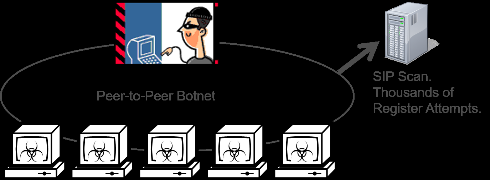
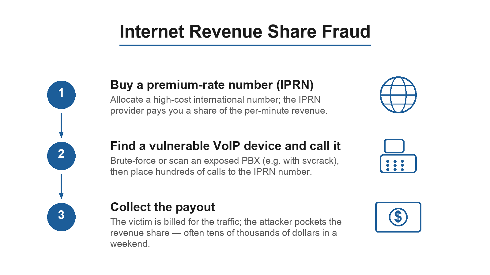
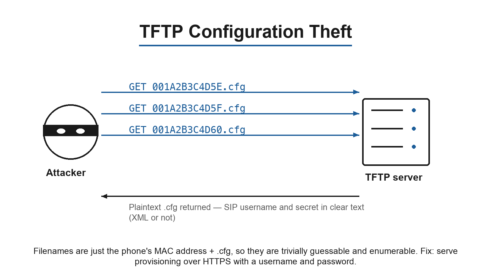
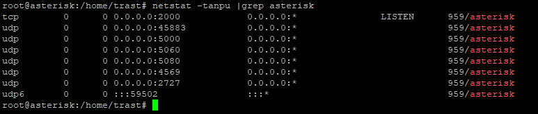
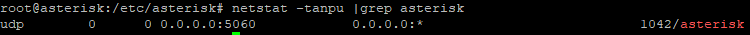
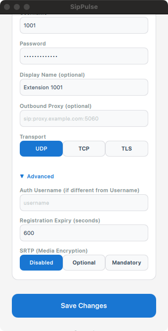

# Asterisk Security

Since the beginning, the issue of security for Asterisk is critical. SIP, Session Initiation Protocol is the most attacked protocol on the Internet according to the CERT.BR. Any person running a honeypot can confirm. The problem of the Internet Revenue Share Fraud is very serious and can lead to losses superior to hundreds of thousands of dollars. You should never install an Asterisk Server connected to the Internet without proper security. In this chapter, you will learn how to identify the main types of attacks you can receive and how to prevent them using a proper security policy. Last, but not least you will learn how to implement the suggested security policy.

This chapter targets **Asterisk 22 LTS**, where PJSIP (`res_pjsip` / `chan_pjsip`) is the only SIP channel. (The old `chan_sip` driver was removed in Asterisk 21 — see the *Legacy Channels* chapter if you are migrating an older system.) One security-relevant consequence: failed authentications are now emitted through the Asterisk **security event framework** and the dedicated `security` logger channel, which changes how Fail2Ban is configured (covered later in this chapter).

## Objectives

By the end of this chapter you should be able to:

- Identify the main types of attacks frequently made to Asterisk servers
- Define an effective security policy
- Implement the security policy
- Install and configure IPTABLES for Asterisk
- Install and configure Fail2Ban for Asterisk
- Install and configure TLS and SRTP for encryption

## Main attacks to IP telephony

The main attacks to IP telephony can be classified as DOS/DDOS, Theft of Service/Toll Fraud and Eavesdropping. Some of the names can be confusing and different sources sometimes have different names for the same attack. Service Theft, Toll Fraud, Internet Revenue Share Fraud, Phone Fraud are different names for hackers using your PBX to pump traffic to a Premium Rate Number and get rebates from the provider.

### DDoS/DOS

Denial of Service and Distributed Denial of Service are popular attacks to any IT infrastructure. It is not different with SIP and other Voice over IP protocols. Distributed denial of service is usually perpetrated by a botnet while DOS just by a single computer. In February 2011 the Sality botnet carried out a stealthy, coordinated scan of the entire IPv4 address space looking for vulnerable SIP servers — researchers observing the UCSD Network Telescope attributed it to roughly three million distinct source IPs probing UDP port 5060, most likely to brute-force SIP accounts for toll fraud.[^sality]

[^sality]: A. Dainotti et al., "Analysis of a '/0' Stealth Scan from a Botnet," *IEEE/ACM Transactions on Networking*, 2015 (DOI 10.1109/TNET.2013.2297678).



The DOS is applied usually thru techniques such as fuzzing and flooding. Flooding can use SIP, IAX, RTP and other protocols. They can stop the service completely or degrade the voice quality. They are very hard to mitigate if the ports are open to the Internet. Below are some of the tools used by attackers

**Fuzzing:**

- **PROTOS Test Suite (c07-sip)** — from the University of Oulu OUSPG. Sends thousands of malformed packets to provoke a malfunction such as a buffer overflow that stops the software.
- **Voiper** — generates more than 200,000 tests covering all SIP attributes and verifies whether your server can process the messages effectively. <http://voiper.sourceforge.net/>

**Flooding:**

- **INVITE Flooder** — floods the server with SIP INVITE requests. <http://www.hackingvoip.com/tools/inviteflood.tar.gz>
- **IAX Flooder** — floods the server with IAX2 traffic. <http://www.hackingvoip.com/tools/iaxflood.tar.gz>
- **RTP Flooder** — floods active media sessions with RTP packets to degrade voice quality. <http://www.hackingvoip.com/tools/rtpflood.tar.gz>

### Mitigation techniques for DoS/DDoS

My recommendations are

1. Do not expose your Asterisk server on the Internet, unless necessary with proper protection (SBC) 2. In the internal network use a Virtual LAN for voice, mainly if you are in a University, College where the number of users is high. 3. Use VPN or TLS for external access.

### Internet Revenue Share Fraud

This fraud is a bit tricky to understand. The key is to understand the concept of an International premium rate number (IPRN).



An IPRN is a number that you can allocate for free in some specific internet phone companies. Search for Internet Premium Rate Number Providers and you will find a bunch of them. In this type of operator you can allocate, as an example, a number in a satellite network such as Iridium, a destination costing tenths of dollars per minute to the caller. The IPRN provider will pay you back a percentage of the revenue (10 to 20% of the income) for any minute received.


After the allocation phase, the hacker tries to find any open Asterisk server capable to dial the allocated IPRN. The PBX from the victim, controlled by the hacker, will make hundreds of calls to the IPRN number generating a large pay back for the hacker and a huge phone bill for the victim. Many times, higher then hundreds of thousands of dollars in a single weekend. Main tools used by hackers to attack a PBX 1. SIPVicious: http://code.google.com/p/sipvicious/. Sipvicious is a security tool set easy to use. Its main objective is to recognize vulnerable PBXs and crack the SIP passwords using a brute force attack. The most used tool is svcrack. The tool is capable to test thousands of passwords per second. 2. Phone vulnerabilities. Another point frequently used by hackers as an attack vector is the phone itself. Many people installing Asterisk do not change the default password in the web interface of the phone. Once these phones are open on the Internet, hackers can try to use the default interface password to download the configuration where they can often find the secret SIP password. .

#### TFTPTheft:

If you are using auto provisioning of phones using TFTP, you are probably open to this type of attack. TFTP is a simple and insecure form of a File Transfer Protocol.



The name of the configuration files are easily guessable using the mac address followed by .cfg (e.g. 001A2B3C4D5E.cfg). A wise hacker can easily create a utility to try all MAC addresses sequentially or simply download a tool to do it. The configuration file is usually unencrypted and have the secret SIP password inside.

#### Mitigation for brute force attacks and tftp theft

To mitigate these attacks you may apply the solutions below. Brute force: The best solution to mitigate brute force attacks is prevent sequential unauthorized attempts. Almost any Asterisk installer use the utility fail2ban for this. When fail2ban detects multiple attempts with the wrong password or user name, it bans the IP of the attacker for a certain amount of time. The second measure against brute force is to use strong passwords, more than 12 characters, at least one special character. Tftptheft: To prevent TFTPTheft configure provisioning to use https with name and password. The file is transmitted encrypted and a name and password prevents attackers to attempt downloading any files.

### Eavesdropping

We don’t see a lot these types of attack because in most cases they are simply not detected. Eavesdropping is very hard to detect in an IP environment. Utilities such as UCsniff freely available are capable to eavesdrop a VoIP call in most networks. The main technique is to use ARP spoofing to force the traffic thru the computer running UCsniff and record the calls.

#### Mitigation for eavesdropping

You can prevent eavesdropping by encrypting your VoIP traffic. The other way is to prevent man in the middle (MITM) attacks on your network. ARP inspection is very effective to prevent MITM in layer 2 networks. Check your network tech support to understand how to implement. Later in this book we will learn how to install encryption based on TLS and SRTP. You may also use ARPWatch to discover if anyone is now abusing of the ARP protocol to attack your network.

## Security policy for Asterisk

The best way to implement security is to create a security policy. For this training I will suggest a security policy for most Asterisk installations. Use it as the base starting point and change it according to your needs. The suggested security policy follows below: 1. No unnecessary UDP/TCP ports open 2. No access to any administrative interface (SSH/HTTPS) open on the Internet. 3. To access SSH and/or HTTP/HTTPS there should be an explicit exceptions in IPTABLES firewall 4. Strong passwords with 12 characters and at least one special character 5. Ban IP addresses failing more than 10 times in the authentication using Fail2ban 6. Password confirmation for International calls 7. Limit access to the SIP port to your known range of IP address If you require to have external access to your PBX, there are two possibilities. Use a SBC (Session Border Controller) to protect your server against DOS/DDOS or use a VPN whenever you want external access. If you leave the port 5060 open on the Internet without a SBC or VPN, you are open to a DOS/DDOS attack. The risk is yours.

### PJSIP-era hardening (Asterisk 22)

Beyond the firewall and Fail2Ban, Asterisk 22's PJSIP stack provides several configuration-level controls that should be part of your security policy. These complement (not replace) the network controls above:

- **Per-endpoint authentication.** Every endpoint should reference a dedicated `type=auth` section with a strong, unique `password` (`auth_type=digest`). Never reuse credentials across endpoints.
- **Anonymous handling is built in.** PJSIP does not reveal whether a username exists when authentication fails. To accept anonymous calls at all you must explicitly create an endpoint named `anonymous` and use `type=identify` sections (matching on source IP) to map known peers to endpoints. If you do not want anonymous calls, simply do not create an `anonymous` endpoint, and unmatched requests are challenged/rejected.
- **ACLs.** Restrict who can reach an endpoint with `/etc/asterisk/acl.conf` named ACLs, referenced from the endpoint with `acl=` (signalling/source ACL) and `contact_acl=` (restricts the contact/registration address). You can also set permit/deny directly on the endpoint.
- **`qualify`.** Set `qualify_frequency` (and `qualify_timeout`) on the AOR so Asterisk actively monitors reachability of registered contacts and prunes dead ones.
- **PJSIP transport hardening / DoS protection.** The `type=transport` does not expose a per-transport client cap, so connection-flood protection comes from the firewall (the iptables/Fail2Ban rules in this chapter) rather than a PJSIP option. What the transport *does* give you is TCP keep-alive tuning (`tcp_keepalive_enable`, `tcp_keepalive_idle_time`, `tcp_keepalive_interval_time`, `tcp_keepalive_probe_count`) to reap dead/half-open connections, and `local_net`/`external_*` settings for correct NAT handling. Combine these with the firewall rules to blunt connection-flood attacks.
- **TLS + SRTP for media.** Encrypt signalling with a TLS transport and media with `media_encryption=sdes` (or `dtls` for WebRTC) on the endpoint — covered later in this chapter.
- **AMI/ARI access control.** Restrict the Asterisk Manager Interface (`manager.conf`) and ARI (`ari.conf` / `http.conf`) to localhost or a trusted management network, use strong unique secrets, bind the HTTP server to a private interface, and never expose these to the Internet.

All of the option names above are confirmed against Asterisk 22.10: the `type=transport` section exposes `tcp_keepalive_enable`, `tcp_keepalive_idle_time`, `tcp_keepalive_interval_time`, `tcp_keepalive_probe_count`, `tos`, `cos`, `local_net`, and the `external_*` family, but it has **no** `max_clients` option — connection-flood protection comes from the firewall, not from the transport. The `acl` and `contact_acl` endpoint options take section names from `acl.conf`, and source-IP matching for unauthenticated peers is done with `type=identify` sections (`match=`).

### Removing unnecessary ports

Instead of discovering all vulnerabilities associated with all Asterisk protocols, let us simplify the problem removing the unnecessary ports. To list all ports open by the Asterisk server use:

```
netstat –pantu |grep asterisk
```

The output of the command is shown below.



If you look at the output, you will discover that many ports are open. Do we need them? Not necessarily, 2727 is the MGCP protocol (chan_mgcp), 4569 is the IAX (chan_iax2). If you are not using these protocols, you can simply remove the module in the configuration file modules.conf.

You may notice Asterisk binding a high-numbered UDP port. This comes from `res_pjsip`'s resolver making outbound DNS queries (the source port is ephemeral, like any client DNS lookup), not from an inbound listener — your firewall only needs to allow **established/related** return traffic for it (the iptables `conntrack ESTABLISHED,RELATED` rule shown below already covers this). You do **not** need to open a wide inbound high-UDP range just for PJSIP DNS.

To remove the unnecessary ports, disable the modules you don't use. Edit the file modules.conf and add `noload` lines for the channels and protocols you are not using. **Do not** noload `res_pjsip`, `res_pjproject`, or `chan_pjsip` — those are required for SIP in Asterisk 22:

```
; res_pjsip / res_pjproject / chan_pjsip are REQUIRED in Asterisk 22 — keep them loaded
noload => chan_iax2.so
noload => chan_unistim.so
```

(In Asterisk 22 you no longer need to noload `chan_mgcp` or `chan_skinny` — those drivers were *removed* in Asterisk 21 and are not part of a stock 22 build.) With the instructions above, I have removed all unnecessary channels keeping only PJSIP. You can choose whatever protocol modules you want, just remove the unused ones. The result is shown in the screenshot below — only the SIP port (5060) bound by your PJSIP transport is now exposed inbound.



### Implementing the security police with IPTABLES

IPTABLES or netfilter is a standard firewall present in most Linux distributions. In this lab we will configure iptables and fail2ban. The objective is to implement the recommended security policy for Asterisk and block all unnecessary traffic. Follow the steps below: 1 – Block all external traffic 2 – Allow SSH traffic from an internal network or single host 3 – Allow SIP traffic in UDP and TCP the ports 5060 4 – Allow RTP traffic in the UDP media port range. There is no single built-in default — Asterisk's own `rtp.conf` falls back to ports 5000–31000 when nothing is set, but the shipped `rtp.conf.sample` configures `rtpstart=10000` / `rtpend=20000`, so we use that example range here. Match your firewall rule to whatever `rtpstart`/`rtpend` you actually set in `rtp.conf`. Make sure you have console access to the server, you don't want to block yourself out of the system. Be careful. Step 1 - Install the package net-persistent.

```
sudo apt-get install iptables-persistent
```

Step 2 - Allow all traffic from the loopback

```
sudo iptables -I INPUT -i lo -j ACCEPT
sudo iptables -I OUTPUT -o lo -j ACCEPT
```

Step 3 - Allow established connections

```
sudo iptables -I INPUT -m conntrack --ctstate ESTABLISHED,RELATED -j ACCEPT
```

Step 4 - Allow SSH/HTTPS traffic from the network 192.168.0.0

```
sudo iptables -I INPUT -p tcp -s 192.168.0.0/16 --dport 22 -m conntrack --ctstate
NEW,ESTABLISHED -j ACCEPT
sudo iptables -I INPUT -p tcp -s 192.168.0.0/16 --dport 443 -m conntrack --ctstate
NEW,ESTABLISHED -j ACCEPT
```

Step 5 - Insert the Asterisk rules

```
sudo iptables -I INPUT -p udp -m udp --dport 5060 -j ACCEPT
sudo iptables -I INPUT -p tcp -m tcp --dport 5060 -j ACCEPT
sudo iptables -I INPUT -p tcp -m tcp --dport 5061 -j ACCEPT
sudo iptables -I INPUT -p udp -m udp --dport 10000:20000 -j ACCEPT
```

Note that port 5061 (SIP over TLS) is **TCP**, not UDP. The rules above open 5060 on both UDP and TCP and 5061 on TCP. If you only run TLS, you can drop the plain 5060 rules entirely. Only open the ports your PJSIP transports actually bind to.

-I means PREPEND Step 6 - The last rule has to be a drop

```
sudo iptables -A INPUT -j DROP
```

-A means APPEND Note: Take care when maintaining new rules, you have to add rules before the DROP. Use PREPEND for new rules -I Step 7 - Save the rules and restart iptables

```
sudo iptables-save >/etc/iptables/rules.v4
sudo /etc/init.d/netfilter-persistent restart
```

### Using Fail2Ban to block multiple failed attempts to authenticate

Fail2Ban is almost a standard for Asterisk. Most users implement to enhance the security. This utility scans the Asterisk logs for failed attempts and ban IP addresses of the attackers. Below I provide the instructions to install Fail2Ban.

In Asterisk 22, PJSIP reports failed authentications and other security events through the Asterisk **security event framework**, written to the dedicated **`security` logger channel**. To make Fail2Ban work you must:

1. Enable the security channel in `/etc/asterisk/logger.conf`. The syntax is `<filename> => <levels>`, so to send the security level to a file named `security` write:

```
[logfiles]
security => security
```

then run `logger reload` from the CLI. This produces `/var/log/asterisk/security` with one line per security event, in the form:

```
[2026-01-15 10:23:45] SECURITY[1234] res_security_log.c: SecurityEvent="InvalidPassword",...,RemoteAddress="IPV4/UDP/203.0.113.7/5060",...
```

The events Fail2Ban cares about are `InvalidPassword`, `ChallengeResponseFailed`, `InvalidAccountID`, and `FailedACL`, each carrying a `RemoteAddress="IPV4/UDP/<ip>/<port>"` field that identifies the offender. (Note the address is wrapped as `IPV4/UDP/.../...`, not a bare IP — your filter must extract the host from inside that string.)

2. Point the `asterisk` jail at that file (`logpath = /var/log/asterisk/security`) and use a filter that parses this security-event format.

Modern Fail2Ban ships an `asterisk` filter whose `failregex` already matches the events above and extracts `<HOST>` from the `RemoteAddress` field, for example:

```
failregex = ^SecurityEvent="(?:FailedACL|InvalidAccountID|ChallengeResponseFailed|InvalidPassword)".*,RemoteAddress="IPV[46]/[^/"]+/<HOST>/\d+"
```

PBX distributions (FreePBX/Sangoma) ship equivalent filters. Prefer the packaged filter over hand-writing one, since the exact event strings are version-dependent. One caveat to be aware of: a now-patched advisory (GHSA-5743-x3p5-3rg7) showed that crafted PJSIP traffic could inject fake log lines — keep both Asterisk and your Fail2Ban filter current.

Below I provide the instructions to install Fail2Ban Step 1 – Install fail2ban on Linux

```
sudo apt-get install fail2ban
```

Step 2 - Activate fail2ban for Asterisk and SSH

```
sudo vi /etc/fail2ban/jails.d/defaults-debian.conf
```

Add the following lines to activate fail2ban for ssh and asterisk

```
[sshd]
enabled = true
[asterisk]
enabled=true
```

Step 3 - Restart fail2ban

```
/etc/init.d/fail2ban restart
```

Step 4 - Verify Change the secret from your softphone and try to re-register 10 times Using iptables -L, check if the softphone address was included as a blocked address. Step 5 - Remove the address from the ban (suppose the address is 192.168.0.5)

```
sudo fail2ban-client set asterisk unbanip 192.168.0.5
```

Note: In the command replace 192.168.0.5 by the ip address of your phone

### Implementing TLS and SRTP

I will split this section in two. In the first part we will cover TLS to encrypt signaling and in the second part SRTP to encrypt media. The objective here is to configure Asterisk for these resources.

#### TLS

TLS (Transport Layer Security) is the encryption mechanism defined to protect the SIP signaling. Type of attack Protection Signaling Attacks YES TLS assures the integrity of the messages Man In the Middle YES TLS checks the server certificate Eavesdropping NO TLS encrypts signaling, not media. For media (voice/video) encryption use SRTP.

#### Self-signed digital certificates

There are two types of certificates you can use self-signed and commercial. Self-signed certificates are signed by your own server while commercial certificates are signed by an external authority. For VoIP, you can be your own certificate authority. There is no need for an external certificate such as GoDaddy and Verisign, this is an unnecessary expense. We will generate our own certificates using ast_tls_cert.

#### Configuring TLS with self signed certificates

Below is a step-by-step guide on how to implement TLS. We first generate the certificates, then configure the PJSIP TLS transport (see "Configuring TLS with chan_pjsip"), and finally point the softphone at it. We will use the SipPulse Softphone, which supports TLS and SRTP natively. (Any TLS/SRTP-capable SIP softphone works the same way.) Step 1. Create a private RSA key using 3DES encryption with length of 4096 bits for our certification authority. The command below present in /usr/src/asterisk-22.x.y/contrib/scripts will create the Certification Authority and The Asterisk Certificate. As usual adapt the instructions if required, versions change, directories change. Please, pay attention on what you are doing. Use your domain or IP address in the –C option. The command ast_tls_cert has three options.

- -C host or IP address (I have used 192.168.0.74, the IP address of my VM)
- -O Organizational name
- -d Directory where to store the keys

```
mkdir /etc/asterisk/keys
cd /usr/src/asterisk-22.0.0/contrib/scripts
/ast_tls_cert -C 192.168.0.74 -O "Asteriskguide" -d /etc/asterisk/keys
root@asterisk:/usr/src/asterisk-22.0.0/contrib/scripts#
./ast_tls_cert
-C
192.168.0.74
-O
"AsteriskGuide"
-d
/etc/asterisk/keys
No config file specified, creating '/etc/asterisk/keys/tmp.cfg'
You can use this config file to create additional certs without
re-entering the information for the fields in the certificate
Creating CA key /etc/asterisk/keys/ca.key
Generating RSA private key, 4096 bit long modulus
........................................................++
........................................................++
e is 65537 (0x010001)
Enter pass phrase for /etc/asterisk/keys/ca.key:
Verifying - Enter pass phrase for /etc/asterisk/keys/ca.key:
Creating CA certificate /etc/asterisk/keys/ca.crt
Enter pass phrase for /etc/asterisk/keys/ca.key:
Creating certificate /etc/asterisk/keys/asterisk.key
Generating RSA private key, 1024 bit long modulus
........................++++++
......................++++++
e is 65537 (0x010001)
Creating signing request /etc/asterisk/keys/asterisk.csr
Creating certificate /etc/asterisk/keys/asterisk.crt
Signature ok
subject=CN = 192.168.0.74, O = AsteriskGuide
Getting CA Private Key
Enter pass phrase for /etc/asterisk/keys/ca.key:
Combining key and crt into /etc/asterisk/keys/asterisk.pem
root@asterisk:/usr/src/asterisk-22.0.0/contrib/scripts#
```

I’m not going to generate a client certificate because we are not going to use the certificate to authenticate the client. The client is not required to present its own certificate. Step 2: Configure Asterisk to support our client over TLS. This is done in `pjsip.conf` (a TLS transport plus the endpoint settings) — the full configuration is shown in the next section, "Configuring TLS with chan_pjsip." We are not authenticating using certificates, just encrypting the traffic.

Step 3: Install a TLS-capable SIP softphone (the author uses the SipPulse Softphone). Step 4: Copy the certificate authority to the computer running the softphone. After installing it, copy the file /etc/asterisk/keys/ca.crt to the computer running the softphone (use scp, or WinSCP on Windows) if you are using a self-signed certificate. Step 5: Create the account in the softphone. In the account screen add the account normally like any other sip account. Use the right password, the authentication is still based on the password. Step 6: Set TLS as the transport in the account settings. In the SipPulse Softphone account screen (below), choose **TLS** as the transport and use port 5061. Adjust your firewall to open TCP port 5061.

{width=35%}

Step 7: Trust the certificate authority. If your Asterisk TLS certificate is signed by a public CA (for example Let's Encrypt — see the *Deployment* chapter), a modern softphone such as the SipPulse Softphone trusts it automatically through the system certificate store, with no manual import. If you use a self-signed certificate, import its CA (`/etc/asterisk/keys/ca.crt`) into the client or the operating-system trust store, or accept it when prompted.

Step 8: You do **not** need a client certificate. A common misconception is that each phone needs its own certificate to authenticate — it does not. At this point Asterisk only *encrypts* the session; authentication is still username and password. Asterisk does not verify client certificates by default, so there is no need to distribute a per-client certificate.

Step 9: After changing the certificate or transport, fully restart the softphone (quit and relaunch, not just close the window) so it reconnects over the new transport.

### Configuring TLS with chan_pjsip

Now let’s learn how to configure PJSIP for TLS. PJSIP is the only SIP channel in Asterisk 22, so there is nothing to switch — just make sure `res_pjsip`, `res_pjproject` and `chan_pjsip` are loaded. Step 1: Confirm PJSIP is enabled in /etc/asterisk/modules.conf.

```
; res_pjsip / res_pjproject / chan_pjsip must be loaded (do NOT noload them)
noload => chan_iax2.so
noload => chan_unistim.so
```

Step 2: Configure PJSIP to support TLS. Add a section for TLS transport in the file /etc/asterisk/pjsip.conf

```
[transport-tls]
type=transport
protocol=tls
bind=0.0.0.0:5061
cert_file=/etc/asterisk/keys/asterisk.crt
priv_key_file=/etc/asterisk/keys/asterisk.key
method=tlsv1_2
```

Use `method=tlsv1_2` (or `tlsv1_3` if your OpenSSL/PJSIP build supports it) — TLS 1.0/1.1 are obsolete and insecure and should not be used.

Step 3: Configure the endpoint for blink Edit the pjsip.conf end edit the section for blink. Let pjsip choose automatically the transport.

```
[blink]
type=endpoint
aors=blink
auth=blink
context=from-internal
disallow=all
allow=ulaw
dtmf_mode=rfc4733
media_encryption=sdes
[blink]
type=aor
max_contacts=2
remove_existing=yes
[blink]
type=auth
auth_type=digest
username=blink
password=supersecret
```

Step 4: Verifying To verify if the registration happened over TLS use the following command in Asterisk console.

```
CLI>pjsip show aor blink
asterisk*CLI> pjsip show aor blink
      Aor:  <Aor..............................................>  <MaxContact>
    Contact:
```

- <Aor/ContactUri............................>

```
<Hash....>
<Status> <RTT(ms)..>
============================================================================
==============
      Aor:  blink                                                2
    Contact:  blink/sip:03694827@192.168.0.67:56295;transp 620d91556d NonQual
nan
 ParameterName        : ParameterValue
 ====================================================================
 authenticate_qualify : false
```

- contact
- :

```
sip:03694827@192.168.0.67:56295;transport=tls
 default_expiration   : 3600
 mailboxes            :
 max_contacts         : 2
 maximum_expiration   : 7200
 minimum_expiration   : 60
 outbound_proxy       :
 qualify_frequency    : 0
 qualify_timeout      : 3.000000
 remove_existing      : true
 support_path         : false
 voicemail_extension  :
```

### Making secure calls using SRTP

The protocol responsible for media encryption is the Secure Real Time Protocol (SRTP) defined in the RFC3711. One of the short comes of the protocol is the lack of a standardized way to exchange keys. Asterisk uses SDES exchange keys over the SDP protocol protected by the signaling encryption provided by TLS. There are also other methods such as MIKEY and ZRTP. ZRTP developed by Philipp Zimmermann is of the most sophisticated methods for key exchange and media encryption. Some softphones and hard phones allow ZRTP. However the standard way is still SDES and you will find this method in almost any phone available in the market. Below an example of a request with the crypto keys defines in the SDP in the lines a=crypto:1 and a=crypto:2.

```
INVITE sip:8000@192.168.1.237 SIP/2.0
Via:
SIP/2.0/tls
192.168.1.192:65525;rport;branch=z9hG4bKPj9fa224a14b17488ea15625ead833ea3a
Max-Forwards: 70
From:
"Flavio"
<sip:flavio@192.168.1.237>;tag=35afe6cc11274934867b24e43c805638
To: <sip:8000@192.168.1.237>
Contact: <sip:pyhkxnjz@192.168.1.192:65524;transport=tls>
Call-ID: 530a339c72af47f0a76e7ecb2a58ac43
CSeq: 5669 INVITE
Allow: SUBSCRIBE, NOTIFY, PRACK, INVITE, ACK, BYE, CANCEL, UPDATE, MESSAGE
Supported: 100rel
User-Agent: Blink 0.2.5 (Windows)
Authorization: Digest username="flavio", realm="asterisk", nonce="72ff51ad",
uri="sip:8000@192.168.1.237",
response="ba8c10672751baa7007d82eb34e2340e",
algorithm=MD5
Content-Type: application/sdp
Content-Length: 544
v=0
o=- 3509174186 3509174186 IN IP4 192.168.1.192
s=Blink 0.2.5 (Windows)
c=IN IP4 192.168.1.192
t=0 0
m=audio 50004 RTP/SAVP 9 104 103 102 0 8 101
a=rtcp:50005
a=rtpmap:9 G722/8000
a=rtpmap:104 speex/32000
a=rtpmap:103 speex/16000
a=rtpmap:102 speex/8000
a=rtpmap:0 PCMU/8000
a=rtpmap:8 PCMA/8000
a=rtpmap:101 telephone-event/8000
a=fmtp:101 0-15
a=crypto:1
AES_CM_128_HMAC_SHA1_80
inline:WrtZH82ztz93albRNT8o+oMcK9GvlAHRoaR1STvJ
a=crypto:2
AES_CM_128_HMAC_SHA1_32
inline:4Ma9jJOCEEGMPzzkmgyf6ttp1qhN16yumdXB7eRv
a=sendrecv
```

#### Configuring SRTP on Asterisk

To configure SRTP on Asterisk is very simple. Set `media_encryption=sdes` on the endpoint; you can also require it with `media_encryption_optimistic=no` so that unencrypted media is rejected rather than silently allowed. Note that SDES requires the signalling to run over TLS so the keys are not sent in the clear. Step 1: Asterisk configuration

Set the following on the `type=endpoint` section in `pjsip.conf`:

```
[blink]
type=endpoint
aors=blink
auth=blink
context=from-internal
disallow=all
allow=ulaw
transport=transport-tls
media_encryption=sdes
media_encryption_optimistic=no
```

Step 2: Softphone configuration

In the softphone, enable SRTP for the account media (set the **SRTP (Media Encryption)** option to *Mandatory*) so that voice is encrypted.

{width=35%}

## Enabling two way authentication for international calls

Sometimes the best way is to not have international routes. However, if you really need to dial international, use an extra password. We are going to use the Asterisk application vmauthenticate to ask for the voicemail password before dialing internationally. This is configured in the dialplan in the extensions.conf. See the example below. So a hacker, even after discovering a peer password or to compromise a phone still needs the voicemail password to dial this destination.

```
exten=_9011.,1,Playback(pleasedialyourvmpassword)
exten=_9011.,2,VMAuthenticate(${CALLERID(num)}@default,s)
exten=_9011.,3,Dial(PJSIP/${EXTEN:1}@my_trunk,20,tT)
exten=_9011.,4,Hangup()
```

`VMAuthenticate` is still a standard application in Asterisk 22. The `Dial()` above routes the call over a SIP/PJSIP trunk (`PJSIP/<number>@<trunk>`), which is how most modern installations reach the PSTN — adapt `my_trunk` to your own trunk name, and use `DAHDI/g1/...` only if you actually have a DAHDI span. Toll-fraud defense in the dialplan — a second factor like this, combined with restricting which contexts can reach your outbound and international routes — remains one of the single most important protections you can deploy.

## Summary

In this chapter you have learned about the risks of having an IP PBX connected to the Internet. Then we learned how to protect our PBX implementing a security police. In this security police we have implemented iptables, fail2ban, TLS, SRTP and two way authentication for international calls. I hope you have enjoyed this chapter.

## Quiz

1. What is the most important countermeasure against Internet Revenue Share Fraud?
   - A. Implement SRTP
   - B. Keep Asterisk updated
   - C. Implement TLS
   - D. Use strong passwords
2. SIP fuzzing is defined as:
   - A. A DoS attack using malformed requests and replies
   - B. Service theft where passwords are brute-forced
   - C. Eavesdropping on current calls
   - D. A DDoS with a flood of SIP requests
3. TFTPTheft occurs when the server provides configuration files over TFTP. You can avoid it using:
   - A. FTP
   - B. HTTP
   - C. HTTPS with username and password
   - D. SCP
4. Man-in-the-middle attacks use a technique called:
   - A. TFTP theft
   - B. ARP spoofing
   - C. MAC poisoning
   - D. dsniff
5. For SRTP, Asterisk uses the following system to exchange keys:
   - A. MIKEY
   - B. SDES
   - C. ZRTP
   - D. Pluto
6. The utility that generates the certificate authority and certificates, found in `/usr/src/asterisk-22.x.y/contrib/scripts`, is:
   - A. ast_tls_cert
   - B. gen_tls
   - C. gen_ast_tls
   - D. tls_generator
7. Valid strategies to prevent eavesdropping (check all that apply):
   - A. Implement analog eavesdropping detectors
   - B. Use the ARPwatch utility to detect ARP spoofing
   - C. Enable ARP-spoofing detection in the switches
   - D. Use SRTP
8. Asterisk supports strong authentication by verifying client certificates. (The PJSIP TLS transport can require and verify the client's certificate.)
   - A. True
   - B. False
9. On Asterisk 22, which PJSIP endpoint setting turns on SRTP media encryption using in-SDP (SDES) keys?
   - A. `encryption=yes`
   - B. `media_encryption=sdes`
   - C. `srtp=mandatory`
   - D. `transport=tls`
10. In Asterisk 22, Fail2Ban must read PJSIP failed-authentication events from the dedicated ________ logger channel (enabled in `logger.conf`).
   - A. `console`
   - B. `messages`
   - C. `security`
   - D. `verbose`

**Answers:** 1 — D · 2 — A · 3 — C · 4 — B · 5 — B · 6 — A · 7 — B, C, D · 8 — A · 9 — B · 10 — C
